# Chapter 4: Optics and Cable Management

## Table of Contents

- [Goal](#goal)
- [Why Optics Matter in AI/ML Fabrics](#why-optics-matter-in-aiml-fabrics)
  - [GPU Server Connectivity](#gpu-server-connectivity)
  - [Bandwidth Growth](#bandwidth-growth)
  - [Optical Innovation Challenges](#optical-innovation-challenges)
- [Packet Flow Through Optics](#packet-flow-through-optics)
  - [Demux and Mux](#demux-and-mux)
  - [SerDes and PFE ASIC Lanes](#serdes-and-pfe-asic-lanes)
  - [Digital Signal Processors, DSPs](#digital-signal-processors-dsps)
- [Modulation, FEC, and Signal Recovery](#modulation-fec-and-signal-recovery)
  - [NRZ, PAM4, and Higher-Order Modulation](#nrz-pam4-and-higher-order-modulation)
  - [DWDM](#dwdm)
  - [FEC, Clock Recovery, and Equalization](#fec-clock-recovery-and-equalization)
- [Transmission Media](#transmission-media)
  - [Copper vs. Fiber](#copper-vs-fiber)
  - [Multi-Mode Fiber, MMF](#multi-mode-fiber-mmf)
  - [Single-Mode Fiber, SMF](#single-mode-fiber-smf)
- [AI Server Connectivity Options](#ai-server-connectivity-options)
  - [H100/H200-Style Connectivity](#h100h200-style-connectivity)
  - [A100-Style Connectivity](#a100-style-connectivity)
  - [Rail-Optimized Cabling](#rail-optimized-cabling)
- [Transceiver Reach Types](#transceiver-reach-types)
- [Cable and Connector Types](#cable-and-connector-types)
  - [LC](#lc)
  - [MPO and MTP](#mpo-and-mtp)
  - [DAC, AEC, and AOC](#dac-aec-and-aoc)
- [Optics Form Factors and Standards](#optics-form-factors-and-standards)
  - [QSFP28, QSFP56, and QSFP-DD](#qsfp28-qsfp56-and-qsfp-dd)
  - [OSFP](#osfp)
  - [CFP Family](#cfp-family)
  - [QSFP-DD vs. OSFP](#qsfp-dd-vs-osfp)
- [Further Optics Innovation](#further-optics-innovation)
  - [Pluggable Optics](#pluggable-optics)
  - [Linear-Drive Pluggable Optics, LPO](#linear-drive-pluggable-optics-lpo)
  - [Linear Receive Optics, LRO](#linear-receive-optics-lro)
  - [Co-Packaged Optics, CPO](#co-packaged-optics-cpo)
- [Design Decision Matrix](#design-decision-matrix)
- [Operational Validation Checklist](#operational-validation-checklist)
- [Chapter Summary](#chapter-summary)
- [Key Terms](#key-terms)
- [Q&A](#qa)
- [References](#references)

## Goal

This chapter explains how optics, transceivers, cables, connectors, and physical cable management affect AI/ML data center fabrics.

The core idea is:

> AI fabric performance depends not only on topology and routing, but also on the physical optical and electrical links that make high-bandwidth GPU-to-GPU communication possible.

The chapter focuses on these topics:

- 200 Gbps, 400 Gbps, 800 Gbps, and 1.6 Tbps server and switch links
- GPU server connectivity using OSFP and high-density NICs
- Packet flow through transceivers, mux/demux, DSPs, SerDes, and PFE ASICs
- Modulation schemes such as NRZ, PAM4, PAM8, QAM, and DWDM
- FEC, clock data recovery, and equalization
- MMF, SMF, DAC, AEC, and AOC cabling
- Reach types such as VR, SR, DR, FR, LR, ZR, and CR
- LC, MPO, and MTP connectors
- QSFP28, QSFP56, QSFP-DD, OSFP, and CFP form factors
- Pluggable optics, LPO, LRO, and CPO
- Cable management for rail-optimized AI fabrics

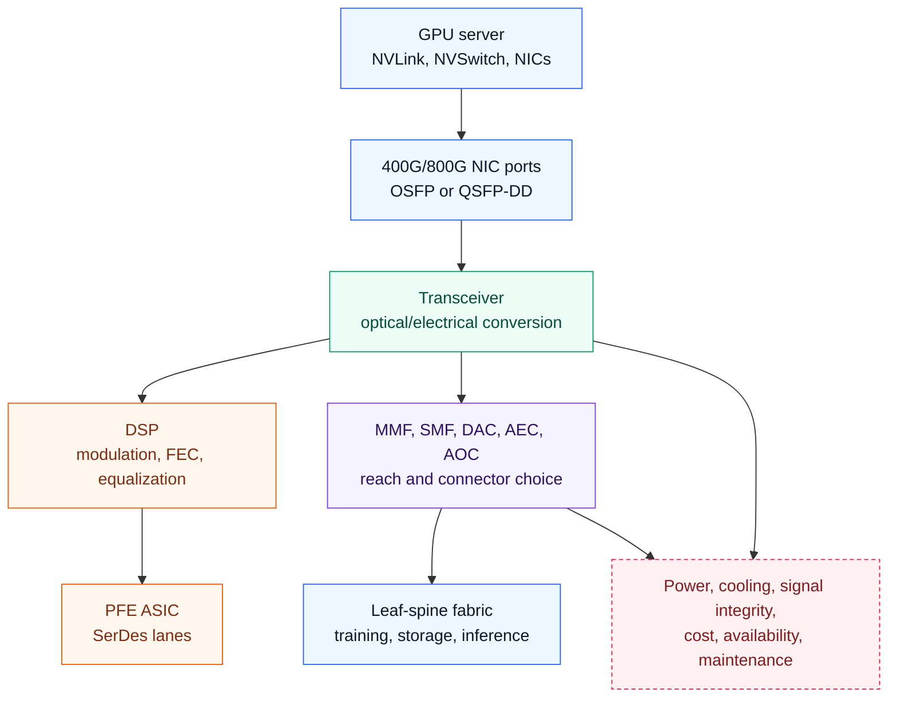

## Why Optics Matter in AI/ML Fabrics

Chapter 3 covered topology and high-level network design. This chapter moves down the stack to the physical links that make those designs possible.

AI/ML clusters create unusually aggressive physical-layer requirements:

- GPU servers expose many high-speed NIC ports.
- Each GPU may have a dedicated scale-out NIC.
- Training traffic needs predictable bandwidth between many servers.
- Leaf and spine switches need high radix and high per-port speed.
- Power and cooling budgets are constrained at rack scale.
- Cable count and cable length directly affect operations.

Optics and cable choices therefore become architecture decisions. A design that looks valid on a topology diagram can fail operationally if the optics are unavailable, too expensive, too power hungry, too hot, or too difficult to cable cleanly.

### GPU Server Connectivity

Modern AI servers include several connectivity domains:

| Domain | Example Technology | Purpose |
| --- | --- | --- |
| Intra-server GPU fabric | NVIDIA NVLink/NVSwitch, AMD Infinity Fabric, CXL, UCIe, PCIe | GPU-to-GPU communication inside one server |
| Scale-out network | ConnectX or similar NICs, Ethernet or InfiniBand | GPU-to-GPU communication across servers |
| Storage network | NVMe-oF, Ethernet, InfiniBand, or storage NICs | Dataset and checkpoint movement |
| Out-of-band management | BMC and management Ethernet | Operations and recovery |

The chapter uses NVIDIA DGX-class systems as examples. An 8-GPU server can have a dedicated NIC path per GPU, with OSFP ports that expose 400 Gbps or 800 Gbps connectivity toward the external fabric.

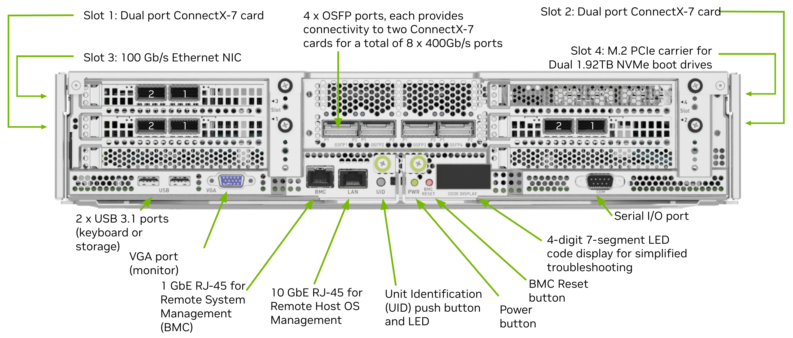

The DGX H100 rear panel shows why AI server networking must be planned as a set of separate connectivity domains: high-speed ConnectX-7 OSFP network ports, storage or host Ethernet ports, BMC management, console access, boot storage, and redundant power supplies all share the same rear-service area.

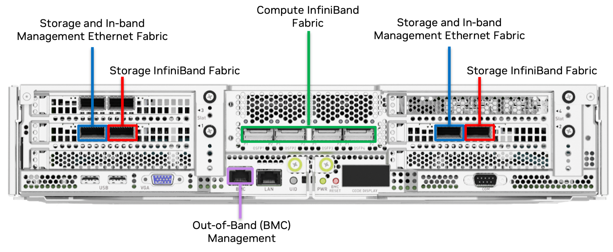

The colored port map highlights the operational difference between scale-out network ports, storage or host ports, and management ports. These physical distinctions should be reflected in rack cabling, rail labels, switch port allocation, and troubleshooting documentation.

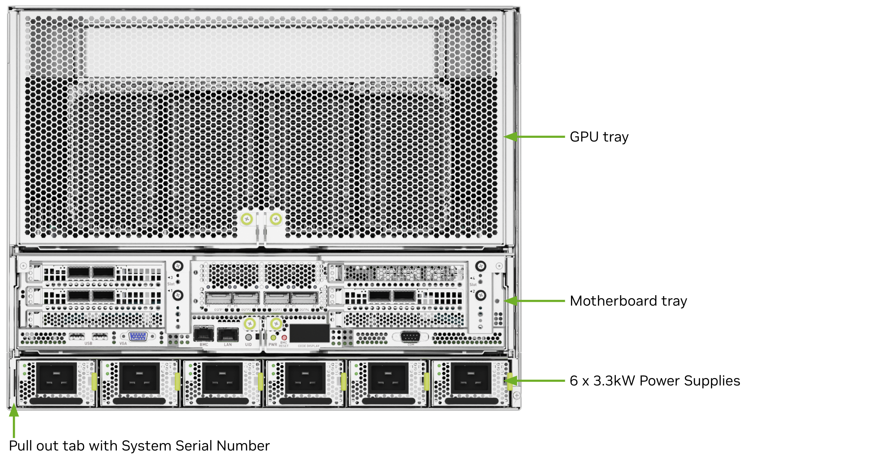

The rear module view separates the GPU tray, motherboard tray, and six 3.3 kW power supplies. This matters for optics and cabling because network service access, airflow, and power-cable routing all converge at the rear of the chassis.

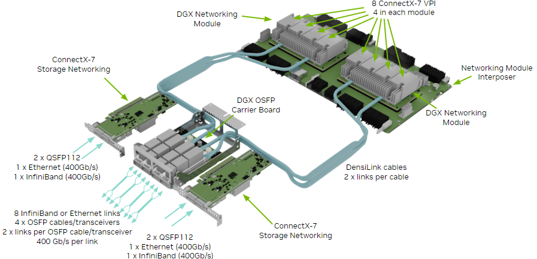

The storage and networking module layout shows the internal relationship between ConnectX-7 storage networking, the OSFP carrier board, DGX networking modules, and DensiLink cables. External fabric design should account for how these internal modules map to OSFP-facing links.

The important distinction is:

- Intra-server communication uses the local GPU interconnect and internal switch.
- Server-to-server communication uses external NICs, cables, optics, and fabric switches.

AMD has Infinity Fabric, while Intel has switch and interconnect technologies around CXL, UCIe, and PCIe. These technologies are not the external data center fabric itself, but they influence how compute, memory, accelerators, and NICs are connected inside or near the server boundary.

> [Note]
> - CXL, Compute Express Link: A cache-coherent interconnect used to connect CPUs, memory expanders, accelerators, and devices.
> - UCIe, Universal Chiplet Interconnect Express: A chiplet-to-chiplet interconnect for connecting dies inside a package.
> - PCIe, Peripheral Component Interconnect Express: A general-purpose high-speed I/O interconnect used for NICs, GPUs, storage, and other devices.

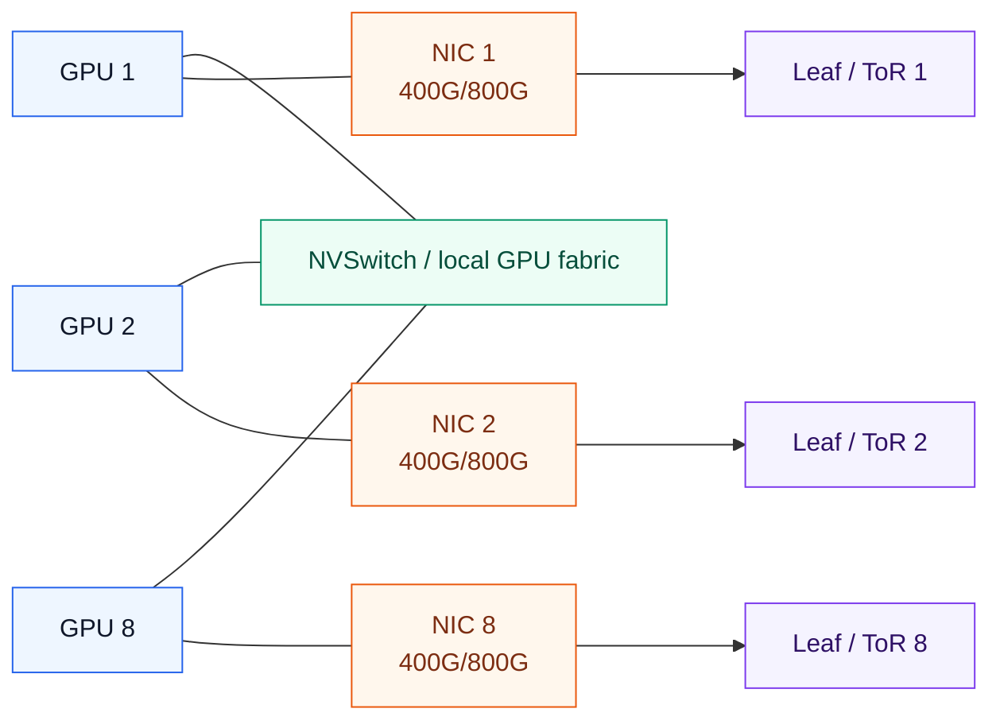

### Bandwidth Growth

AI server-to-leaf links have moved from 200 Gbps and 400 Gbps toward 800 Gbps and 1.6 Tbps. Optics roadmaps continue toward even higher speeds such as 3.2 Tbps.

This growth is driven by:

- Larger GPU clusters
- Higher GPU memory bandwidth and compute throughput
- More frequent distributed training collectives
- Faster storage and checkpointing requirements
- High-radix switches with many ports per rack unit
- Need to reduce training job completion time

The optics layer must keep pace with the compute layer. If GPU compute grows faster than network bandwidth, expensive accelerators sit idle waiting for data or synchronization.

### Optical Innovation Challenges

Higher-speed optics face several constraints.

| Challenge | Why It Matters |
| --- | --- |
| Signal quality | Higher speeds increase attenuation, dispersion, crosstalk, and noise sensitivity |
| Signal conditioning | Equalization and DSP become more important as impairments increase |
| Power | High-speed optics can consume significant rack power |
| Cooling | More power creates more heat near dense switch ports |
| Availability | New optics may lag switch and server roadmaps |
| Cost | High-speed optical modules can dominate fabric bill of materials |
| Standards | Multi-vendor deployments need interoperable form factors and link types |

For AI fabrics, these issues are not minor. A topology may require thousands of identical links. A small per-module power or cost increase multiplies quickly.

## Packet Flow Through Optics

When a network device receives data, the signal arrives as either an electrical signal or an optical signal. Before the packet reaches the packet forwarding engine, it passes through several physical-layer stages.

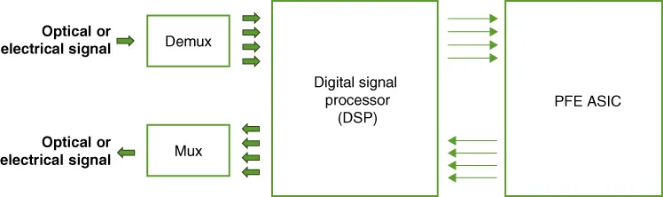

The physical receive path starts at the optical or electrical signal, splits the signal through demux logic, conditions and recovers it through the DSP, and then hands lanes toward the PFE ASIC. The transmit direction reverses the process through mux logic before the signal leaves the transceiver or cable interface.

### Demux and Mux

A demultiplexer splits a high-speed incoming signal into multiple lower-rate lanes.

For example:

- A 400 Gbps optic can be split into 8 x 50 Gbps lanes.
- A 400 Gbps optic can also be split into 4 x 100 Gbps lanes.
- An 800 Gbps optic can be split into 8 x 100 Gbps lanes.

A multiplexer performs the reverse operation. After the ASIC processes the packet, multiple lower-rate lanes are combined back into the desired outgoing optical or electrical rate.

### SerDes and PFE ASIC Lanes

The PFE ASIC uses SerDes lanes to convert between serial and parallel data streams.

| ASIC SerDes Capability | Example Mapping |
| --- | --- |
| 50 Gbps SerDes | 400G as 8 x 50G |
| 100 Gbps SerDes | 400G as 4 x 100G |
| 100 Gbps SerDes | 800G as 8 x 100G |
| 200 Gbps SerDes | Future high-speed optics with fewer lanes or higher aggregate bandwidth |

SerDes rate matters because it determines how many electrical lanes must connect the ASIC to the transceiver. More lanes increase design complexity, power, pin count, and signal-integrity work.

### Digital Signal Processors, DSPs

A DSP inside the transceiver or system handles several key functions:

- Modulation and demodulation
- Error detection and correction
- Clock data recovery
- Equalization
- Signal conditioning

The DSP is a major part of the cost and power profile of a high-speed transceiver. In pluggable optics, the DSP can account for a significant share of module cost and power. This is why LPO, LRO, and CPO attempt to change where DSP work is performed.

## Modulation, FEC, and Signal Recovery

Higher bandwidth does not come only from faster switching silicon. It also depends on encoding more information onto the electrical or optical signal and recovering that signal reliably.

### NRZ, PAM4, and Higher-Order Modulation

Modulation converts data into electrical or optical signal states.

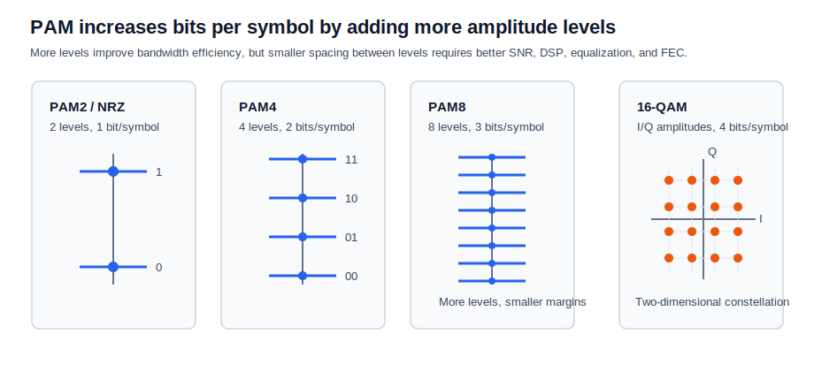

| Modulation | Basic Idea | Benefit | Trade-Off |
| --- | --- | --- | --- |
| NRZ / PAM2 | Two levels, one bit per symbol | Simple and mature | Not enough for modern high-speed optics |
| PAM4 | Four levels, two bits per symbol | Doubles bits per symbol compared with NRZ | Lower signal margin and more noise sensitivity |
| PAM8 | Eight levels | Higher data rate per symbol | Even more demanding signal recovery |
| QAM | Combines amplitude and phase states | High spectral efficiency | More complex DSP and signal quality requirements |

> [!NOTE]
> PAM2, also called NRZ, uses 2 signal levels and carries 1 bit per symbol.
> PAM4 uses 4 signal levels and carries 2 bits per symbol.
> PAM8 uses 8 signal levels and carries 3 bits per symbol.
> As the number of levels increases, bandwidth efficiency improves, but the distance between signal levels shrinks, so the link needs better SNR, DSP, equalization, and FEC.
>
> PAM changes only one amplitude dimension, so it is easy to visualize as stacked signal levels.
> QAM uses two amplitude dimensions, I and Q, so symbols are shown as points on a constellation diagram.
> In this chapter, PAM4 is the more important concept for short-reach high-speed Ethernet optics, while QAM is most relevant to coherent optics such as long-reach DWDM and ZR-class links.

PAM4 is important because it enables higher bandwidth over a given lane rate. For example, it can carry two bits per symbol instead of one. The cost is that each level is closer to the next, so noise and distortion become more difficult to tolerate.

### DWDM

Dense Wavelength Division Multiplexing(고밀도 파장 분할 다중화), DWDM, carries multiple channels over a single fiber by using different wavelengths of light.

In data centers and data center interconnects, DWDM is useful when:

- Fiber count is constrained.
- Long distance is required.
- Multiple high-speed channels must share a fiber path.
- IP-over-DWDM is desired.

400G ZR optics are an example of pluggable coherent DWDM optics used for data center interconnect distances, commonly up to about 80 km.

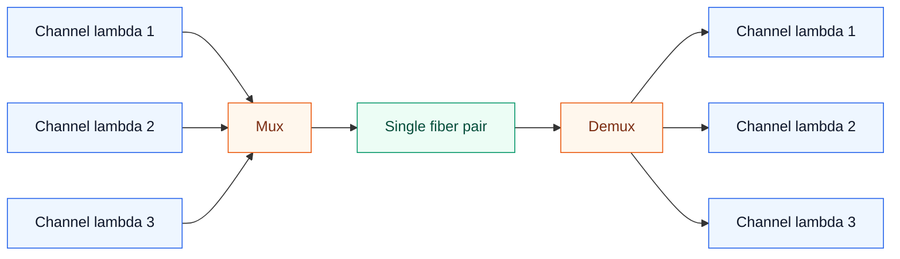

### FEC, Clock Recovery, and Equalization

At 400 Gbps and beyond, signal recovery features become normal rather than optional.

| Function | Role |
| --- | --- |
| FEC | Corrects bit errors introduced during transmission |
| LDPC / BCH | Common error-correction coding approaches |
| Clock Data Recovery, CDR | Recovers timing from the incoming signal |
| Equalization | Restores signal shape and improves signal-to-noise ratio |
| FFE / DFE | Feed-forward and decision-feedback equalization methods |

FEC improves reliability, but it adds latency. In AI/ML fabrics, this is a practical trade-off: reliable high-speed links are required, but excessive latency can affect tightly synchronized training jobs.

## Transmission Media

### Copper vs. Fiber

Older data center links often used copper cabling. Copper remains useful, but its reach becomes very limited at high speeds.

| Medium | Strength | Limitation |
| --- | --- | --- |
| Copper | Low cost, simple, good for short in-rack links | Short reach at high speeds, signal integrity limits |
| Fiber | Long reach, immune to electromagnetic interference, high bandwidth | Higher optics cost, connector cleanliness and handling requirements |

As links moved to 200G, 400G, and 800G, fiber became the dominant choice for many server-to-switch and switch-to-switch connections. Copper still appears as DAC and AEC for short in-rack links.

### Multi-Mode Fiber, MMF

Multi-mode fiber carries multiple rays of light through a wider core, commonly 50 um or 62.5 um. It often uses lower-cost light sources such as LEDs or VCSELs and wavelengths such as 850 nm and 1300 nm.

MMF is typically used for:

- In-rack or nearby-rack connectivity
- Short to medium data center links
- AOC cables
- SR optics

MMF grades:

| Grade | Typical Capability |
| --- | --- |
| OM1 | 1G up to 300 m, 10G up to about 33 m |
| OM2 | 1G up to 550 m, 10G up to about 82 m |
| OM3 | 40G up to about 240 m, 100G/400G up to about 100 m |
| OM4 | 100G/400G up to about 150 m |
| OM5 | 100G/400G up to about 150 m, supports WDM use cases |

OM1 has a larger 62.5 um core, while newer MMF grades commonly use 50 um.

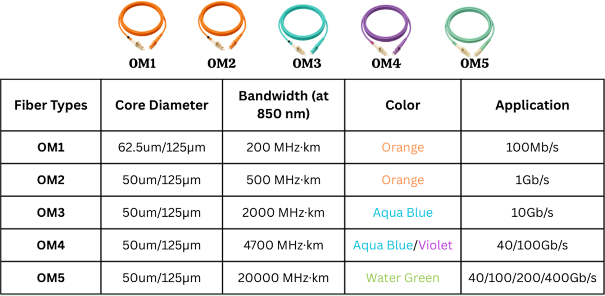

Source: [BlueOptics, "OM2, OM3, OM4, OM5: Which multimode fiber optic cable is the right choice?"](https://www.blueoptics.de/blog-en/om2-om3-om4-om5-which-multimode-fiber-optic-cable-is-the-right-choice)

### Single-Mode Fiber, SMF

Single-mode fiber carries a single ray of light through a smaller core, commonly about 8 um to 10 um. It uses laser sources and wavelengths such as 1310 nm and 1550 nm.

SMF is typically used for:

- Longer data center links
- Inter-row or inter-building links
- Data center interconnects
- DR, FR, LR, and ZR optics

SMF costs more than MMF in many short-distance cases, but it supports longer reach and avoids modal dispersion caused by multiple light paths.

## AI Server Connectivity Options

AI server connectivity is determined by the server port form factor, NIC speed, switch port speed, rack layout, and whether breakout is required.

### H100/H200-Style Connectivity

For servers with 800 Gbps OSFP ports, the switch side can be designed in two common ways:

- Connect the server OSFP directly to an 800 Gbps switch port.
- Break out one 800 Gbps server port into two 400 Gbps switch ports.

This creates a practical design dependency: the cable and transceiver plan must align with both server and switch port speeds.

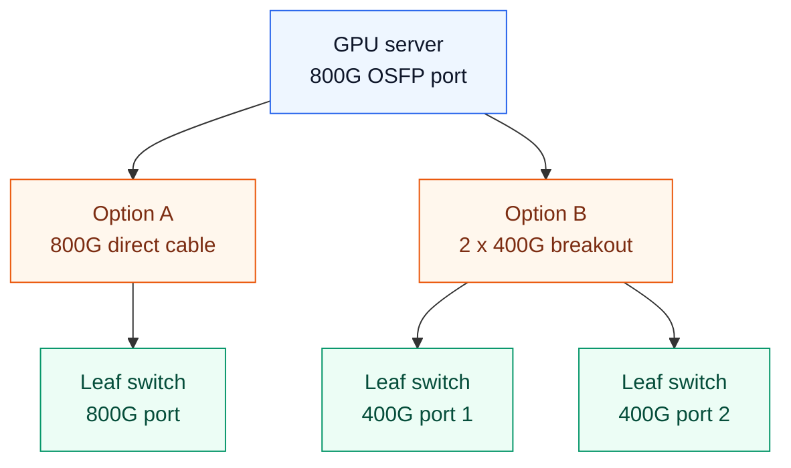

### A100-Style Connectivity

A100-class systems commonly expose multiple 200 Gbps ports. In a rail-optimized design, each server port can connect to a different leaf switch so that each GPU or GPU rail has a separate network path.

This spreads traffic across rails and helps avoid concentrating all GPU traffic through a single ToR.

### Rail-Optimized Cabling

Rail-Optimized Design, ROD, creates many parallel server-to-leaf connections. It improves scale-out bandwidth, but it also increases cabling complexity.

Rack placement affects cable type and length:

| Placement | Cabling Pattern | Operational Impact |
| --- | --- | --- |
| ToR | Short server-to-leaf cables inside the rack, varied leaf-to-spine lengths | Good for short server cables, many rack-local connections |
| MoR | More uniform server cable runs within a row | May simplify row-level cable bundles |
| EoR | Longer server-to-network runs, centralized network rack | Can simplify switch placement but increases cable length |

In ROD, leaf and spine switches may be close enough that AOC or AEC is practical. For server-to-leaf links, DR optics are commonly considered when SMF reach and predictable link behavior are needed.

## Transceiver Reach Types

Optics naming often includes a reach suffix. The suffix helps identify distance, medium, and sometimes lane count.

For example, `400G-SR8` means:

- `400G`: aggregate data rate
- `SR`: short reach
- `8`: eight optical lanes

Typical reach categories:

| Suffix | Meaning | Typical Reach | Medium |
| --- | --- | --- | --- |
| VR | Very short reach | About 50 m | MMF |
| SR | Short reach | About 100 m | MMF |
| DR | Data center reach | About 500 m | SMF |
| FR | Far reach | About 2 km | SMF |
| LR | Long reach | About 10 km | SMF |
| ZR | Extended reach | More than 80 km | DWDM / coherent optics |
| CR | Copper reach | Up to about 7 m passive DAC, about 10 m active DAC | Direct attach copper |

The right reach type depends on rack layout, fiber plant, port speed, breakout design, cost, and power.

## Cable and Connector Types

Connectors join the cable to the transceiver. As bandwidth increases, connector density and cleanliness become more important.

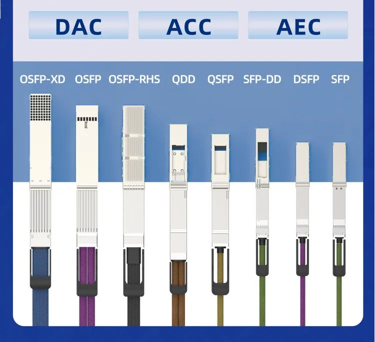

The figure above compares common high-speed cable and pluggable form factors, including OSFP-XD, OSFP, OSFP-RHS, QDD, QSFP, SFP-DD, DSFP, and SFP. These form factors matter because AI cluster cabling must match the server port, switch port, cable type, reach, airflow, and service model.

### LC

LC is a common connector for duplex fiber links. It can be used with single-mode or multi-mode fiber, but in high-speed data center optics it is often associated with SMF use cases such as FR and LR.

Example:

- `QSFP-DD-FR4` with 2 km SMF and dual LC connectors.

### MPO and MTP

MPO is a multi-fiber push-on connector. MTP is a branded MPO-style connector.

MPO/MTP is used when many fibers must terminate in a dense connector, especially for:

- Breakout cables
- Parallel optics
- High-density patch panels
- SR and DR variants with multiple transmit and receive fibers

Examples:

- `QSFP-DD-SR8` with 100 m MMF and MPO-16.
- `QSFP-DD-DR4` with 500 m SMF and MPO-12.

### DAC, AEC, and AOC

| Cable Type | Medium | Typical Use | Benefit | Trade-Off |
| --- | --- | --- | --- | --- |
| DAC | Copper | Very short in-rack links | Low cost, low power | Limited distance |
| Passive DAC | Copper | Short direct connections | Very low power, simple | Usually limited to about 7 m |
| Active DAC | Copper with electronics | Slightly longer short links | Signal boost | More power than passive DAC |
| AEC | Copper with active electronics | High-speed short in-rack links | Cost-effective, improves signal quality | Shorter reach than fiber |
| AOC | Fiber with integrated transceivers | ToR/MoR/EoR links up to about 100 m | Thin, flexible, lower bend radius | Less modular than separate optics plus fiber |

For AI clusters:

- DAC is attractive for very short and low-cost links.
- AEC is attractive inside racks at high speed.
- AOC is attractive across nearby racks or rows.
- Separate pluggable optics plus structured fiber is attractive for larger, more serviceable deployments.

## Optics Form Factors and Standards

AI fabrics need standardized form factors to avoid vendor lock-in and to make high-speed ports deployable at scale.

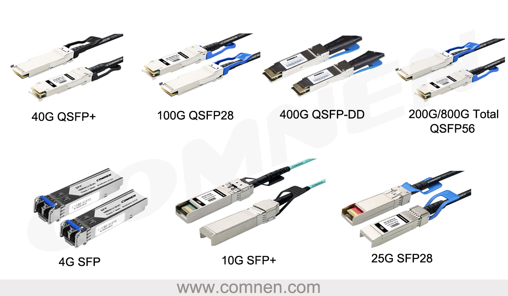

The figure above compares common SFP and QSFP-family form factors across generations. For AI fabrics, the important operational point is that higher link speeds usually require newer cages, more lanes, different cable assemblies, and stricter power and cooling planning.

Important standards bodies and form-factor families include:

- IEEE 802.3bm
- IEEE 802.3bs
- OIF OSFP
- ITU-T G.959.1

### QSFP28, QSFP56, and QSFP-DD

QSFP evolved from 40 Gbps toward higher speeds.

| Form Factor | Typical Data Rate | Lane Count | Typical Lane Rate | Notes |
| --- | --- | --- | --- | --- |
| QSFP28 | 100 Gbps | 4 | 25 Gbps | Mature, compact, broadly deployed |
| QSFP56 | 200 Gbps | 4 | 50 Gbps | Uses PAM4 for higher lane rate |
| QSFP-DD | 200G/400G and future higher speeds | 8 | 25G/50G/100G depending generation | Double-density form factor, backward compatibility |

QSFP-DD is important because it offers high density and backward compatibility with earlier QSFP modules. It is widely considered for 400G Ethernet migration.

QSFP-DD packaging variants include:

| Type | Description |
| --- | --- |
| Type 1 | Similar size to QSFP28 |
| Type 2 | Longer back cage for more design room |
| Type 2A | Heat sink packaged on the optics |
| Type 2B | Taller heat sink to allow room for internal connector and port separation |

### OSFP

OSFP is designed for higher speeds and higher power envelopes. It is common in NVIDIA AI server connectivity and is a major form factor for 400G and 800G AI deployments.

Compared with QSFP-DD, OSFP is physically larger. The extra size can help thermal design, but it may affect density and compatibility.

### CFP Family

CFP, CFP2, and CFP4 were early 100G form factors. CFP variants support longer-distance use cases, but they are larger and less dense than QSFP-DD or OSFP.

The chapter notes that CFP can provide far fewer ports per rack unit than QSFP-DD or OSFP, so it is less attractive for dense AI fabric switch ports.

### QSFP-DD vs. OSFP

| Feature | QSFP-DD | OSFP |
| --- | --- | --- |
| Size | Compact | Larger |
| Lane configuration | Commonly 8 lanes, with evolution toward more | Commonly 8 lanes |
| Speed target | 200G, 400G, and higher variants | 200G, 400G, 800G and beyond |
| Power | Moderate relative to OSFP | Higher power envelope |
| Cable compatibility | Copper and fiber options | Primarily high-speed optical and cable options |
| Thermal behavior | Compact size requires careful thermal design | Larger size can support stronger thermal handling |
| Migration | Strong backward compatibility | Strong fit for next-generation AI servers |
| Cost | Often lower due to smaller standardized ecosystem | Can be higher due to larger package and thermal design |

The practical lesson is not that one form factor always wins. The best choice depends on server vendor, switch vendor, port speed, thermal budget, cable plan, optics availability, and operational preference.

## Further Optics Innovation

The industry is pushing beyond traditional pluggable optics to reduce power, increase port density, and improve economics.

### Pluggable Optics

Traditional pluggable optics place the optical module and DSP inside the removable transceiver.

Benefits:

- Maximum flexibility
- Easy replacement
- Broad operational familiarity
- Ability to choose different optics for different reaches

Trade-offs:

- Higher module power
- Higher module cost
- Heat concentrated at the front panel
- DSP included in every pluggable module

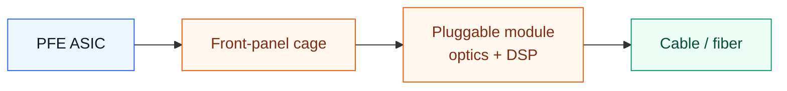

### Linear-Drive Pluggable Optics, LPO

LPO moves DSP functions out of the optical module and relies more heavily on the switch ASIC.

Benefits:

- Lower transceiver cost
- Lower module power
- Smaller pluggable module
- Reduced cooling demand at the module

Trade-offs:

- More dependency on the PFE ASIC
- Interoperability risk
- Deployment and operational risk
- Potential robustness concerns

LPO is attractive because the DSP can represent a large part of optical module cost and power. However, moving that function changes the operating model and may complicate multi-vendor interoperability.

### Linear Receive Optics, LRO

LRO removes DSP from the receive path while maintaining DSP in the transmit path.

The chapter positions LRO as a compromise:

- Better standards compliance than fully DSP-less designs
- Better interoperability than aggressive LPO designs
- Improved power efficiency compared with fully traditional pluggables
- Stronger deployment reliability trade-off

### Co-Packaged Optics, CPO

CPO integrates optics close to, or into, the switch package rather than keeping all optics as separate front-panel pluggables.

Benefits:

- Higher port density
- Lower power
- Shorter electrical traces
- Potentially lower per-bit cost at scale

Trade-offs:

- Less field flexibility
- Switch includes the optics cost up front
- Failed optics may require switch-level service
- Technology and operational model are still emerging

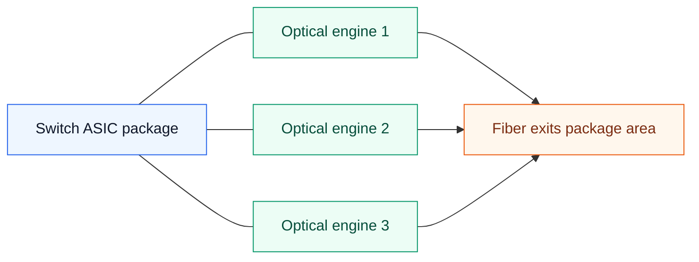

LPO and CPO can benefit switch and ASIC vendors by shifting integration closer to the system. LRO is often more aligned with optics vendors because it preserves more transceiver-side functionality.

## Design Decision Matrix

| Design Question | Common Choice | Reason |
| --- | --- | --- |
| In-rack short link | DAC or AEC | Low cost and low power for short reach |
| Short row-level link | AOC or SR optics | Flexible fiber reach without long-distance optics cost |
| Server-to-leaf 400G/800G in ROD | OSFP, QSFP-DD, DR/SR/AOC/AEC depending layout | Must match server port, switch port, and rack geometry |
| Leaf-to-spine within row | AOC, AEC, SR, or DR | Depends on distance and structured cabling preference |
| Inter-row or building link | SMF with DR/FR/LR | Longer reach and lower dispersion |
| Data center interconnect | ZR / coherent DWDM | Long reach and wavelength multiplexing |
| High-density NVIDIA server connectivity | OSFP commonly used | Server ecosystem and 800G readiness |
| 400G switch migration with backward compatibility | QSFP-DD | Density and QSFP ecosystem compatibility |
| Lowest module power trend | LPO/LRO/CPO evaluation | Reduces DSP or electrical path burden |

## Operational Validation Checklist

Use this checklist before finalizing an AI fabric optics and cable plan.

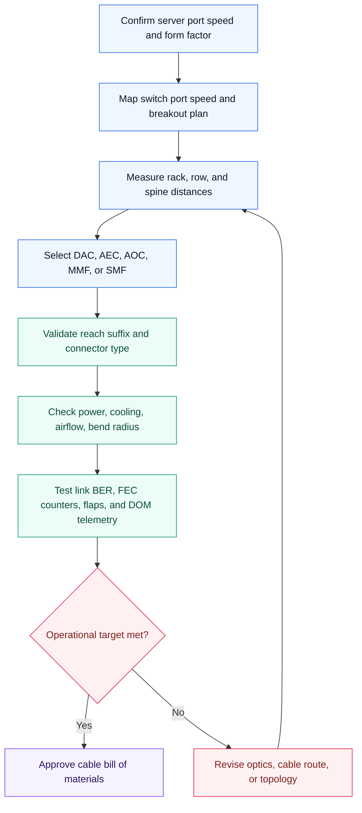

Checklist:

- Confirm server-side form factor: OSFP, QSFP-DD, or another type.
- Confirm switch-side form factor and port speeds.
- Confirm whether breakout is needed, such as 800G to 2 x 400G.
- Validate every link distance against the selected optics reach.
- Avoid using long-reach optics where short-reach cables are sufficient.
- Ensure MMF/SMF selection matches the transceiver type.
- Ensure LC, MPO/MTP, and fiber count match the optics.
- Validate polarity and transmit/receive mapping for MPO trunks.
- Account for bend radius and cable tray fill.
- Account for airflow and front-panel service access.
- Budget power for every optical module.
- Confirm cooling capacity at high-density switch faceplates.
- Monitor link BER, FEC correction, uncorrectable errors, and flaps.
- Track DOM telemetry, including temperature, optical power, voltage, and current.
- Label cables consistently by rail, rack, leaf, spine, and port.
- Keep spare optics and cables for the exact deployed types.
- Validate cleaning and inspection procedures for fiber connectors.
- Confirm that the selected optics are available in production volume.
- Test representative links before ordering at cluster scale.
- Update network diagrams with real cable types, lengths, and connector types.

## Chapter Summary

AI/ML data center optics are moving rapidly from 200G and 400G toward 800G, 1.6T, and beyond. This is driven by high-speed GPU servers, distributed training, and the need to move large amounts of data between accelerators.

GPU servers use local interconnects such as NVLink/NVSwitch for intra-server traffic and external NICs for scale-out traffic. The external path depends on OSFP or QSFP-DD ports, transceivers, cabling, connector choices, and switch port capabilities.

High-speed optics rely on mux/demux, SerDes, DSPs, modulation, FEC, clock recovery, and equalization. PAM4 and higher-order modulation increase bandwidth, but they reduce signal margin and require more sophisticated signal processing.

MMF is used for short links, while SMF supports longer reach. DAC and AEC are attractive for short in-rack links, while AOC and pluggable optics are common for short to medium data center runs. DR, FR, LR, and ZR optics extend reach for larger layouts and data center interconnects.

QSFP-DD and OSFP are central form factors for AI fabrics. QSFP-DD provides compact density and backward compatibility, while OSFP is popular for high-speed AI server connectivity and 800G-class designs.

Pluggable optics provide flexibility, but power and cost are major concerns. LPO, LRO, and CPO attempt to reduce power and increase density, but each changes the trade-off among interoperability, serviceability, reliability, and cost.

## Key Terms

| Term | Meaning |
| --- | --- |
| OSFP | Octal Small Form-factor Pluggable, common for high-speed AI server links |
| QSFP-DD | Quad Small Form-factor Pluggable Double Density |
| QSFP28 | 100G QSFP form factor using 4 lanes |
| QSFP56 | 200G QSFP form factor using 4 x 50G lanes |
| CFP | Earlier 100G form-factor family |
| SerDes | Serializer/deserializer used between ASIC and transceiver |
| PFE ASIC | Packet forwarding engine ASIC |
| DSP | Digital signal processor used for modulation, FEC, equalization, and recovery |
| NRZ | Non-Return-to-Zero, two-level modulation |
| PAM4 | Four-level modulation carrying two bits per symbol |
| QAM | Quadrature amplitude modulation |
| FEC | Forward error correction |
| CDR | Clock data recovery |
| MMF | Multi-mode fiber |
| SMF | Single-mode fiber |
| DWDM | Dense Wavelength Division Multiplexing |
| DAC | Direct attach copper |
| AEC | Active electrical cable |
| AOC | Active optical cable |
| LC | Lucent Connector, common duplex fiber connector |
| MPO | Multi-fiber push-on connector |
| MTP | Branded MPO-style connector |
| VR | Very short reach |
| SR | Short reach |
| DR | Data center reach |
| FR | Far reach |
| LR | Long reach |
| ZR | Extended reach, often coherent DWDM |
| CR | Copper reach |
| LPO | Linear-drive pluggable optics |
| LRO | Linear receive optics |
| CPO | Co-packaged optics |
| ROD | Rail-Optimized Design |

## Q&A

### 1. Why are high-speed optics critical for AI/ML data centers?

In an interview, I would start from the workload. AI/ML clusters spend a lot of time moving data between GPUs, servers, and storage, especially during all-reduce, checkpointing, and data loading. If the optical links are too slow, the GPUs wait on the network. So high-speed optics are critical because they protect GPU utilization and reduce distributed training bottlenecks.

### 2. What is the role of DSPs in optical transceivers?

I would describe a DSP as the signal-recovery engine inside the optical path. At 400G and 800G, the signal is not clean enough to simply pass through unchanged. The DSP handles modulation and demodulation, FEC, clock recovery, and equalization so the receiver can reconstruct the original data reliably.

### 3. Why does PAM4 enable higher bandwidth?

PAM4 increases bandwidth by carrying more information per symbol. NRZ, or PAM2, has two levels and carries one bit per symbol. PAM4 has four levels, so it carries two bits per symbol. The trade-off is that the voltage levels are closer together, which means lower noise margin and a greater need for DSP, equalization, and FEC.

### 4. How do MMF and SMF differ?

I would compare them by reach and signal behavior. MMF has a wider core and carries multiple light paths, so it is cost-effective for short links such as in-rack or nearby-rack connectivity. SMF has a smaller core and carries a single light path, so it supports longer distances with less modal dispersion. In practice, MMF is common for short SR-style links, while SMF is used for DR, FR, LR, and longer links.

### 5. When should DAC, AEC, or AOC be used?

I would choose based on distance, power, and serviceability. DAC is the simplest and cheapest option for very short in-rack links. AEC is still copper, but it adds electronics to improve signal quality at higher speeds. AOC is better when the link needs more reach or thinner, more flexible cabling, for example across racks or rows.

### 6. What does a reach suffix such as SR8 or DR4 mean?

The suffix tells us the optical reach class and the number of optical lanes. For example, `400G-SR8` means 400G short reach using eight optical lanes. SR is usually short-reach MMF, while DR is data center reach over SMF. This matters because the suffix must match the cable plant, connector type, and physical distance.

### 7. Why are QSFP-DD and OSFP important in AI fabrics?

I would say they are important because they are the practical packaging choices for high-speed AI links. QSFP-DD gives compact, high-density switch ports and backward compatibility with the QSFP ecosystem. OSFP provides a larger form factor with a higher power and thermal envelope, which is why it is common in NVIDIA-style 400G and 800G server connectivity.

### 8. What are the trade-offs of pluggable optics?

The main advantage is operational flexibility. With pluggable optics, I can choose SR, DR, FR, LR, or ZR modules depending on distance, and I can replace a failed optic without replacing the switch. The downside is power, cost, and heat. At 400G and 800G, front-panel optics can become a major thermal and power design constraint.

### 9. How do LPO, LRO, and CPO differ?

I would explain them as three ways to reduce the cost and power of traditional pluggables. LPO moves DSP functions out of the module and relies more on the switch ASIC. LRO is a middle ground: it removes DSP from the receive path but keeps transmit-side DSP. CPO goes further by integrating optics close to the switch ASIC package. These approaches can improve power and density, but they also change interoperability, serviceability, and failure-replacement models.

### 10. How does cable management affect AI data center reliability?

I would treat cable management as part of reliability, not just neatness. Bad bend radius, dirty connectors, unlabeled cables, blocked airflow, or overloaded trays can all lead to link errors, thermal problems, and slow troubleshooting. In AI fabrics, where one rack can have many high-speed GPU, storage, and management links, disciplined cabling directly affects uptime and repair time.

## References

- [NVIDIA DGX H100/H200 User Guide, Introduction to NVIDIA DGX H100/H200 Systems](https://docs.nvidia.com/dgx/dgxh100-user-guide/introduction-to-dgxh100.html)
- [NVIDIA DGX A100 User Guide, Introduction to the NVIDIA DGX A100 System](https://docs.nvidia.com/dgx/dgxa100-user-guide/introduction-to-dgxa100.html)
- [Dell'Oro Group, "Exploring the Data Center Switch and AI Networks Markets Landscape in 2024"](https://www.delloro.com/exploring-the-data-center-switch-and-ai-networks-markets-landscape-in-2024/)
- [Understanding NRZ and PAM4 Signaling](https://blog.samtec.com/post/understanding-nrz-and-pam4-signaling/)
- [BlueOptics, "OM2, OM3, OM4, OM5: Which multimode fiber optic cable is the right choice?"](https://www.blueoptics.de/blog-en/om2-om3-om4-om5-which-multimode-fiber-optic-cable-is-the-right-choice)
