# Chapter 5: Thermal and Power Efficiency Considerations

## Table of Contents

- [Goal](#goal)
- [Thermal Footprints in AI Data Centers](#thermal-footprints-in-ai-data-centers)
  - [Why AI Racks Consume More Power](#why-ai-racks-consume-more-power)
  - [Rack Power Budget](#rack-power-budget)
  - [Power Usage Effectiveness, PUE](#power-usage-effectiveness-pue)
- [Airflow Options](#airflow-options)
  - [Front-to-Back Airflow](#front-to-back-airflow)
  - [Back-to-Front Airflow](#back-to-front-airflow)
  - [Bidirectional Fans](#bidirectional-fans)
  - [Choosing Fan Direction](#choosing-fan-direction)
- [Liquid Cooling](#liquid-cooling)
  - [Why Liquid Cooling Is Becoming Necessary](#why-liquid-cooling-is-becoming-necessary)
  - [Immersion Liquid Cooling](#immersion-liquid-cooling)
  - [Single-Phase Immersion Cooling](#single-phase-immersion-cooling)
  - [Two-Phase Immersion Cooling](#two-phase-immersion-cooling)
  - [Cold Plate Liquid Cooling](#cold-plate-liquid-cooling)
  - [Rear-Door Heat Exchanger Liquid Cooling](#rear-door-heat-exchanger-liquid-cooling)
  - [Sprayed Liquid Cooling](#sprayed-liquid-cooling)
- [Cooling Method Comparison](#cooling-method-comparison)
- [Rack and Facility Design Implications](#rack-and-facility-design-implications)
- [Operational Validation Checklist](#operational-validation-checklist)
- [Chapter Summary](#chapter-summary)
- [Key Terms](#key-terms)
- [Q&A](#qa)
- [References](#references)

## Goal

This chapter explains why AI/ML data centers create unusually high power and thermal requirements, and how rack airflow and liquid cooling approaches address those requirements.

The core idea is:

> AI data center design is constrained by power delivery and heat removal as much as by compute, network, or storage capacity.

The chapter focuses on these topics:

- Thermal footprint of AI/ML racks
- Power consumption of GPU servers, high-speed switches, and optics
- Rack power budget and power density
- Power Usage Effectiveness, PUE
- Front-to-back, back-to-front, and bidirectional airflow
- Liquid cooling as an alternative to air cooling
- Immersion cooling, cold plate cooling, rear-door heat exchangers, and sprayed liquid cooling
- Rack and facility design implications

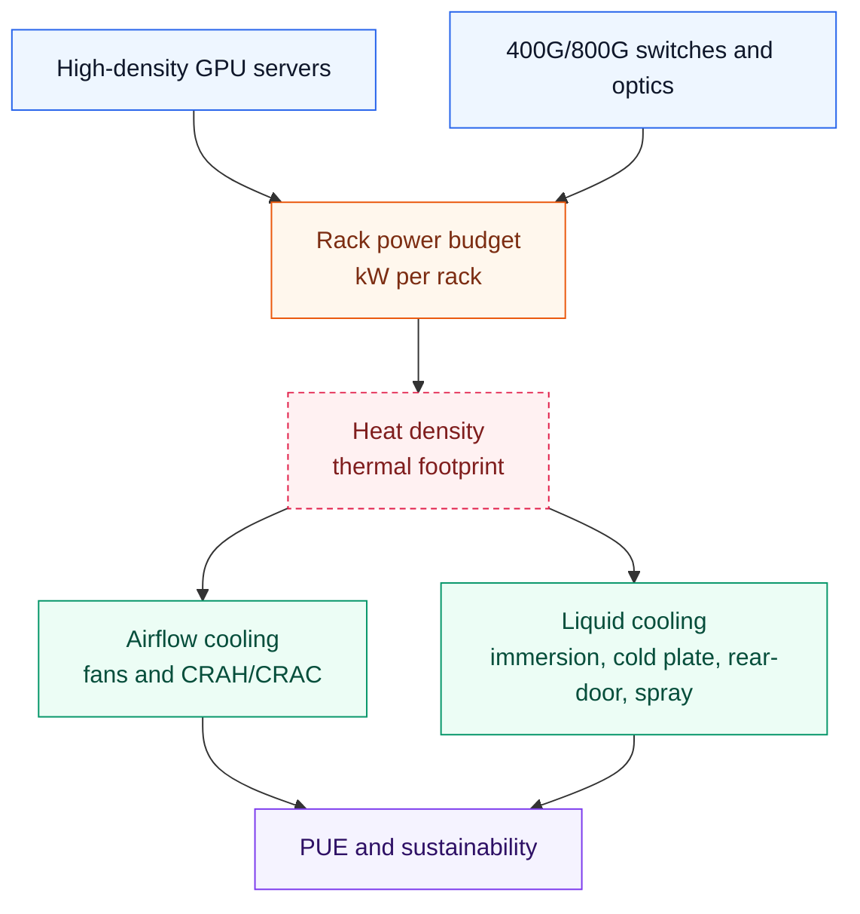

## Thermal Footprints in AI Data Centers

Data center power consumption is already a significant share of global power consumption, and AI/ML workloads increase this pressure. AI data centers use dense GPU servers, storage systems, high-speed switches, and optics. These devices do more work in less space, but they also consume more power and emit more heat per rack.

The physical design problem is direct:

- More GPUs per rack increase compute density.
- More NICs per server increase network power draw.
- 400G/800G optics consume more power than older optics.
- High-radix switches require large power supplies and fan capacity.
- Heat removal must keep up with the compute and network plan.
- Cooling systems themselves consume a large amount of facility power.

### Why AI Racks Consume More Power

AI/ML racks contain power-hungry equipment:

| Component | Power Driver |
| --- | --- |
| Multi-GPU servers | GPUs, CPUs, memory, NICs, local storage, power supply redundancy |
| High-speed switches | ASIC power, fan power, control plane, high-radix port count |
| Optical modules | QSFP-DD, OSFP, 400G/800G transceivers |
| Storage systems | NVMe drives, storage controllers, storage NICs |
| Cooling equipment | Fans, pumps, chillers, heat exchangers |
| Power distribution | UPS, PDUs, conversion losses, lighting and facility overhead |

The chapter gives DGX H100-class systems as an example. A system can include six 3.3 kW power supplies with 4 + 2 redundancy. In that model, active consumption can be approximated as:

```text
4 x 3.3 kW = 13.2 kW
```

A single high-speed switch can also consume several kilowatts. Optics add more power: 400G/800G modules such as QSFP-DD and OSFP consume substantially more power than older 100G QSFP28 optics.

### Rack Power Budget

Traditional data center racks are often designed around roughly 10 kW to 25 kW per rack, with many facilities operating around 16 kW to 18 kW per rack. AI racks can exceed those assumptions quickly.

Example:

| Item | Approximate Impact |
| --- | --- |
| One multi-GPU server | Can consume more than 10 kW |
| Two multi-GPU servers | May exceed a traditional rack power budget |
| One high-radix switch | Several kW, depending on model and optics |
| Dense 400G/800G optics | Adds front-panel heat and power draw |

This changes rack planning. AI clusters may require:

- Fewer servers per rack
- Higher-capacity PDUs
- More power feeds
- Better phase balancing
- Higher airflow
- Liquid cooling
- Wider aisles or specialized containment
- Facility-level power upgrades

### Power Usage Effectiveness, PUE

Power Usage Effectiveness, PUE, measures data center energy efficiency.

```text
PUE = Total Facility Power / IT Equipment Power
```

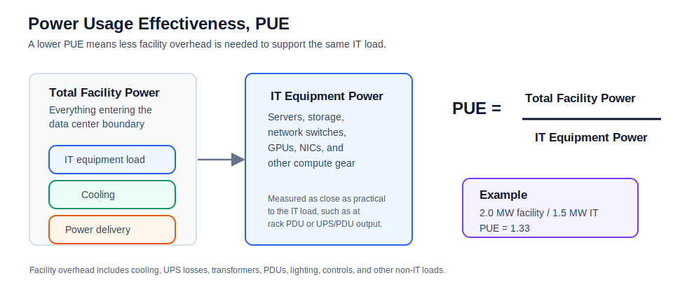

Where:

- Total Facility Power includes IT load plus cooling, power distribution, UPS losses, lighting, and facility overhead.
- IT Equipment Power includes servers, storage, switches, and other computing equipment.

An ideal PUE is `1.0`, meaning all power goes directly to IT equipment with no overhead. Real data centers are above `1.0`.

The chapter notes a typical data center power split:

| Category | Approximate Share |
| --- | --- |
| IT equipment | 40% to 45% |
| Cooling systems | 35% to 40% |
| Power distribution, UPS, lighting, and other overhead | Remaining share |

Lowering PUE matters because cooling overhead can become nearly as important as the IT load itself.

## Airflow Options

The goal of airflow design is to remove heat with the least possible power. Fans are still the most common method for moving heat out of servers, storage devices, and switches.

Airflow direction must be coordinated across the rack. Servers, switches, storage systems, blanking panels, cable managers, and aisle containment should all support the same thermal design.

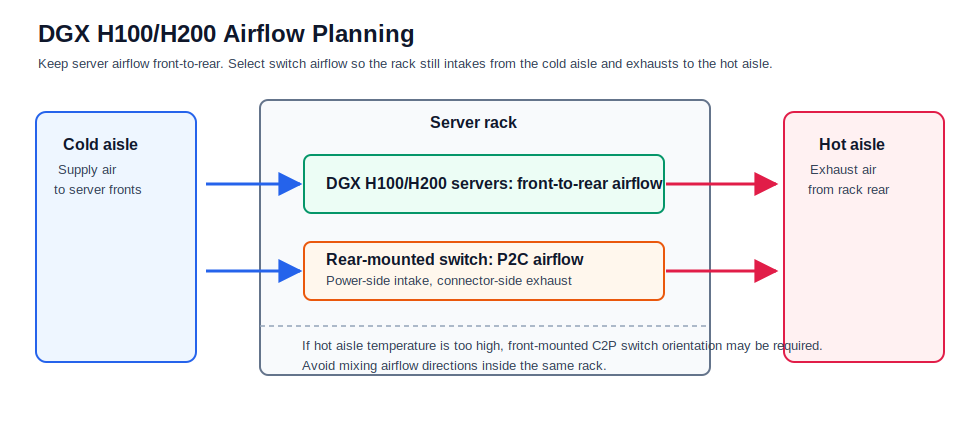

For DGX H100/H200-class racks, design the row around front-to-rear server airflow. Use cold aisle supply and hot aisle exhaust, align switch airflow to the rack orientation, and avoid mixing airflow directions inside the same rack. At this density, aisle containment and full rack heat-load planning are usually more important than simply selecting larger fans.

Rear-mounted switches commonly use P2C airflow, while front-mounted switches may require C2P when hot aisle temperatures are too high for cabling.

### Front-to-Back Airflow

In front-to-back airflow, cool air enters the front of the device and hot air exits the rear.

This is common in data centers and is usually preferred by customers.

Benefits:

- Aligns with hot-aisle/cold-aisle rack designs.
- Cools switch optics first when ports are on the front panel.
- Works well when servers, storage, and switches share the same direction.
- Simplifies rack standardization.

Trade-offs:

- Requires cable and airflow discipline at the front of the rack.
- Dense front-panel optics may still require strong airflow and heat sinks.

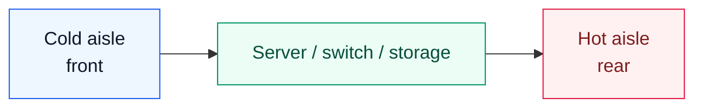

### Back-to-Front Airflow

In back-to-front airflow, cool air enters from the rear and hot air exits the front.

Benefits:

- Can cool power supply units first when their intake is at the rear.
- May fit certain rack layouts or network rack designs.

Trade-offs:

- Front-panel optics receive air later in the path.
- Optics may need extra heat sinks.
- The rack and all equipment must be aligned to this airflow model.
- Mixed airflow directions can cause recirculation and hotspots.

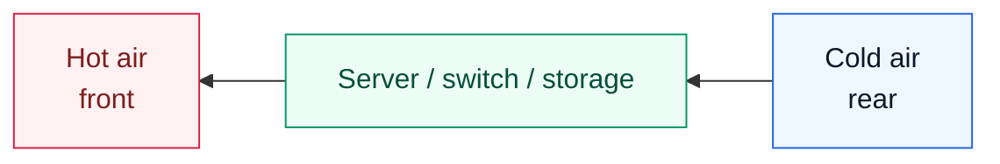

### Bidirectional Fans

Bidirectional fans can support either airflow direction. Some designs can adjust fan direction based on heat sensors or deployment requirements.

Benefits:

- Flexible when airflow direction is uncertain during procurement.
- Can adapt to different rack designs.
- Reduces risk of ordering the wrong airflow direction.

Trade-offs:

- More expensive.
- More complex hardware design.
- May not be cost-effective for large standardized deployments.
- Still requires facility airflow planning.

### Choosing Fan Direction

Once the rack and aisle design are defined, fan direction should normally be fixed before equipment is ordered.

For AI/ML clusters, the selected direction must account for:

- Server airflow direction
- Switch airflow direction
- Optics heat at the front panel
- Storage airflow direction
- Cable management
- Hot aisle and cold aisle containment
- Facility air-conditioning capacity
- Maintenance access

If airflow is inconsistent across devices, heat can recirculate inside the rack. This can increase fan speed, power consumption, link errors, thermal throttling, and hardware failure risk.

## Liquid Cooling

Air cooling becomes harder as rack power density rises. Liquid cooling is becoming more important because liquid can remove heat more efficiently than air.

### Why Liquid Cooling Is Becoming Necessary

Liquid cooling can:

- Remove more heat from high-density racks.
- Reduce cooling power consumption.
- Improve PUE.
- Support higher processor and GPU performance.
- Enable rack densities that are difficult with air cooling.
- Reduce dependence on extremely high fan speeds.

The chapter notes that liquid cooling can significantly reduce data center power consumption and improve PUE. It also cites market growth in data center liquid cooling as AI power density rises.

Liquid cooling is not a single design. The chapter discusses four main approaches:

- Immersion liquid cooling (침지식 액체 냉각)
- Cold plate liquid cooling (콜드 플레이트 액체 냉각)
- Rear-door heat exchanger liquid cooling (후면 도어 열교환기 액체 냉각)
- Sprayed liquid cooling (분사식 액체 냉각)

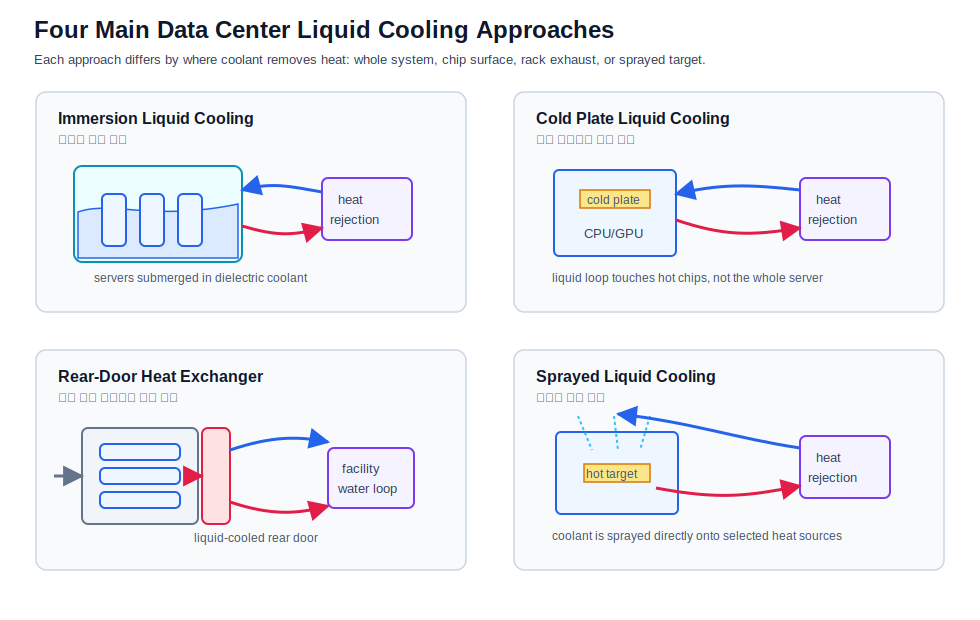

This simplified original diagram summarizes the same cooling categories discussed in the chapter. It is not a reproduction of the published figure from Wu et al.; the paper is listed in References only as a technical background source.

### Immersion Liquid Cooling (침지식 액체 냉각)

In immersion cooling, equipment is submerged in a dielectric coolant. The fluid absorbs heat from boards and components directly.

Requirements:

- Facility must be designed for immersion tanks.
- Equipment must be qualified for immersion.
- Maintenance processes must handle submerged hardware.
- Coolant compatibility and lifecycle management must be planned.

Benefits:

- Strong heat removal.
- Supports very high power density.
- Can improve power efficiency.
- Reduces dependence on server fans.

Limitations:

- Requires specialized facility design.
- May complicate operations and maintenance.
- Hardware must be immersion-compatible.
- Less compatible with standard rack service workflows.

### Single-Phase Immersion Cooling (단상 침지 냉각)

In single-phase immersion cooling, the coolant remains liquid.

The cycle is:

1. Equipment sits in a sealed tank of coolant.
2. Heat from components warms the coolant.
3. Pumps move warm coolant to a heat exchanger.
4. Water or another secondary loop removes heat from the coolant.
5. Cooled coolant returns to the tank.

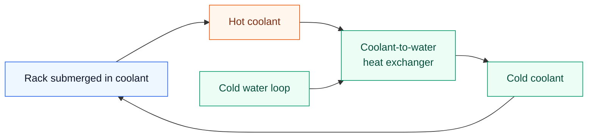

Single-phase immersion is conceptually simple, but it requires immersion-ready infrastructure and equipment.

### Two-Phase Immersion Cooling (2상 침지 냉각)

In two-phase immersion cooling, the fluid has a boiling point below the temperature of hot components.

The cycle is:

1. Components heat the liquid.
2. The liquid boils and becomes vapor.
3. Vapor rises toward a condenser or cold-water tube.
4. Vapor cools and condenses back into liquid droplets.
5. Droplets fall back into the liquid pool.

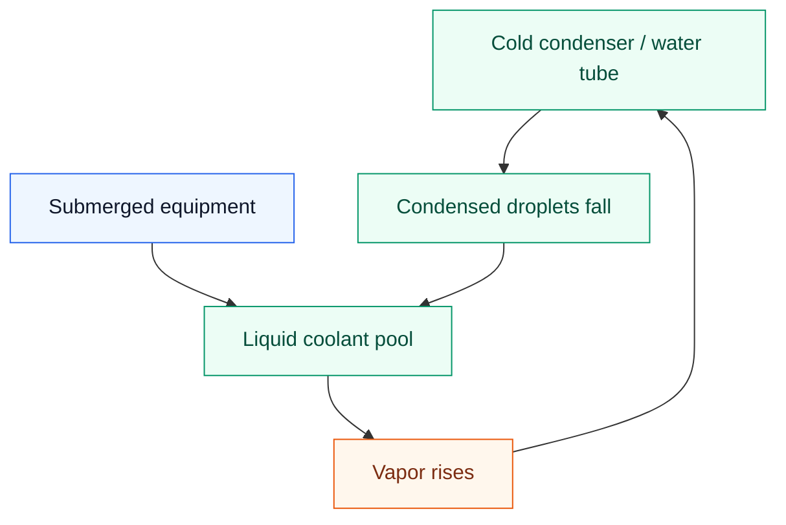

Two-phase immersion can avoid a separate external heat exchanger inside the coolant loop because phase change happens inside the tank. It is efficient, but it requires carefully selected fluids and specialized operational procedures.

### Cold Plate Liquid Cooling (콜드 플레이트 냉각)

Cold plate cooling is also called direct-to-chip liquid cooling (직접 칩 냉각).

In this design:

- Cold plates or heat sinks attach directly to CPUs, GPUs, memory, or other hot components.
- Cool liquid flows through tubes to the plates.
- Heat transfers from the component to the liquid.
- Warm liquid moves to a heat exchanger.
- Cooled liquid returns to the cold plates.

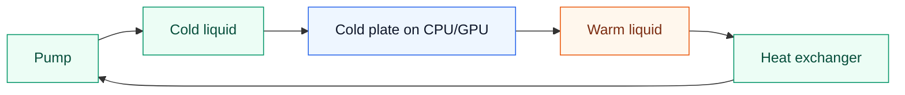

Benefits:

- Targeted heat removal from the hottest components.
- Equipment does not need to be fully submerged.
- Can be cheaper and more flexible than immersion.
- Can coexist with air cooling for other components.

Limitations:

- Requires plumbing inside the rack or chassis.
- Requires leak detection and service procedures.
- Not all components are cooled directly.
- Still requires facility water or heat exchange infrastructure.

### Rear-Door Heat Exchanger Liquid Cooling (후면 도어 열교환기 액체 냉각)

Rear-door heat exchanger cooling uses a radiator-like door at the back of the rack. Hot exhaust air from the equipment passes through the rear-door heat exchanger. A chilled-water loop absorbs heat from the air.

Benefits:

- Can support high-density racks, such as around 20 kW at standard chilled-water design temperatures.
- Does not require changing servers or switches.
- Works with air-cooled equipment.
- Can be simpler than immersion or direct-to-chip retrofits.

Limitations:

- Less efficient than immersion and cold plate liquid cooling.
- Requires data center design support.
- Works best with front-to-back airflow.
- Adds rear-rack weight, plumbing, and service considerations.

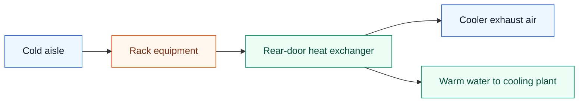

The chapter also refers to this approach as air-assisted liquid cooling. The equipment remains air cooled, but liquid removes heat at the rack rear.

### Sprayed Liquid Cooling (분사식 액체 냉각)

Sprayed liquid cooling sprays coolant through nozzles onto heat-generating components.

Benefits:

- Targeted cooling.
- Uses less coolant than some other liquid cooling methods.
- Can reduce energy consumption compared with air-cooled designs.
- Similar in spirit to cold plate cooling, but coolant is sprayed instead of circulated through a plate.

Limitations:

- Equipment must be modified to support spray devices.
- Requires liquid management inside the chassis or enclosure.
- Requires careful maintenance and reliability planning.

The chapter notes that sprayed liquid cooling can reduce total data center energy consumption compared with air cooling.

## Cooling Method Comparison

| Cooling Method | Main Idea | Strength | Limitation |
| --- | --- | --- | --- |
| Front-to-back airflow | Air enters front, exits rear | Standard data center pattern, good for front-panel optics | Limited at very high power density |
| Back-to-front airflow | Air enters rear, exits front | Can cool power supplies first | Optics get warmer air later |
| Bidirectional fans | Configurable airflow direction | Procurement and deployment flexibility | Higher cost and complexity |
| Single-phase immersion | Equipment submerged in liquid coolant | Strong heat removal, high density | Specialized tanks, compatible hardware required |
| Two-phase immersion | Coolant boils and condenses inside tank | Efficient phase-change cooling | Specialized fluids and procedures |
| Cold plate | Liquid runs to plates on hot chips | Targeted direct-to-chip cooling | Plumbing, leak detection, component coverage |
| Rear-door heat exchanger | Liquid-cooled rear rack door absorbs exhaust heat | Works with normal air-cooled gear | Less efficient than direct liquid methods |
| Sprayed liquid cooling | Coolant sprayed onto hot surfaces | Targeted and coolant-efficient | Requires modified equipment |

## Rack and Facility Design Implications

Thermal and power planning must be integrated with network design. For AI fabrics, the rack is not just a physical container; it is a power, cooling, cabling, and service domain.

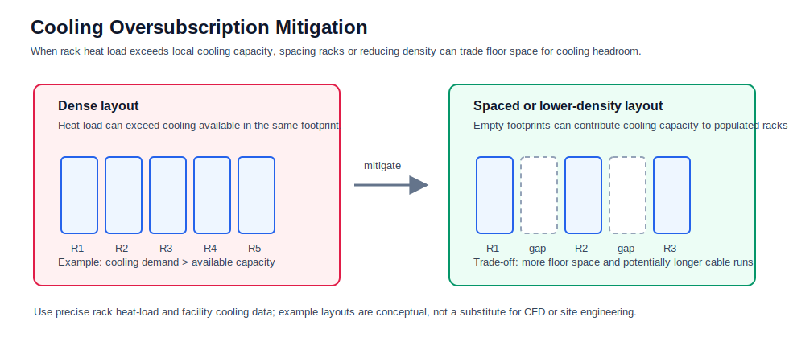

Cooling oversubscription is a facility-level problem, not just a rack airflow problem. Even when airflow direction is correct, a dense row can produce more heat than the local cooling footprint can remove. In that case, mitigation may require reducing rack density, spacing populated racks apart, or changing the row layout. This improves cooling headroom, but it consumes more floor space and can increase cable length.

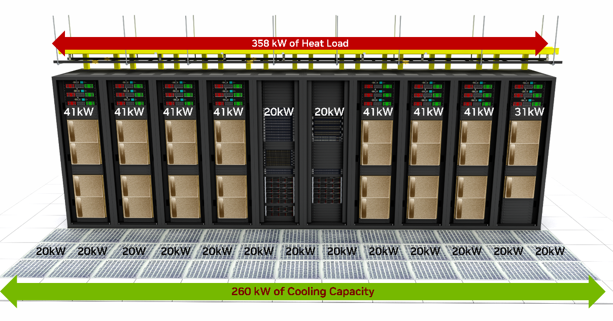

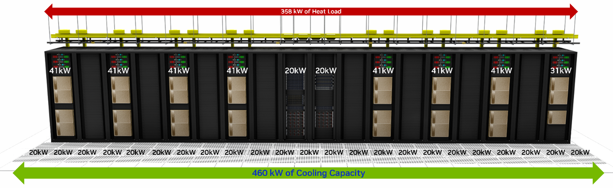

Source: NVIDIA, [DGX SuperPOD Data Center Design Featuring DGX H100 Systems, Cooling and Airflow Optimization](https://docs.nvidia.com/dgx-superpod/design-guides/dgx-superpod-data-center-design-h100/latest/cooling.html), Figure 21 and Figure 22.

Important design implications:

- Rack power density determines how many GPU servers can fit safely.
- Cooling design may limit server count before rack units are physically full.
- Switch and optics heat must be included in thermal planning.
- Airflow direction must match across servers, switches, and storage.
- Cable bundles must not block airflow.
- High-power racks may need wider aisles or containment changes.
- Liquid-cooled racks require plumbing, leak detection, maintenance clearance, and facility water loops.
- PDU and UPS capacity must be sized for peak and redundant loads.
- Power feed redundancy must match workload availability targets.
- Thermal telemetry should be collected with network and server telemetry.

## Operational Validation Checklist

Use this checklist before finalizing an AI data center rack and cooling design.

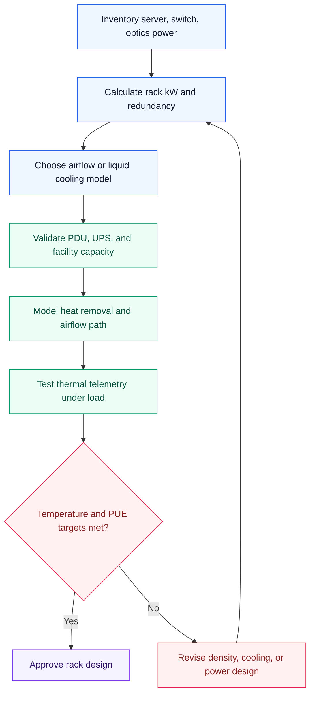

Checklist:

- Calculate server, switch, optics, storage, and management power per rack.
- Include redundant power supply behavior, not only nameplate power.
- Verify PDU, branch circuit, UPS, and generator capacity.
- Confirm airflow direction before ordering equipment.
- Avoid mixing airflow directions in the same rack.
- Validate hot-aisle/cold-aisle containment.
- Confirm cable routing does not block fan intake or exhaust.
- Monitor inlet temperature, outlet temperature, fan speed, and thermal throttling.
- Monitor optics temperature and link error counters.
- Confirm cooling capacity at peak training workload.
- Measure PUE impact of the proposed design.
- For liquid cooling, validate facility water availability and quality.
- For cold plate, validate quick-disconnects, leak detection, and service workflow.
- For immersion, validate tank maintenance, coolant compatibility, and hardware qualification.
- For rear-door heat exchangers, validate door weight, clearance, and chilled-water loop.
- For sprayed liquid cooling, validate equipment modifications and spray reliability.
- Ensure operations staff can service failed servers, switches, optics, and pumps.
- Keep thermal design documents aligned with rack elevation and cable plans.

## Chapter Summary

AI/ML data centers have much higher power and cooling requirements than traditional data centers because GPU servers, high-speed switches, and optics concentrate more power into each rack.

Traditional racks often operate around 10 kW to 25 kW, while modern AI racks can exceed those assumptions quickly. A single DGX H100-class system can consume more than 10 kW, and switches plus optics add additional heat.

PUE measures data center efficiency as total facility power divided by IT equipment power. Because cooling systems can consume a large share of total facility power, thermal design has a direct effect on operating cost and sustainability.

Air cooling remains common, but airflow direction must be chosen carefully. Front-to-back airflow is commonly preferred and helps cool front-panel optics first. Back-to-front airflow cools power supplies first but may leave optics hotter. Bidirectional fans provide flexibility at higher cost.

Liquid cooling is becoming more important for high-density AI racks. Immersion cooling submerges equipment in coolant, cold plate cooling targets CPUs and GPUs directly, rear-door heat exchangers remove heat from rack exhaust air, and sprayed liquid cooling sprays coolant onto hot components.

No cooling method is universally best. The right choice depends on rack power density, facility design, equipment compatibility, maintenance model, cost, and sustainability goals.

## Key Terms

| Term | Meaning |
| --- | --- |
| PUE | Power Usage Effectiveness, total facility power divided by IT equipment power |
| IT Equipment Power | Power consumed by servers, storage, switches, and IT gear |
| Total Facility Power | IT load plus cooling, power distribution, UPS losses, lighting, and overhead |
| Thermal Footprint | Heat output and cooling impact of equipment or a rack |
| Front-to-Back Airflow | Air enters the equipment front and exits the rear |
| Back-to-Front Airflow | Air enters the equipment rear and exits the front |
| Bidirectional Fan | Fan system that can support either airflow direction |
| Immersion Cooling | Cooling method where equipment is submerged in dielectric liquid |
| Single-Phase Immersion | Immersion cooling where coolant remains liquid |
| Two-Phase Immersion | Immersion cooling where coolant boils and condenses |
| Cold Plate Cooling | Direct-to-chip liquid cooling using plates attached to hot components |
| Rear-Door Heat Exchanger | Liquid-cooled door that absorbs heat from rack exhaust air |
| Sprayed Liquid Cooling | Cooling method where coolant is sprayed onto hot surfaces |
| Heat Exchanger | Device that transfers heat from one fluid loop to another |
| Chilled Water Loop | Facility cooling loop carrying cold water to remove heat |
| Rack Power Density | Power consumed per rack, usually measured in kW |
| Thermal Throttling | Performance reduction caused by overheating |
| UPS | Uninterruptible Power Supply |
| PDU | Power Distribution Unit |

## Q&A

### 1. Why do AI/ML data centers have higher power and cooling requirements than traditional data centers?

At a high level, AI/ML data centers concentrate far more compute, network, and storage capacity into each rack than traditional enterprise data centers. A single multi-GPU server can consume more than 10 kW, and the rack may also contain high-radix switches, 400G/800G optics, storage devices, PDUs, and management equipment. All of that power becomes heat that must be removed reliably.

The key point is that the problem is not just total facility power. It is power density. Traditional racks might have been designed around 10 kW to 25 kW, while AI racks can exceed those assumptions quickly. Once power density rises, airflow, cable routing, service clearance, and cooling capacity all become design constraints.

The practical answer is: AI data centers need more power and cooling because they are built to keep expensive accelerators busy. If the facility cannot deliver power or remove heat, the GPUs may throttle, fail, or sit idle.

### 2. What is PUE, and how is it calculated?

PUE, Power Usage Effectiveness, measures how efficiently a data center uses power. The formula is:

```text
PUE = Total Facility Power / IT Equipment Power
```

IT equipment power is the load consumed by servers, storage, switches, GPUs, NICs, and similar equipment. Total facility power includes the IT load plus cooling, UPS losses, power distribution losses, lighting, pumps, fans, and other overhead.

The intuition is simple: if a site has a PUE of `1.3`, then for every 1 MW used by IT equipment, the facility uses about 0.3 MW of additional overhead. The ideal PUE is `1.0`, but real facilities are above that. For AI data centers, PUE matters because cooling overhead can become a large part of the operating cost.

### 3. How do front-to-back, back-to-front, and bidirectional airflow differ?

Front-to-back airflow takes in cold air at the equipment front and exhausts hot air out the rear. This aligns well with cold aisle and hot aisle data center layouts, and it is the expected orientation for DGX H100/H200-class servers.

Back-to-front airflow does the reverse. It can be useful for some network devices depending on where the switch is mounted and where the connector side faces. For example, rear-mounted network switches may use P2C airflow so the switch still follows the rack-level cold-to-hot direction.

Bidirectional fans add flexibility because the same platform can support either direction, but they increase cost and complexity. Airflow direction should not be treated as an afterthought. Mixed airflow in the same rack can create recirculation, raise inlet temperatures, and reduce cooling efficiency.

### 4. How does immersion cooling work?

Immersion cooling places equipment directly in a dielectric coolant. The coolant absorbs heat from the electronics and transfers it to a heat exchanger or condenser. In single-phase immersion, the coolant stays liquid. In two-phase, or 2상, immersion, the coolant boils into vapor and then condenses back into liquid.

The main advantage is heat removal. Immersion cooling can support very high power density and can reduce reliance on high-speed fans. It can also improve facility efficiency when the full cooling loop is designed well.

The trade-off is operational change. The servers, boards, connectors, materials, maintenance process, and facility layout all need to be compatible with immersion. Immersion is powerful, but it is not a simple drop-in replacement for air cooling.

### 5. What is cold plate cooling?

Cold plate cooling, often called direct-to-chip liquid cooling, attaches liquid-cooled plates to hot components such as CPUs, GPUs, or memory devices. Cool liquid flows through the plate, absorbs heat from the component, and then carries that heat to a heat exchanger or facility water loop.

The reason this is attractive is that it targets the highest heat sources without submerging the entire server. That makes it more compatible with conventional rack operations than immersion cooling. Some components can still be air cooled while the CPUs and GPUs use liquid.

The engineering trade-off is plumbing. You need manifolds, hoses, quick disconnects, leak detection, service procedures, and facility water planning. Cold plate cooling is efficient, but it moves part of the reliability problem from airflow into liquid distribution and maintenance.

### 6. What are the trade-offs between air and liquid cooling?

Air cooling is simpler, familiar, and usually cheaper to operate from a hardware-service perspective. It works well when rack power density is moderate and airflow is well managed with cold aisle supply, hot aisle exhaust, blanking panels, and containment.

The limitation is heat capacity. At high AI rack densities, air can require large fan power, high airflow volume, and careful facility design. Eventually, the rack may be physically full of cooling constraints before it is full of servers.

Liquid cooling removes heat more efficiently and can improve PUE, but it introduces specialized infrastructure. The site needs liquid loops, pumps, heat exchangers, leak management, trained operators, and hardware qualified for the cooling method. Liquid cooling solves one scaling problem, but it introduces a new operational model.

### 7. How does rack design influence cooling strategy?

Rack design directly determines whether the cooling plan is practical. Rack height, width, depth, side panels, cable ingress, blanking panels, door choice, PDU placement, and sensor placement all affect airflow and serviceability.

For DGX H100/H200-class racks, the starting point is front-to-rear server airflow and a row design based on cold aisle supply and hot aisle exhaust. Switch airflow must be aligned with the rack orientation. If a rear-mounted switch faces the hot aisle, P2C airflow may be appropriate. If hot aisle temperatures are too high for cabling, the switch placement and airflow may need to change.

The other constraint is cooling capacity per footprint. Even if airflow direction is correct, a dense row can exceed the local cooling capacity. That is why rack spacing, rack density, containment, cable length, and facility cooling capacity must be considered together.

### 8. Why does cooling efficiency affect sustainability?

Cooling efficiency matters because cooling is not a small overhead. In many data centers, cooling systems consume a large share of facility power. If the cooling design is inefficient, the site burns more energy just to remove heat from the IT load.

From a sustainability point of view, better cooling reduces total energy consumption, operating cost, and carbon impact. It can also allow more compute capacity within the same power envelope. That is especially important for AI data centers because demand for GPU capacity is growing faster than many facilities can add power.

In practice, sustainability comes back to engineering discipline. Good airflow management, accurate thermal telemetry, correct rack density, efficient liquid cooling where needed, and realistic PUE targets all help the data center deliver more useful compute per watt.

## References

- [Data Center Knowledge, "Power Shortages Will Restrict 40% of AI Data Centers by 2027, Gartner"](https://www.datacenterknowledge.com/management/power-shortages-will-restrict-40-of-ai-data-centers-by-2027-gartner)
- [IEA, Energy and AI](https://www.iea.org/reports/energy-and-ai)
- [ASHRAE, American Society of Heating, Refrigerating and Air-Conditioning Engineers](https://www.ashrae.org/)
- [ASHRAE, AIDC Infrastructure Revolution and Liquid Cooling Application](https://ashrae.org.vn/wp-content/uploads/2024/12/Topic-1-AIDC-Infrastructure-revolution-and-liquid-cooling-application.pdf)
- [Wu et al., "A comprehensive review of cold plate liquid cooling technology for data centers," Chemical Engineering Science, 2025](https://doi.org/10.1016/j.ces.2025.121525)
- [NVIDIA, DGX SuperPOD Data Center Design Featuring DGX H100 Systems, Cooling and Airflow Optimization](https://docs.nvidia.com/dgx-superpod/design-guides/dgx-superpod-data-center-design-h100/latest/cooling.html)
- [NVIDIA, DGX SuperPOD Data Center Design Featuring DGX H100 Systems, White Space Infrastructure](https://docs.nvidia.com/dgx-superpod/design-guides/dgx-superpod-data-center-design-h100/latest/infrastructure.html)
- [Naddod, "Data Center Liquid Cooling Technology and Trends Analysis (2025)"](https://www.naddod.com/blog/data-center-liquid-cooling-technology-and-trends-analysis)
