# Chapter 6: Efficient Load Balancing

## Table of Contents

- [Goal](#goal)
- [Why Load Balancing Is Hard in AI Fabrics](#why-load-balancing-is-hard-in-ai-fabrics)
  - [Low Entropy in RoCEv2 Traffic](#low-entropy-in-rocev2-traffic)
  - [Elephant Flows and Flow Collisions](#elephant-flows-and-flow-collisions)
- [ECMP Foundation](#ecmp-foundation)
  - [Control Plane View](#control-plane-view)
  - [Data Plane View](#data-plane-view)
  - [Hash Inputs and RoCEv2 BTH](#hash-inputs-and-rocev2-bth)
- [Load-Balancing Mechanisms](#load-balancing-mechanisms)
  - [Static Load Balancing, SLB](#static-load-balancing-slb)
  - [Resilient, Symmetric, and Weighted Hashing](#resilient-symmetric-and-weighted-hashing)
  - [Dynamic Load Balancing, DLB](#dynamic-load-balancing-dlb)
  - [DLB Assigned-Flow Mode](#dlb-assigned-flow-mode)
  - [DLB Flowlet Mode](#dlb-flowlet-mode)
  - [DLB Reactive Path Rebalancing](#dlb-reactive-path-rebalancing)
  - [DLB Per-Packet Mode](#dlb-per-packet-mode)
- [Global Load Balancing, GLB](#global-load-balancing-glb)
  - [Why Local Link Quality Is Not Enough](#why-local-link-quality-is-not-enough)
  - [Remote Link Quality and End-to-End Path Quality](#remote-link-quality-and-end-to-end-path-quality)
  - [BGP NNHN and GLB Heartbeats](#bgp-nnhn-and-glb-heartbeats)
  - [Where GLB Can Be Applied](#where-glb-can-be-applied)
- [Traffic Engineering-Based Load Balancing, TELB](#traffic-engineering-based-load-balancing-telb)
  - [Why TELB Exists](#why-telb-exists)
  - [Path Color, Tenant, GPU, and QP Pinning](#path-color-tenant-gpu-and-qp-pinning)
  - [BGP Deterministic Path Forwarding](#bgp-deterministic-path-forwarding)
  - [Controller-Based TELB](#controller-based-telb)
- [Per-Packet Load Balancing](#per-packet-load-balancing)
  - [Random Spray](#random-spray)
  - [Selective Packet Spraying](#selective-packet-spraying)
  - [Packet Reordering](#packet-reordering)
- [Mechanism Comparison](#mechanism-comparison)
- [Operational Validation Checklist](#operational-validation-checklist)
- [Chapter Summary](#chapter-summary)
- [Key Terms](#key-terms)
- [Q&A](#qa)
- [References](#references)

## Goal

This chapter explains how load balancing works in AI/ML data center fabrics and why conventional ECMP is often not enough for large RoCEv2 training clusters.

The core idea is:

> AI fabrics need load balancing that understands low entropy, elephant flows, local and remote congestion, packet ordering, and workload policy.

The chapter focuses on these topics:

- ECMP control-plane and data-plane behavior
- Why RoCEv2 traffic often has low flow entropy
- Static Load Balancing, SLB
- Dynamic Load Balancing, DLB
- Flowlet-based balancing and reactive rebalancing
- Global Load Balancing, GLB
- BGP Next-Next-Hop Nodes, NNHN, and GLB heartbeats
- Traffic Engineering-Based Load Balancing, TELB
- Per-packet load balancing and selective packet spraying

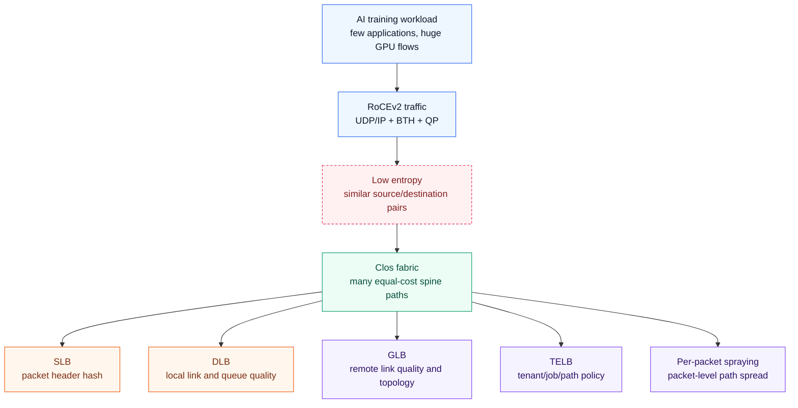

## Why Load Balancing Is Hard in AI Fabrics

AI/ML fabrics are not typical enterprise data center fabrics. A cluster may run a small number of large distributed jobs, and most useful traffic may be RDMA over Converged Ethernet, RoCEv2.

Important properties:

- Traffic is dominated by east-west GPU-to-GPU communication.
- Distributed training creates synchronized bursts.
- The number of large flows may be small.
- Many flows share similar source/destination IP and UDP fields.
- RoCEv2 normally uses UDP destination port 4791.
- A few elephant flows can consume whole leaf-spine or spine-leaf links.
- Packet reordering can hurt RDMA unless the NIC, DPU, or transport can handle it.

### Low Entropy in RoCEv2 Traffic

Entropy means the amount of useful variation in packet header fields that a switch can hash on.

Traditional ECMP often hashes on a 5-tuple:

| Field | Meaning |
| --- | --- |
| Source IP | Sender address |
| Destination IP | Receiver address |
| Source port | Transport source port |
| Destination port | Transport destination port |
| Protocol | TCP, UDP, and so on |

In AI RoCEv2 fabrics, this can be weak because the same GPU pairs may communicate repeatedly, UDP destination port 4791 is common, and the number of flows is often much smaller than in web or enterprise traffic.

To improve entropy, some implementations can include RoCEv2 Base Transport Header, BTH, fields such as Queue Pair, QP, in the hash calculation.

### Elephant Flows and Flow Collisions

An elephant flow is a large, bandwidth-heavy flow. A mouse flow is a short, small flow.

In AI training, elephant flows are common:

- Gradient synchronization
- Activation transfer
- Parameter exchange
- AllReduce, AllGather, ReduceScatter, and AlltoAll communication
- Checkpoint-heavy storage or synchronization traffic

When multiple elephant flows hash to the same ECMP member, that link can become congested while other equal-cost links remain underused.

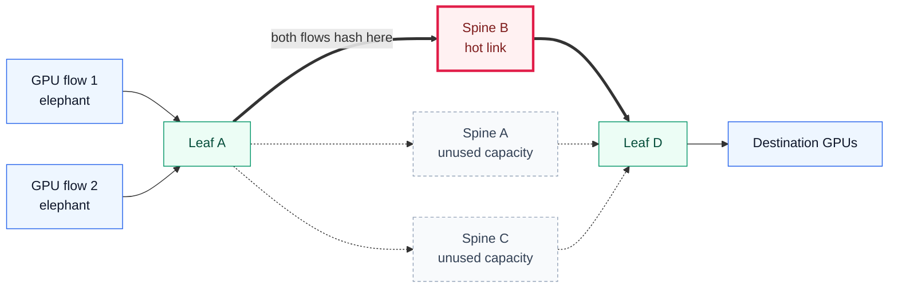

The result is poor fabric utilization, longer tail latency, more ECN/CNP activity, and possibly more PFC pressure.

---

## ECMP Foundation

Equal-Cost Multipathing, ECMP, lets a leaf switch use several equal-cost paths through the spine layer.

Example:

- GPU1 is attached behind Leaf A.
- GPU2 is attached behind Leaf B.
- Leaf A can reach Leaf B through Spine A, Spine B, or Spine C.
- BGP or an IGP installs equal-cost next hops.
- The ASIC chooses one next hop for each flow.

### Control Plane View

The routing control plane tells the switch which next hops are available.

In a BGP-based IP fabric:

1. Leaf B advertises the GPU2 prefix to the spines.
2. Spine A, Spine B, and Spine C advertise the same prefix to Leaf A.
3. Leaf A sees multiple routes with equal attributes.
4. Leaf A programs an ECMP next-hop group in the ASIC.

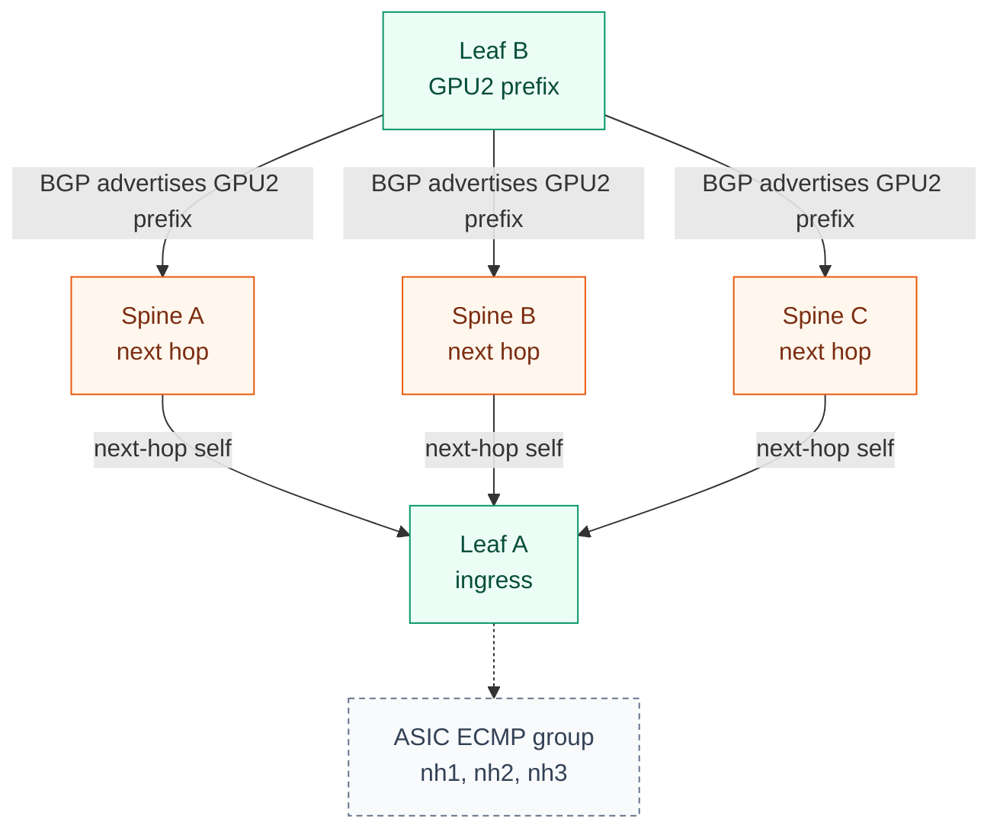

For a vendor reference topology, see Juniper's EBGP underlay overview in its IP fabric underlay design guide.

### Data Plane View

The data plane makes the forwarding decision at packet arrival time. The control plane is not consulted for every packet.

The switch ASIC:

1. Parses packet headers.
2. Looks up the destination in the forwarding table.
3. Finds an ECMP next-hop group.
4. Computes a hash over selected packet fields.
5. Maps the hash result to an ECMP bucket.
6. Sends the packet toward the chosen spine.

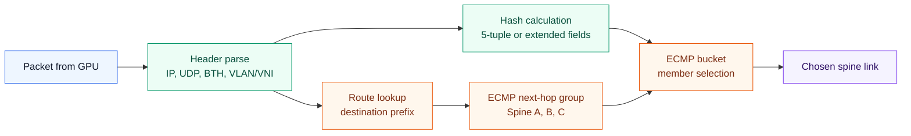

For classic ECMP, the ASIC does not need to remember every flow. The hash is deterministic, so packets with the same hash inputs select the same ECMP member while different flows are spread across the available spine links.

### Hash Inputs and RoCEv2 BTH

Possible hash inputs include:

| Field | Usefulness |
| --- | --- |
| Source IP | Basic flow separation |
| Destination IP | Basic flow separation |
| Source UDP/TCP port | Helps when varied |
| Destination UDP/TCP port | Weak for RoCEv2 if many packets use UDP 4791 |
| Protocol | Basic 5-tuple field |
| VLAN/VNI | Useful in overlays or segmentation |
| RoCEv2 BTH QP | Improves entropy for RDMA traffic |

The chapter's practical point is that default packet-header hashing may be too coarse for AI training. The switch may need RoCEv2-aware hash fields or a more adaptive load-balancing mechanism.

---

## Load-Balancing Mechanisms

The chapter compares several mechanisms:

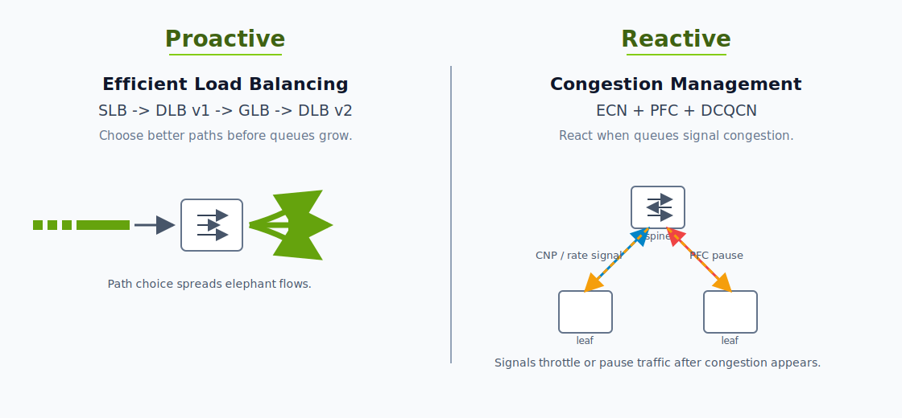

Juniper's elephant-flow discussion separates the problem into proactive and reactive controls. Proactive mechanisms try to avoid congestion before it forms by choosing better paths for flows, flowlets, or selected packets. Reactive mechanisms respond after queues begin to build by marking, pausing, or slowing traffic.

In this model, SLB, DLB, DLB v2, GLB, TELB, and selective packet spraying are mainly proactive load-balancing tools. ECN, PFC, and DCQCN are reactive congestion-management tools. A RoCEv2 fabric usually needs both: proactive path selection to reduce hot spots, and reactive congestion control to protect loss-sensitive RDMA traffic when queues still build.

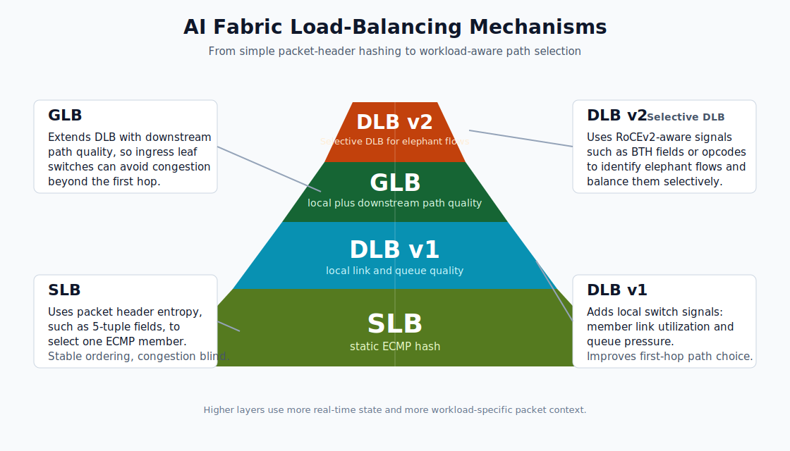

This pyramid is a simplified, original diagram based on the load-balancing categories discussed in Juniper's AI data center elephant-flow blog.

| Mechanism | Decision Input | Main Benefit | Main Risk |
| --- | --- | --- | --- |
| SLB | Packet or flow header hash | Simple and widely deployed | Blind to real-time congestion |
| DLB | Header hash plus local link and queue quality | Better local link utilization | Does not see remote spine-to-leaf congestion |
| GLB | Local and remote link quality plus topology | Better end-to-end path choice | Requires topology awareness and heartbeat scale |
| TELB | Tenant, GPU, QP, port, path policy | Predictable path control | Operational and policy complexity |
| Per-packet | Packet-level path choice | Very high link utilization | Packet reordering |

### Static Load Balancing, SLB

Static Load Balancing is the traditional Ethernet ECMP model. It uses packet or flow header fields to assign a flow to an outgoing ECMP member.

SLB works well when:

- There are many flows.
- Flow sizes are diverse.
- Header entropy is high.
- Link capacities are symmetric.
- Workloads are not tightly synchronized.

It is weaker for AI fabrics because it does not consider:

- Current link utilization
- Queue depth
- Flow size
- Remote congestion
- Whether elephant flows collided on the same path

Example:

| Flow | Assigned Link | Rate |
| --- | --- | ---: |
| Flow 1 | Leaf A to Spine A | 50 Gbps |
| Flow 3 | Leaf A to Spine A | 50 Gbps |
| Flow 2 | Leaf A to Spine B | 100 Gbps |
| Flow 4 | Leaf A to Spine B | 100 Gbps |

If each leaf-spine link is 200 Gbps:

| Link | Load | Utilization |
| --- | ---: | ---: |
| Leaf A to Spine A | 100 Gbps | 50% |
| Leaf A to Spine B | 200 Gbps | 100% |

The number of flows is balanced, but bandwidth is not.

### Resilient, Symmetric, and Weighted Hashing

SLB can be enhanced, but it is still fundamentally hash-based.

| Enhancement | Purpose |
| --- | --- |
| Resilient hashing | Reduce flow churn when ECMP members fail or recover |
| Symmetric hashing | Keep forward and reverse directions on the same path |
| Weighted ECMP | Send more hash buckets to higher-capacity or preferred paths |

Resilient hashing commonly uses a fixed bucket table, such as 512 or 1024 buckets. When a link fails, only buckets pointing to that link are remapped, instead of remapping many flows because the ECMP member count changed.

Weighted ECMP changes bucket distribution:

| Next Hop | Capacity Example | Weight | Bucket Share |
| --- | ---: | ---: | ---: |
| Spine A | 400G | 2 | 40% |
| Spine B | 400G | 2 | 40% |
| Spine C | 200G | 1 | 20% |

These tools help normal fabrics, but they do not solve the core AI problem when there are only a few low-entropy elephant flows.

### Dynamic Load Balancing, DLB

Dynamic Load Balancing improves on SLB by adding local link quality information.

DLB considers signals such as:

- Link utilization
- Queue depth
- Buffer utilization
- Local congestion
- Recent usage

The ASIC or packet forwarding engine keeps a link quality table and chooses better local ECMP members for new flows or flowlets.

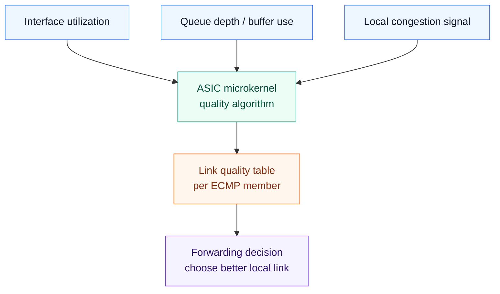

With the earlier example, DLB can avoid putting both 100 Gbps flows on the same link. Instead, it can drive both links to roughly 75% utilization.

### DLB Assigned-Flow Mode

Assigned-flow mode pins an active flow to an interface for the flow's lifetime.

Benefits:

- Preserves packet ordering
- Works well for short-lived or high-entropy traffic
- Simple behavior after initial assignment

Limitations:

- A long-lived elephant flow can remain on a path even after conditions change.
- It is less useful when a small number of flows dominate the link.
- It can still leave persistent imbalance in AI workloads.

### DLB Flowlet Mode

Flowlet mode splits one flow into bursts separated by idle gaps.

The switch monitors inactivity:

- If the idle gap is shorter than the inactivity timer, the flow stays on the same path.
- If the idle gap is longer than the inactivity timer, the next burst can be assigned to a different path.

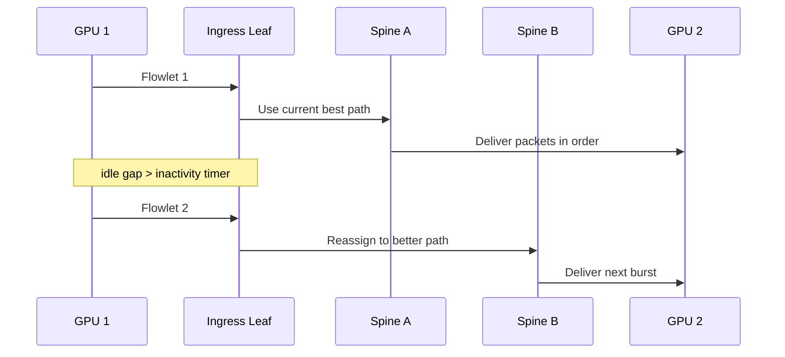

Why it fits AI workloads:

- Distributed training often has bursty communication phases.
- A collective may create bursts separated by compute or synchronization gaps.
- Flowlet reassignment improves load distribution while reducing packet reordering risk.

### DLB Reactive Path Rebalancing

Reactive path rebalancing monitors the quality of the path assigned to a long-lived flow.

If a link degrades and another ECMP member has better quality, the switch may move the flow or a later burst to the better path.

Trade-off:

- Better response to changing congestion
- Possible short-term packet reordering
- Requires NIC/RDMA stack tolerance if packets from the same logical flow can arrive out of order

### DLB Per-Packet Mode

DLB per-packet mode sprays packets from the same flow across ECMP members based on the link quality table.

This can improve link utilization, but it directly creates packet reordering risk. It should be used only when the receiver side can handle the reordering for the relevant RDMA operation or when the traffic class is safe for spraying.

---

## Global Load Balancing, GLB

DLB only sees local link quality. GLB extends the idea by using remote link quality and topology information to select a better end-to-end path.

### Why Local Link Quality Is Not Enough

Consider two ingress leaves sending traffic to the same egress leaf. Each ingress leaf may independently choose Spine A because its local link to Spine A looks good. However, Spine A may have only one congested downlink toward the egress leaf.

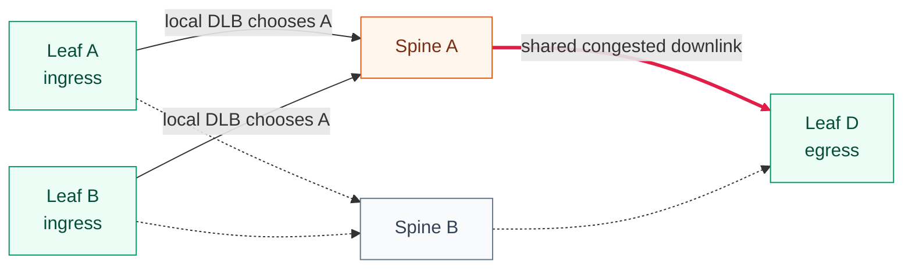

DLB improved the ingress leaf decision, but it did not see the downstream congestion from Spine A to Leaf D.

### Remote Link Quality and End-to-End Path Quality

GLB lets a leaf consider:

- Local leaf-to-spine quality
- Remote spine-to-egress-leaf quality
- Destination location
- Next-hop and next-next-hop topology

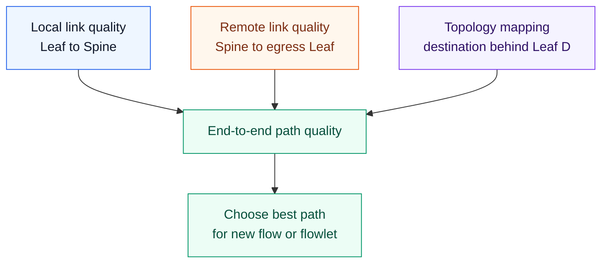

GLB can reduce the chance that many elephant flows converge on the same congested spine-to-leaf link. It can also reduce DCQCN triggers and PFC pressure because new traffic can be steered away from degraded paths earlier.

### BGP NNHN and GLB Heartbeats

GLB needs two kinds of information:

| Component | Role |
| --- | --- |
| Control-plane topology | Tell a leaf which egress node is behind which next-next-hop |
| ASIC-level heartbeat | Carry fast path quality information between neighboring switches |

BGP Next-Next-Hop Nodes, NNHN, is one proposed way to tell a switch which nodes sit behind a next hop for ECMP forwarding. In a leaf-spine fabric, the next hop may be a spine and the next-next-hop may be the egress leaf.

Example:

| View from Leaf A | Meaning |
| --- | --- |
| Destination GPU2 prefix | The prefix Leaf A wants to reach |
| Next hop | Spine A, Spine B, or Spine C |
| Next-next-hop | Leaf B, the egress leaf behind those spines |
| NNHN topology signal | Which egress leaves are reachable behind each spine next hop |

Without NNHN-like topology information, Leaf A knows that several spines can reach the destination prefix, but it does not have a clean control-plane mapping from each spine next hop to the egress leaf behind it. With NNHN, the switch can associate a next hop with the downstream node that matters for path quality.

GLB heartbeats carry link quality information at the forwarding level. The chapter describes heartbeats as change-based, with an example frequency of 20 ms.

The division of labor is important:

| Signal | Question Answered | Example |
| --- | --- | --- |
| BGP NNHN | Where can this next hop take me? | Spine A can reach Leaf B |
| GLB heartbeat | How healthy is that path right now? | Spine A to Leaf B is congested |
| GLB decision | Which path should this flow or flowlet use? | Prefer Spine C for traffic to Leaf B |

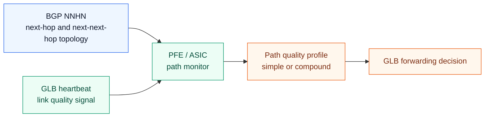

### Where GLB Can Be Applied

| Fabric Area | GLB Application |
| --- | --- |
| Three-stage Clos | GLB can run across all leaf and spine devices |
| Within a pod | In five-stage Clos, each pod can be treated like its own three-stage GLB domain |
| Spine to super-spine | Useful when upper layers are oversubscribed or congested |
| All layers | Possible, but table scale and heartbeat overhead must be evaluated |

Important constraints:

- GLB is newer than SLB and DLB.
- Vendor implementation matters.
- Heartbeat frequency and scale must be tuned.
- Microburst behavior must be tested.
- Multi-vendor interoperability may still be difficult.

---

> [!NOTE]
> The SLB, DLB, GLB, and DLB v2 terminology in this chapter is mainly an Ethernet/RoCEv2 way to discuss load balancing in an IP fabric. NVIDIA QM97xx switches are Quantum-2 InfiniBand systems, so they should not be mapped one-to-one to Ethernet DLB or GLB terminology.
>
> The problems are similar: avoid elephant-flow concentration, steer around degraded paths, and improve fabric utilization. The mechanisms are different.
>
> | Item | RoCEv2 Ethernet | QM97xx InfiniBand |
> | --- | --- | --- |
> | Transport | RoCEv2 over UDP/IP | Native InfiniBand RDMA |
> | Basic path selection | ECMP hash | InfiniBand routing and Subnet Manager |
> | Dynamic path avoidance | Vendor DLB, GLB, or DLB v2 features | Adaptive routing |
> | Congestion control | ECN, PFC, and DCQCN | InfiniBand congestion control |
> | QoS unit | Ethernet priority, DSCP, and queues | VL, SL, and QoS |
> | AI-specific functions | RoCE-aware hashing or selective packet spraying | SHARP, adaptive routing, and congestion control |
>
> QM97xx addresses many of the same AI fabric goals, but through InfiniBand-native mechanisms rather than Ethernet ECMP extensions.

---

## Traffic Engineering-Based Load Balancing, TELB

Traffic Engineering-Based Load Balancing uses policy to steer AI traffic over specific logical paths.

### Why TELB Exists

SLB, DLB, and GLB still choose paths dynamically based on hashing and quality. TELB is useful when an operator wants more deterministic behavior.

TELB can be useful for:

- Multi-tenant AI fabrics
- Predictable job performance
- Tenant isolation
- Steering a tenant, GPU, QP range, or UDP port range to a path color
- Keeping packet order by limiting path diversity for selected traffic
- Using backup path IDs after failures

The chapter notes that traditional service-provider traffic engineering technologies such as MPLS-TE or SR-MPLS are mature, but may be too heavy or expensive for AI data center fabrics. AI fabrics often need a lightweight pure-IP form of traffic engineering.

### Path Color, Tenant, GPU, and QP Pinning

TELB can match traffic characteristics and assign a path color.

Possible match inputs:

| Match Input | Example Use |
| --- | --- |
| Tenant ID | Put one training job on a dedicated spine set |
| GPU ID | Map GPU traffic to a logical fabric color |
| QP range | Pin RoCEv2 QP ranges to path colors |
| Source UDP port range | Use port allocation to represent a job or tenant |
| Ingress interface | Tie a server rail or NIC to a logical path group |

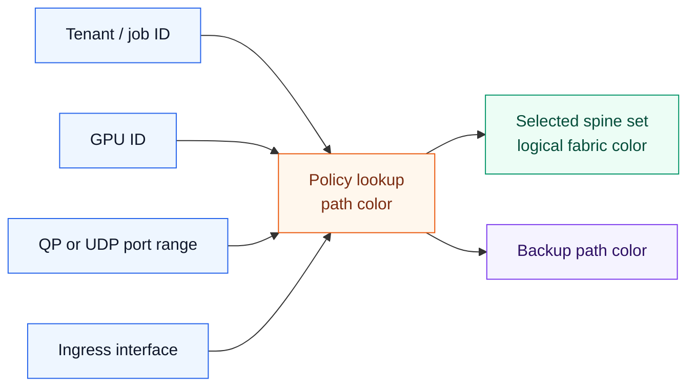

### BGP Deterministic Path Forwarding

BGP Deterministic Path Forwarding, BGP-DPF, is described as one way to deliver TELB. The idea is to use BGP policy to pin traffic characteristics to colored paths.

Example policy model:

| GPU ID | QP Range | Tenant Port Range | Primary Path Color | Backup Path Color |
| --- | --- | --- | --- | --- |
| GPU 0 | 1000-1999 | Tenant 1 ports | Blue | Green |
| GPU 1 | 2000-2999 | Tenant 2 ports | Green | Blue |
| Any | Storage sync range | Red | Blue |

The ASIC must be able to apply the policy quickly and switch to a backup path when a link or node fails.

### Controller-Based TELB

A centralized controller can combine fabric telemetry with scheduler intent.

Inputs:

- Tenant and job identity
- GPU allocation
- Leaf/spine utilization
- Queue depth
- ECN, PFC, and DCQCN signals
- Link or node failure events
- Policy objectives

Outputs:

- Path color assignment
- BGP-DPF or policy updates
- Monitoring and alerting
- Automated remediation

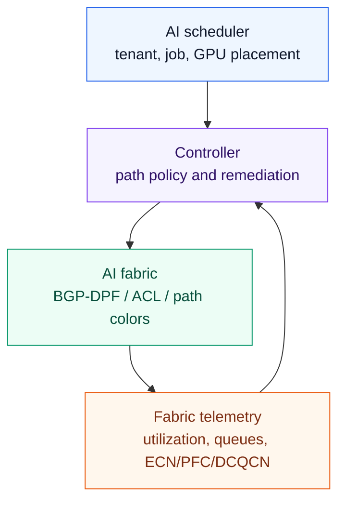

---

## Per-Packet Load Balancing

Per-packet load balancing treats packets independently rather than pinning a whole flow to one path.

Benefits:

- Uses ECMP members more evenly.
- Can break a single elephant flow across multiple paths.
- Can improve bandwidth utilization when flow entropy is low.

Main risk:

- Packets can arrive out of order.

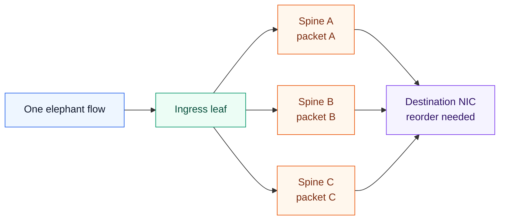

### Random Spray

Random spray sends packets across ECMP members randomly or round-robin.

It does not check link quality before sending each packet. It is simple, but it can still send packets to poor-quality links.

### Selective Packet Spraying

Selective packet spraying applies per-packet mode only to traffic that can tolerate or handle reordering.

The switch can match packet characteristics such as:

- RoCEv2 opcode
- BTH fields
- QP
- ACL match
- Tenant or traffic class

The chapter notes that some modern 400G NICs and DPUs can handle reordering for selected RDMA operations, especially certain write operations. That makes selective spraying more practical than spraying everything.

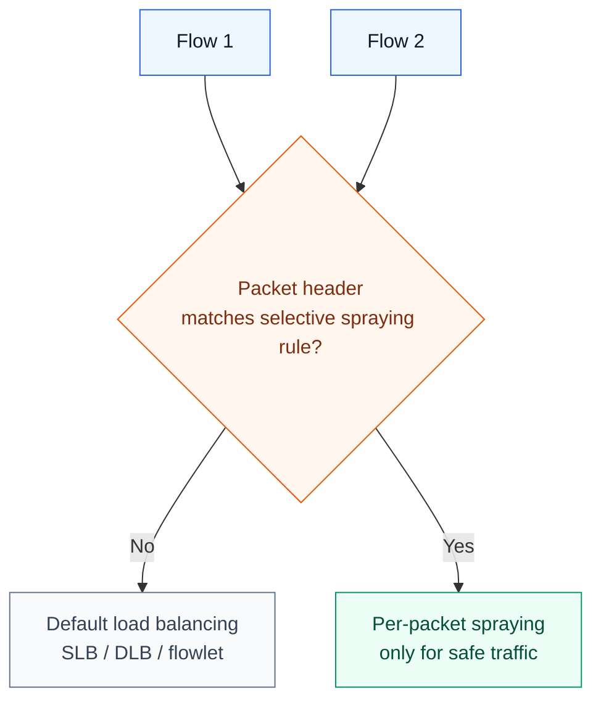

Selective spraying requires:

- ASIC support for parsing the required fields
- ACL or TCAM resources
- Clear knowledge of NIC reordering capability
- Per-traffic-class policy
- Validation with real RDMA workloads

### Packet Reordering

When packets take different spines, they may experience different queueing and processing delays. Packet B can arrive before packet A even if A was sent first.

The receiver then needs to:

1. Buffer out-of-order packets.
2. Identify missing sequence positions.
3. Reorder packets.
4. Forward in-order data to the application or RDMA operation.

Small amounts of reordering may be manageable. Under congestion, the number of out-of-order packets can grow and can hurt latency, throughput, buffer usage, and CPU/NIC/DPU work.

The practical rule:

> Per-packet load balancing is powerful, but it should be enabled only where the transport, NIC, and workload semantics can handle the reordering.

---

## Mechanism Comparison

| Feature | SLB | DLB | GLB | TELB |
| --- | --- | --- | --- | --- |
| Packet or flow header hash | Yes | Yes | Yes | Policy-dependent |
| Local link bandwidth awareness | No | Yes | Yes | Optional |
| Queue size awareness | No | Yes | Yes | Optional |
| Remote link quality | No | No | Yes | Optional |
| RoCEv2 BTH fields | Possible | Possible | Possible | Useful |
| Fabric telemetry | No | Local | Remote heartbeat | Controller or policy |
| Path determinism | Low | Medium | Medium | High |
| Reordering risk | Low | Low to medium | Low to medium | Usually controlled |
| Operational complexity | Low | Medium | High | High |
| Industry adoption | High | Medium | Lower | Lower |

Recommended mental model:

| Workload or Fabric Condition | Likely Mechanism |
| --- | --- |
| Many small diverse flows | SLB may be enough |
| AI training with local link imbalance | DLB, especially flowlet mode |
| Congestion hidden behind spines | GLB |
| Multi-tenant fabric needing predictable path policy | TELB or BGP-DPF |
| One elephant flow must use many links | Selective per-packet spraying |

---

## Operational Validation Checklist

Before relying on a load-balancing design, validate it under AI-like traffic.

Checklist:

- Confirm which fields are used in the hash: 5-tuple, VLAN/VNI, RoCEv2 BTH, QP.
- Measure per-link utilization across leaf-spine and spine-leaf links.
- Check whether elephant flows collide on the same ECMP member.
- Test DLB quality table behavior under mixed 50G, 100G, 200G, 400G, or 800G flows.
- Tune flowlet inactivity timers against actual collective traffic gaps.
- Validate packet reordering counters on NICs and DPUs.
- Verify ECN, CNP, PFC, and DCQCN behavior during congestion.
- Test link and node failure convergence.
- Confirm whether GLB heartbeat scale and frequency are acceptable.
- For TELB, validate tenant/job policy, backup path behavior, and controller failure behavior.
- Run workload-level tests such as NCCL collectives, all-to-all patterns, storage synchronization, and checkpoint bursts.

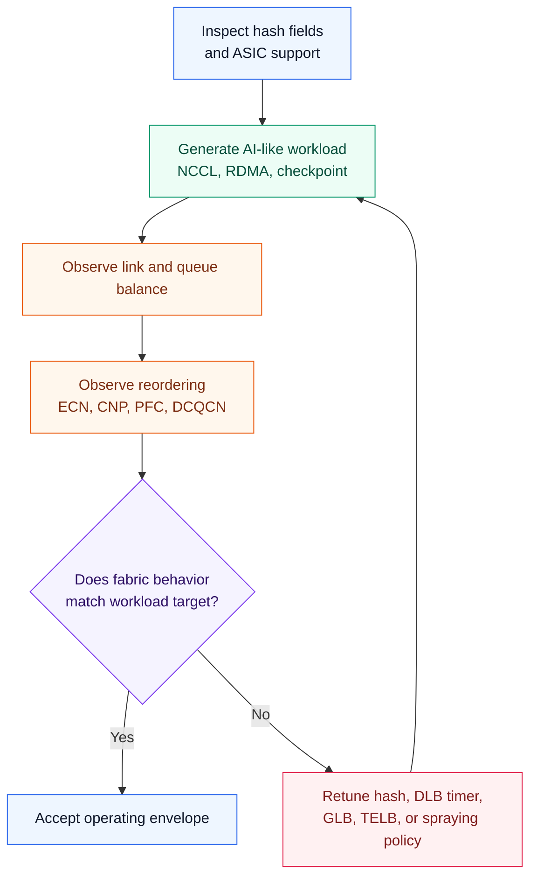

---

## Chapter Summary

Efficient load balancing is central to Ethernet AI fabric performance.

The main takeaways:

- AI training traffic often has low entropy and large elephant flows.
- ECMP provides multiple paths, but default per-flow hashing can create hot spots.
- SLB is simple and common, but it does not understand real-time link utilization or queue depth.
- Resilient, symmetric, and weighted hashing improve SLB operations but do not fully solve AI low-entropy traffic.
- DLB uses local link quality and queue state to improve local path choice.
- Flowlet mode is often a practical compromise because it improves path distribution while limiting packet reordering.
- GLB adds remote link quality and topology awareness, helping avoid congestion beyond the first hop.
- BGP NNHN and GLB heartbeats are mechanisms for distributing topology and path quality information.
- TELB provides deterministic path control for tenants, jobs, GPUs, QPs, or port ranges.
- Per-packet load balancing can maximize link utilization but requires careful handling of packet reordering.
- Selective packet spraying is more practical than spraying all traffic because it can be limited to RDMA operations and NICs that support reordering.

---

## Key Terms

| Term | Meaning |
| --- | --- |
| ECMP | Equal-Cost Multipathing; forwarding across multiple equal-cost next hops |
| SLB | Static Load Balancing; hash-based path selection without real-time congestion awareness |
| DLB | Dynamic Load Balancing; path choice based on local link and queue quality |
| GLB | Global Load Balancing; path choice using local and remote link quality plus topology |
| TELB | Traffic Engineering-Based Load Balancing; policy-driven path control |
| BGP-DPF | BGP Deterministic Path Forwarding; BGP-based mechanism for deterministic path selection |
| NNHN | Next-Next-Hop Nodes; BGP capability for signaling nodes behind a next hop |
| Flow entropy | Header variation available for hashing |
| Elephant flow | Large bandwidth-heavy flow |
| Mouse flow | Small short-lived flow |
| Flowlet | A burst within a flow separated by an idle gap |
| Inactivity timer | Timer used to decide whether the next burst can be reassigned |
| Packet spraying | Sending packets from the same flow across multiple paths |
| RoCEv2 BTH | RoCEv2 Base Transport Header |
| QP | RDMA Queue Pair |
| TCAM | Ternary Content-Addressable Memory used for fast match rules |
| DCQCN | Data Center Quantized Congestion Notification |
| PFC | Priority Flow Control |
| CNP | Congestion Notification Packet |

## Q&A

### 1. What is the role of ECMP in AI/ML data center fabrics?

ECMP gives the fabric multiple equal-cost paths between leaf switches, usually through several spine switches. The control plane, such as BGP or an IGP, installs equal-cost next hops, and the switch ASIC maps packets or flows to one of those next hops using selected packet fields.

ECMP should be treated as the baseline multipathing mechanism, not the complete AI load-balancing solution. It gives the network path diversity, but it does not automatically guarantee bandwidth balance. If several large RoCEv2 flows hash to the same spine, the fabric can have one hot link and several idle links even though the topology looks non-blocking on paper.

The important point is that ECMP balances hash buckets, not bytes. That distinction matters in AI fabrics because a few elephant flows can dominate total bandwidth. ECMP is therefore necessary, but AI clusters usually need better entropy, DLB, GLB, TELB, or selective spraying on top of basic ECMP behavior.

### 2. Why is static load balancing often insufficient for AI workloads?

SLB assigns flows based on header hashes. It does not consider flow size, link utilization, queue depth, or remote congestion.

That is acceptable when there are many small flows with diverse headers. It becomes weak when the workload has a small number of synchronized, high-bandwidth RoCEv2 flows. In that case, the number of flows may look balanced while the number of bits per second is badly skewed.

The key factors are entropy and elephant flows. RoCEv2 traffic often shares common fields, such as UDP destination port 4791, and may not expose enough useful entropy to a default 5-tuple hash. If two or three elephant flows collide on the same ECMP member, the impact is not a minor statistical imbalance. It can create queue buildup, ECN/CNP activity, PFC pressure, and longer collective completion time.

So the problem with SLB is not that hashing is wrong. The problem is that static hashing is blind to traffic volume and fabric state.

### 3. How does DLB improve on SLB?

DLB adds local link quality information. Instead of relying only on the hash, the switch can consider local interface utilization, queue depth, buffer state, and recent usage.

This allows the switch to steer new flows, flowlets, or in some modes packets toward less congested local ECMP members. The practical improvement is that the ingress leaf is no longer completely blind. If one uplink has a deep queue and another uplink is clean, DLB can prefer the cleaner member.

The limitation is equally important. DLB usually sees the local leaf-to-spine condition well, but it may not see the downstream condition behind the spine. A path can look healthy from the ingress leaf to the spine while the spine-to-egress-leaf link is congested. That is why DLB improves local utilization but does not fully solve end-to-end path quality.

In practice, I would describe DLB as the first move from static hashing toward state-aware forwarding. It is useful, but it still has a local view.

### 4. Why is flowlet mode useful for AI training traffic?

Flowlet mode uses natural pauses between bursts as reassignment points. If the idle gap exceeds the inactivity timer, the next burst can move to a better path.

This is useful because AI training often alternates compute and communication phases. Collective operations can create bursts separated by short idle gaps. Flowlet mode uses those gaps as safer boundaries for moving traffic to a different path.

The key trade-off is between load distribution and packet ordering. Per-packet spraying gives the most aggressive link utilization, but it can reorder packets. Pure per-flow hashing preserves ordering, but it can create hot spots. Flowlet mode sits between those extremes. It can move a later burst to a better path while reducing the chance that packets from the same burst arrive out of order.

Flowlet mode is a practical compromise. It is not magic; the inactivity timer must match the workload. If the timer is too short, the fabric may reorder packets. If it is too long, the mechanism behaves too much like static per-flow hashing.

### 5. What problem does GLB solve?

GLB solves the problem where local path choice looks good but the downstream path is congested. For example, several leaves may choose the same spine, and that spine may have a congested downlink to the egress leaf.

The classic example is two ingress leaves sending traffic to the same egress leaf. Each ingress leaf may independently choose Spine A because its local uplink to Spine A looks good. But Spine A may have a congested downlink to the egress leaf. Local DLB cannot see that full picture, so it keeps choosing a path that is locally good and globally bad.

GLB adds remote link quality and topology information. Instead of asking only "which local uplink is good?", the ingress leaf can ask "which end-to-end path toward the egress leaf is good?" That is the real value of GLB.

The key point is that GLB attacks hidden downstream congestion. It is especially relevant in Clos fabrics where many ingress leaves can converge on the same spine-to-leaf segment. If GLB works well, it can reduce queue buildup before ECN, CNP, or PFC become the main line of defense.

### 6. What are BGP NNHN and GLB heartbeats used for?

BGP NNHN tells a switch which next-next-hop nodes are behind a next hop. In a Clos fabric, this helps a leaf understand which egress leaf is behind a spine.

GLB heartbeats carry fast path quality information at the forwarding level. Together, topology information and heartbeat quality let the ASIC build path quality profiles and choose better paths.

The clean way to explain this is:

| Signal | Question Answered |
| --- | --- |
| BGP NNHN | Where can this next hop take me? |
| GLB heartbeat | How healthy is that path right now? |
| GLB decision | Which path should this flow or flowlet use? |

For example, Leaf A may know that Spine A, Spine B, and Spine C can all reach a GPU prefix. NNHN-like topology signaling tells Leaf A which egress leaf sits behind those spines. Heartbeats then tell Leaf A whether the relevant downstream path is healthy or degraded.

It is important to separate the two. NNHN is not the congestion signal. It is topology context. Heartbeats are not the routing protocol. They are fast path-quality signals. GLB needs both.

### 7. Why would an operator use TELB?

TELB is useful when the operator needs deterministic path behavior. It can pin tenant, job, GPU, QP, or port-range traffic to specific path colors or spine sets.

This is especially useful in multi-tenant AI fabrics where predictable job performance and isolation matter. For example, one tenant or training job can be assigned to one set of spine paths, while another tenant uses a different path color. A storage or checkpoint traffic class may also be steered differently from GPU collective traffic.

The difference from DLB or GLB is intent. DLB and GLB are dynamic mechanisms that react to quality signals. TELB is more policy-driven. It lets the operator express "this class of traffic should use this logical path set" rather than leaving every choice to hashing and local quality.

The trade-off is operational complexity. TELB needs clean policy, match criteria, backup path behavior, and failure handling. If the policy is wrong, the network can become less balanced, not more balanced. I would use TELB when isolation, predictability, or tenant control is more important than maximum automatic path freedom.

### 8. What is the main trade-off of per-packet load balancing?

Per-packet load balancing can spread a single elephant flow across many ECMP members and achieve excellent link utilization.

The trade-off is packet reordering. Packets sent across different spines can arrive in a different order because the paths may have different queueing, serialization, or congestion conditions. The receiver NIC, DPU, RDMA stack, or application must be able to buffer and reorder safely.

In AI fabrics, this is a serious design question, not a minor implementation detail. Some traffic and operations may tolerate reordering well if the NIC or transport has the right support. Other traffic may suffer from retransmission, buffering pressure, latency spikes, or reduced throughput.

Per-packet mode is powerful, but it moves complexity to the receiver and validation process. It should not be enabled broadly just because it improves link utilization in a synthetic test. Reordering counters, NIC behavior, tail latency, and JCT should be validated under real NCCL or RDMA workloads.

### 9. Why is selective packet spraying safer than spraying all traffic?

Selective packet spraying applies per-packet mode only to traffic that matches safe criteria, such as specific RoCEv2 opcodes, QP ranges, or traffic classes.

This lets the operator use packet spraying where the NIC can handle reordering, while leaving other traffic on SLB, DLB, or flowlet mode. It is safer because it acknowledges that not every packet has the same ordering tolerance.

For RoCEv2, the useful idea is to look beyond the basic IP and UDP header. A RoCE-aware device may use BTH fields, QP information, opcode information, or traffic class policy to decide whether a flow is eligible for more aggressive balancing.

Selective spraying is a form of risk containment. The network gets some of the bandwidth benefit of per-packet distribution without turning the entire fabric into a reordering experiment. The hard requirement is evidence: the selected traffic class must be tested on the actual NICs, firmware, drivers, and application stack.

### 10. How should load-balancing mechanisms be chosen?

Start from workload behavior and hardware capability.

If traffic has high entropy and many small flows, SLB may be enough. If AI training traffic creates local imbalance, DLB and flowlet mode are usually the next mechanisms to evaluate. If congestion appears beyond the first hop, GLB becomes relevant because the ingress leaf needs remote path-quality information. If the fabric is multi-tenant or needs predictable path control, TELB can add policy-based steering. If one elephant flow must use many links, selective packet spraying may be useful, but only after validating reordering support.

I would not choose the mechanism from a feature checklist. I would choose it from observed failure modes:

| Symptom | Likely Direction |
| --- | --- |
| Hash collisions among elephant flows | Better hash inputs, DLB, or flowlet mode |
| Local uplink imbalance | DLB |
| Downstream spine-to-leaf congestion | GLB |
| Tenant or job interference | TELB or path coloring |
| Single flow cannot fill enough paths | Selective packet spraying |

The practical answer is to start simple, measure, and then add sophistication where the data proves it is needed. Every mechanism adds its own operational cost: timers, telemetry, policy, heartbeat scale, reordering validation, or vendor-specific behavior.

## References

- [Broadcom Tomahawk 5 Switch Series](https://www.broadcom.com/products/ethernet-connectivity/switching/strataxgs/bcm78900-series)
- [Broadcom: Cognitive Routing in the Tomahawk 5 Data Center Switch](https://www.broadcom.com/blog/cognitive-routing-in-the-tomahawk-5-data-center-switch)
- [Cisco Catalyst 9300 Series Switches Architecture White Paper](https://www.cisco.com/c/en/us/products/collateral/switches/catalyst-9300-series-switches/nb-06-cat9300-architecture-cte-en.html)
- [Cisco: Evolve your AI/ML Network with Cisco Silicon One](https://www.cisco.com/c/en/us/solutions/collateral/silicon-one/evolve-ai-ml-network-silicon-one.html)
- [Cisco Nexus 9300-EX Platform Switches Architecture White Paper](https://www.cisco.com/c/dam/global/en_uk/products/switches/cisco_nexus_9300_ex_platform_switches_white_paper_uki.pdf)
- [IETF Datatracker: BGP Next-Next Hop Nodes](https://datatracker.ietf.org/doc/draft-wang-idr-next-next-hop-nodes/)
- [Juniper Blog: Managing the Elephant in the Room for AI Data Centers](https://blogs.juniper.net/en-us/industry-solutions-and-trends/managing-the-elephant-in-the-room-for-ai-data-centers)
- [Juniper: IP Fabric Underlay Network Design and Implementation](https://www.juniper.net/documentation/us/en/software/nce/sg-005-data-center-fabric/topics/task/ip-fabric-underlay-cloud-dc-configuring.html)
- [Nokia SR Linux: IP ECMP Load Balancing](https://documentation.nokia.com/srlinux/26-3/books/routing-protocols/ip-ecmp-load-balanc.html)
- [NVIDIA Onyx: IP Routing Overview](https://docs.nvidia.com/networking/display/onyxv31040100/ip+routing+overview)
- [NVIDIA QM97xx Quantum-2 NDR InfiniBand Switch Platform Introduction](https://docs.nvidia.com/networking/display/QM97X0PUB/Introduction)
- [NVIDIA RoCE Documentation](https://docs.nvidia.com/networking/display/MLNXOFEDv23103220lts/RDMA+over+Converged+Ethernet+(RoCE))
- [P4 Portable Switch Architecture Specification](https://p4lang.github.io/p4-spec/docs/PSA-v1.0.0.html)
- [P4-16 Language Specification](https://p4.org/p4-spec/docs/P4-16-v1.0.0-spec.html)
- [Ultra Ethernet Consortium](https://ultraethernet.org/)
