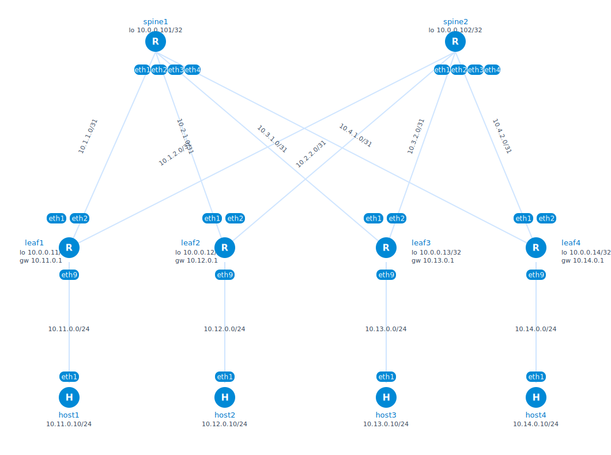

# Clos Fabric Lab Series

This README starts with the implemented Lab 1 and records the planned direction for the next labs. The sequence is meant to move from a pure routed underlay to failure detection, toy dynamic load balancing, multi-tenant overlays, and then BGP unnumbered.

## Lab Roadmap

| Lab | Title | Status | Focus |
|---|---|---|---|
| Lab 1 | Pure eBGP Clos Underlay and ECMP Failure Behavior | Implemented here | RFC 7938-style eBGP underlay, `/31` links, ECMP, failure tests |
| Lab 2 | BFD + DLB-like Linux ECMP Weight Controller | Planned | BFD-assisted convergence and a toy controller that adjusts Linux ECMP weights from uplink counters |
| Lab 3 | EVPN-VXLAN Overlay with cEOS-lab | Planned | Replace the FRR-only lab with cEOS-lab, add VXLAN overlay, EVPN control plane, and multi-tenant L2/L3 services |
| Lab 4 | BGP Unnumbered Underlay (RFC 5549) | Planned | Remove the fabric link IPv4 plan by using IPv6 link-local next-hops for IPv4 NLRI |

Lab 2 is intentionally a simulation, not real ASIC DLB. FRR and Linux can show the control loop idea by changing ECMP next-hop weights, but they do not implement hardware flowlet switching. Any future eBPF experiment should stay scoped to lab interfaces and include cleanup for `tc` qdiscs and filters.

## Lab 1: Pure eBGP Clos Underlay and ECMP Failure Behavior

2-spine x 4-leaf Clos fabric on FRR + containerlab. Lab 1 implements the canonical hyperscale DC underlay pattern from RFC 7938: per-device private 2-byte ASNs, routed `/31` P2P links, eBGP-only control plane, ECMP across both spines, no IGP, and no L2 fabric.

## What This Lab Proves

- 8 eBGP sessions come up: `4 leaves x 2 spines`.
- Each leaf learns remote leaf loopbacks and host subnets through both spines.
- leaf-to-leaf and host-to-host reachability survives one spine path failure.
- ECMP shrinks to one next-hop during failure and expands back to two after recovery.
- Leaves advertise only their own loopback and host subnet, so they do not become transit between spines.

## Prerequisites

- Linux host with Docker
- [containerlab](https://containerlab.dev/install/) >= 0.55
- [just](https://github.com/casey/just) optional, but recommended
- ~2 GB RAM, ~2 GB disk for images

```bash
# install containerlab (official one-liner)
bash -c "$(curl -sL https://get.containerlab.dev)"

# pull images up front (or run `just pull`)
docker pull quay.io/frrouting/frr:9.1.0
docker pull nicolaka/netshoot:latest
```

## Quick Start

```bash
cd clos-ebgp-lab
just up          # pull -> deploy -> wait 25s -> verify
just bgp-summary # BGP state on all routers
just ping-mesh   # host-to-host reachability matrix
just destroy     # tear down
```

Run `just` with no args to see every recipe.

## Topology

```
        AS 65000              AS 65001
        ┌────────┐            ┌────────┐
        │ spine1 │            │ spine2 │
        │.0.0.101│            │.0.0.102│
        └─┬┬┬┬───┘            └─┬┬┬┬───┘
          ││││                  ││││
   ┌──────┘│││└──────┐    ┌─────┘│││└─────┐
   │ ┌─────┘│└─────┐ │    │ ┌────┘│└────┐ │
   │ │      │      │ │    │ │     │     │ │
 ┌─┴─┴┐ ┌──┴┴─┐ ┌──┴─┴┐ ┌─┴─┴┐
 │leaf1│ │leaf2│ │leaf3│ │leaf4│   each leaf peers with both spines
 │65011│ │65012│ │65013│ │65014│
 └──┬──┘ └──┬──┘ └──┬──┘ └──┬──┘
    │       │       │       │
  host1   host2   host3   host4
 10.11.0.10  .12   .13    .14
```

Containerlab's graph view (`just graph`) renders the same fabric visually:



### Addressing

| Element | Address |
|---|---|
| spine1 lo | `10.0.0.101/32` |
| spine2 lo | `10.0.0.102/32` |
| leafN lo | `10.0.0.1N/32`, N=1..4 |
| leafN <-> spine1 | `10.N.1.0/31`, leaf=`.0`, spine=`.1` |
| leafN <-> spine2 | `10.N.2.0/31`, leaf=`.0`, spine=`.1` |
| leafN host net | `10.1N.0.0/24`, gw=`10.1N.0.1`, host=`10.1N.0.10` |

### ASN Plan

| Node | ASN |
|---|---:|
| spine1 | `65000` |
| spine2 | `65001` |
| leaf1 | `65011` |
| leaf2 | `65012` |
| leaf3 | `65013` |
| leaf4 | `65014` |

Per-leaf and per-spine ASNs make AS_PATHs easy to inspect and keep loop avoidance native: a leaf rejects paths where its own ASN reappears.

## Bring Up and Inspect

```bash
sudo containerlab deploy -t clos.clab.yml   # or: just deploy
just wait 25
```

Containerlab prints the node table and management IPs. To enter a router:

```bash
docker exec -it clab-clos-ebgp-leaf1 vtysh   # or: just vtysh leaf1
leaf1# show bgp ipv4 unicast summary
leaf1# show ip route
```

Useful one-shot commands:

```bash
just vc leaf1 "show ip route 10.0.0.13/32"  # route to leaf3 loopback
just bgp leaf1 10.0.0.13/32                 # BGP paths for leaf3 loopback
just routes leaf1                           # full RIB
just counters leaf1                         # eth1/eth2 byte counters
```

## Verify

```bash
sudo bash scripts/verify.sh   # or: just verify
```

Quick checks:

```bash
just bgp-summary    # BGP summary on every router
just ecmp           # leaf1 -> remote leaf loopback ECMP checks
just route-count    # BGP-installed route count per leaf
just ping-mesh      # host1..host4 reachability matrix
```

### Expected Results

- **8 eBGP sessions total.** This is `4 leaves x 2 spines`. There are no extra validation BGP sessions. Spine summaries show four neighbors each; leaf summaries show two neighbors each. Do not double-count the same session from both ends.
- **All sessions Established.** Spines should show four leaf neighbors with a numeric `State/PfxRcd`; leaves should show two spine neighbors with a numeric `State/PfxRcd`. `Idle`, `Active`, or `Connect` means the session is not up.
- **2-way ECMP installed.** On leaf1, the route to leaf3 loopback should have two FIB next-hops:

  ```text
  show ip route 10.0.0.13/32
  * 10.1.1.1, via eth1
  * 10.1.2.1, via eth2
  ```

  `eth1` is the spine1 uplink and `eth2` is the spine2 uplink.
- **Correct AS_PATHs.** `just bgp leaf1 10.0.0.13/32` should show two paths:

  ```text
  65000 65013
  65001 65013
  ```

  These are the spine1 and spine2 paths to leaf3. There should not be another leaf ASN in the middle.
- **Host reachability.** `host1 -> host3` and `host2 -> host4` should report `0% packet loss`.
- **Route count.** Each leaf should report `8 BGP routes installed`: three remote leaf loopbacks, three remote host subnets, and two spine loopbacks.

If `vtysh` prints `% Can't open configuration file /etc/frr/vtysh.conf`, the lab was likely deployed before `configs/vtysh.conf` was bind-mounted. It is cosmetic; `just redeploy` removes the warning.

### Reading `show ip route` on leaf1

A healthy route table on leaf1 has four kinds of routes:

- `C>* 10.0.0.11/32`: leaf1's own loopback, directly connected on `lo`.
- `C>* 10.1.1.0/31` and `C>* 10.1.2.0/31`: directly connected P2P uplinks to spine1 and spine2.
- `B>* 10.0.0.12/32`, `10.0.0.13/32`, `10.0.0.14/32`: remote leaf loopbacks learned via BGP, with two ECMP next-hops.
- `B>* 10.12.0.0/24`, `10.13.0.0/24`, `10.14.0.0/24`: remote host subnets learned via BGP, also with two ECMP next-hops.

The management route `K>* 0.0.0.0/0 via 172.20.20.1` and connected `172.20.20.0/24` are containerlab management-network routes, not fabric routes.

### Reading `verify.sh` Output

The script checks control plane first, then data plane:

- **Spine BGP summaries.** Each spine should list four leaf neighbors. With the current `LOCAL-ONLY` leaf export policy, each leaf advertises only two local prefixes to each spine: its loopback and host subnet.
- **Leaf BGP summaries.** Each leaf should list two spine neighbors. A leaf should receive seven prefixes from each spine: three remote leaf loopbacks, three remote host subnets, and the attached spine's loopback.
- **Full BGP table on leaf1.** Remote leaf loopbacks and host subnets should have two paths, one through each spine.
- **Spine loopbacks.** `10.0.0.101/32` should be reachable through spine1 and `10.0.0.102/32` through spine2. Extra non-best paths such as `65001 65014 65000` indicate the old pre-`LOCAL-ONLY` policy is still running; redeploy the lab.
- **Traceroute.** Repeated traceroutes may still take the same spine because ECMP is flow-hash based. Use `iperf-parallel` plus `just counters leaf1` for a clearer view of load sharing.

## Failure Scenarios

```bash
sudo bash scripts/failure-test.sh   # or: just failure-test
```

The script exercises two cases:

- A single link failure: `leaf1:eth1` down, which removes the leaf1-spine1 path.
- A spine fabric isolation: all spine1 fabric-facing links `eth1`-`eth4` down.

With `timers bgp 3 9`, link-down convergence should complete in single-digit seconds. Silent peer failures where links stay up, such as a frozen routing process, converge near the hold timer unless BFD is enabled.

### Reading `failure-test.sh` Output

1. **Baseline.** leaf1 should have two next-hops to leaf3 loopback:

   ```text
   * 10.1.1.1, via eth1
   * 10.1.2.1, via eth2
   ```

2. **Single-link failure.** After `leaf1:eth1` goes down, the spine1 neighbor moves to `Active`, spine2 remains `Established`, and the route collapses to the surviving spine2 next-hop only:

   ```text
   * 10.1.2.1, via eth2
   ```

3. **Single-link recovery.** When `leaf1:eth1` comes back, BGP re-establishes and ECMP returns to two next-hops.

4. **Ping-loss summary.** If `Loss percentage:` is empty, the background ping has not printed its final summary yet. That is a script timing artifact, not a forwarding failure; the packet replies above it show live traffic.

5. **Spine1 fabric isolation.** When spine1's fabric links go down, leaf1 keeps the spine2 session and host traffic still succeeds through spine2.

6. **Fabric recovery.** When spine1's links return, the spine1 BGP session comes back to `Established` and the route to `10.0.0.13/32` again shows both `eth1` and `eth2`.

## Exercises

### 1. Enable BFD to bring detection under a second

The justfile applies BFD at runtime across all 8 eBGP sessions:

```bash
just failure-test     # baseline: BGP timers only
just bfd-on           # 300ms detection on every session
just bfd-status       # confirm peers are up
just failure-test     # compare behavior
just bfd-off          # roll back
```

Relevant FRR snippets:

```text
neighbor 10.1.1.1 bfd
```

```text
bfd
 peer 10.1.1.1
  receive-interval 100
  transmit-interval 100
  detect-multiplier 3
```

The default failure script uses `ip link set dev eth1 down`, which signals the failure via netlink; BGP tears down quickly even without BFD. BFD is more useful for silent failures where the link stays up but control-plane packets stop. To try that:

```bash
docker kill -s STOP clab-clos-ebgp-spine1   # freeze process; links stay up
# without BFD: hold timer expiry is around 9s
# with BFD: detection is around 300ms
docker kill -s CONT clab-clos-ebgp-spine1   # restore
```

### 2. Observe ECMP Polarization

```bash
just iperf-parallel   # 8 flows, host1 -> host3; should spread across uplinks
just iperf-single     # 1 flow, host1 -> host3; hashes to one uplink
```

Watch leaf1 counters in another pane:

```bash
just counters leaf1
# or live:
docker exec clab-clos-ebgp-leaf1 \
  sh -c "watch -n1 'ip -s link show eth1; ip -s link show eth2'"
```

The single-flow case demonstrates ECMP polarization: one elephant flow hashes to one uplink while the other idles. The sibling lab [`glb-nnhn-bgp-underlay`](../glb-nnhn-bgp-underlay/) builds on this motivation.

### 3. Add a Third Spine

Add a spine with ASN `65002` and P2P plan `10.N.3.0/31`. Each leaf needs only a new uplink and new spine neighbor stanza; no leaf-to-leaf configuration changes.

### 4. Break Multipath Intentionally

Remove `bgp bestpath as-path multipath-relax` from a leaf and re-check `show ip route`. Only one path remains. This is a common BGP Clos config bug.

## Cleanup

```bash
sudo containerlab destroy -t clos.clab.yml --cleanup   # or: just destroy
just clean                                             # remove state dir afterwards
```

## Files

```text
clos.clab.yml              # topology
configs/<node>/frr.conf    # per-node BGP config
configs/<node>/daemons     # FRR daemon enable list
configs/vtysh.conf         # vtysh startup config
scripts/verify.sh          # end-to-end checks
scripts/failure-test.sh    # link/fabric failure exercises
justfile                   # task runner; see `just --list`
assets/clos-ebgp-topology.svg
```

## Recipe Map

| Group | Recipes |
|---|---|
| Lifecycle | `pull`, `deploy`, `destroy`, `redeploy`, `up`, `status`, `graph`, `clean`, `lint` |
| Verification | `verify`, `bgp-summary`, `ecmp`, `route-count`, `ping-mesh` |
| Failure | `failure-test`, `bfd-on`, `bfd-off`, `bfd-status` |
| Per-node interactive | `vtysh <n>`, `sh <n>`, `vc <n> <cmd>`, `routes <n>`, `bgp <n> <prefix>` |
| Traffic | `ping <src> <dst>`, `trace <src> <dst>`, `iperf-single`, `iperf-parallel`, `counters <n>` |
| Inspection | `logs <n>`, `tcpdump <n> <iface>`, `reload <n>` |

## Design Notes

- **Per-spine ASN.** Shared-ASN-per-tier is simpler, but per-spine ASN keeps path identity visible in AS_PATH and avoids `allowas-in` on leaves.
- **Explicit leaf `network` statements.** Leaves advertise only intended local prefixes: loopback and host subnet.
- **Spine `redistribute connected` with filtering.** Spines advertise only their loopbacks; fabric links do not need to be globally reachable.
- **Leaf `LOCAL-ONLY` export policy.** Leaves accept routes from both spines but do not re-advertise spine-learned routes back to another spine.
- **`no bgp default ipv4-unicast`.** AF activation is explicit.
- **Aggressive lab timers.** `timers bgp 3 9` is useful for demos. Production fabrics commonly use default timers plus BFD.
- **Runtime-only BFD.** `just bfd-on` deliberately skips `write memory`, so BFD disappears on `just redeploy`. Persist it by editing `configs/*/frr.conf`.
