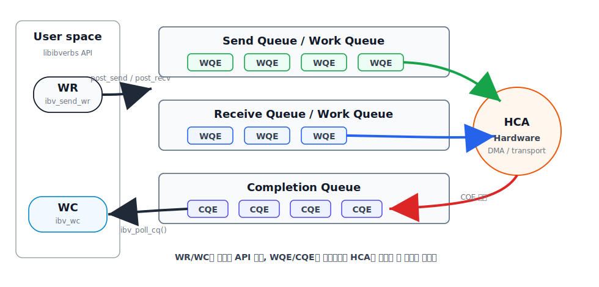

# RDMA Read/Write 실전 입문
> 목표: **이 글 하나로 RDMA Read와 Write를 직접 작성하고 실행할 수 있는 기준을 정리함.**

<p align="center">

</p>

---

## 0. 왜 또 RDMA인가

LLM 추론과 학습이 GPU 클러스터의 일이 되면서 RDMA는 더 이상 HPC 영역만의 전유물이 아님.

NCCL의 IB plugin, NIXL, Mooncake의 KV cache 전송, vLLM의 disaggregated prefill 모두 결국 RDMA 위에서 동작함.

스택 디버깅과 튜닝을 위해 verbs 레벨 동작 이해가 필요함.

이 글의 범위는 **InfiniBand/RoCEv2 위의 `libibverbs` 사용법**임. (iWARP는 사용 빈도가 낮아 생략)

---

## 1. 핵심 개념 5분 정리

### 1.1 RDMA가 빠른 이유

```
TCP:   APP → kernel buffer → kernel TCP/IP → NIC → wire → ...
RDMA:  APP → HCA → wire → HCA → APP    (커널 우회, 카피 없음)
```

세 가지 특성이 결합한 결과임:
- **Kernel bypass**: data path의 커널 우회
- **Zero-copy**: 사용자 버퍼에서 직접 NIC DMA
- **Transport offload**: 헤더 생성, 재전송, ordering의 HCA 하드웨어 처리

대신 **Control path는 커널을 경유함**. QP 생성과 메모리 등록은 한 번 수행하는 고비용 작업이며,
이후 send/recv/read/write는 커널 없이 매우 빠르게 동작하는 구조임.

### 1.2 통신 패러다임 두 가지

**Two-sided (Send/Recv)**: 양쪽 모두 능동적. 송신자는 send, 수신자는 미리 receive post.
TCP의 send/recv와 유사한 멘탈 모델임.

**One-sided (RDMA Read/Write)**: 한쪽이 일방적으로 원격 메모리를 읽고 쓰는 방식.
**원격 CPU는 자기 메모리 접근 여부를 인지하지 못함**. RDMA의 핵심 강점임!

| 연산 | requester | responder CPU | 용도 |
|---|---|---|---|
| Send/Recv | 양쪽 active | 개입 O | 제어 메시지, 메타데이터 교환 |
| RDMA Write | 한쪽만 | 개입 X | 일방적 데이터 전달 (NCCL 기본) |
| RDMA Read | 한쪽만 | 개입 X | pull 패턴, KV cache 회수 |
| Atomic | 한쪽만 | 개입 X | 분산 락, counter |

### 1.3 객체 모델

```
┌─────────────────────────────────────────────────────────┐
│  Context (HCA 핸들)                                      │
│    └─ PD (Protection Domain, 보안 경계)                   │
│         ├─ MR (Memory Region: 등록된 메모리)               │
│         ├─ QP (Queue Pair)                              │
│         │    ├─ SQ (Send Queue)                         │
│         │    └─ RQ (Receive Queue)                      │
│         └─ ...                                          │
│    └─ CQ (Completion Queue)  ← PD에 안 묶임               │
└─────────────────────────────────────────────────────────┘
```

- **WR (Work Request)**: HCA에 지시하는 일감. SQ 또는 RQ에 post
- **WC (Work Completion)**: WR 완료 후 CQ에 들어오는 완료 항목
- **SGE (Scatter-Gather Element)**: 한 WR이 여러 버퍼를 다룰 수 있게 해주는 단위

**중요한 규칙**: WR post 이후 WC 수신 전까지 해당 버퍼에 접근하면 안 됨.
Outstanding 상태에서 버퍼 수정 시 wire에 손상된 데이터가 전송됨.

### 1.4 Transport 타입

| 타입 | 비유 | 신뢰성 | 연결성 | RDMA Read/Atomic 가능? |
|---|---|---|---|---|
| **RC** | TCP | O | O | **O** ← 거의 항상 이거 씀 |
| UC | - | X | O | X |
| UD | UDP | X | X | X |
| DC | - | O | 동적 | O (대규모용) |

NCCL, UCX, MPI 등 대부분의 라이브러리가 RC를 쓰는 이유는 **RDMA Read와 Atomic이 RC에서만 동작**하기 때문임.

### 1.5 QP 상태 전이

```
RESET ──init──> INIT ──peer info──> RTR ──more attrs──> RTS
                                    │                   │
                                    ▼                   ▼
                                 receive 가능         send 가능
```

RTR(Ready to Receive)에서는 수신만 가능하고, RTS(Ready to Send)까지 전이 후 송신 가능함.
**RTR 전이를 위해 상대방의 QPN과 LID/GID가 필요함**. 해당 정보 교환 방식이 RDMA 프로그램의 첫 번째 허들임.

---

## 2. 환경 준비 — 2026년 기준

### 2.1 옵션 A: 진짜 RDMA NIC

ConnectX-6/7, BlueField, AWS EFA 등 실제 RDMA HCA 사용을 권장함.

```bash
# 패키지 (Ubuntu 24.04 기준)
sudo apt install rdma-core libibverbs-dev librdmacm-dev ibverbs-utils \
                 perftest infiniband-diags

# 디바이스 확인
ibstat               # 카드와 포트 상태
ibv_devices          # 디바이스 이름 목록
ibv_devinfo -d mlx5_0   # 상세 정보 (LID, GID, MTU)
```

### 2.2 옵션 B: Soft-RoCE (RXE) — 실 NIC 없이 학습용

일반 이더넷 NIC 위에 RDMA 스택을 소프트웨어로 얹는 방식임. 학습/CI에 적합함.

```bash
sudo modprobe rdma_rxe
sudo rdma link add rxe0 type rxe netdev eth0   # eth0은 사용 중인 NIC

ibv_devices    # rxe0 표시 시 성공
```

### 2.3 동작 검증

```bash
# 한쪽
ib_write_bw -d mlx5_0

# 반대쪽
ib_write_bw -d mlx5_0 <서버IP>
```

여기서 BW 미출력 시 이후 코드도 동작하지 않음. **반드시 perftest 통과 후 시작해야 함.**

---

## 3. 첫 번째 프로그램 — RDMA Write 한 번 보내기

이 섹션의 목표: **클라이언트가 서버 메모리에 "Hello, RDMA!"를 직접 쓰는 흐름을 구현함.**
서버 CPU가 메인 루프에서 sleep 중이어도 메모리 변경 확인이 가능함.

### 3.1 전체 흐름

```
[양쪽 공통 - 초기화 phase]
  1. ibv_get_device_list / ibv_open_device        → context
  2. ibv_alloc_pd                                 → PD
  3. ibv_create_cq                                → CQ
  4. ibv_create_qp                                → QP (RESET 상태)
  5. ibv_modify_qp(INIT)                          → INIT 상태

[TCP 소켓으로 OOB 정보 교환]
  ─ LID/GID, QPN, (그리고 MR의) addr/rkey 주고받기

[양쪽 공통]
  6. ibv_modify_qp(RTR with peer info)            → RTR
  7. ibv_modify_qp(RTS)                           → RTS
  8. ibv_reg_mr                                   → MR (5번 직후 수행도 가능)

[클라이언트만]
  9. ibv_post_send(opcode=RDMA_WRITE)             → 전송
 10. ibv_poll_cq                                  → 완료 확인
```

서버는 9, 10을 수행하지 않음. 메모리 관찰만 수행함.

### 3.2 공통 헤더와 유틸 (`common.h`)

```c
// common.h
#pragma once
#include <stdio.h>
#include <stdlib.h>
#include <string.h>
#include <stdint.h>
#include <errno.h>
#include <unistd.h>
#include <arpa/inet.h>
#include <sys/socket.h>
#include <netinet/in.h>
#include <infiniband/verbs.h>

#define BUF_SIZE   4096
#define TCP_PORT   18515
#define IB_PORT    1
#define GID_INDEX  3        // RoCEv2면 보통 3, IB면 0. ibv_devinfo로 확인.

#define CHECK(x, msg) do { \
    if (!(x)) { perror(msg); exit(1); } \
} while (0)

// TCP 교환 정보
struct conn_info {
    uint32_t qpn;            // peer Queue Pair Number
    uint32_t lid;            // peer Local ID (IB용)
    union ibv_gid gid;       // peer GID (RoCE용)
    uint64_t addr;            // peer MR 시작 주소
    uint32_t rkey;           // peer MR remote key
} __attribute__((packed));

// 디바이스 open
static struct ibv_context* open_device(const char* name) {
    int n;
    struct ibv_device** list = ibv_get_device_list(&n);
    CHECK(list, "ibv_get_device_list");

    struct ibv_context* ctx = NULL;
    for (int i = 0; i < n; i++) {
        if (!name || strcmp(ibv_get_device_name(list[i]), name) == 0) {
            ctx = ibv_open_device(list[i]);
            break;
        }
    }
    ibv_free_device_list(list);
    CHECK(ctx, "ibv_open_device");
    return ctx;
}

// QP를 RESET → INIT
static void qp_to_init(struct ibv_qp* qp) {
    struct ibv_qp_attr attr = {
        .qp_state        = IBV_QPS_INIT,
        .pkey_index      = 0,
        .port_num        = IB_PORT,
        .qp_access_flags = IBV_ACCESS_LOCAL_WRITE
                         | IBV_ACCESS_REMOTE_READ
                         | IBV_ACCESS_REMOTE_WRITE,
    };
    int flags = IBV_QP_STATE | IBV_QP_PKEY_INDEX
              | IBV_QP_PORT  | IBV_QP_ACCESS_FLAGS;
    CHECK(ibv_modify_qp(qp, &attr, flags) == 0, "qp INIT");
}

// QP를 INIT → RTR (peer info 필요)
static void qp_to_rtr(struct ibv_qp* qp, struct conn_info* peer) {
    struct ibv_qp_attr attr = {
        .qp_state           = IBV_QPS_RTR,
        .path_mtu           = IBV_MTU_1024,
        .dest_qp_num        = peer->qpn,
        .rq_psn             = 0,
        .max_dest_rd_atomic = 1,
        .min_rnr_timer      = 12,
        .ah_attr = {
            .is_global  = 1,           // RoCE는 무조건 global (GRH 사용)
            .dlid       = 0,           // RoCE는 LID 의미 없음
            .sl         = 0,
            .src_path_bits = 0,
            .port_num   = IB_PORT,
            .grh = {
                .hop_limit  = 1,
                .dgid       = peer->gid,
                .sgid_index = GID_INDEX,
            },
        },
    };
    int flags = IBV_QP_STATE | IBV_QP_AV | IBV_QP_PATH_MTU
              | IBV_QP_DEST_QPN | IBV_QP_RQ_PSN
              | IBV_QP_MAX_DEST_RD_ATOMIC | IBV_QP_MIN_RNR_TIMER;
    CHECK(ibv_modify_qp(qp, &attr, flags) == 0, "qp RTR");
}

// RTR → RTS
static void qp_to_rts(struct ibv_qp* qp) {
    struct ibv_qp_attr attr = {
        .qp_state      = IBV_QPS_RTS,
        .timeout       = 14,
        .retry_cnt     = 7,
        .rnr_retry     = 7,
        .sq_psn        = 0,
        .max_rd_atomic = 1,
    };
    int flags = IBV_QP_STATE | IBV_QP_TIMEOUT | IBV_QP_RETRY_CNT
              | IBV_QP_RNR_RETRY | IBV_QP_SQ_PSN | IBV_QP_MAX_QP_RD_ATOMIC;
    CHECK(ibv_modify_qp(qp, &attr, flags) == 0, "qp RTS");
}

// CQ polling 후 WC 하나 획득
static int poll_one_completion(struct ibv_cq* cq) {
    struct ibv_wc wc;
    int n;
    do {
        n = ibv_poll_cq(cq, 1, &wc);
    } while (n == 0);

    if (n < 0 || wc.status != IBV_WC_SUCCESS) {
        fprintf(stderr, "WC failed: %s (wr_id=%lu)\n",
                ibv_wc_status_str(wc.status), wc.wr_id);
        return -1;
    }
    return 0;
}

static int write_full(int fd, const void* buf, size_t len) {
    const char* p = buf;
    while (len > 0) {
        ssize_t n = write(fd, p, len);
        if (n < 0) {
            if (errno == EINTR) continue;
            return -1;
        }
        if (n == 0) {
            errno = EPIPE;
            return -1;
        }
        p += n;
        len -= n;
    }
    return 0;
}

static int read_full(int fd, void* buf, size_t len) {
    char* p = buf;
    while (len > 0) {
        ssize_t n = read(fd, p, len);
        if (n < 0) {
            if (errno == EINTR) continue;
            return -1;
        }
        if (n == 0) {
            errno = ECONNRESET;
            return -1;
        }
        p += n;
        len -= n;
    }
    return 0;
}

// TCP로 conn_info 교환 (서버 모드)
static int tcp_server_exchange(struct conn_info* local, struct conn_info* remote) {
    int srv = socket(AF_INET, SOCK_STREAM, 0);
    int opt = 1;
    setsockopt(srv, SOL_SOCKET, SO_REUSEADDR, &opt, sizeof(opt));
    struct sockaddr_in addr = { .sin_family = AF_INET,
                                .sin_port = htons(TCP_PORT),
                                .sin_addr.s_addr = INADDR_ANY };
    bind(srv, (struct sockaddr*)&addr, sizeof(addr));
    listen(srv, 1);
    int cli = accept(srv, NULL, NULL);
    close(srv);

    CHECK(write_full(cli, local, sizeof(*local)) == 0, "write conn_info");
    CHECK(read_full(cli, remote, sizeof(*remote)) == 0, "read conn_info");
    close(cli);
    return 0;
}

// TCP로 conn_info 교환 (클라이언트 모드)
static int tcp_client_exchange(const char* server_ip,
                               struct conn_info* local,
                               struct conn_info* remote) {
    int s = socket(AF_INET, SOCK_STREAM, 0);
    struct sockaddr_in addr = { .sin_family = AF_INET,
                                .sin_port = htons(TCP_PORT) };
    inet_pton(AF_INET, server_ip, &addr.sin_addr);
    CHECK(connect(s, (struct sockaddr*)&addr, sizeof(addr)) == 0, "connect");

    CHECK(read_full(s, remote, sizeof(*remote)) == 0, "read conn_info");
    CHECK(write_full(s, local, sizeof(*local)) == 0, "write conn_info");
    close(s);
    return 0;
}
```

### 3.3 서버 코드 (`server.c`)

```c
// server.c — 메모리만 노출하고 가만히 있는 쪽
#include "common.h"

int main(int argc, char** argv) {
    const char* dev = (argc > 1) ? argv[1] : NULL;

    // 1~4: context, PD, CQ, QP 생성
    struct ibv_context* ctx = open_device(dev);
    struct ibv_pd*  pd  = ibv_alloc_pd(ctx);            CHECK(pd, "alloc_pd");
    struct ibv_cq*  cq  = ibv_create_cq(ctx, 16, NULL, NULL, 0);
    CHECK(cq, "create_cq");

    struct ibv_qp_init_attr qp_attr = {
        .send_cq = cq, .recv_cq = cq,
        .qp_type = IBV_QPT_RC,
        .cap = { .max_send_wr = 16, .max_recv_wr = 16,
                 .max_send_sge = 1, .max_recv_sge = 1 },
    };
    struct ibv_qp* qp = ibv_create_qp(pd, &qp_attr);
    CHECK(qp, "create_qp");

    // 5: INIT 전이
    qp_to_init(qp);

    // 8: 메모리 등록 (서버는 클라이언트가 쓸 영역을 노출)
    char* buf = aligned_alloc(4096, BUF_SIZE);
    memset(buf, 0, BUF_SIZE);
    strcpy(buf, "(initial server memory)");

    struct ibv_mr* mr = ibv_reg_mr(pd, buf, BUF_SIZE,
        IBV_ACCESS_LOCAL_WRITE | IBV_ACCESS_REMOTE_WRITE | IBV_ACCESS_REMOTE_READ);
    CHECK(mr, "reg_mr");

    // local 정보 구성
    struct ibv_port_attr port;
    ibv_query_port(ctx, IB_PORT, &port);
    union ibv_gid my_gid;
    ibv_query_gid(ctx, IB_PORT, GID_INDEX, &my_gid);

    struct conn_info local = {
        .qpn  = qp->qp_num,
        .lid  = port.lid,
        .gid  = my_gid,
        .addr = (uintptr_t) buf,
        .rkey = mr->rkey,
    };
    struct conn_info remote;

    printf("[server] waiting for client TCP on port %d...\n", TCP_PORT);
    tcp_server_exchange(&local, &remote);
    printf("[server] peer QPN=%u, addr=0x%lx, rkey=0x%x\n",
           remote.qpn, remote.addr, remote.rkey);

    // 6, 7: RTR, RTS
    qp_to_rtr(qp, &remote);
    qp_to_rts(qp);

    // 메모리 변화를 관찰
    printf("[server] before:  '%s'\n", buf);
    printf("[server] sleeping 5 seconds, doing nothing...\n");
    for (int i = 0; i < 5; i++) {
        sleep(1);
        printf("[server] t=%d:    '%s'\n", i, buf);  // CPU 개입 없이 변경
    }
    printf("[server] after:   '%s'\n", buf);

    // 정리
    ibv_dereg_mr(mr);
    ibv_destroy_qp(qp);
    ibv_destroy_cq(cq);
    ibv_dealloc_pd(pd);
    ibv_close_device(ctx);
    free(buf);
    return 0;
}
```

### 3.4 클라이언트 코드 (`client.c`)

```c
// client.c — 서버 메모리에 직접 RDMA Write
#include "common.h"

int main(int argc, char** argv) {
    if (argc < 2) {
        fprintf(stderr, "usage: %s <server_ip> [device]\n", argv[0]);
        return 1;
    }
    const char* server_ip = argv[1];
    const char* dev = (argc > 2) ? argv[2] : NULL;

    struct ibv_context* ctx = open_device(dev);
    struct ibv_pd*  pd  = ibv_alloc_pd(ctx);
    CHECK(pd, "alloc_pd");
    struct ibv_cq*  cq  = ibv_create_cq(ctx, 16, NULL, NULL, 0);
    CHECK(cq, "create_cq");

    struct ibv_qp_init_attr qp_attr = {
        .send_cq = cq, .recv_cq = cq,
        .qp_type = IBV_QPT_RC,
        .cap = { .max_send_wr = 16, .max_recv_wr = 16,
                 .max_send_sge = 1, .max_recv_sge = 1 },
    };
    struct ibv_qp* qp = ibv_create_qp(pd, &qp_attr);
    CHECK(qp, "create_qp");
    qp_to_init(qp);

    // 전송 데이터 준비
    char* buf = aligned_alloc(4096, BUF_SIZE);
    snprintf(buf, BUF_SIZE, "Hello, RDMA from client at PID %d!", getpid());
    struct ibv_mr* mr = ibv_reg_mr(pd, buf, BUF_SIZE, IBV_ACCESS_LOCAL_WRITE);
    CHECK(mr, "reg_mr");

    // local 정보 구성
    struct ibv_port_attr port;
    ibv_query_port(ctx, IB_PORT, &port);
    union ibv_gid my_gid;
    ibv_query_gid(ctx, IB_PORT, GID_INDEX, &my_gid);

    struct conn_info local = {
        .qpn  = qp->qp_num,
        .lid  = port.lid,
        .gid  = my_gid,
        .addr = (uintptr_t) buf,        // 클라이언트는 송신용이라 주소/rkey는 사실상 불필요
        .rkey = mr->rkey,
    };
    struct conn_info remote;

    printf("[client] connecting to %s:%d ...\n", server_ip, TCP_PORT);
    tcp_client_exchange(server_ip, &local, &remote);
    printf("[client] peer addr=0x%lx, rkey=0x%x\n", remote.addr, remote.rkey);

    qp_to_rtr(qp, &remote);
    qp_to_rts(qp);

    // ─── RDMA Write 지점 ───
    struct ibv_sge sge = {
        .addr   = (uintptr_t) buf,
        .length = strlen(buf) + 1,
        .lkey   = mr->lkey,
    };
    struct ibv_send_wr wr = {
        .wr_id      = 1,
        .sg_list    = &sge,
        .num_sge    = 1,
        .opcode     = IBV_WR_RDMA_WRITE,
        .send_flags = IBV_SEND_SIGNALED,
        .wr.rdma = {
            .remote_addr = remote.addr,
            .rkey        = remote.rkey,
        },
    };
    struct ibv_send_wr* bad = NULL;
    CHECK(ibv_post_send(qp, &wr, &bad) == 0, "post_send");

    // 완료 대기
    CHECK(poll_one_completion(cq) == 0, "poll");
    printf("[client] RDMA Write completed.\n");

    sleep(2);  // 서버 메모리 관찰 시간 확보

    // RDMA Read 수행: 서버 메모리 재읽기 후 덮어쓰기
    memset(buf, 0, BUF_SIZE);
    sge.length = BUF_SIZE;
    wr.opcode  = IBV_WR_RDMA_READ;
    wr.wr_id   = 2;
    CHECK(ibv_post_send(qp, &wr, &bad) == 0, "post_send read");
    CHECK(poll_one_completion(cq) == 0, "poll read");
    printf("[client] RDMA Read got: '%s'\n", buf);

    // 정리
    ibv_dereg_mr(mr);
    ibv_destroy_qp(qp);
    ibv_destroy_cq(cq);
    ibv_dealloc_pd(pd);
    ibv_close_device(ctx);
    free(buf);
    return 0;
}
```

### 3.5 빌드와 실행

```bash
# Makefile
cat > Makefile <<'EOF'
CFLAGS = -O2 -Wall -g
LDLIBS = -libverbs

all: server client
server: server.c common.h
	$(CC) $(CFLAGS) server.c -o server $(LDLIBS)
client: client.c common.h
	$(CC) $(CFLAGS) client.c -o client $(LDLIBS)
clean:
	rm -f server client
EOF

make

# 한쪽 머신에서
./server mlx5_0

# 다른쪽에서
./client 10.0.0.1 mlx5_0
```

기대 출력:
```
[server] before:  '(initial server memory)'
[server] sleeping 5 seconds, doing nothing...
[server] t=0:    'Hello, RDMA from client at PID 12345!'   ← 변했다!
[server] t=1:    'Hello, RDMA from client at PID 12345!'
...
```

서버 코드는 RDMA Write를 처리하는 함수를 호출하지 않음. 메모리만 변경된 상태임.

---

## 4. InfiniBand vs RoCEv2 — 같은 코드, 다른 wire

위 코드를 한 번 실행한 뒤 자연스럽게 생기는 질문: "이게 IB 코드인가 RoCEv2 코드인가?" 답은 **둘 다**임. 정확히는 **거의 같은 코드로 둘 다 동작함**. 차이 지점을 이해하면 디버깅에 큰 도움이 됨.

### 4.1 큰 그림: 서로 다른 layer

```
┌─────────────────────────────────────────┐
│  Application + libibverbs API           │  ← 동일
├─────────────────────────────────────────┤
│  RDMA Transport (RC, UC, UD ...)        │  ← 동일
├─────────────────────────────────────────┤
│  Network Layer                          │  ← 분기 지점
│   IB: IB Network (LID 기반 라우팅)        │
│   RoCEv1: Ethernet L2 (MAC 기반)         │  ← 거의 미사용
│   RoCEv2: UDP/IP (port 4791) ← 표준      │
│   iWARP: TCP                            │  ← 거의 미사용
├─────────────────────────────────────────┤
│  Link: IB cable / Ethernet cable        │
└─────────────────────────────────────────┘
```

**핵심**: RDMA의 "위쪽 절반"(verbs API, QP, MR, RC/UC/UD semantics)은 셋 다 동일함. 차이는 **"이 RDMA 패킷의 wire 전송 방식"** 에서만 발생함.

따라서 3장 코드 대부분은 RoCEv2에서도 그대로 동작함. 변경 지점은 **주소 체계**와 **네트워크 튜닝**임.

### 4.2 LID vs GID

InfiniBand는 **LID(Local Identifier)** 라는 16비트 주소를 사용함. Subnet Manager가 부여하며, IB subnet 안에서만 의미 있음.

RoCEv2에는 IB LID 같은 개념이 없음. 대신 **GID만 사용함**. **GID = IPv4/IPv6 주소를 IPv6 형식으로 인코딩한 값**임.

```bash
# RoCEv2 환경에서 ibv_devinfo
ibv_devinfo -d mlx5_0 -v
# ...
# GID[0]:  fe80::... (link-local IPv6, RoCEv1)
# GID[1]:  fe80::... (link-local IPv6, RoCEv2)
# GID[2]:  ::ffff:10.0.0.1 (IPv4 mapped, RoCEv1)
# GID[3]:  ::ffff:10.0.0.1 (IPv4 mapped, RoCEv2)  ← 보통 이 인덱스 사용
```

같은 IP 주소가 v1용/v2용으로 두 번 등장하여 초기 혼동이 가능함. **RoCEv2 사용 시 RoCEv2 인덱스 선택이 필요함**. 잘못 선택 시 RoCEv1으로 동작하여 라우팅에 실패함.

`show_gids` 명령어(MOFED 도구)로 한눈에 매핑 확인이 가능함:
```bash
show_gids
# DEV    PORT INDEX GID                                  IPv4         VER  DEV
# mlx5_0 1    0     fe80::...                                          v1   eth0
# mlx5_0 1    1     fe80::...                                          v2   eth0
# mlx5_0 1    2     0000:0000:0000:0000:0000:ffff:0a00:0001 10.0.0.1  v1   eth0
# mlx5_0 1    3     0000:0000:0000:0000:0000:ffff:0a00:0001 10.0.0.1  v2   eth0
```

### 4.3 코드 차이는 정확히 어디?

3장의 `qp_to_rtr` 함수를 다시 보면, IB 환경에서는 다음 형태가 필요함:

```c
// IB일 때
.ah_attr = {
    .is_global  = 0,           // GRH 미사용
    .dlid       = peer->lid,   // LID로 라우팅
    .port_num   = IB_PORT,
}

// RoCEv2일 때 (3장 코드 그대로)
.ah_attr = {
    .is_global  = 1,           // GRH 필수!
    .dlid       = 0,           // RoCE는 LID 의미 없음
    .port_num   = IB_PORT,
    .grh = {
        .dgid          = peer->gid,
        .sgid_index    = 3,        // RoCEv2 GID 인덱스
        .hop_limit     = 1,        // IP TTL 유사
        .traffic_class = 0,        // DSCP/ECN용
    },
}
```

차이는 다음과 같음:
- IB: LID 기반 routing → `is_global = 0`, `dlid` 채움
- RoCEv2: IP 기반 routing → `is_global = 1`, GRH 채움 (`dgid`가 사실상 IP)

**`is_global` 플래그 하나가 wire 포맷을 변경함**. 잘못 설정 시 silent fail 발생이 가능함. 3장 코드는 RoCEv2 가정이므로, IB 환경 실행 시 `is_global = 0`으로 변경이 필요함.

### 4.4 Subnet Manager 유무

IB는 `opensm` 같은 Subnet Manager가 LID를 부여하고 라우팅 테이블을 관리함. 보통 IB 스위치에 내장되거나 한 노드에서 실행됨.

RoCEv2는 이더넷 + IP 기반이므로 SM이 불필요함. 대신 **이더넷 스위치 설정**의 중요도가 증가함. 다음 절의 주제임.

### 4.5 RoCEv2의 진짜 까다로운 부분: "Lossless Ethernet" 만들기

이 부분이 RoCEv2의 핵심 과제임. IB는 link layer가 **credit-based flow control** 기반이라 패킷 drop이 거의 없음. RoCEv2는 일반 이더넷을 사용하며, 이더넷은 기본적으로 **lossy**임(혼잡 시 패킷 폐기).

RDMA는 lossy 환경에서 성능 저하가 큼. RC 재전송은 **go-back-N** 방식이므로 패킷 하나 손실 시 이후 패킷을 전부 재전송함. 이를 막기 위해 이더넷을 lossless에 가깝게 만들어야 함.

두 가지 메커니즘이 존재함:

**PFC (Priority Flow Control, IEEE 802.1Qbb)**:
- 큐별 "잠깐 멈춤" 신호 전송 (PAUSE frame)
- RDMA 트래픽을 특정 priority에 격리하고 해당 priority만 lossless 보장
- **위험**: head-of-line blocking, PFC storm, deadlock 가능함. 잘못 설정 시 네트워크가 마비됨

**ECN + DCQCN (Data Center QCN)**:
- 스위치 혼잡 시 패킷에 ECN 마크 (drop 없이 표시만)
- 수신 NIC의 송신 NIC 대상 CNP(Congestion Notification Packet) 전송
- 송신 NIC의 자체 rate 감소 → 이후 천천히 회복
- **PFC보다 부드러운 방식**임. 현재 대규모 RoCE 데이터센터의 표준임

실무에서는 **DCQCN을 메인으로 쓰고 PFC는 백업**으로 두는 구성이 많음(Microsoft, Meta 모두 이 방향). 최근에는 PFC 없이 ECN만 사용하는 시도도 존재(HPCC, Swift 같은 알고리즘).

스위치/NIC 설정 예시:
```bash
# Mellanox NIC 기준 - PFC priority 3에 활성화
mlnx_qos -i eth0 --pfc 0,0,0,1,0,0,0,0

# DSCP 기반 trust mode
mlnx_qos -i eth0 --trust dscp

# RoCE 트래픽에 DSCP 26 부여
echo 26 > /sys/class/infiniband/mlx5_0/tc/1/traffic_class
```

이런 설정이 **RoCEv2 성능 차이의 90%를 결정함**. 코드는 동일한데 perftest 결과가 절반 수준이면 대부분 PFC/ECN 설정 문제임. 스위치 쪽도 같은 priority/DSCP에 lossless 큐 매핑이 필요하고, 경로상 모든 hop의 일관성이 필요함.

### 4.6 MTU와 라우팅

**MTU**:
- IB: 256, 512, 1024, 2048, 4096 바이트 (`enum ibv_mtu`)
- RoCEv2: 이더넷 MTU에 종속됨. 보통 **Jumbo frame 9000 활성화** 후 RoCE MTU는 4096 사용함

3장 코드의 `IBV_MTU_1024`는 보수적인 값임. 데이터센터 RoCEv2에서는 4096으로 올려야 throughput 확보가 가능함. 단, **경로상 모든 스위치/NIC의 동일 MTU**가 필요함. 불일치 시 fragment + drop이 발생함.

**라우팅 (이게 RoCEv2의 진짜 장점)**:

RoCEv2는 UDP/IP 위에서 동작하므로 **L3 라우팅이 가능함**. IB 대비 큰 장점:
- 다른 IP subnet 간 RDMA 가능함
- 기존 데이터센터 네트워크 그대로 활용
- ECMP로 multipath 가능함 (UDP source port를 flow id로 써서 분산)

IB는 단일 subnet 안에서만 동작함. 여러 subnet 연결에는 IB router가 필요하지만 사용 빈도는 낮음.

**Source port entropy**: RoCEv2 패킷의 UDP source port를 flow별로 다르게 설정 시 ECMP가 여러 경로로 분산함. NCCL/NIXL 같은 라이브러리들은 이를 적극 활용하여 single QP의 throughput을 multi-path로 향상함. IB에는 해당 개념이 없음.

### 4.7 디버깅 도구

```bash
# IB 환경
ibstat                  # 포트 상태, LID
ibhosts                 # subnet의 모든 노드
ibtracert               # 경로 추적
perfquery               # 카운터

# RoCEv2 환경 - 이더넷 도구도 함께 사용
ibstat                                   # 여전히 동작
ethtool -S eth0 | grep -i roce           # NIC 카운터
ethtool -S eth0 | grep -E "pause|pfc"    # PFC 카운터
mlnx_qos -i eth0                         # QoS 설정 확인
show_gids                                # GID 매핑 한눈에
cat /sys/class/net/eth0/ecn/...          # ECN 설정
```

특히 `show_gids`는 RoCEv2에서 GID 인덱스 혼동 시 필수임.

### 4.8 실무적으로 어디서 뭘 보게 되나

2026년 시점 현실:

- **클라우드 (AWS/Azure/GCP)**: 거의 RoCEv2 또는 그 변종. AWS EFA는 자체 transport이지만 verbs 호환. Azure는 RoCEv2 기반.
- **NVIDIA DGX SuperPOD, Meta GenAI 클러스터**: InfiniBand가 여전히 다수임. Quantum-2, Quantum-X800 같은 NDR/XDR IB.
- **하이퍼스케일러 자체 데이터센터 (Microsoft, Meta, Google, ByteDance)**: RoCEv2가 대세임. Google은 Falcon이라는 자체 reliable transport를 개발함. Meta는 RoCE.
- **일반 엔터프라이즈/스타트업**: 거의 RoCEv2임. 일반 이더넷 인프라 위에 배치 가능함.

**일반화**: AI 슈퍼컴 == IB가 아직 우세, AI 클라우드/하이퍼스케일 == RoCEv2 우세임. 추세는 RoCEv2의 점유 확대이고, IB는 latency와 단순함으로 top tier에 잔존함.

### 4.9 한 줄 요약

3장의 코드는 **RoCEv2 가정으로 작성됨**(`is_global = 1`, GID 사용). IB 실행 시 `is_global = 0` 변경과 LID 사용으로 충분함. **API와 semantics는 같고, "wire 종류"와 "네트워크 설정"만 다름**.

다만 **RoCEv2를 잘 운용하려면 application 코드보다 PFC/ECN/DSCP 설정이 훨씬 중요함**. 같은 코드가 IB에서 line rate가 나오고 RoCEv2에서 절반 수준이면, 대부분 스위치 설정 또는 PFC 미적용 문제임. 한 번 겪으면 잊기 어려운 문제임.

---

## 5. 동작 원리 다시 짚기

### 5.1 왜 서버 CPU가 개입 안 했나

`ibv_reg_mr` 호출 순간 발생하는 일:
1. 커널의 해당 메모리 페이지 **pin** (swap 방지)
2. HCA 페이지 테이블에 가상→물리 매핑 등록
3. **rkey** 발급 — 일종의 "이 메모리에 원격 접근을 허락한다"는 인증 토큰

클라이언트가 RDMA Write 전송 시 패킷에 `rkey`와 `remote_addr`를 포함함.
서버 HCA는 패킷 수신 즉시 rkey 검증 → 해당 MR의 매핑 사용 → DMA로 직접 메모리 쓰기. **CPU 인터럽트 없음**.

### 5.2 rkey/lkey 차이

- **lkey (local key)**: 로컬 MR 접근 시 사용 (sg_list에 들어가는 값)
- **rkey (remote key)**: 상대의 내 MR 접근 시 사용 (peer가 wr.rdma.rkey에 쓰는 값)

이 둘의 혼동 시 `IBV_WC_REM_ACCESS_ERR`로 실패함.

### 5.3 RDMA Write vs Read

```
Write:                        Read:
┌─────────┐                   ┌─────────┐
│ Client  │──data──>          │ Client  │──req──>
│         │   (큰 데이터 fire)  │         │  <──data──
│         │  <──ACK           │         │   (round-trip)
└─────────┘                   └─────────┘
```

Write가 빠른 이유: 데이터를 한 방향으로 보내고 작은 ACK만 반환함. Read는 요청 전송 후 데이터 수신이 필요하므로 round-trip이 필수임.
**따라서 NCCL이나 NIXL은 Write 중심 구조임.**

---

## 6. 입문자가 자주 빠지는 함정 9가지

### 6.1 GID index 틀리기

`ibv_devinfo`로 확인:
```bash
ibv_devinfo -d mlx5_0 -v | grep -A 1 "GID\["
```
RoCEv2 IPv4: 보통 GID[3]. RoCEv2 IPv6: GID[1]. Pure IB: GID[0]. **GID index 오류 시 RTR 전이에 실패하거나 ACK를 받지 못함**.

### 6.2 RoCE인데 `is_global = 0`

위 코드처럼 RoCE에서는 **반드시 GRH 사용**이 필요함. 0으로 두면 connection이 silent하게 실패함.

### 6.3 Pure IB인데 GRH 켜기

반대 케이스임. Pure IB subnet 안에서는 `is_global = 0`이 정상임.

### 6.4 post_recv 안 하고 send 받기 → `RNR_RETRY_EXC_ERR`

Send/Recv 패턴에서만 해당함. **수신자는 송신자가 보내기 전에 미리 RR post가 필요함**.
RDMA Write/Read에서는 해당 함정이 없음(원격 RR 불필요).

### 6.5 MR을 너무 자주 등록/해제

`ibv_reg_mr`은 고비용 syscall임(페이지 pin + HCA TLB 업데이트).
**큰 메모리를 한 번 등록하고 sub-region으로 잘라 쓰는 방식이 정석임**. 매번 등록 시 throughput이 급락함.

### 6.6 모든 WR에 SIGNALED 켜기

WC가 매번 생기면 CQ 처리 비용이 누적됨. **N개마다 한 번만 SIGNALED** 사용하는 것이 NCCL 패턴임:
```c
wr.send_flags = (i % 64 == 0) ? IBV_SEND_SIGNALED : 0;
```
주의: unsignaled WR도 SQ slot을 차지함. signaled WR 완료 시 그 앞의 unsignaled들도 함께 free됨.

### 6.7 작은 메시지에 SGE 등록 → `IBV_SEND_INLINE` 안 쓰기

수십~수백 바이트 데이터는 lkey 없이 WR 안에 inline 가능함:
```c
wr.send_flags |= IBV_SEND_INLINE;
```
큰 차이가 발생함. Latency 측정 시 필수임.

### 6.8 버퍼 alignment

DMA 안정성을 위해 **페이지 정렬**을 권장함. `aligned_alloc(4096, size)` 또는 `posix_memalign`.

### 6.9 "WR과 WQE의 동일성 여부" — 레벨 혼동

코드 작성 중 자연스럽게 헷갈리는 부분임. 이름이 비슷하지만 정확한 위치와 레벨 구분이 필요함.

```
[User space]      WR (Work Request)   ←→   WC (Work Completion)
                       ↓ driver               ↑ driver
[Kernel/HW]      WQE (Work Queue Element) ←→ CQE (Completion Queue Element)
```

<p align="center">

</p>

WR은 사용자가 `ibv_post_send()`에 넘기는 API 레벨 요청이고, 드라이버/HCA는 이를 **WQE로 변환해 Work Queue에** 배치함. 완료 결과는 하드웨어의 CQE로 생성되고, `ibv_poll_cq()`를 통해 사용자에게 WC 형태로 전달됨.

- **WR/WC**: 사용자가 API로 다루는 구조체. `struct ibv_send_wr`, `struct ibv_wc` ← 사용자가 만지는 것
- **WQE/CQE**: 드라이버가 HCA에게 넘기는 실제 큐 엔트리. **vendor마다 다름** (ConnectX-6/7 다르고 BlueField도 다름)

`ibv_post_send(qp, &wr, ...)` 호출 = 드라이버가 WR을 HCA가 이해하는 WQE로 변환하여 SQ에 배치하는 것. `ibv_poll_cq`도 마찬가지로 CQE → WC 변환.

이 개념을 알아야 하는 이유:

1. **벤더 문서/스펙 읽을 때 혼동이 줄어듦.** Mellanox PRM 같은 문서의 "WQE"는 실제 HW 레이아웃을 의미함. 사용자 코드의 `ibv_send_wr`이 아님
2. **성능 분석 시 필요함.** "WQE doorbell ring", "WQE BlueFlame" 같은 용어는 HW 큐 동작을 의미함. 사용자 코드 레벨이 아님
3. **다른 의외의 함정**: RQ는 **passive하게 동작함**. 즉 RQ에 WQE를 미리 넣어도 HCA가 즉시 소비하지 않음. **상대로부터 Send 패킷이 실제로 도착한 시점에** RQ에서 WQE 하나를 소비함. 이것이 RNR 에러의 본질 — "패킷 도착, 꺼내 쓸 RQ WQE 없음" → NACK

```
SQ:  active queue  — 내가 post한 즉시 HW가 처리 시작
RQ:  passive queue — post 후에도 패킷 도착 시 비로소 소비
```

이 mental model을 정립하면 장기적으로 도움이 됨. RQ는 "받을 준비를 미리 깔아두는 슬롯 풀"로 이해하는 것이 정확함.

---

## 7. 다음 단계

### 7.1 `librdmacm`으로 갈아타기

위 코드의 TCP bootstrap은 학습용임. 실전에서는 `librdmacm`(rdmacm)이 처리함:

```c
#include <rdma/rdma_cma.h>

struct rdma_event_channel* ec = rdma_create_event_channel();
struct rdma_cm_id* id;
rdma_create_id(ec, &id, NULL, RDMA_PS_TCP);
rdma_resolve_addr(id, NULL, peer_sockaddr, 2000);
// 이벤트 받으며 진행: ADDR_RESOLVED → ROUTE_RESOLVED → CONNECT
```

ADDR/ROUTE/CONNECT 이벤트 driven 방식에서는 GID index, LID 등이 모두 자동 처리됨.

### 7.2 GPU Direct RDMA

GPU 메모리 직접 등록이 가능함(드라이버 지원 시):
```c
cudaMalloc(&gpu_buf, size);
struct ibv_mr* mr = ibv_reg_mr(pd, gpu_buf, size, ACCESS_FLAGS);
// 이제 wire에서 GPU HBM <-> GPU HBM 직접 DMA
```
H100/B200 + ConnectX-7 조합에서는 PCIe P2P 또는 NVLink 경로로 CPU를 우회함.

### 7.3 성능 측정

`perftest` 패키지가 가장 정확함:
- `ib_write_bw`, `ib_read_bw`: 처리량
- `ib_write_lat`, `ib_read_lat`: 지연
- `ib_send_bw -a`: 메시지 크기별 sweep

자체 코드 측정 시 **워밍업 1000회 정도 후 측정**, 작은 메시지에는 inline 사용이 필요함.

### 7.4 디버깅 도구

```bash
ibv_devinfo -v        # 디바이스 capability 전수 확인
rdma resource show    # 현재 자원 사용량
perfquery             # 포트 카운터 (에러, drop 등)
ibdump                # 패킷 캡처 (Mellanox)
```

WC status가 알려주는 것:
- `LOC_LEN_ERR`: 로컬 길이 문제 (SGE 길이 > MR 길이 등)
- `LOC_PROT_ERR`: lkey가 잘못됐거나 access flag 부족
- `REM_ACCESS_ERR`: rkey 또는 권한 문제 (REMOTE_WRITE 안 켜고 write 시도 등)
- `RETRY_EXC_ERR`: 네트워크 문제, 케이블/스위치 의심
- `RNR_RETRY_EXC_ERR`: 상대가 RR 안 올림

---

## 8. 더 큰 그림: 프로덕션에서는

LLM 서빙/학습 스택 기준 RDMA가 사용되는 위치임:

- **NCCL `ib_plugin`**: AllReduce/AllGather가 RDMA Write로 동작함. 위 코드의 훨씬 정교한 버전임
- **NIXL (NVIDIA Inference Xfer Library)**: KV cache 전송용 RDMA 추상화임
- **Mooncake / vLLM disaggregated**: prefill→decode 노드 간 KV cache를 RDMA Read로 pull
- **MPI (`OpenMPI`, `MPICH`)**: UCX 위에서 RDMA로 polling
- **분산 스토리지 (IBM ESS/Storage Scale(GPFS), DAOS, WekaFS 등)**: storage client와 server 사이의 data path에 RDMA 사용이 가능함

이 라이브러리 내부에 들어가지 않더라도, 어떤 layer가 어떻게 RDMA를 쓰는지 알면 스택 디버깅과 튜닝 수준이 달라짐.

---

## 9. 마무리: 한 페이지 cheatsheet

```
초기화 (한 번):
  open_device → alloc_pd → create_cq → create_qp
  qp: RESET → INIT
  TCP: peer의 (LID, GID, QPN, addr, rkey) 받기
  qp: INIT → RTR → RTS
  reg_mr (또는 처음에 미리)

송신 (반복):
  ibv_sge      = { addr, length, lkey }
  ibv_send_wr  = { wr_id, sg_list, num_sge, opcode, send_flags,
                   wr.rdma = { remote_addr, rkey } }
  ibv_post_send → ibv_poll_cq

자주 쓰는 플래그:
  IBV_SEND_SIGNALED   — WC 생성
  IBV_SEND_INLINE     — 작은 메시지, MR 우회
  IBV_SEND_FENCE      — 이전 RDMA Read 완료 후 처리

opcode:
  IBV_WR_SEND         — two-sided
  IBV_WR_RDMA_WRITE   — one-sided write
  IBV_WR_RDMA_READ    — one-sided read
  IBV_WR_ATOMIC_*     — 64bit atomic

진단 시 첫 번째 의심:
  GID index, is_global 플래그, rkey/lkey 혼동, MR access flag,
  post_recv 미수행, MTU mismatch
```

이 정도면 RDMA 입문 정리가 완료됨. 그 다음은 코드 작성, 실패, 복구 과정에서 익히는 영역임.

---

## 부록. OpenAI MRC: 초대규모 AI 학습 네트워크 사례

OpenAI는 2026년에 **MRC(Multipath Reliable Connection)** 라는 네트워크 프로토콜을 공개함. MRC는 RoCE를 기반으로 하되, 10만 GPU 이상 규모의 동기식 학습에서 발생하는 혼잡과 장애 문제를 줄이기 위해 설계된 방식임.

핵심 아이디어는 세 가지임:
- **Multi-plane 네트워크**: 하나의 800Gb/s NIC를 여러 개의 100Gb/s 링크처럼 나누고, 독립적인 여러 네트워크 plane으로 분산함
- **Packet spraying**: 하나의 전송을 단일 경로에 고정하지 않고 수백 개 경로로 패킷을 분산함
- **SRv6 기반 source routing**: 스위치의 동적 라우팅에 의존하지 않고, 송신 측이 패킷 경로를 지정함

이 방식의 목표는 단순히 평균 bandwidth를 높이는 것이 아니라, **동기식 AI 학습에서 가장 치명적인 tail latency와 장애 전파를 줄이는 것**임. 큰 학습 job에서는 일부 GPU나 링크가 느려지는 것만으로 전체 step이 지연될 수 있음. MRC는 경로 장애를 빠르게 우회하고, 혼잡 경로를 피하며, 네트워크 control plane을 단순하게 유지하는 방향으로 이 문제를 풀어냄.

이 문서의 관점에서 MRC는 “RDMA/RoCE가 실제 대규모 AI 클러스터에서 어디까지 확장되는가”를 보여주는 좋은 사례임. 다만 MRC 자체는 NIC, 스위치, 라우팅, congestion control이 함께 맞물리는 프로덕션 네트워크 설계이므로, 입문 단계에서는 **RoCE 위에서 multipath, packet spraying, source routing을 결합한 초대규모 학습용 확장 사례** 정도로 이해하면 충분함.

---

## References
- *[RDMA Aware Networks Programming User Manual](https://docs.nvidia.com/rdma-aware-networks-programming-user-manual-1-7.pdf)* (NVIDIA/Mellanox 공식 PDF)
- *[Supercomputer networking to accelerate large scale AI training](https://openai.com/index/mrc-supercomputer-networking/)* (OpenAI, 2026)
- *[10만 GPU 시대의 네트워크, OpenAI가 직접 만든 MRC 프로토콜](https://wikidocs.net/blog/@jaehong/12991/)* (박재홍의 실리콘밸리, 2026)
