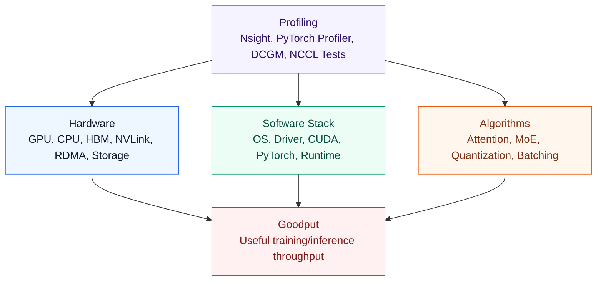
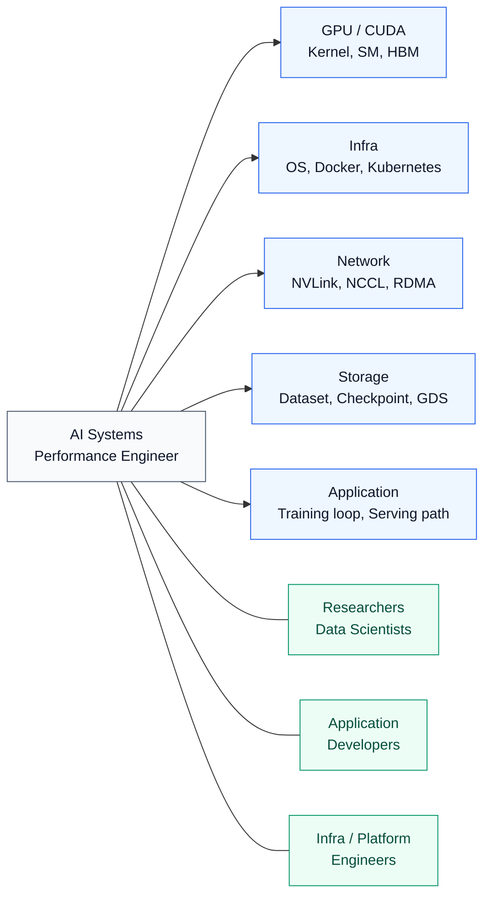
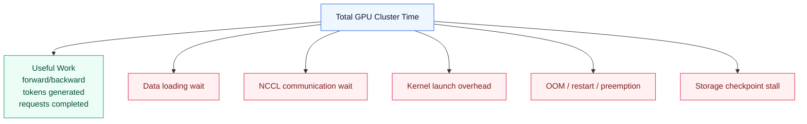
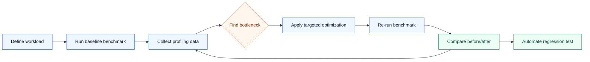
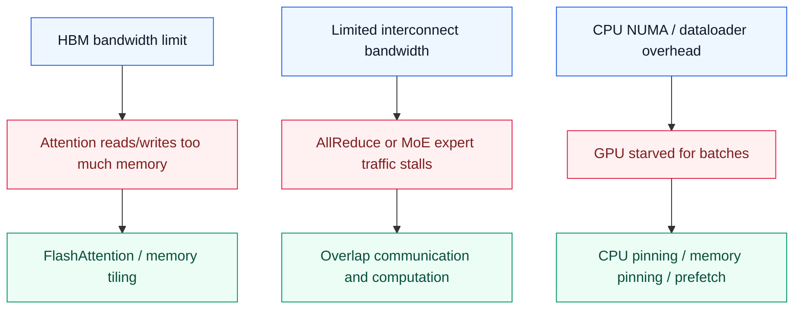
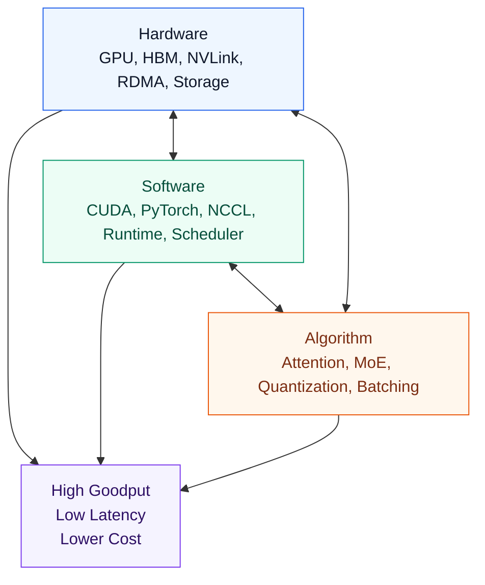
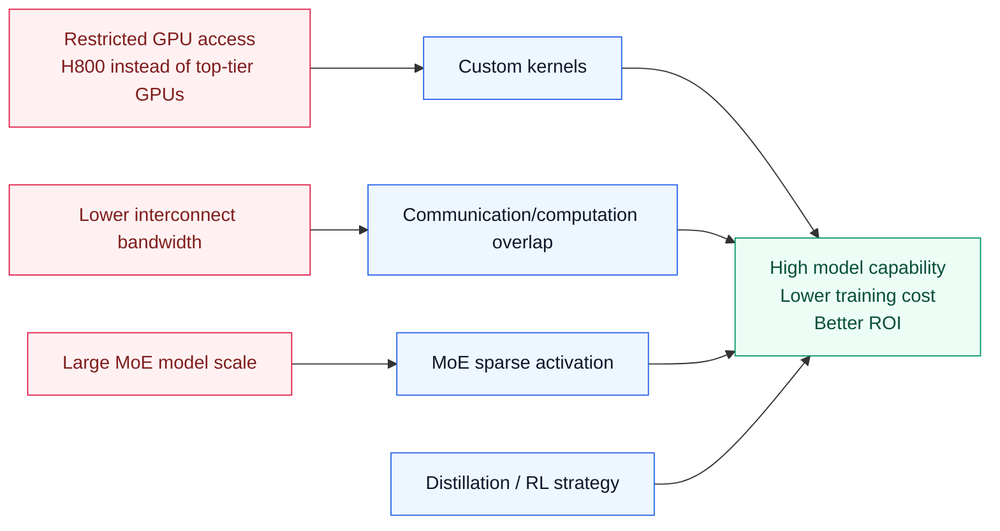
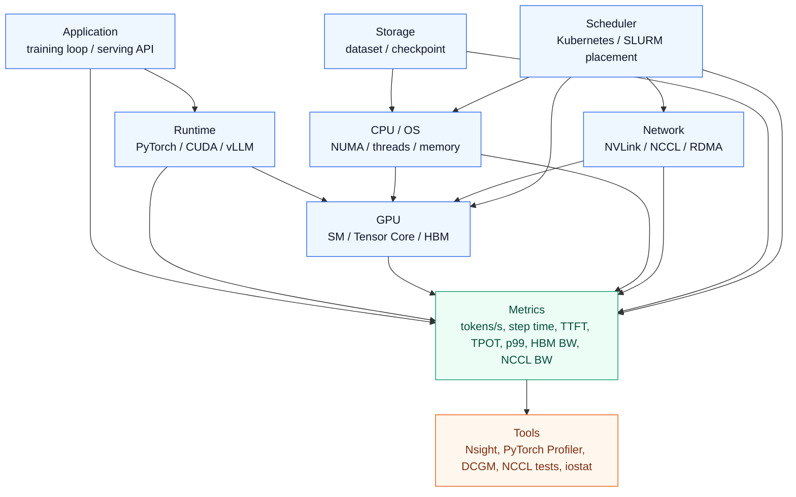
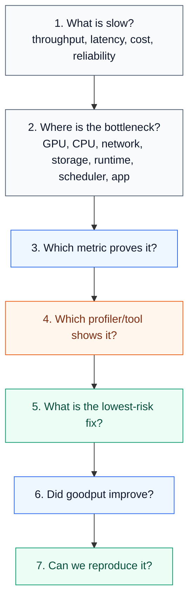

# Chapter 1: Introduction and AI System Overview

## Table of Contents

* [Goal](#goal)
* [Core Message](#core-message)
* [AI Systems Performance Engineer](#ai-systems-performance-engineer)
* [Why Goodput Matters](#why-goodput-matters)
* [Benchmarking and Profiling](#benchmarking-and-profiling)
* [Mechanical Sympathy](#mechanical-sympathy)
* [Hardware-Software-Algorithm Codesign](#hardware-software-algorithm-codesign)
* [DeepSeek Case Study](#deepseek-case-study)
* [Performance Bottleneck Lens](#performance-bottleneck-lens)
* [Practical Metrics and Tools](#practical-metrics-and-tools)
* [AI Performance Engineering Workflow](#ai-performance-engineering-workflow)
* [Design Decision Matrix](#design-decision-matrix)
* [Operational Validation Checklist](#operational-validation-checklist)
* [Chapter Summary](#chapter-summary)
* [Key Terms](#key-terms)
* [Questions](#questions)
* [Answers](#answers)
* [References](#references)

---

## Goal

This chapter introduces the mental model of **AI Systems Performance Engineering**.

The core idea is:

> AI performance engineering is not about making GPUs look busy.
> It is about maximizing useful work — goodput — across hardware, software, runtime, network, storage, scheduler, and application layers.

Chapter 1 sets the foundation for the whole book:

* AI systems are full-stack systems.
* Performance bottlenecks can appear at any layer.
* Raw GPU utilization is not enough.
* Goodput is the real target.
* Optimization must be driven by profiling, not intuition.
* Hardware, software, and algorithms must be codesigned.



---

## Core Message

AI systems performance engineering is the discipline of answering three questions:

1. **Where is the bottleneck?**
2. **How do we measure it?**
3. **Which layer should we fix?**

The important shift is from:

```text
"GPU utilization is high, so the system is healthy."
```

to:

```text
"How much of the system's capacity is doing useful training or inference work?"
```

This is why Chapter 1 introduces **goodput**, **mechanical sympathy**, and **hardware-software-algorithm codesign** early.

---

## AI Systems Performance Engineer

An AI Systems Performance Engineer sits between several domains.



The role is not just “GPU administrator” or “ML engineer.”

It combines:

| Area                | Responsibility                                                     |
| ------------------- | ------------------------------------------------------------------ |
| Benchmarking        | Measure throughput, latency, memory usage, scaling efficiency      |
| Profiling           | Identify bottlenecks using system and GPU profilers                |
| Debugging           | Trace performance regressions to root cause                        |
| Optimization        | Improve kernels, runtime, data pipeline, communication, scheduling |
| Scaling             | Move from single GPU to multi-GPU, multinode, multirack systems    |
| Resource efficiency | Improve performance per dollar and performance per watt            |
| Reproducibility     | Make benchmark results repeatable and comparable                   |

---

## Why Goodput Matters

Goodput means **useful throughput**.

Raw throughput asks:

```text
How much work appears to be happening?
```

Goodput asks:

```text
How much useful model progress is actually happening?
```

Examples of non-useful work:

* GPU waiting for dataloader
* GPU waiting for NCCL synchronization
* excessive CPU-GPU memory copy
* failed job restart
* suboptimal kernel launch overhead
* communication bubble in pipeline parallelism
* request queueing delay in inference serving
* KV cache eviction or recomputation



A simplified goodput view:

```text
Goodput = Useful completed work / End-to-end elapsed time
```

For training:

```text
Goodput = useful tokens or samples processed per second
```

For inference:

```text
Goodput = completed requests or generated tokens per second under SLO
```

The key point:

> GPU utilization can be high while goodput is low.

Example:

| Situation                                          | GPU Utilization |       Goodput | Likely Bottleneck             |
| -------------------------------------------------- | --------------: | ------------: | ----------------------------- |
| GPU busy but waiting on all-reduce                 |            High |           Low | Network / NCCL                |
| GPU periodically idle before each batch            | Low or unstable |           Low | CPU / dataloader / storage    |
| GPU memory nearly full, KV cache eviction frequent |            High |           Low | Memory / serving scheduler    |
| p99 latency high despite good average throughput   |            High | Low under SLO | Application / batching policy |
| training job restarts often                        |        Variable |           Low | Reliability / orchestration   |

---

## Benchmarking and Profiling

Chapter 1 emphasizes that performance work should be **profile-driven**.

The workflow should be:



Bad optimization style:

```text
"I changed this and it feels faster."
```

Good optimization style:

```text
"Before: 1,200 tokens/s, p99 900 ms.
After: 1,580 tokens/s, p99 710 ms.
Profiler shows NCCL wait reduced from 27% to 12%."
```

### Benchmarking targets

| Workload               | Primary Metric                     | Secondary Metrics                                     |
| ---------------------- | ---------------------------------- | ----------------------------------------------------- |
| Training               | samples/sec, tokens/sec, step time | GPU util, NCCL time, dataloader wait, checkpoint time |
| Inference              | tokens/sec, requests/sec           | TTFT, TPOT, p95/p99 latency, queue time               |
| Distributed training   | scaling efficiency                 | all-reduce time, network bandwidth, straggler ratio   |
| Storage-heavy training | data pipeline throughput           | IOPS, read BW, dataloader latency                     |
| LLM serving            | SLO-compliant throughput           | KV cache usage, batch size, decode latency            |

---

## Mechanical Sympathy

Mechanical sympathy means:

> Understand how the machine works, then design software and algorithms that cooperate with it.

For AI systems, the “machine” includes:

* GPU SMs
* Tensor Cores
* HBM
* L2 cache
* CPU NUMA topology
* PCIe / NVLink / NVSwitch
* RDMA NICs
* storage hierarchy
* CUDA runtime
* PyTorch execution model
* Kubernetes scheduler placement



Examples:

| Hardware Reality                              | Performance Problem                   | Mechanically Sympathetic Fix                     |
| --------------------------------------------- | ------------------------------------- | ------------------------------------------------ |
| HBM is fast but limited                       | attention moves too much data         | FlashAttention, MLA                              |
| NVLink is faster than IB                      | cross-node communication is expensive | keep traffic intra-node/intra-rack when possible |
| Tensor Cores prefer specific precision/shapes | low compute efficiency                | FP8/FP4, padding, fused kernels                  |
| CPU-GPU transfers are costly                  | dataloader stalls GPU                 | pinned memory, async copy, prefetch              |
| distributed collectives create bubbles        | scaling efficiency drops              | overlap communication and computation            |

---

## Hardware-Software-Algorithm Codesign

Chapter 1 frames modern AI performance as a **codesign problem**.



A performance issue can often be solved at different layers.

Example: inference latency is too high.

| Layer       | Possible Fix                       | Trade-off                    |
| ----------- | ---------------------------------- | ---------------------------- |
| Hardware    | Use B200/H200 instead of A100/H100 | expensive                    |
| Precision   | FP8/FP4 quantization               | possible accuracy loss       |
| Kernel      | optimized attention kernel         | engineering complexity       |
| Runtime     | CUDA Graphs                        | shape/static constraints     |
| Serving     | continuous batching                | latency-throughput trade-off |
| Application | prompt compression                 | possible quality loss        |
| Scheduler   | route long prompts separately      | operational complexity       |

The senior engineer’s question is:

```text
Which layer gives the highest ROI fix for this bottleneck?
```

---

## DeepSeek Case Study

Chapter 1 uses DeepSeek as a motivating case.

The lesson is not simply that “DeepSeek used fewer GPUs.”

The deeper performance engineering lesson is:

> When hardware is constrained, software and algorithmic optimization become strategic weapons.



Key lessons:

| Constraint                         | Engineering Response                     |
| ---------------------------------- | ---------------------------------------- |
| limited GPU interconnect bandwidth | reduce and overlap communication         |
| limited hardware availability      | optimize kernels and runtime             |
| large model size                   | use MoE sparse activation                |
| high training cost                 | improve algorithmic efficiency           |
| inference cost pressure            | optimize attention and KV cache behavior |

For your DGX B200/H100 context, the same lesson applies:

```text
Do not assume that more GPU is the first answer.
First prove whether the bottleneck is compute, memory, network, storage, runtime, or scheduling.
```

---

## Performance Bottleneck Lens

Chapter 1 is an overview chapter, so the bottleneck lens should cover the full stack.



### Bottleneck table

| Bottleneck Layer | Symptom                         | Metric                                | Tool                         | Example Fix                             |
| ---------------- | ------------------------------- | ------------------------------------- | ---------------------------- | --------------------------------------- |
| GPU Compute      | low achieved FLOPS              | SM occupancy, tensor core utilization | Nsight Compute               | kernel fusion, mixed precision          |
| GPU Memory       | GPU busy but slow               | HBM bandwidth, memory stall           | Nsight Compute               | FlashAttention, tiling, cache reuse     |
| CPU / OS         | GPU waits for batches           | dataloader time, CPU util             | PyTorch Profiler, perf       | num_workers, CPU pinning, pinned memory |
| Network          | multi-GPU scaling poor          | NCCL time, RDMA BW                    | NCCL tests, Nsight Systems   | topology-aware placement, overlap       |
| Storage          | slow epoch start/checkpoint     | read BW, IOPS, latency                | iostat, fio, gdsio           | local cache, prefetch, GDS              |
| Runtime          | many tiny kernels               | kernel launch overhead                | Nsight Systems               | CUDA Graphs, torch.compile              |
| Scheduler        | performance varies by placement | GPU/NIC locality                      | kubectl, DCGM, topology view | topology-aware scheduling               |
| Application      | p99 latency high                | TTFT, TPOT, queue time                | vLLM/SGLang metrics          | continuous batching, prefix cache       |

---

## Practical Metrics and Tools

### Training metrics

| Metric             | Meaning                                      |
| ------------------ | -------------------------------------------- |
| step time          | end-to-end training iteration time           |
| samples/sec        | training throughput                          |
| tokens/sec         | LLM training throughput                      |
| GPU utilization    | whether GPU is active                        |
| SM occupancy       | whether GPU execution resources are filled   |
| HBM bandwidth      | whether kernels are memory-bound             |
| NCCL time          | communication overhead                       |
| dataloader wait    | CPU/storage pipeline bottleneck              |
| checkpoint latency | storage write bottleneck                     |
| scaling efficiency | how well performance improves with more GPUs |

### Inference metrics

| Metric                   | Meaning                                        |
| ------------------------ | ---------------------------------------------- |
| TTFT                     | time to first token; mostly prefill-sensitive  |
| TPOT                     | time per output token; mostly decode-sensitive |
| requests/sec             | serving throughput                             |
| tokens/sec               | generation throughput                          |
| p50 / p95 / p99 latency  | user-facing latency distribution               |
| queue time               | scheduler/batching pressure                    |
| KV cache usage           | memory pressure                                |
| batch size               | throughput-latency balance                     |
| SLO-compliant throughput | useful inference goodput                       |

### Tools

| Tool                 | Best For                                  |
| -------------------- | ----------------------------------------- |
| `nvidia-smi`         | quick GPU utilization, memory, power      |
| DCGM                 | cluster-level GPU telemetry               |
| Nsight Systems       | end-to-end timeline, CPU/GPU/NCCL overlap |
| Nsight Compute       | kernel-level SM, memory, warp analysis    |
| PyTorch Profiler     | PyTorch operator-level bottlenecks        |
| NVTX                 | custom profiling ranges                   |
| NCCL tests           | communication bandwidth and latency       |
| `iostat`, `fio`      | storage I/O bottlenecks                   |
| `perf`               | CPU-level hotspots                        |
| `nvidia-smi topo -m` | GPU/NIC/CPU topology                      |
| Kubernetes metrics   | placement, throttling, resource pressure  |

---

## AI Performance Engineering Workflow

A practical workflow for this chapter:



The key habit:

```text
Never optimize without a baseline.
Never claim improvement without before/after numbers.
Never rely on GPU utilization alone.
```

---

## Design Decision Matrix

### When performance is poor, where should you look first?

| Symptom                                 | First Suspect                     | Confirm With               | Likely Fix                           |
| --------------------------------------- | --------------------------------- | -------------------------- | ------------------------------------ |
| GPU utilization low                     | CPU/dataloader/storage            | PyTorch Profiler, iostat   | prefetch, pin_memory, more workers   |
| GPU utilization high but throughput low | GPU memory-bound kernel           | Nsight Compute             | memory tiling, fused kernel          |
| scaling from 8 to 64 GPUs is poor       | NCCL/network                      | NCCL tests, Nsight Systems | topology-aware placement, overlap    |
| p99 latency high in serving             | batching/scheduler/KV cache       | serving metrics            | separate long prompts, tune batching |
| training pauses every N steps           | checkpoint I/O                    | iostat, storage metrics    | async checkpoint, faster storage     |
| high variance between runs              | scheduler/topology/noisy neighbor | DCGM, placement logs       | pin placement, isolate resources     |
| OOM or frequent eviction                | memory pressure                   | GPU memory, KV cache stats | quantization, offload, cache policy  |

---

## Operational Validation Checklist

Use this checklist after reading Chapter 1.

### Baseline

* [ ] Define the workload: training, inference, fine-tuning, batch inference, online serving
* [ ] Record hardware: GPU type, GPU count, CPU, memory, NIC, storage
* [ ] Record software stack: driver, CUDA, PyTorch, NCCL, container image
* [ ] Measure baseline throughput
* [ ] Measure baseline latency if serving
* [ ] Measure GPU utilization and memory usage
* [ ] Save profiler trace

### Goodput

* [ ] Identify useful work metric: samples/sec, tokens/sec, requests/sec
* [ ] Separate useful compute time from wait time
* [ ] Check dataloader wait
* [ ] Check communication wait
* [ ] Check checkpoint or storage stall
* [ ] Check failure/restart/preemption overhead
* [ ] Estimate goodput gap

### Profiling

* [ ] Use PyTorch Profiler for framework-level bottleneck
* [ ] Use Nsight Systems for CPU/GPU/NCCL timeline
* [ ] Use Nsight Compute for kernel bottleneck
* [ ] Use NCCL tests for network baseline
* [ ] Use storage tools for dataset/checkpoint path
* [ ] Add NVTX ranges for important code regions

### Optimization

* [ ] Optimize the largest proven bottleneck first
* [ ] Change one major variable at a time
* [ ] Re-run benchmark
* [ ] Compare before/after
* [ ] Record trade-offs
* [ ] Add regression test if possible

---

## Chapter Summary

Chapter 1 gives the operating philosophy of the whole book.

The chapter’s main message:

> AI systems performance engineering is full-stack, empirical, and goodput-driven.

Important takeaways:

1. GPU utilization alone is not enough.
2. Goodput is the meaningful performance target.
3. Bottlenecks can appear in GPU, CPU, memory, network, storage, runtime, scheduler, or application layers.
4. Performance optimization must be profile-driven.
5. DeepSeek shows that smart engineering can offset hardware constraints.
6. Mechanical sympathy means designing software and algorithms around hardware realities.
7. Hardware, software, and algorithms must be codesigned.
8. Reproducibility matters because performance claims without repeatable benchmarks are weak.
9. At AI scale, small efficiency improvements can translate into large cost savings.
10. The job of an AI Systems Performance Engineer is to turn expensive raw compute into useful model progress.

---

## Key Terms

| Term                | Meaning                                                                   |
| ------------------- | ------------------------------------------------------------------------- |
| Goodput             | useful training/inference throughput after excluding overhead             |
| Throughput          | total work processed per unit time                                        |
| GPU utilization     | percentage of time GPU appears active                                     |
| Mechanical Sympathy | hardware-aware software/algorithm design                                  |
| Codesign            | optimizing hardware, software, and algorithms together                    |
| Profiling           | measuring where time/resources are spent                                  |
| Benchmarking        | reproducible measurement of performance                                   |
| NCCL                | NVIDIA collective communication library                                   |
| NIXL                | NVIDIA inference transfer library for distributed inference data movement |
| RDMA                | direct memory transfer across network without CPU copy                    |
| FlashAttention      | hardware-aware attention algorithm reducing memory traffic                |
| MoE                 | mixture-of-experts model using sparse activation                          |
| TTFT                | time to first token                                                       |
| TPOT                | time per output token                                                     |
| Scaling Efficiency  | realized speedup compared with ideal speedup                              |

---

## Questions

### Concept Check

1. What is the difference between throughput and goodput?
2. Why can GPU utilization be misleading?
3. What does an AI Systems Performance Engineer optimize?
4. What is mechanical sympathy?
5. Why does Chapter 1 emphasize reproducible benchmarking?

### Bottleneck Diagnosis

6. GPU utilization is 95%, but training throughput is low. What are three possible causes?
7. Multi-GPU training scales poorly from 8 GPUs to 64 GPUs. Which metrics would you check?
8. Inference p99 latency is high while average latency is acceptable. What should you inspect?
9. A training job pauses every few hundred steps. Which layer might be responsible?
10. A model serving system has high TTFT but acceptable TPOT. Which phase is likely bottlenecked?

### Practical Application

11. In a DGX B200/H100 cluster, why is topology-aware scheduling important?
12. Which tools would you use to distinguish GPU compute bottleneck from network bottleneck?
13. How would you prove that a dataloader optimization improved goodput?
14. When should you consider algorithm-level optimization instead of buying more GPUs?
15. What should be included in a performance regression test?

---

## Answers

1. **Throughput** is total processed work per time. **Goodput** is useful completed work per time, excluding waits, restarts, stalls, and overhead.

2. GPU utilization only says the GPU is active. It does not prove that the GPU is doing useful model progress. A GPU can be busy with inefficient kernels, memory movement, or synchronization overhead.

3. The role optimizes end-to-end AI workload performance across hardware, software, algorithms, runtime, network, storage, and scheduler layers.

4. Mechanical sympathy means understanding the hardware’s actual behavior and designing software/algorithms that exploit its strengths and avoid its weaknesses.

5. Because performance claims are meaningless unless they can be repeated, compared, and validated with the same workload, environment, and metrics.

6. Possible causes: NCCL wait, memory-bound kernels, small batch size, dataloader stalls, storage jitter, CPU NUMA issues, synchronization bubbles.

7. Check NCCL bandwidth, all-reduce time, step time breakdown, GPU/NIC topology, RDMA counters, NVLink/NVSwitch usage, and straggler behavior.

8. Inspect queue time, request length distribution, batch size, KV cache usage, prefill/decode split, TTFT, TPOT, and scheduler policy.

9. Checkpoint I/O, storage bandwidth, filesystem latency, or distributed synchronization may be responsible.

10. High TTFT usually points to the prefill phase, prompt processing, scheduling queue, or long input context bottleneck.

11. Because bad placement can put GPUs, NICs, and CPU threads across inefficient topology paths, increasing NCCL latency and reducing goodput.

12. Use Nsight Systems for timeline and NCCL overlap, Nsight Compute for kernel-level compute/memory analysis, and NCCL tests for network baseline.

13. Measure before/after samples/sec or tokens/sec, dataloader wait time, GPU idle time, CPU utilization, and repeat the benchmark under the same conditions.

14. When profiling shows the bottleneck is memory movement, communication, attention complexity, batching policy, or KV cache behavior rather than raw compute capacity.

15. Workload definition, fixed input shape/data, hardware/software versions, baseline metric, acceptable threshold, profiler artifact, and automated comparison.