# Chapter 2: AI System Hardware Overview

## Table of Contents

* [Goal](#goal)
* [Why Hardware Matters for AI Performance](#why-hardware-matters-for-ai-performance)
* [AI System Hardware Stack](#ai-system-hardware-stack)
* [Grace Blackwell Superchip](#grace-blackwell-superchip)
* [CPU-GPU Memory Model](#cpu-gpu-memory-model)
* [Blackwell GPU Architecture](#blackwell-gpu-architecture)
* [Tensor Cores and Transformer Engine](#tensor-cores-and-transformer-engine)
* [GPU Execution Model](#gpu-execution-model)
* [GPU Memory Hierarchy](#gpu-memory-hierarchy)
* [NVL72 Rack-Scale GPU System](#nvl72-rack-scale-gpu-system)
* [NVLink and NVSwitch](#nvlink-and-nvswitch)
* [Multi-GPU Communication](#multi-gpu-communication)
* [SHARP and In-Network Reduction](#sharp-and-in-network-reduction)
* [Multirack and Storage Communication](#multirack-and-storage-communication)
* [Preintegrated Rack Appliance](#preintegrated-rack-appliance)
* [Co-Packaged Optics](#co-packaged-optics)
* [Power and Cooling](#power-and-cooling)
* [Performance Monitoring](#performance-monitoring)
* [Sharing and Scheduling](#sharing-and-scheduling)
* [ROI of Hardware Upgrade](#roi-of-hardware-upgrade)
* [Hardware Bottleneck Lens](#hardware-bottleneck-lens)
* [Operational Validation Checklist](#operational-validation-checklist)
* [Practical Tips and Notes](#practical-tips-and-notes)
* [Hardware Roadmap](#hardware-roadmap)
* [Chapter Summary](#chapter-summary)
* [Key Terms](#key-terms)
* [Questions](#questions)
* [Answers](#answers)

---

## Goal

이번 주의 목표는 AI 시스템 하드웨어를 단순한 스펙표가 아니라 **성능 병목 구조**로 이해하는 것이다.

핵심 아이디어는 다음과 같다.

> AI 하드웨어 설계는 FLOPS만 높이는 문제가 아니라, GPU compute, HBM bandwidth, CPU feeding, GPU-to-GPU communication, storage I/O, power, cooling, scheduler를 함께 맞추는 full-stack trade-off다.

이 챕터는 다음 주제를 다룬다.

* Grace CPU와 Blackwell GPU가 결합된 Superchip 구조
* NVLink-C2C를 통한 CPU-GPU 고속 연결
* HBM, L2 cache, Tensor Cores, Transformer Engine
* SM, warp, GPU memory hierarchy
* NVL72 rack-scale GPU fabric
* NVLink / NVSwitch / SHARP
* BlueField DPU, ConnectX NIC, InfiniBand / Ethernet
* 130kW급 rack power와 liquid cooling
* DCGM, NVLink telemetry, GPU utilization monitoring
* MIG, scheduler, multitenancy, hardware ROI
* Blackwell Ultra, Vera Rubin, Rubin Ultra, Feynman roadmap

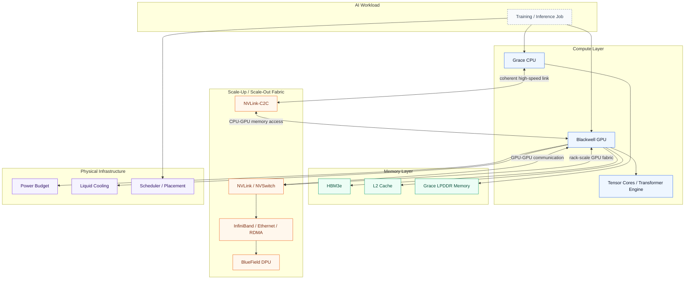

---

## Why Hardware Matters for AI Performance

AI workload에서 GPU가 비싼 이유는 단순히 GPU 자체가 비싸서가 아니다. GPU가 놀고 있으면 전체 시스템의 비용 효율이 급격히 떨어진다.

AI 시스템 성능 문제는 보통 다음 형태로 나타난다.

| 증상                                  | 가능한 병목                                                       |
| ----------------------------------- | ------------------------------------------------------------ |
| GPU utilization이 낮다                 | CPU dataloader, storage I/O, synchronization, scheduling     |
| GPU memory가 부족하다                    | model parameter, activation, optimizer state, KV cache       |
| GPU utilization은 높은데 throughput이 낮다 | memory-bound kernel, poor Tensor Core usage                  |
| scale-out하면 성능이 안 오른다               | NCCL collective, interconnect bandwidth, topology mismatch   |
| p95/p99 latency가 흔들린다               | batching, network congestion, CPU jitter, thermal throttling |
| 장시간 학습 중 성능이 떨어진다                   | power cap, cooling limit, GPU clock throttling               |

따라서 Chapter 2의 핵심은 다음이다.

> 하드웨어를 안다는 것은 GPU 이름을 외우는 것이 아니라, 병목이 어느 물리 계층에서 발생하는지 추적할 수 있다는 뜻이다.

---

## AI System Hardware Stack

AI 시스템 하드웨어는 대략 다음 계층으로 볼 수 있다.

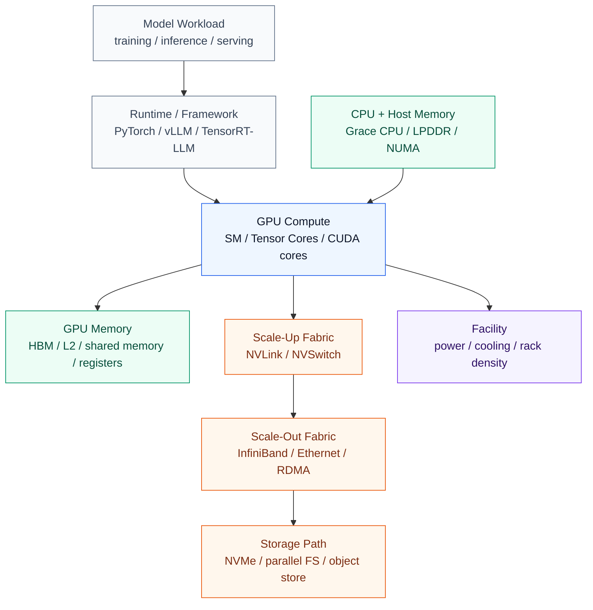

| Layer            | Main Role                                | Main Bottleneck                               |
| ---------------- | ---------------------------------------- | --------------------------------------------- |
| GPU Compute      | matrix multiplication, attention, decode | Tensor Core underutilization, low occupancy   |
| GPU Memory       | model weights, activations, KV cache     | HBM bandwidth, memory capacity                |
| CPU / Host       | dataloader, preprocessing, orchestration | CPU feeding, NUMA, memory copy                |
| Scale-up Fabric  | GPU-to-GPU within node/rack              | NVLink saturation, topology mismatch          |
| Scale-out Fabric | node-to-node / rack-to-rack              | RDMA bandwidth, congestion, NCCL latency      |
| Storage          | dataset, checkpoint, offload             | read throughput, random I/O, checkpoint delay |
| Facility         | sustained operation                      | power cap, thermal throttling                 |

---

## Grace Blackwell Superchip

Grace Blackwell Superchip은 하나의 Grace CPU와 두 개의 Blackwell GPU를 하나의 모듈처럼 결합한 구조다. 전통적인 CPU-GPU 서버에서는 CPU memory와 GPU HBM이 분리되어 있고, CPU와 GPU는 PCIe를 통해 통신한다. 이 구조에서는 CPU에서 GPU로 데이터를 복사하는 비용이 병목이 될 수 있다.

Grace Blackwell은 이 문제를 줄이기 위해 CPU와 GPU를 **NVLink-C2C**로 연결한다. 책에서는 NVLink-C2C가 GB200 Superchip에서 Grace CPU와 Blackwell GPU 사이에 약 900GB/s 수준의 대역폭을 제공하며, PCIe Gen5/Gen6보다 훨씬 높은 대역폭과 cache-coherent 특성을 제공한다고 설명한다.

공식 제품 아키텍처 이미지는 NVIDIA 문서의 [Topology of a Compute Node][nvidia-mn-topology] 그림을 참고하면 된다. 이 그림은 Grace CPU, 양쪽 Blackwell GPU, NVLink-C2C 연결, NIC/DPU 경로를 함께 보여준다.

![NVIDIA GB200 compute node topology][nvidia-mn-topology]

Source: NVIDIA, [GB200 NVL Multi-Node Tuning Guide: System][nvidia-system], [Topology of a Compute Node][nvidia-mn-topology].

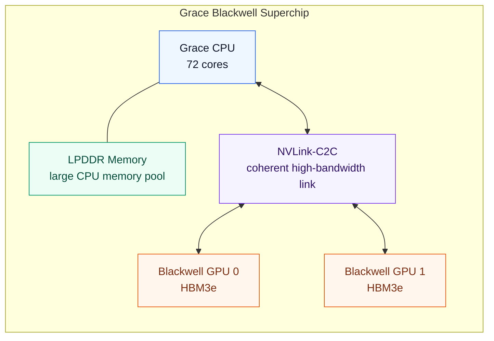

### Capacity and Bandwidth Lens

| Component              | Chapter 2 Point                                 | Performance Meaning                                  |
| ---------------------- | ----------------------------------------------- | ---------------------------------------------------- |
| Grace CPU              | ARM Neoverse V2 기반 CPU, 대용량 LPDDR5X 연결       | preprocessing, tokenization, control-heavy code 처리 |
| Grace LPDDR5X          | 약 480GB, 약 500GB/s급 CPU memory bandwidth       | HBM overflow와 CPU-side working set에 유리             |
| Blackwell GPU HBM3e    | GPU당 192GB raw, 약 180GB usable, 약 8TB/s급 대역폭 | hot tensor, activation, KV cache의 기본 위치           |
| NVLink-C2C             | CPU-GPU 사이 약 900GB/s coherent interconnect    | PCIe copy 병목 완화, unified address space 단순화       |
| Superchip memory model | CPU memory와 GPU memory를 하나의 address space로 노출 | correctness는 쉬워지지만 placement 최적화는 여전히 필요     |

### Performance Meaning

Grace Blackwell의 의미는 “CPU memory도 GPU가 접근할 수 있다”가 아니다. 더 정확히는 다음과 같다.

| 관점           | 의미                                                                                 |
| ------------ | ---------------------------------------------------------------------------------- |
| Correctness  | CPU와 GPU가 coherent memory model을 공유하므로 프로그래밍 복잡도가 줄어든다                             |
| Performance  | CPU memory 접근은 HBM보다 느리므로 hot data는 여전히 HBM에 있어야 한다                                |
| Capacity     | HBM에 다 못 올리는 data/model 일부를 CPU memory로 확장할 수 있다                                   |
| Optimization | `cudaMemPrefetchAsync`, staged transfer, caching allocator, offload strategy가 중요하다 |

즉, Grace memory는 HBM의 대체재가 아니라 **lower-tier memory**로 이해하는 것이 좋다.

---

## CPU-GPU Memory Model

AI workload에서 memory는 단일 계층이 아니다. 성능 관점에서는 다음처럼 계층화해서 봐야 한다.

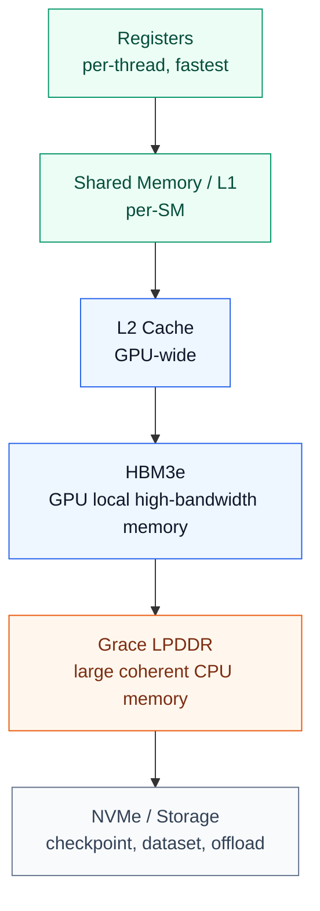

| Memory Tier        | Use Case                                | Bottleneck Risk                 |
| ------------------ | --------------------------------------- | ------------------------------- |
| Register           | per-thread temporary values             | register pressure               |
| Shared Memory / L1 | tile reuse, intra-block data sharing    | bank conflict, limited capacity |
| L2 Cache           | cross-SM reuse                          | low hit rate                    |
| HBM                | weights, activations, KV cache          | bandwidth, capacity             |
| Grace LPDDR        | offload, overflow, preprocessing buffer | higher latency than HBM         |
| NVMe / Storage     | dataset, checkpoint, cold offload       | I/O latency, throughput         |

### Practical Rule

> Hot path는 HBM/L2/shared memory에 두고, cold 또는 less frequently accessed data만 CPU memory나 storage로 밀어내야 한다.

LLM inference에서는 특히 KV cache가 hot data가 되기 쉽다. KV cache를 CPU memory나 remote storage로 offload할 수는 있지만, latency-sensitive decode phase에서는 잘못 설계하면 TTFT/TPOT가 바로 나빠진다.

---

## Blackwell GPU Architecture

Blackwell GPU는 dual-die 구조를 사용한다. 즉, 하나의 GPU처럼 보이지만 내부적으로는 두 개의 GPU die를 고속 interconnect로 연결한 구조다. 책에서는 Blackwell B200이 dual-die MCM 구조이며, 두 die가 하나의 GPU처럼 동작하도록 설계되어 있다고 설명한다.

공식 Blackwell GPU 아키텍처 참고 이미지는 NVIDIA Developer Blog의 [NVIDIA Blackwell Ultra GPU chip explained][nvidia-blackwell-ultra-chip] 그림을 보면 된다. B200 자체가 아니라 Blackwell Ultra 설명용 그림이지만, dual-reticle die, NV-HBI, HBM3E, NVLink-C2C, NVLink 5 같은 핵심 구조를 한 장에 보여주므로 Blackwell 계열 GPU 구조를 이해하는 데 유용하다.

![NVIDIA Blackwell Ultra GPU chip explained][nvidia-blackwell-ultra-chip]

Source: NVIDIA Developer Blog, [Inside NVIDIA Blackwell Ultra: The Chip Powering the AI Factory Era][nvidia-blackwell-ultra-blog], Figure 1.

아래 Mermaid는 공식 그림의 세부 회로도를 그대로 옮긴 것이 아니라, 성능 관점에서 기억해야 할 구조만 단순화한 개념도다. 핵심은 두 GPU die가 NV-HBI로 묶이고, 각 die가 HBM3e stack과 on-chip cache 계층을 통해 Tensor Core에 데이터를 공급한다는 점이다.

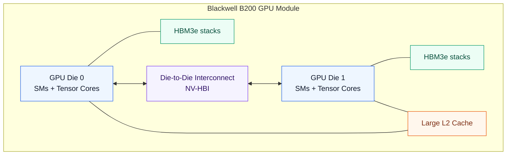

### Performance Meaning

| Feature        | Why It Matters                                         |
| -------------- | ------------------------------------------------------ |
| Dual-die MCM   | 더 큰 transistor budget과 compute capacity                |
| HBM3e          | model weight, activation, KV cache를 위한 대용량/고대역폭 memory |
| Large L2 Cache | HBM 접근을 줄이고 data reuse 증가                              |
| Tensor Cores   | matrix multiplication throughput 향상                    |
| FP8/FP4        | memory footprint 감소와 throughput 증가                     |
| NVLink 5       | GPU-to-GPU communication 병목 감소                         |

Blackwell의 핵심은 compute만 늘린 것이 아니라, **compute를 먹여 살릴 memory bandwidth와 interconnect도 같이 키웠다**는 점이다.

---

## Tensor Cores and Transformer Engine

Tensor Cores는 GPU 내부의 matrix multiplication 전용 가속기다. Transformer Engine은 transformer workload에서 FP8/FP4 같은 reduced precision을 활용해 throughput과 memory efficiency를 높이는 방향이다.

| Precision   | 장점                                          | Trade-off               |
| ----------- | ------------------------------------------- | ----------------------- |
| FP32        | 안정적, 정확도 높음                                 | 느림, memory 사용량 큼        |
| FP16 / BF16 | training에서 널리 사용                            | 일부 모델에서 numerical issue |
| FP8         | memory 절감, throughput 증가                    | calibration 필요          |
| FP4         | inference throughput과 memory efficiency 극대화 | accuracy 관리가 더 어려움      |

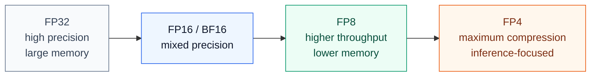

### Performance Lens

* Training에서는 BF16/FP16이 여전히 안정적인 기본 선택이다.
* FP8은 대규모 training/inference에서 좋은 throughput-memory trade-off를 제공한다.
* FP4는 특히 inference serving에서 model weight memory footprint와 bandwidth pressure를 크게 줄일 수 있다.
* 하지만 precision을 낮추면 항상 accuracy, calibration, fallback path를 같이 봐야 한다.

---

## GPU Execution Model

GPU는 CPU처럼 소수의 강한 core가 아니라, 많은 thread를 동시에 실행하는 구조다.

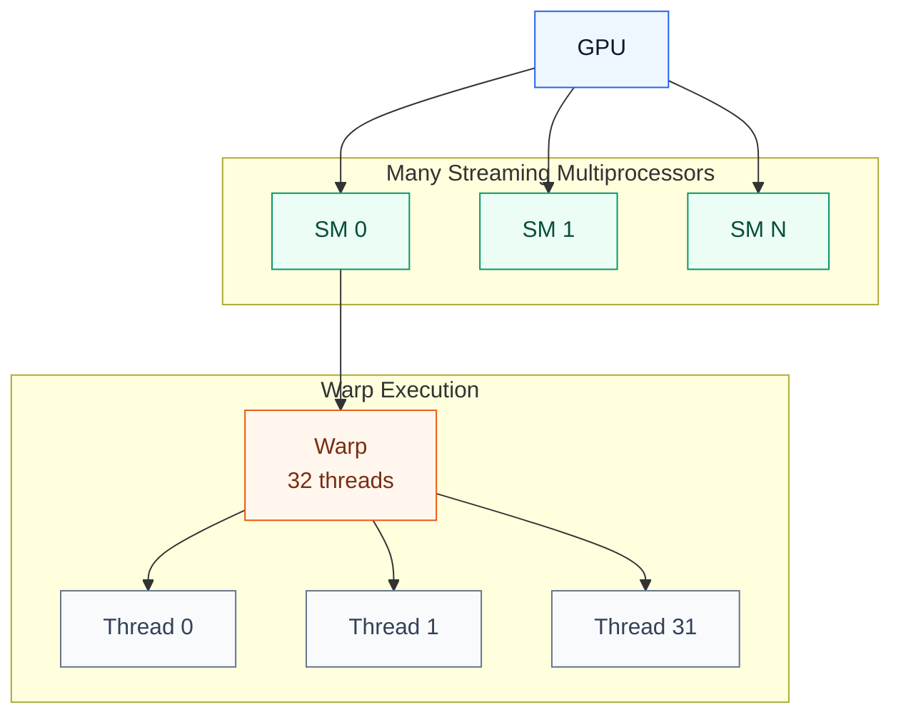

| Concept           | Meaning                               | Bottleneck Metric         |
| ----------------- | ------------------------------------- | ------------------------- |
| SM                | GPU의 실행 단위                            | SM utilization            |
| Warp              | 32 threads가 lockstep으로 실행             | warp execution efficiency |
| Occupancy         | SM 안에 활성화된 warp 비율                    | achieved occupancy        |
| Latency hiding    | 한 warp가 memory 대기 중이면 다른 warp 실행      | eligible warps per cycle  |
| Warp divergence   | 같은 warp 내부 thread들이 다른 branch 실행      | branch efficiency         |
| Register pressure | thread당 register 사용량이 많아 occupancy 감소 | registers per thread      |

### Practical Rule

> GPU 최적화는 “thread를 많이 띄우면 된다”가 아니라, memory latency를 숨길 만큼 충분한 warp를 유지하면서도 register/shared memory pressure를 관리하는 것이다.

---

## GPU Memory Hierarchy

책에서는 GPU 성능을 이해하려면 memory hierarchy를 반드시 봐야 한다고 설명한다. data가 HBM까지 내려가면 bandwidth는 높아도 latency가 커지고, 모든 operation이 HBM을 왕복하면 GPU가 stall될 수 있다. 따라서 reusable data를 shared memory, L1, L2에 최대한 머물게 하는 것이 중요하다.

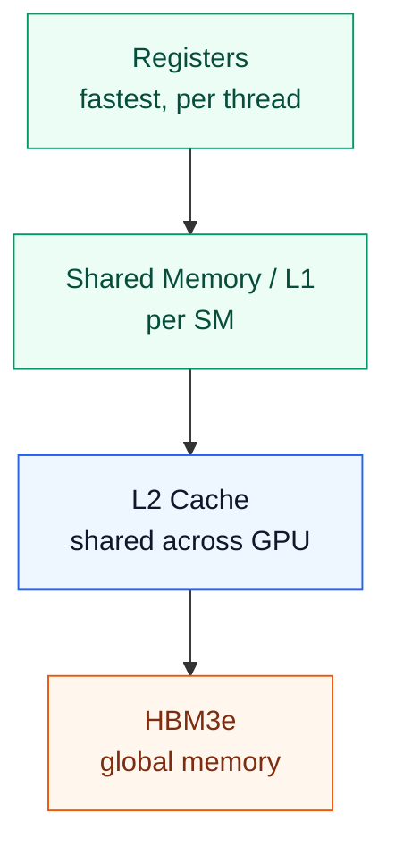

| Access Pattern                 | Good or Bad | Reason                     |
| ------------------------------ | ----------- | -------------------------- |
| coalesced global memory access | 좋음          | memory transaction 효율 높음   |
| uncoalesced access             | 나쁨          | 불필요한 memory transaction 증가 |
| high L2 hit rate               | 좋음          | HBM 왕복 감소                  |
| repeated HBM access            | 나쁨          | memory-bound 가능성 증가        |
| shared memory tiling           | 좋음          | data reuse 증가              |
| bank conflict                  | 나쁨          | shared memory access 병목    |

### Bottleneck Interpretation

| Nsight Metric                                      | 해석                                                  |
| -------------------------------------------------- | --------------------------------------------------- |
| High DRAM throughput + low SM utilization          | memory-bound 가능성                                    |
| Low DRAM throughput + low SM utilization           | launch overhead, dependency stall, occupancy 문제 가능성 |
| High SM utilization + high Tensor Core utilization | compute path가 잘 타는 상태                               |
| Low L2 hit rate                                    | data reuse 부족                                       |
| High warp stall memory dependency                  | memory access pattern 개선 필요                         |

---

## NVL72 Rack-Scale GPU System

NVL72는 72개의 Blackwell GPU와 36개의 Grace CPU를 하나의 rack-scale system으로 묶는 구조다. 책에서는 GB200/GB300 NVL72가 18개 compute node로 구성되고, 각 node가 2개의 Grace Blackwell Superchip, 즉 4개의 Blackwell GPU와 2개의 Grace CPU를 포함한다고 설명한다.

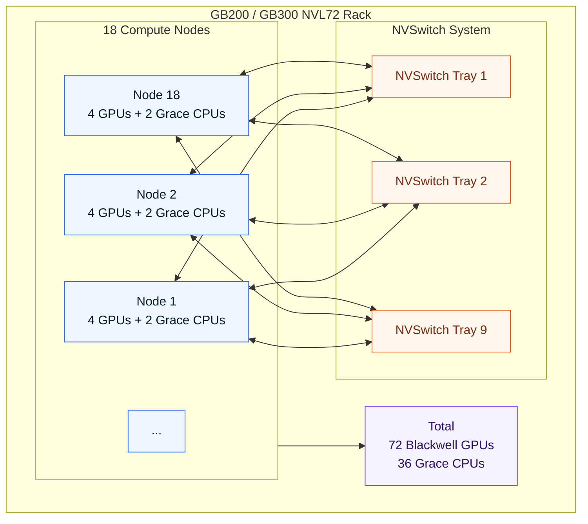


Source: [NVIDIA DGX GB Rack Scale Systems User Guide](https://docs.nvidia.com/dgx/dgxgb200-user-guide/hardware.html)

### Why NVL72 Matters

| Problem                           | NVL72 Design Answer                       |
| --------------------------------- | ----------------------------------------- |
| 모델이 단일 GPU에 안 들어감                 | 72 GPU memory pool과 parallelism 활용        |
| GPU 간 통신이 느림                      | NVLink/NVSwitch로 intra-rack bandwidth 극대화 |
| tensor/expert parallelism이 통신에 막힘 | 하나의 NVLink domain 안에 job을 배치              |
| inference TTFT/TPOT가 느림           | large model을 rack 안에서 빠르게 serve           |
| inter-rack network가 병목            | 가능한 한 intra-rack 안에 communication을 유지     |

---

## NVLink and NVSwitch

NVLink는 GPU 간 고속 point-to-point interconnect이고, NVSwitch는 여러 GPU를 all-to-all에 가깝게 연결하는 switch fabric이다.

책에서는 NVL72에서 각 Blackwell GPU가 18개의 NVLink 5 port를 가지고, GPU당 aggregate bidirectional bandwidth가 약 1.8TB/s이며, 72개 GPU가 NVSwitch를 통해 full bisection bandwidth에 가깝게 연결된다고 설명한다.

> [!NOTE]
> NVIDIA의 [DGX B200 System Topology][nvidia-dgx-b200-topology] 그림도 Blackwell 시스템을 이해하는 데 유용하다. 단, 이 그림은 Grace Blackwell Superchip 또는 GB200 NVL72가 아니라 **DGX B200 8-GPU 시스템**의 CPU/PCIe/NVSwitch/NIC 연결을 보여주는 자료다. 따라서 Grace CPU와 Blackwell GPU가 NVLink-C2C로 묶인 GB200 Superchip 구조를 설명할 때는 위의 GB200 NVL Multi-Node Tuning Guide 그림이 더 정확하다.

![NVIDIA DGX B200 system topology][nvidia-dgx-b200-topology]

Source: NVIDIA, [DGX B200 User Guide][nvidia-dgx-b200-guide], DGX B200 System Topology.

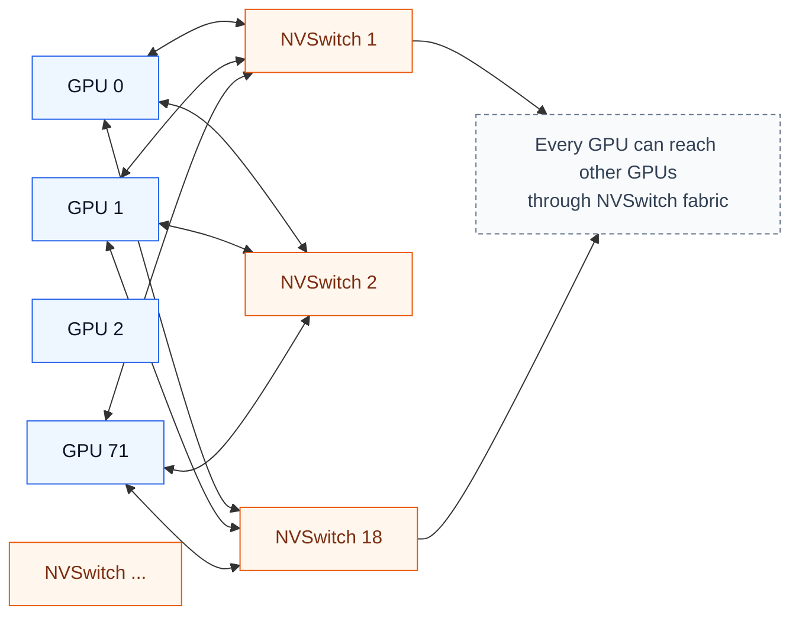

### Scale-Up vs Scale-Out

| 구분           | Fabric                       | 범위                          | 성능 특성                                      |
| ------------ | ---------------------------- | --------------------------- | ------------------------------------------ |
| Scale-up     | NVLink / NVSwitch            | same node / same rack       | low latency, high bandwidth                |
| Scale-out    | InfiniBand / Ethernet        | node-to-node / rack-to-rack | RDMA 필요, congestion 관리 필요                  |
| Scale-across | multi-cluster / multi-region | DC 간                        | 일반적으로 training에는 부적합, inference routing 가능 |

### Practical Rule

> Communication-heavy workload는 가능한 한 NVLink/NVSwitch domain 안에 배치해야 한다.

예를 들어 tensor parallel 8-way 또는 expert parallel workload를 Kubernetes에서 아무 GPU 8개에 흩뿌리면 안 된다. 같은 NVSwitch domain, 가능하면 같은 node/rack 안에 넣어야 한다.

---

## Multi-GPU Communication

대규모 training과 inference에서는 GPU 간 통신이 자주 발생한다.

| Parallelism                  | Communication Pattern        | Bottleneck                         |
| ---------------------------- | ---------------------------- | ---------------------------------- |
| Data Parallelism             | all-reduce gradients         | NCCL bandwidth, latency            |
| Tensor Parallelism           | all-reduce / all-gather      | GPU-to-GPU latency                 |
| Pipeline Parallelism         | activation transfer          | stage imbalance, bubble            |
| Expert Parallelism           | all-to-all                   | network congestion, load imbalance |
| Context Parallelism          | sequence split communication | KV/cache transfer                  |
| Disaggregated Prefill/Decode | KV cache movement            | RDMA/NIXL/NVLink path              |

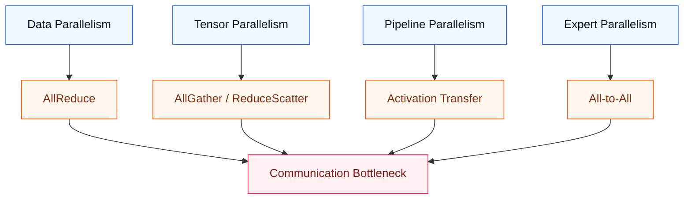

NVL72의 장점은 이런 communication-heavy pattern을 rack 내부의 NVLink/NVSwitch fabric 안에서 처리할 수 있다는 점이다. 책에서는 NVL72 내부 통신은 traditional InfiniBand/Ethernet cluster보다 collective overhead를 훨씬 낮출 수 있으며, 가능한 한 workload communication을 intra-rack에 유지해야 한다고 설명한다.

---

## SHARP and In-Network Reduction

SHARP는 collective operation 일부를 network hardware에서 처리하는 기술이다. 특히 all-reduce처럼 여러 GPU의 값을 합치거나 평균내는 작업에서 유용하다.

책에서는 NVSwitch ASIC 안의 SHARP engine이 reduction을 offload하여 GPU가 직접 모든 aggregation을 처리하지 않도록 하며, collective latency와 network traffic volume을 줄일 수 있다고 설명한다.

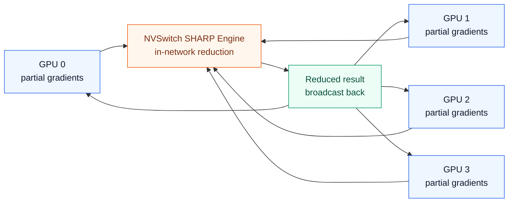

### Why SHARP Matters

| Without SHARP                                   | With SHARP              |
| ----------------------------------------------- | ----------------------- |
| GPU가 reduction computation과 communication 모두 처리 | switch가 일부 reduction 처리 |
| network traffic 증가                              | traffic volume 감소       |
| collective latency 증가                           | collective latency 감소   |
| GPU compute resource 일부 소모                      | GPU는 model compute에 집중  |

### Practical Impact

SHARP는 특히 다음 상황에서 중요하다.

* gradient all-reduce가 iteration time의 큰 비중을 차지할 때
* GPU 수가 증가하면서 scaling efficiency가 떨어질 때
* MoE, tensor parallel, data parallel이 섞인 hybrid parallel workload
* inter-rack collective까지 확장되는 대규모 training

---

## Multirack and Storage Communication

NVL72 rack 내부는 NVLink/NVSwitch가 담당하지만, rack 밖으로 나가면 InfiniBand 또는 Ethernet fabric이 필요하다.

책에서는 NVL72 compute node가 고속 NIC와 DPU를 사용하고, BlueField-3 DPU가 RDMA, TCP/IP, NVMe-oF, storage/security/control-plane offload를 처리한다고 설명한다. DPU는 CPU 개입 없이 NIC와 GPU memory 사이 data movement를 돕기 때문에 storage streaming이나 RDMA path에서 중요하다.

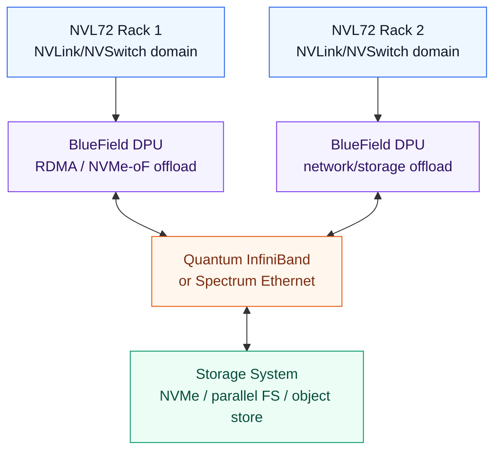

### Practical Rule

> NVLink는 rack 내부 GPU fabric이고, InfiniBand/Ethernet은 rack 밖으로 나가는 scale-out fabric이다.

따라서 병목 진단도 구분해야 한다.

| Traffic                | Path                       | Tool                                      |
| ---------------------- | -------------------------- | ----------------------------------------- |
| GPU0 → GPU1 same node  | NVLink / NVSwitch          | `nvidia-smi topo -m`, DCGM                |
| GPU in same NVL72 rack | NVSwitch                   | DCGM NVLink counters, Nsight Systems      |
| GPU across racks       | InfiniBand / Ethernet RDMA | NCCL tests, ib_write_bw, switch telemetry |
| GPU ↔ Storage          | DPU / NIC / GDS / NVMe-oF  | gdsio, iostat, DPU/NIC counters           |

---

## Preintegrated Rack Appliance

Chapter 2는 NVL72를 단순한 부품 묶음이 아니라 **preintegrated rack appliance**로 설명한다. 즉, 18개 compute tray, 9개 NVSwitch tray, 내부 NVLink cabling, power distribution, liquid cooling, cluster management software가 하나의 검증된 rack 단위로 제공된다.

이 관점은 성능 엔지니어에게 중요하다. NVLink fabric을 운영자가 직접 72 GPU 규모로 배선하고 검증하는 방식이 아니라, rack 내부 topology는 이미 설계된 하나의 accelerator domain으로 취급한다. 따라서 운영자는 rack 내부를 바꾸기보다, 외부 InfiniBand/Ethernet 연결, storage path, scheduler placement, monitoring policy를 정확히 맞추는 쪽에 집중해야 한다.

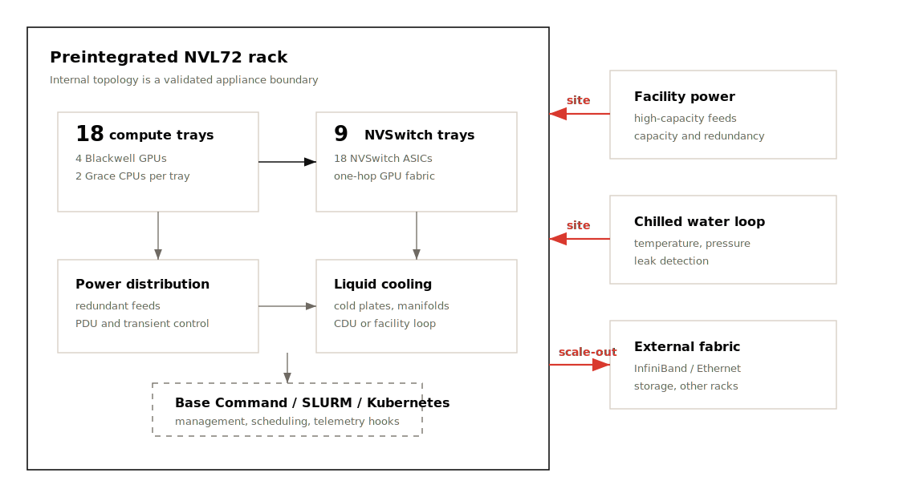

| Area                    | Rack Appliance Meaning                                  | Validation Point                         |
| ----------------------- | ------------------------------------------------------- | ---------------------------------------- |
| Internal NVLink fabric  | 72 GPU가 NVSwitch로 사전 연결됨                              | GPU 간 expected topology 확인               |
| NVSwitch system         | 9 switch trays / 18 NVSwitch ASICs가 fabric 구성             | NVLink counter와 collective baseline 확인    |
| Power distribution      | rack 단위 고전력 공급 설계                                     | redundant feed, PDU, transient 대응 확인    |
| Liquid cooling          | cold plate, manifold, CDU/facility loop 연결                | coolant temperature, pressure, leak 감시  |
| Cluster management      | Base Command Manager, SLURM, Kubernetes와 결합 가능          | job placement와 resource accounting 확인   |
| External network/storage | rack 밖은 ConnectX/BlueField와 InfiniBand/Ethernet fabric 사용 | NIC affinity, RDMA, GDS path 확인          |

### Practical Rule

> NVL72는 “GPU 72개가 들어 있는 서버 묶음”이 아니라, rack 내부가 이미 하나의 topology-aware compute fabric으로 설계된 운영 단위다.

그래서 troubleshooting도 다음 순서가 자연스럽다.

1. rack 내부 NVLink/NVSwitch fabric이 정상인지 확인한다.
2. rack 밖으로 나가는 NIC/DPU/RDMA path를 분리해 본다.
3. scheduler가 job을 rack 내부 domain에 맞게 배치했는지 확인한다.
4. power/cooling telemetry가 sustained performance를 막고 있지 않은지 확인한다.

---

## Co-Packaged Optics

Chapter 2는 rack-scale 이후의 병목으로 inter-rack network를 지목하고, 이를 완화하기 위한 방향으로 **Co-Packaged Optics(CPO)**를 소개한다. CPO는 optical transmitter를 switch silicon 가까이에 통합해 전기 신호 경로를 줄이고, 더 높은 대역폭과 낮은 전력 소모를 목표로 하는 networking hardware 방향이다.

NVL72 내부에서는 NVLink/NVSwitch가 매우 높은 bandwidth와 낮은 latency를 제공하지만, 여러 rack을 묶는 순간 InfiniBand/Ethernet fabric이 다시 병목 후보가 된다. 800Gb/s, 1.6Tb/s급 fabric으로 갈수록 optics의 전력과 신호 무결성이 중요해지고, CPO는 이 부분을 개선하는 기술로 이해하면 된다.

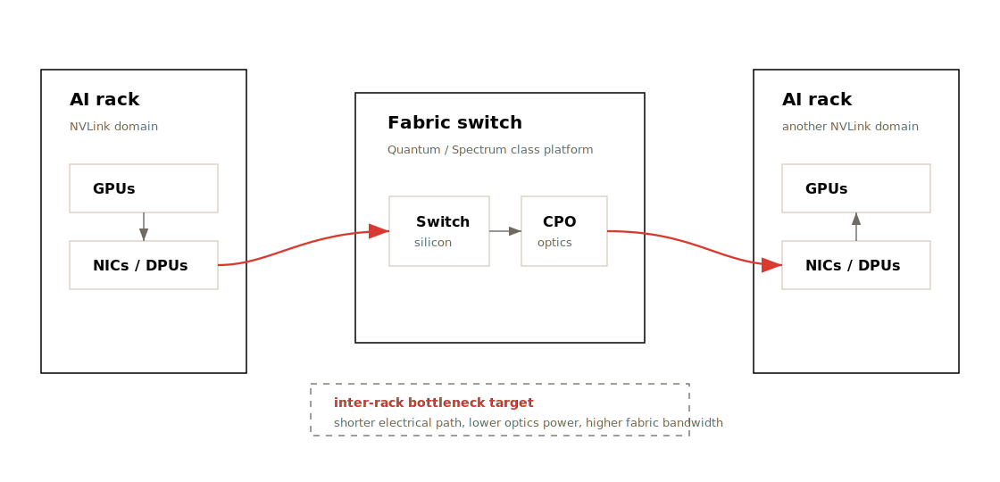

| Problem                         | Why CPO Matters                                |
| ------------------------------- | ---------------------------------------------- |
| inter-rack bandwidth pressure   | rack 밖 collective와 storage traffic 증가           |
| optics power draw               | pluggable optics가 대규모 fabric 전력의 큰 비중 차지 가능 |
| signal integrity                | 고속 전기 경로가 길수록 손실과 설계 난이도 증가              |
| AI factory scale                | 수백~수천 rack을 연결하려면 network efficiency가 핵심    |

### Performance Meaning

> CPO는 당장 kernel을 빠르게 만드는 기능이 아니라, AI factory 규모에서 inter-rack fabric이 GPU scaling을 따라가게 만드는 hardware roadmap이다.

현재 병목 진단에서는 NVLink/NVSwitch와 InfiniBand/Ethernet telemetry를 분리해서 보고, 장기 설계에서는 optics power와 fabric bandwidth까지 capacity planning에 포함해야 한다.

---

## Power and Cooling

고성능 GPU rack에서는 power와 cooling도 성능 병목이다. 책에서는 NVL72 rack이 약 120~132kW 수준의 전력을 소비할 수 있으며, 이런 밀도에서는 liquid cooling이 사실상 필수라고 설명한다.

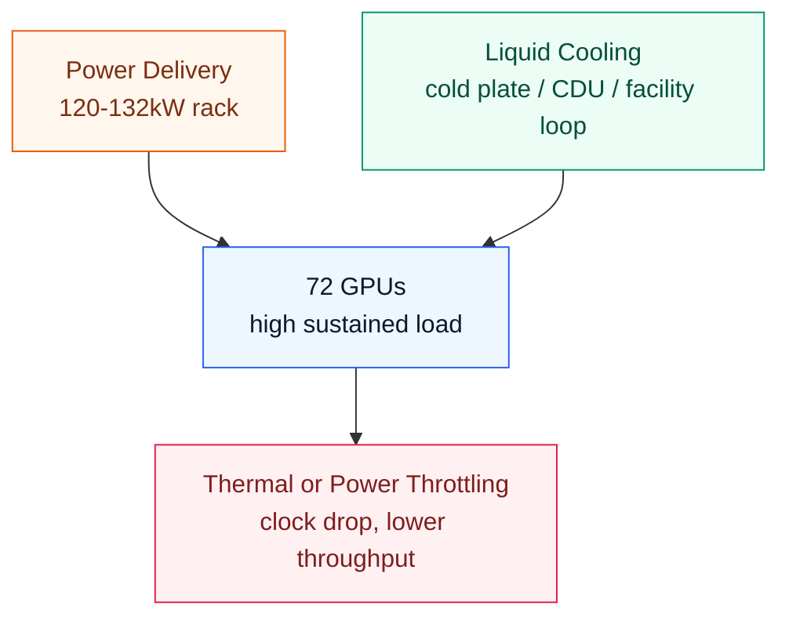

### Performance Meaning

| Metric                    | Meaning                       |
| ------------------------- | ----------------------------- |
| `power.draw`              | 실제 GPU power 사용량              |
| `clocks.sm`               | SM clock이 유지되는지               |
| `temperature.gpu`         | thermal headroom              |
| `clocks_throttle_reasons` | power/thermal/software cap 여부 |
| GPU utilization variance  | thermal/power jitter 가능성      |

### Operational Risk

* cooling capacity가 부족하면 GPU clock이 떨어진다.
* power cap이 낮으면 theoretical FLOPS를 못 쓴다.
* rack density가 높으면 facility 설계가 성능 설계가 된다.
* 장시간 training에서는 순간 성능보다 sustained performance가 중요하다.
* rack 무게와 floor loading, coolant pressure/leak sensor, quick-disconnect 같은 물리 운영 요소도 deployment risk에 포함된다.
* GPU가 idle에서 full load로 급격히 올라갈 때 power transient가 발생할 수 있으므로 PDU와 feed redundancy를 함께 봐야 한다.

---

## Performance Monitoring

NVL72 같은 시스템은 hardware potential이 매우 크지만, 그만큼 monitoring 없이 운영하면 낭비도 크다.

책에서는 DCGM으로 GPU utilization, memory usage, temperature, NVLink throughput 등을 추적하고, GPU가 50% utilization에 머무르면 dataloader나 synchronization issue 같은 원인을 찾아야 한다고 설명한다. 또한 NVLink usage를 보면 communication bottleneck 여부를 파악할 수 있다.

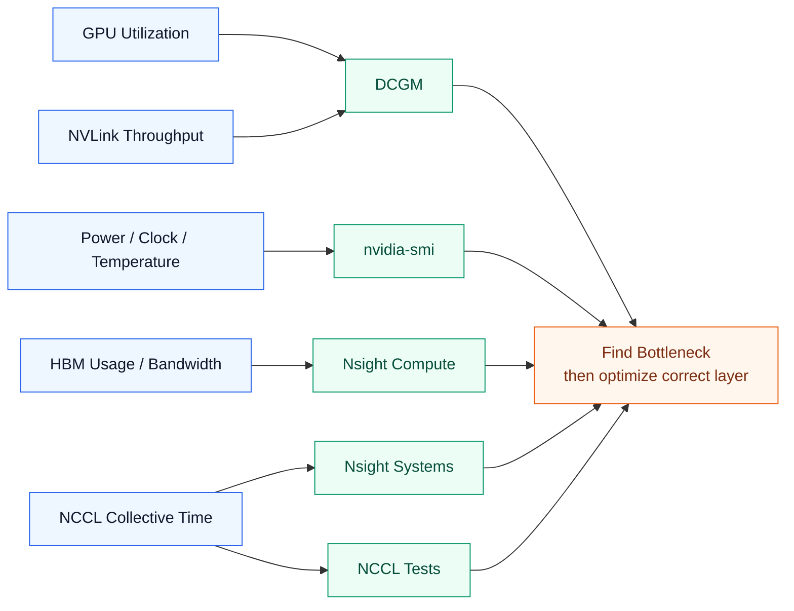

### Basic Commands

```bash
nvidia-smi topo -m
nvidia-smi nvlink --status
nvidia-smi dmon -s pucvmt
dcgmi dmon
```

```bash
# NCCL all-reduce benchmark
./build/all_reduce_perf -b 8 -e 4G -f 2 -g 8
```

```bash
# Nsight Systems
nsys profile -t cuda,nvtx,osrt,cudnn,cublas python train.py
```

```bash
# Nsight Compute
ncu --set full python kernel_workload.py
```

---

## Sharing and Scheduling

Chapter 2는 NVL72 같은 고가 rack-scale system에서 **모든 job이 항상 72 GPU 전체를 쓰지는 않는다**는 점을 강조한다. 따라서 성능 문제는 hardware 성능만이 아니라, scheduler가 GPU subset을 어떻게 나누고 어떤 topology에 배치하는지에 크게 좌우된다.

SLURM이나 Kubernetes는 8 GPU, 16 GPU, 48 GPU처럼 rack 내부 GPU를 여러 job에 나누어 할당할 수 있다. 이때 단순히 “빈 GPU 수”만 보고 배치하면 tensor parallel group이 나쁜 경로에 놓이거나, NIC affinity가 깨지거나, 한 job이 다른 job의 NVLink/NIC path를 방해할 수 있다.

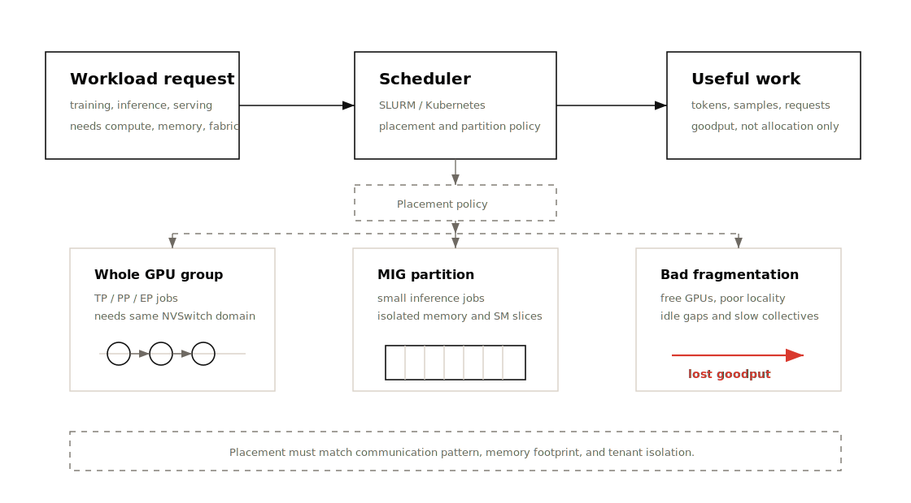

### MIG and Multitenancy

MIG(Multi-Instance GPU)는 하나의 물리 GPU를 hardware-level partition으로 나누는 기능이다. Chapter 2에서는 Blackwell GPU가 최대 7개의 isolated MIG instance를 지원할 수 있다고 설명한다. 각 instance는 고정된 GPU memory와 SM slice를 가지므로, 작은 inference workload를 한 GPU에 여러 개 올릴 때 유용하다.

| Sharing Mode               | Good Fit                                  | Risk                                      |
| -------------------------- | ----------------------------------------- | ----------------------------------------- |
| Whole GPU allocation       | training, large inference, tensor parallel | idle GPU fragment가 생길 수 있음               |
| Multi-GPU gang scheduling  | TP/PP/EP workload                         | topology-aware placement가 없으면 collective 병목 |
| MIG partition              | small model serving, batch inference       | large model 또는 NCCL-heavy job에는 부적합 가능   |
| DPU-backed multitenancy    | shared rack, secure tenant isolation       | DPU/NIC policy와 observability 필요           |
| Chargeback / GPU-hour model | 조직 내부 사용량 관리                            | utilization만 보고 goodput을 놓칠 수 있음         |

### Practical Rule

> Scheduler의 목표는 GPU를 “채우는 것”이 아니라, workload의 communication pattern과 memory footprint에 맞는 topology를 할당하는 것이다.

운영 관점에서는 다음을 함께 추적해야 한다.

* allocated GPU hours와 실제 useful work의 차이
* job별 GPU utilization과 NVLink/NIC utilization
* MIG 사용 시 memory/SM partition이 workload 요구량과 맞는지
* multi-tenant 환경에서 DPU/network isolation이 제대로 적용되는지
* preemption, fragmentation, queueing이 goodput을 얼마나 줄이는지

---

## ROI of Hardware Upgrade

Chapter 2는 최신 GPU 도입 여부를 단순한 구매 비용이 아니라 **performance per dollar**, **performance per watt**, **operational simplicity** 관점에서 평가해야 한다고 설명한다.

예를 들어 Blackwell GPU가 Hopper 대비 workload 처리량을 2배 이상 낼 수 있다면, 동일한 throughput을 위해 필요한 GPU 수가 줄어들 수 있다. GPU 수가 줄면 server 수, CPU/RAM, NIC, switch port, rack 수, 전력, 냉각, 운영 복잡도도 함께 줄어든다. 반대로 workload가 충분하지 않아 장비가 idle이면 multimillion-dollar asset과 수만 달러 단위의 월 전력 비용이 낭비된다.

| ROI Factor              | Why It Matters                              |
| ----------------------- | ------------------------------------------- |
| Throughput per GPU      | 같은 job을 더 적은 GPU로 처리 가능                  |
| Memory per GPU          | model partition/offload 복잡도 감소              |
| Performance per watt    | 장시간 training/inference의 OPEX 절감             |
| Rack consolidation      | 여러 구형 rack을 하나의 NVL72급 rack으로 대체 가능      |
| Network simplification  | inter-node split 감소, intra-rack fabric 활용 증가 |
| Engineering simplicity  | model sharding, checkpoint, routing 복잡도 완화    |
| Utilization discipline  | idle GPU가 많으면 ROI가 급격히 악화                  |

### Upgrade Decision Questions

```text
현재 workload가 GPU-bound인가, memory-bound인가, communication-bound인가?
→ 새 GPU가 실제 병목을 줄이는가?

HBM capacity 증가가 model partition/offload를 줄이는가?
→ software complexity와 latency가 함께 줄어드는가?

새 rack이 전력/냉각/floor loading 요구사항을 만족하는가?
→ facility upgrade 비용이 ROI에 반영됐는가?

장비를 24/7에 가깝게 채울 workload가 있는가?
→ utilization과 goodput이 구매 비용을 정당화하는가?
```

---

## Hardware Bottleneck Lens

| Bottleneck               | Symptom                             | Metric                                  | Tool                          | Fix Direction                                |
| ------------------------ | ----------------------------------- | --------------------------------------- | ----------------------------- | -------------------------------------------- |
| Compute-bound            | SM/Tensor Core는 바쁘고 memory stall 낮음 | achieved FLOPS, Tensor Core utilization | Nsight Compute                | mixed precision, kernel fusion               |
| Memory-bound             | HBM bandwidth 높고 SM stall 많음        | DRAM throughput, L2 hit rate            | Nsight Compute                | tiling, cache reuse, FlashAttention          |
| CPU feeding bottleneck   | GPU idle gap이 반복됨                   | CPU util, dataloader time               | PyTorch Profiler, perf        | DataLoader tuning, NUMA pinning              |
| GPU-GPU communication    | iteration 중 collective time 큼       | NCCL time, NVLink BW                    | Nsight Systems, NCCL tests    | topology-aware placement, overlap            |
| Inter-rack bottleneck    | scale-out 시 throughput 저하           | RDMA BW, retransmit, congestion         | ib_write_bw, switch telemetry | rail-aware design, SHARP, congestion control |
| Storage bottleneck       | batch 준비 지연, checkpoint 느림          | read BW, iowait, dataloader wait        | iostat, gdsio                 | local cache, GDS, prefetch                   |
| Thermal/power bottleneck | 시간이 지나며 clock 하락                    | throttle reason, power, temp            | nvidia-smi, DCGM              | cooling, power cap, workload shaping         |
| Scheduler fragmentation  | GPU는 할당됐지만 통신 path 나쁨               | job placement, topology                 | Kubernetes, SLURM             | topology-aware scheduling                    |

---

## Operational Validation Checklist

### 1. GPU Topology

```bash
nvidia-smi topo -m
```

확인할 것:

* GPU 간 NVLink 연결 여부
* GPU와 NIC의 affinity
* GPU와 CPU NUMA node 관계
* NVSwitch domain 내부/외부 구분

---

### 2. NVLink / NVSwitch Utilization

```bash
nvidia-smi nvlink --status
dcgmi dmon
```

확인할 것:

* NVLink link가 활성화되어 있는가?
* 특정 link만 과도하게 사용되는가?
* communication-heavy workload에서 NVLink bandwidth가 올라가는가?

---

### 3. NCCL Baseline

```bash
./build/all_reduce_perf -b 8 -e 4G -f 2 -g 8
```

확인할 것:

* intra-node bandwidth
* inter-node bandwidth
* GPU 수 증가에 따른 scaling efficiency
* 특정 GPU pair 또는 NIC path에서 성능이 낮은지

---

### 4. GPU Memory Behavior

```bash
nvidia-smi --query-gpu=memory.used,memory.total,utilization.gpu,utilization.memory --format=csv -l 1
```

확인할 것:

* HBM 사용량
* memory utilization
* OOM 직전 fragmentation 가능성
* KV cache pressure

---

### 5. Power / Thermal

```bash
nvidia-smi --query-gpu=power.draw,clocks.sm,temperature.gpu,clocks_throttle_reasons.active --format=csv -l 1
```

확인할 것:

* clock이 유지되는가?
* power cap에 걸리는가?
* thermal throttling이 발생하는가?
* 장시간 workload에서 성능이 떨어지는가?

---

### 6. Scheduler Placement

Kubernetes / SLURM에서 확인할 것:

* 같은 job의 GPU들이 같은 node/rack/NVSwitch domain에 있는가?
* tensor parallel group이 물리 topology와 맞는가?
* NIC affinity가 깨지지 않았는가?
* MIG 사용 시 memory/SM isolation이 workload에 맞는가?
* multi-tenant job이 NVLink/NIC/storage path를 서로 방해하지 않는가?
* chargeback이나 quota가 utilization뿐 아니라 goodput도 보게 만드는가?

---

## Practical Tips and Notes

이 섹션은 Chapter 2 본문에 직접 나오는 내용이라기보다, 같은 하드웨어 주제를 실제 운영/설계에 적용할 때 자주 도움이 되는 실전 메모다.

### Utilization Is Not Goodput

GPU utilization만 보고 “GPU가 바쁘다”고 판단하지 않는다. 최소한 `utilization.gpu`, `utilization.memory`, HBM bandwidth, NVLink/NIC throughput, power/clock/throttle reason을 같이 봐야 한다. GPU utilization이 높아도 Tensor Core를 못 쓰거나 memory stall이 많으면 goodput은 낮을 수 있다.

### Keep Baselines Before Incidents

NCCL benchmark는 장애가 난 뒤에 처음 돌리는 도구가 아니라, 장비 인수 시점에 baseline으로 남겨야 한다. 같은 node, 같은 rack, rack 간, storage path별 baseline을 저장해 두면 나중에 “느려졌다”를 감이 아니라 수치로 말할 수 있다.

> [!TIP]
> 장비 인수 직후 `nvidia-smi topo -m`, NCCL all-reduce, storage read, power/thermal steady-state 결과를 같은 포맷으로 저장해 둔다. 나중에 firmware, driver, cable, switch, scheduler 변경의 영향을 비교하기 쉽다.

### Topology-Aware Scheduling

NVLink/NVSwitch domain과 Kubernetes GPU resource는 같은 개념이 아니다. Kubernetes가 `nvidia.com/gpu: 8`을 할당했다고 해서 그 8개 GPU가 같은 NVSwitch domain, 같은 NUMA locality, 같은 NIC affinity를 가진다는 뜻은 아니다. tensor parallel이나 expert parallel job은 반드시 topology-aware placement가 필요하다.

> [!WARNING]
> communication-heavy job을 “빈 GPU 수”만 보고 배치하면 GPU는 충분히 할당됐는데 NCCL collective가 느린 경로를 타는 상황이 생긴다. TP/EP group은 가능한 한 같은 NVSwitch domain 안에 묶어야 한다.

### Memory Capacity Planning

inference에서는 HBM capacity를 model weight만으로 계산하지 않는다. KV cache, activation workspace, CUDA graph capture buffer, framework allocator reserve, fragmentation headroom까지 포함해야 한다. 특히 long context serving에서는 KV cache가 모델 weight보다 먼저 병목이 될 수 있다.

Unified memory 또는 Grace LPDDR 접근이 가능하다는 것은 “느린 memory를 공짜로 HBM처럼 쓸 수 있다”는 뜻이 아니다. CPU memory offload는 OOM을 피하게 해주지만, hot tensor가 LPDDR/NVLink-C2C 경로를 자주 타면 latency와 throughput이 바로 나빠진다.

> [!WARNING]
> CPU memory offload를 켠 뒤 OOM이 사라졌다고 해서 성능 문제가 해결된 것은 아니다. TTFT/TPOT, HBM hit behavior, PCIe/NVLink-C2C traffic을 같이 봐야 한다.

### Power, Cooling, and Efficiency

power cap을 무조건 최대로 두는 것이 항상 최적은 아니다. serving workload에서는 약간 낮은 power limit이 tokens/Watt를 개선하면서 SLO를 만족할 때가 있다. 반대로 training에서는 낮은 power cap이 iteration time을 늘려 전체 에너지 사용량을 오히려 키울 수도 있으므로 workload별로 측정해야 한다.

장시간 workload에서는 순간 peak보다 sustained clock이 더 중요하다. 같은 benchmark도 2분짜리 run과 6시간짜리 run의 결과가 다를 수 있다.

### MIG and Multitenancy

MIG는 “GPU를 더 잘게 나누면 항상 효율이 오른다”는 기능이 아니다. 작은 inference tenant를 격리하는 데는 좋지만, NCCL collective, large model serving, 큰 KV cache, topology-sensitive workload에는 whole GPU allocation이 더 단순하고 빠를 수 있다.

### Storage and Checkpoint Behavior

storage 성능은 평균 read bandwidth보다 tail latency와 checkpoint behavior를 더 자주 본다. training job은 dataloader가 한 번씩 막히는 것만으로도 GPU idle gap이 생기고, 대규모 checkpoint는 network/storage burst로 다른 job까지 흔들 수 있다.

### Reproducibility and Failure Policy

“같은 GPU 모델”이어도 서버 SKU, cooling policy, power limit, firmware, driver, CUDA/NCCL 버전, PCIe/NIC 배치가 다르면 성능이 달라진다. benchmark 결과를 공유할 때는 GPU 이름만 적지 말고 system topology와 software stack 버전을 같이 적어야 재현 가능하다.

rack-scale system에서는 장애 대응 절차도 성능 설계의 일부다. 한 GPU, 한 NIC, 한 NVLink path, 한 storage mount 문제가 전체 job restart로 이어지면 goodput 손실이 크다. health check, drain policy, checkpoint interval, retry policy를 성능 목표와 함께 설계한다.

### Quick Field Heuristics

| Situation                         | First Question                              | Fast Check                                      |
| --------------------------------- | ------------------------------------------- | ----------------------------------------------- |
| GPU가 주기적으로 idle 상태가 됨          | input pipeline 또는 collective에서 기다리는가?       | Nsight Systems timeline, dataloader time        |
| GPU memory가 남는데 throughput이 낮음   | Tensor Core path를 실제로 타는가?                 | Nsight Compute, dtype, kernel name              |
| GPU memory가 거의 가득 참              | KV cache와 allocator reserve를 포함했는가?        | framework memory summary, `nvidia-smi` trend    |
| multi-GPU scaling이 기대보다 낮음       | GPU들이 같은 fast fabric 안에 있는가?              | `nvidia-smi topo -m`, NCCL all-reduce baseline  |
| rack 간 확장 후 성능이 흔들림             | RDMA fabric congestion이나 rail imbalance인가? | switch telemetry, NIC counters, NCCL tests      |
| 장시간 실행 후 점점 느려짐                 | thermal/power throttle인가?                   | clock, power, temperature, throttle reason      |
| small model serving 비용이 높음        | whole GPU가 과할 정도로 큰가?                    | MIG 가능성, batching, request concurrency       |
| 새 GPU 구매를 검토 중                  | 현재 병목이 새 GPU로 줄어드는 종류인가?               | bottleneck profile, perf/Watt, topology impact  |

---

## Hardware Roadmap

Chapter 2의 마지막 부분은 NVIDIA hardware roadmap을 통해 성능 엔지니어가 어떤 방향을 준비해야 하는지 설명한다. 숫자는 제품 세대와 공개 정보에 따라 달라질 수 있지만, 큰 흐름은 명확하다.

> 매 세대마다 compute, memory capacity, memory bandwidth, interconnect bandwidth, rack density 중 적어도 하나가 크게 증가한다.

| Generation             | Rough Direction                          | Performance Engineering Meaning                 |
| ---------------------- | ---------------------------------------- | ----------------------------------------------- |
| Blackwell Ultra / GB300 | B200 대비 더 큰 HBM, 더 높은 AI compute, FP4 강화 | inference throughput, KV cache headroom 증가       |
| Vera Rubin / VR200     | Grace 후속 Vera CPU + Rubin GPU, NVLink 6 방향 | CPU-GPU/Rack fabric bandwidth가 다시 커짐           |
| Rubin Ultra            | 더 많은 die와 더 큰 HBM pool 가능성              | 단일 rack memory/compute density 증가             |
| Feynman                | HBM5, 더 미세한 공정, inference efficiency 강화 방향 | reasoning-heavy inference workload 대비 필요       |
| Co-Packaged Optics     | switch silicon 가까이에 optics 통합             | inter-rack fabric의 bandwidth/Watt 개선            |

### What to Prepare

* model parallelism strategy는 GPU 수보다 **memory capacity와 fabric topology**에 더 민감해진다.
* inference에서는 FP4/NVFP4, KV cache layout, batching/routing이 hardware upgrade 효과를 좌우한다.
* rack power가 130kW를 넘어 더 커질 수 있으므로 facility capacity planning이 조기 설계 항목이 된다.
* inter-rack fabric이 병목이 되면 CPO, SHARP, RDMA, congestion control이 software tuning만큼 중요해진다.
* hardware가 빨라져도 goodput은 scheduler, reliability, data path, monitoring이 함께 맞아야 오른다.

---

## Chapter Summary

Chapter 2의 핵심은 다음이다.

> 현대 AI 하드웨어는 GPU 하나의 성능 경쟁이 아니라, rack-scale system 전체를 하나의 accelerator처럼 동작시키는 방향으로 진화하고 있다.

Grace Blackwell Superchip은 CPU-GPU 간 data movement 병목을 줄이고, Blackwell GPU는 HBM3e, L2 cache, Tensor Cores, Transformer Engine, FP8/FP4로 transformer workload에 맞게 최적화되어 있다. NVL72는 72개 GPU를 NVLink/NVSwitch fabric 안에 묶어 tensor parallelism, pipeline parallelism, expert parallelism 같은 communication-heavy workload의 병목을 줄인다.

Chapter 2에서 추가로 중요한 점은 이 하드웨어가 **rack appliance, facility system, scheduler target, financial asset**이라는 사실이다. NVL72는 내부 fabric이 사전 통합된 rack 단위로 배치되고, rack 밖은 ConnectX/BlueField, InfiniBand/Ethernet, storage fabric으로 확장된다. 성능을 유지하려면 DCGM/Nsight/NCCL telemetry뿐 아니라 power feed, liquid cooling, coolant sensor, MIG partition, GPU-hour accounting, hardware ROI까지 운영 지표에 포함해야 한다.

하지만 이 모든 하드웨어는 자동으로 성능을 보장하지 않는다. 성능 엔지니어는 다음 질문을 계속 던져야 한다.

```text
GPU가 놀고 있는가?
→ CPU/dataloader/storage가 못 먹이는가?

GPU는 바쁜데 throughput이 낮은가?
→ memory-bound인가, Tensor Core를 못 쓰는가?

GPU 수를 늘렸는데 scaling이 안 되는가?
→ NCCL collective, NVLink, InfiniBand, topology 문제인가?

장시간 돌리면 성능이 떨어지는가?
→ power cap, thermal throttling, cooling 문제인가?

Kubernetes에서 GPU를 할당했는데 느린가?
→ topology-aware scheduling이 깨졌는가?
```

이번 챕터는 결국 다음 관점을 훈련시키는 장이다.

> AI Systems Performance Engineer는 하드웨어 스펙을 읽는 사람이 아니라, workload가 어느 물리 계층에서 막히는지 metric으로 증명하는 사람이다.

---

## Key Terms

| Term               | Meaning                                                             |
| ------------------ | ------------------------------------------------------------------- |
| Grace CPU          | NVIDIA의 ARM 기반 CPU. GPU feeding, preprocessing, memory extension 역할 |
| Blackwell GPU      | NVIDIA의 최신 AI GPU architecture. HBM3e, FP8/FP4, Tensor Core 강화      |
| Superchip          | CPU와 GPU를 고속 coherent interconnect로 묶은 module                       |
| NVLink-C2C         | CPU-GPU chip-to-chip 고속 coherent link                               |
| HBM                | GPU local high-bandwidth memory                                     |
| Tensor Core        | matrix multiplication 전용 GPU 가속기                                    |
| Transformer Engine | transformer workload에 맞춘 mixed precision acceleration               |
| SM                 | Streaming Multiprocessor, GPU 실행 단위                                 |
| Warp               | 32 threads가 lockstep으로 실행되는 GPU execution group                     |
| NVLink             | GPU-to-GPU 고속 interconnect                                          |
| NVSwitch           | 다수 GPU를 연결하는 NVLink switch fabric                                   |
| NVL72              | 72개 GPU를 하나의 rack-scale NVLink domain으로 구성한 NVIDIA system           |
| SHARP              | in-network reduction/aggregation offload 기술                         |
| BlueField DPU      | networking, storage, security offload processor                     |
| GPUDirect RDMA     | NIC가 CPU staging 없이 GPU memory에 직접 접근하는 RDMA path                   |
| NVMe-oF            | NVMe storage를 network fabric 너머로 확장하는 protocol                       |
| CPO                | Co-Packaged Optics, optics를 switch silicon 가까이에 통합하는 network hardware 방향 |
| MIG                | Multi-Instance GPU, 하나의 GPU를 hardware-level partition으로 나누는 기능       |
| DCGM               | NVIDIA Data Center GPU Manager, GPU monitoring tool                 |
| Thermal Throttling | 온도 제한으로 GPU clock이 낮아지는 현상                                          |
| Power Cap          | 전력 제한으로 GPU 성능이 제한되는 상태                                             |
| Goodput            | 실제 useful work 기준의 처리량 또는 효율                                          |
| AI Factory         | 여러 AI rack과 fabric을 묶어 training/inference 생산 설비처럼 운영하는 개념            |

---

## Questions

1. Grace Blackwell Superchip에서 NVLink-C2C가 해결하려는 병목은 무엇인가?
2. CPU memory가 GPU에서 접근 가능하다고 해서 HBM처럼 사용하면 안 되는 이유는?
3. Blackwell GPU에서 Tensor Core와 Transformer Engine은 어떤 workload에 가장 큰 영향을 주는가?
4. GPU memory hierarchy에서 HBM 접근을 줄이는 것이 왜 중요한가?
5. NVLink와 InfiniBand의 역할은 어떻게 다른가?
6. NVL72에서 가능한 한 communication을 intra-rack에 유지해야 하는 이유는?
7. SHARP는 NCCL all-reduce 병목을 어떤 방식으로 줄이는가?
8. BlueField DPU는 storage/network path에서 어떤 CPU overhead를 줄이는가?
9. GPU utilization이 낮을 때 hardware 관점에서 가장 먼저 확인할 metric은 무엇인가?
10. Kubernetes GPU scheduling에서 topology를 무시하면 어떤 문제가 생기는가?
11. NVL72를 preintegrated rack appliance로 보는 것이 운영상 왜 중요한가?
12. MIG는 어떤 workload에 유용하고, 어떤 workload에서는 조심해야 하는가?
13. hardware upgrade의 ROI를 계산할 때 GPU 구매 비용 외에 어떤 요소를 봐야 하는가?
14. Co-Packaged Optics는 어떤 규모의 병목을 완화하기 위한 기술 방향인가?

---

## Answers

1. **NVLink-C2C는 CPU와 GPU 사이의 data movement 병목을 줄이기 위한 고속 coherent interconnect다.** 전통적인 PCIe 기반 구조에서는 CPU memory와 GPU HBM 사이 copy 비용이 컸지만, Grace Blackwell에서는 CPU와 GPU가 더 빠르고 coherent하게 memory를 공유할 수 있다.

2. **CPU memory는 HBM보다 latency가 높고 bandwidth가 낮다.** 따라서 CPU memory는 HBM의 확장 계층으로 봐야 하며, hot activations, KV cache, frequent access tensor는 HBM에 두는 것이 좋다.

3. **Tensor Core와 Transformer Engine은 matrix multiplication 중심 workload에 가장 큰 영향을 준다.** LLM training/inference의 attention, MLP, GEMM 연산에서 FP8/FP4 같은 reduced precision을 활용하면 throughput과 memory efficiency를 높일 수 있다.

4. **HBM은 빠르지만 GPU core와 비교하면 여전히 멀다.** 모든 operation이 HBM을 왕복하면 memory-bound가 된다. shared memory, L1, L2 cache에서 data reuse를 높여야 SM과 Tensor Core가 stall 없이 동작한다.

5. **NVLink는 주로 GPU 간 scale-up fabric이고, InfiniBand/Ethernet은 node/rack 간 scale-out fabric이다.** NVLink/NVSwitch는 intra-node/intra-rack 통신에 매우 유리하고, InfiniBand/RDMA는 rack 밖으로 확장할 때 필요하다.

6. **intra-rack NVLink/NVSwitch 통신이 inter-rack InfiniBand/Ethernet보다 bandwidth가 높고 latency가 낮기 때문이다.** tensor parallelism, expert parallelism처럼 통신이 많은 workload는 같은 NVSwitch domain 안에 배치하는 것이 중요하다.

7. **SHARP는 reduction 일부를 switch hardware에서 처리한다.** GPU가 모든 aggregation을 직접 처리하지 않아도 되므로 collective latency와 network traffic을 줄일 수 있다.

8. **BlueField DPU는 RDMA, TCP/IP, NVMe-oF, security/control-plane 작업을 offload한다.** CPU가 network interrupt나 storage movement에 과도하게 관여하지 않게 해 GPU feeding과 preprocessing에 집중할 수 있게 한다.

9. **GPU utilization, memory utilization, HBM bandwidth, NVLink throughput, power/clock/temperature를 함께 봐야 한다.** GPU utilization 하나만 보면 compute 병목인지 data feeding 병목인지 구분할 수 없다.

10. **topology를 무시하면 GPU는 할당됐지만 통신 path가 나빠질 수 있다.** 예를 들어 tensor parallel group이 여러 rack에 흩어지면 NCCL collective가 InfiniBand를 타면서 latency와 bandwidth 병목이 커진다.

11. **NVL72는 rack 내부 NVLink/NVSwitch fabric, power, cooling, management가 사전 통합된 운영 단위이기 때문이다.** 운영자는 내부 배선보다 external fabric, storage, scheduler, telemetry 검증에 집중해야 한다.

12. **MIG는 작은 inference job이나 여러 tenant의 작은 model serving에 유용하다.** 하지만 대형 training, tensor parallel, NCCL-heavy workload는 whole GPU와 topology-aware multi-GPU allocation이 더 적합할 수 있다.

13. **throughput per dollar뿐 아니라 power, cooling, rack consolidation, network port, 운영 복잡도, utilization/goodput을 함께 봐야 한다.** 최신 GPU가 비싸도 더 적은 GPU와 rack으로 같은 일을 처리하면 장기 ROI가 좋아질 수 있다.

14. **Co-Packaged Optics는 수백~수천 rack 규모의 AI factory에서 inter-rack bandwidth와 optics power 병목을 완화하기 위한 방향이다.** rack 내부 NVLink가 아니라 rack 밖 InfiniBand/Ethernet fabric 확장성과 관련이 깊다.

---

## References

* NVIDIA, [GB200 NVL Multi-Node Tuning Guide: System][nvidia-system].
* NVIDIA Developer Blog, [Inside NVIDIA Blackwell Ultra: The Chip Powering the AI Factory Era][nvidia-blackwell-ultra-blog].
* NVIDIA official architecture image: [NVIDIA Blackwell Ultra GPU chip explained][nvidia-blackwell-ultra-chip].
* NVIDIA, [DGX B200 User Guide][nvidia-dgx-b200-guide], [DGX B200 System Topology][nvidia-dgx-b200-topology].
* CudoCompute, [NVIDIA GB200: Everything you need to know][cudo-gb200].
* FiberMall, [Introduction to NVIDIA GB200 Superchip and Liquid-Cooled Servers and Cabinets][fibermall-gb200].

[nvidia-system]: https://docs.nvidia.com/multi-node-nvlink-systems/multi-node-tuning-guide/system.html
[nvidia-mn-topology]: https://docs.nvidia.com/multi-node-nvlink-systems/multi-node-tuning-guide/_images/mn_topology.png
[nvidia-blackwell-ultra-blog]: https://developer.nvidia.com/blog/inside-nvidia-blackwell-ultra-the-chip-powering-the-ai-factory-era/
[nvidia-blackwell-ultra-chip]: https://developer-blogs.nvidia.com/wp-content/uploads/2025/08/NVIDIA-Blackwell-Ultra-GPU-chip.png
[nvidia-dgx-b200-guide]: https://docs.nvidia.com/dgx/dgxb200-user-guide/introduction-to-dgxb200.html#dgx-b200-system-topology
[nvidia-dgx-b200-topology]: https://docs.nvidia.com/dgx/dgxb200-user-guide/_images/dgx-b200-system-topology.png
[cudo-gb200]: https://www.cudocompute.com/blog/nvidia-gb200-everything-you-need-to-know
[fibermall-gb200]: https://www.fibermall.com/blog/nvidia-gb200-superchip.htm
