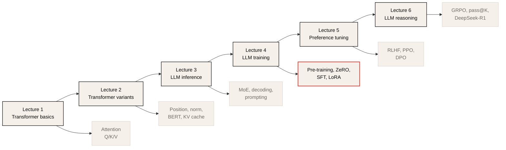

# CME295 Lecture Notes

이 폴더는 CME295 강의 영상을 기반으로 정리한 한국어 lecture notes 모음이다. 각 강의 README는 강의 요약, 핵심 개념, 실무 관점의 메모, 복습 질문과 답변, 그리고 Mermaid/SVG 다이어그램을 포함한다.

## Lectures

| Lecture | Topic | Notes | Source |
| ------- | ----- | ----- | ------ |
| 01 | Transformer 기초 | [lec-01/README.md](lec-01/README.md) | [YouTube](https://www.youtube.com/watch?v=Ub3GoFaUcds) |
| 02 | Transformer-based models and tricks | [lec-02/README.md](lec-02/README.md) | [YouTube](https://www.youtube.com/watch?v=yT84Y5zCnaA) |
| 03 | LLMs, decoding, prompting, and inference | [lec-03/README.md](lec-03/README.md) | [YouTube](https://www.youtube.com/watch?v=Q5baLehv5So) |
| 04 | LLM training, fine-tuning, and efficient adaptation | [lec-04/README.md](lec-04/README.md) | [YouTube](https://www.youtube.com/watch?v=VlA_jt_3Qc4) |
| 05 | LLM tuning and human preferences | [lec-05/README.md](lec-05/README.md) | [YouTube](https://www.youtube.com/watch?v=PmW_TMQ3l0I) |
| 06 | LLM reasoning and GRPO | [lec-06/README.md](lec-06/README.md) | [YouTube](https://www.youtube.com/watch?v=k5Fh-UgTuCo) |

## Learning Path

## Lecture Overview

### Lecture 1: Transformer

Lecture 1은 NLP task, tokenization, representation learning, RNN/LSTM의 한계, attention의 필요성을 거쳐 Transformer encoder-decoder 구조를 설명한다. 핵심은 self-attention이 token 간 의존성을 병렬적으로 계산하고, query/key/value 구조로 information retrieval처럼 동작한다는 점이다.

주요 다이어그램:

* [self-attention-qkv.svg](lec-01/assets/self-attention-qkv.svg)
* [transformer-encoder-decoder.svg](lec-01/assets/transformer-encoder-decoder.svg)

### Lecture 2: Transformer-Based Models and Tricks

Lecture 2는 Transformer를 실제 model family로 확장할 때 필요한 positional encoding, RoPE, layer normalization, RMSNorm, MHA/MQA/GQA, encoder-only model, BERT pre-training을 다룬다. Lecture 1이 architecture의 기본 원리를 설명했다면, Lecture 2는 modern Transformer를 안정적이고 효율적으로 만드는 설계 선택을 정리한다.

주요 다이어그램:

* [rope-rotation.svg](lec-02/assets/rope-rotation.svg)
* [mha-mqa-gqa-kv-cache.svg](lec-02/assets/mha-mqa-gqa-kv-cache.svg)

### Lecture 3: Large Language Models, Decoding, Prompting, and Inference

Lecture 3은 decoder-only Transformer가 LLM으로 확장되는 과정을 다룬다. Mixture of Experts, next-token decoding, greedy/beam/sampling, temperature, prompt structure, in-context learning, chain of thought, KV cache, PagedAttention, speculative decoding 등 inference-time behavior와 serving optimization이 중심이다.

주요 다이어그램:

* [moe-routing.svg](lec-03/assets/moe-routing.svg)
* [kv-cache-decoding.svg](lec-03/assets/kv-cache-decoding.svg)

### Lecture 4: LLM Training, Fine-Tuning, and Efficient Adaptation

Lecture 4는 LLM을 어떻게 학습하고 조정하는지 설명한다. Pre-training, scaling laws, FLOPs/FLOP/s, GPU memory footprint, data parallelism, ZeRO, model parallelism, FlashAttention, mixed precision, SFT, instruction tuning, evaluation, alignment, LoRA, QLoRA가 핵심이다.

주요 다이어그램:

* [zero-sharding.svg](lec-04/assets/zero-sharding.svg)
* [flashattention-io.svg](lec-04/assets/flashattention-io.svg)
* [mixed-precision-training.svg](lec-04/assets/mixed-precision-training.svg)
* [lora-qlora-adaptation.svg](lec-04/assets/lora-qlora-adaptation.svg)

### Lecture 5: LLM Tuning and Human Preferences

Lecture 5는 SFT model을 human preference에 맞게 조정하는 preference tuning을 설명한다. Pairwise preference data, reward model, Bradley-Terry formulation, RLHF, PPO clip/KL penalty, reward hacking, best-of-N, DPO가 핵심이다.

주요 다이어그램:

* [preference-tuning-pipeline.svg](lec-05/assets/preference-tuning-pipeline.svg)
* [rlhf-dpo-tradeoff.svg](lec-05/assets/rlhf-dpo-tradeoff.svg)

### Lecture 6: LLM Reasoning and GRPO

Lecture 6은 reasoning model을 answer 전에 reasoning chain을 생성하는 LLM으로 보고, math/code처럼 정답 검증이 가능한 task에서 verifiable rewards와 GRPO로 reasoning behavior를 학습하는 방법을 설명한다. pass@K, sampling temperature, reasoning token cost, output length growth, DeepSeek-R1-Zero/R1 training pipeline, reasoning distillation이 핵심이다.

주요 다이어그램:

* [reasoning-token-budget.svg](lec-06/assets/reasoning-token-budget.svg)
* [grpo-group-advantage.svg](lec-06/assets/grpo-group-advantage.svg)

## Concept Map

| Concept | First covered | Later use |
| ------- | ------------- | --------- |
| Tokenization | [Lecture 1](lec-01/README.md#from-text-to-tokens) | pre-training data, SFT loss masking |
| Self-attention | [Lecture 1](lec-01/README.md#self-attention) | MHA, KV cache, FlashAttention |
| Q/K/V | [Lecture 1](lec-01/README.md#query-key-and-value) | MHA/MQA/GQA, RoPE, KV cache |
| Positional information | [Lecture 2](lec-02/README.md#why-position-information-is-needed) | long context, RoPE, context rot |
| Transformer families | [Lecture 2](lec-02/README.md#transformer-model-families) | decoder-only LLMs |
| Decoder-only LLM | [Lecture 3](lec-03/README.md#decoder-only-backbone) | pre-training and SFT |
| MoE | [Lecture 3](lec-03/README.md#mixture-of-experts) | expert parallelism |
| KV cache | [Lecture 3](lec-03/README.md#kv-cache) | inference memory and throughput |
| Scaling laws | [Lecture 4](lec-04/README.md#scaling-laws-and-chinchilla) | model/data/compute allocation |
| ZeRO | [Lecture 4](lec-04/README.md#data-parallelism-and-zero) | distributed training memory |
| FlashAttention | [Lecture 4](lec-04/README.md#flashattention) | exact attention with lower HBM IO |
| LoRA/QLoRA | [Lecture 4](lec-04/README.md#lora) | efficient fine-tuning |
| Preference tuning | [Lecture 5](lec-05/README.md#why-preference-tuning) | human preference alignment after SFT |
| Reward model | [Lecture 5](lec-05/README.md#reward-model-training) | RLHF and best-of-N scoring |
| PPO | [Lecture 5](lec-05/README.md#ppo-clip) | RLHF policy optimization |
| DPO | [Lecture 5](lec-05/README.md#dpo) | supervised-style preference optimization |
| Chain of thought | [Lecture 3](lec-03/README.md#chain-of-thought) | reasoning chains and test-time compute |
| Preference tuning / PPO | [Lecture 5](lec-05/README.md#rlhf-pipeline) | GRPO comparison and reasoning RL |
| pass@K | [Lecture 6](lec-06/README.md#pass-at-k) | coding/math reasoning evaluation |
| GRPO | [Lecture 6](lec-06/README.md#grpo) | reasoning model RL training |
| DeepSeek-R1 | [Lecture 6](lec-06/README.md#deepseek-r1-zero-and-deepseek-r1) | multi-stage reasoning training pipeline |

## Repository Notes

* Lecture notes are written in Korean, while technical terms are often kept in English when that is clearer.
* SVG diagrams use the shared editorial style from [AGENTS.md](../AGENTS.md): restrained palette, thin line boxes, minimal fill, and accent red only for critical paths.
* Mermaid diagrams include local `classDef` styling so they follow the same visual scheme in GitHub-rendered markdown.
* Each lecture README ends with review questions and answers for quick self-checking.
