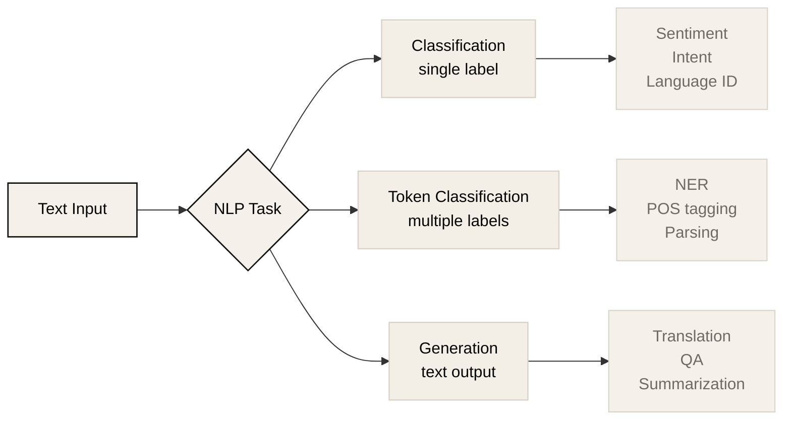
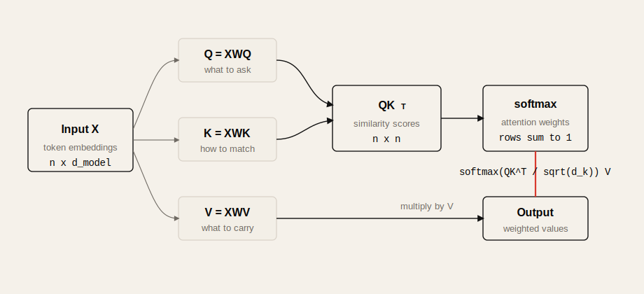
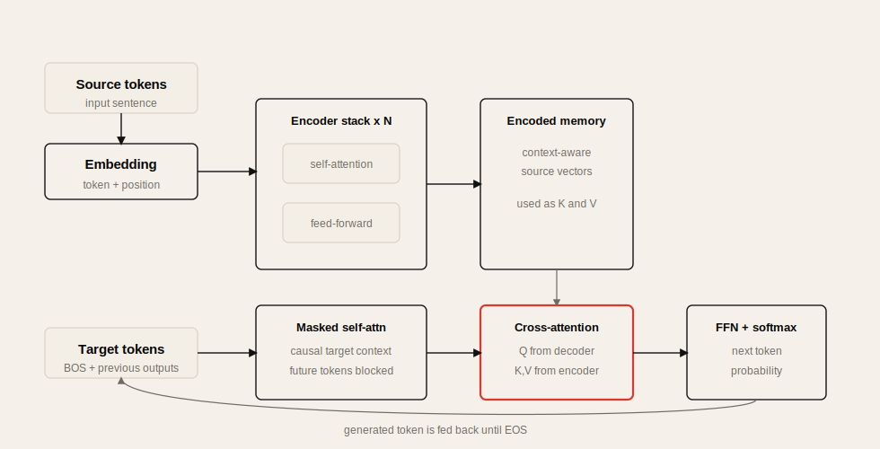

# Lecture 1: Transformer

Source: [CME295 Lecture 1 - Transformer](https://www.youtube.com/watch?v=Ub3GoFaUcds)

## Table of Contents

* [Goal](#goal)
* [Lecture Overview](#lecture-overview)
* [NLP Task Families](#nlp-task-families)
* [Evaluation Metrics](#evaluation-metrics)
* [From Text to Tokens](#from-text-to-tokens)
* [Token Representation](#token-representation)
* [Word2Vec and Proxy Tasks](#word2vec-and-proxy-tasks)
* [RNNs and Sequential Representations](#rnns-and-sequential-representations)
* [LSTMs and Long-Range Dependencies](#lstms-and-long-range-dependencies)
* [Attention Motivation](#attention-motivation)
* [Self-Attention](#self-attention)
* [Query, Key, and Value](#query-key-and-value)
* [Transformer Architecture](#transformer-architecture)
* [Encoder](#encoder)
* [Decoder](#decoder)
* [End-to-End Translation Flow](#end-to-end-translation-flow)
* [Label Smoothing](#label-smoothing)
* [Practical Tips and Notes](#practical-tips-and-notes)
* [Lecture Summary](#lecture-summary)
* [Key Terms](#key-terms)
* [Questions](#questions)
* [Answers](#answers)

---

## Goal

이번 강의의 목표는 Transformer를 갑자기 등장한 LLM 구조로 보는 것이 아니라, NLP 문제와 기존 sequence model의 한계에서 자연스럽게 등장한 architecture로 이해하는 것이다.

핵심 메시지는 다음과 같다.

> Transformer의 출발점은 text를 숫자로 바꾸는 tokenization과 representation 문제이며, 핵심 전환점은 RNN처럼 순서대로 처리하지 않고 attention으로 token 간 직접 연결을 만드는 것이다.

이 강의는 다음 흐름으로 진행된다.

* NLP task의 큰 분류: classification, token/multi-classification, generation
* text를 model input으로 바꾸기 위한 tokenization
* one-hot encoding의 한계와 learned embedding
* Word2Vec의 proxy task와 embedding 학습 직관
* RNN/LSTM의 sequential representation과 long-range dependency 문제
* attention의 동기: 필요한 과거 token에 직접 연결하기
* self-attention의 `Q`, `K`, `V` 개념
* encoder-decoder Transformer 구조
* masked self-attention, cross-attention, FFN, softmax decoding
* label smoothing의 목적

---

## Lecture Overview

강의 초반은 course logistics와 배경 설명이다. CME295는 Transformer와 Large Language Models를 다루는 강의이며, 수업의 핵심 목적은 LLM이 동작하는 underlying mechanism과 training/application을 이해하는 것이다.

기술 내용은 매우 기초적인 NLP 문제 정의에서 시작한다. model은 text를 직접 이해하지 못하므로, text를 token으로 나누고, token을 vector로 표현해야 한다. 이 representation이 문맥을 모르고 순서를 잃는다는 문제가 생기고, 이를 해결하려고 RNN과 LSTM이 등장한다. 하지만 RNN/LSTM은 긴 sequence에서 memory와 gradient 문제가 있고, 순차 계산 때문에 느리다.

Transformer는 이 문제를 attention으로 해결한다. 각 token이 sequence의 다른 token을 직접 참조할 수 있게 하고, 이 연산을 matrix multiplication 형태로 표현해 GPU에서 효율적으로 병렬화한다.

---

## NLP Task Families

강의는 NLP, Natural Language Processing을 text를 조작하고 계산하는 field로 정의한다. NLP task는 크게 세 가지로 볼 수 있다.



| Family | Input | Output | Examples |
| ------ | ----- | ------ | -------- |
| Classification | Text | Single label | sentiment analysis, intent detection, language detection, topic classification |
| Multi-classification / token classification | Text | Multiple labels | NER, POS tagging, dependency parsing |
| Generation | Text | Text | machine translation, question answering, summarization, code generation |

### Classification

Classification은 text 하나를 입력받아 하나의 label을 예측한다. 예를 들어 `"This teddy bear is so cute."`라는 문장이 positive sentiment인지 negative sentiment인지 판단하는 task가 있다.

대표 data source로는 movie review, product review, social media post 등이 있다.

### Token-Level or Multi-Classification

Named Entity Recognition, NER는 문장 안의 특정 token 또는 span이 location, time, person, organization 같은 entity인지 분류한다. POS tagging이나 parsing도 이 범주에 넣을 수 있다.

이 계열 task는 sentence 전체 label이 아니라 token별 또는 entity type별 metric이 중요하다.

### Generation

Generation은 text를 입력받아 text를 출력한다. Machine translation은 source language text를 target language text로 바꾸고, question answering은 질문에 대한 답을 생성하며, summarization은 긴 문서를 짧게 만든다.

Generation은 output length가 미리 정해져 있지 않다는 점이 classification과 다르다.

---

## Evaluation Metrics

Classification에서는 accuracy, precision, recall, F1 score를 자주 사용한다.

| Metric | Meaning | When useful |
| ------ | ------- | ----------- |
| Accuracy | 전체 sample 중 맞힌 비율 | class balance가 좋을 때 |
| Precision | positive로 예측한 것 중 실제 positive 비율 | false positive 비용이 클 때 |
| Recall | 실제 positive 중 찾아낸 비율 | false negative 비용이 클 때 |
| F1 | precision과 recall의 harmonic mean | imbalance가 있을 때 단일 숫자로 비교 |

강의에서 강조한 점은 class imbalance다. 예를 들어 99%가 positive인 dataset에서 모든 sample을 positive로 예측하면 accuracy는 높지만 좋은 classifier가 아니다. 이럴 때 precision, recall, F1이 필요하다.

Generation에서는 평가가 더 어렵다. 같은 의미를 여러 방식으로 번역하거나 요약할 수 있기 때문이다.

| Metric | Main idea | Direction |
| ------ | --------- | --------- |
| BLEU | reference translation과 n-gram overlap 비교 | Higher is better |
| ROUGE | reference text와 overlap을 보는 metric suite | Higher is better |
| Perplexity | model이 output에 얼마나 놀라는지 측정 | Lower is better |

BLEU와 ROUGE는 reference text가 필요하다. 하지만 reference label을 만드는 일은 비용이 크다. 강의에서는 이후 LLM 기반 평가처럼 reference-free evaluation 방향도 다룰 것이라고 예고한다.

---

## From Text to Tokens

Model은 text를 직접 처리하지 못한다. 따라서 먼저 text를 token이라는 단위로 나누어야 한다. 이 과정을 tokenization이라고 한다.

예시 문장은 다음과 같다.

```text
A cute teddy bear is reading.
```

Tokenization 방식은 여러 가지다.

```mermaid
flowchart TB
    T["A cute teddy bear is reading"] --> W[Word-level<br/>A | cute | teddy | bear | is | reading]
    T --> S[Subword-level<br/>A | cute | teddy | bear | is | read | ##ing]
    T --> C[Character-level<br/>A | c | u | t | e | ...]
    W --> WN[shorter sequence<br/>higher OOV risk]
    S --> SN[balanced default<br/>lower OOV risk]
    C --> CN[robust spelling<br/>long sequence]

    classDef primary fill:#F5F1EA,stroke:#111111,stroke-width:1.4px,color:#050505
    classDef secondary fill:#F3EFE7,stroke:#D8D1C7,stroke-width:1.2px,color:#050505
    classDef note fill:#F5F1EA,stroke:#D8D1C7,stroke-width:1px,color:#6F6A63
    classDef accent fill:#F5F1EA,stroke:#D9392E,stroke-width:2px,color:#050505
    class T primary
    class W,S,C secondary
    class WN,CN note
    class SN accent
```

| Tokenization | Example | Pros | Cons |
| ------------ | ------- | ---- | ---- |
| Word-level | `A`, `cute`, `teddy`, `bear` | 단순하고 직관적 | vocabulary가 커지고 OOV 위험이 큼 |
| Subword-level | `bear`, `##s` | word root를 공유하고 OOV를 줄임 | sequence length가 길어짐 |
| Character-level | `A`, `c`, `u`, `t`, `e` | misspelling과 casing에 강함 | sequence가 매우 길고 character 의미가 희박함 |

Out-of-vocabulary, OOV는 inference 시점에 training vocabulary에 없던 token이 나오는 문제다. Word-level tokenizer는 OOV에 취약하다. Subword tokenizer는 단어를 더 작은 조각으로 나누기 때문에 OOV 위험을 줄인다. Character-level tokenizer는 거의 모든 문자를 표현할 수 있지만 sequence length가 길어져 계산 비용이 커진다.

강의에서는 단일 언어 vocabulary는 보통 수만 단위, multilingual/code 포함 model은 수십만 단위 vocabulary도 가능하다고 설명한다.

---

## Token Representation

Tokenization 후에는 각 token을 model이 계산할 수 있는 vector로 바꿔야 한다.

가장 단순한 방식은 one-hot encoding이다. vocabulary size가 `V`라면 각 token은 `V`차원 vector가 되고, 자기 index만 1이며 나머지는 0이다.

```text
soft       -> [1, 0, 0]
teddy bear -> [0, 1, 0]
book       -> [0, 0, 1]
```

문제는 one-hot vector들이 서로 orthogonal하다는 점이다. `teddy bear`와 `soft`가 의미상 더 가깝고, `teddy bear`와 `book`은 독립적이라고 말하고 싶지만 one-hot encoding만으로는 모든 token 간 similarity가 비슷하게 보인다.

따라서 원하는 것은 learned dense embedding이다.

```text
비슷한 token -> 비슷한 vector direction
무관한 token -> 낮은 similarity
```

Cosine similarity는 두 vector의 방향이 얼마나 비슷한지 보는 대표적인 방법이다.

```math
\cos(x, y) = \frac{x \cdot y}{||x|| ||y||}
```

---

## Word2Vec and Proxy Tasks

Word2Vec은 token embedding을 data에서 학습하는 대표적인 초기 방법이다. 핵심은 직접 "좋은 embedding"을 label로 주는 것이 아니라, 언어 구조를 학습하게 만드는 proxy task를 푸는 것이다.

대표 방식은 두 가지다.

| Method | Objective |
| ------ | --------- |
| CBOW | 주변 단어로 target word 예측 |
| Skip-gram | target word로 주변 단어 예측 |

강의에서는 next word prediction에 가까운 toy example로 embedding 학습을 설명한다.

```text
input token: A
target next token: cute
```

1. token을 one-hot vector로 표현한다.
2. neural network의 첫 projection을 통과해 hidden vector를 만든다.
3. output layer와 softmax로 vocabulary 전체에 대한 확률분포를 만든다.
4. 실제 next token과 cross entropy loss를 계산한다.
5. backpropagation으로 weight를 업데이트한다.

학습 후에는 hidden layer에 해당하는 vector를 token representation으로 사용할 수 있다.

중요한 점은 proxy task 자체가 최종 목적은 아니라는 것이다. next word를 맞히는 과정을 통해 language structure를 반영한 embedding을 얻는 것이 목적이다. model이 `king`, `queen`, `Paris`, `France` 같은 관계를 embedding space에 어느 정도 반영할 수 있다는 점이 Word2Vec의 중요한 직관이다.

하지만 Word2Vec류 embedding은 context-independent하다. 같은 단어 `bank`가 river bank인지 financial bank인지 문맥에 따라 달라져야 하지만, static embedding은 token별로 하나의 vector만 가진다.

---

## RNNs and Sequential Representations

단어별 embedding을 평균내면 sentence representation을 만들 수는 있지만, 순서와 문맥을 많이 잃는다. 이를 보완하기 위해 RNN, Recurrent Neural Network가 등장한다.

RNN은 token을 순서대로 처리하면서 hidden state를 유지한다.

```text
h_t = f(h_{t-1}, x_t)
```

여기서 `h_t`는 지금까지 처리한 sequence의 representation이다. RNN은 다음과 같이 해석할 수 있다.

```text
hidden state = 지금까지 본 문장의 의미 요약
```

RNN을 task별로 쓰는 방식은 다음과 같다.

| Task | RNN usage |
| ---- | --------- |
| Sentence classification | 마지막 hidden state를 classifier에 넣음 |
| Token classification | 각 token 위치의 hidden state를 classifier에 넣음 |
| Generation / translation | source sentence를 hidden state로 encode한 뒤 decoder에서 생성 |

RNN의 장점은 word order를 반영한다는 것이다. 그러나 sequence를 한 token씩 처리해야 하므로 병렬화가 어렵고, 긴 sequence에서 앞부분 정보를 잊기 쉽다.

---

## LSTMs and Long-Range Dependencies

LSTM, Long Short-Term Memory는 RNN의 long-range dependency 문제를 줄이기 위해 등장했다. RNN이 hidden state만 유지한다면, LSTM은 cell state를 추가로 유지해 중요한 정보를 더 오래 보존하려 한다.

```text
RNN:
  hidden state h_t

LSTM:
  hidden state h_t
  cell state c_t
```

하지만 LSTM도 완전한 해결책은 아니다. sequence가 길어질수록 여전히 긴 거리 정보 전달이 어렵고, 계산은 여전히 순차적이다.

강의에서는 이 문제를 vanishing gradient 관점으로 설명한다. 마지막 token의 loss를 앞쪽 token 관련 weight까지 backpropagation하려면 여러 time step을 거쳐 gradient가 전달된다. 이때 작은 값들이 반복적으로 곱해지면 gradient가 0에 가까워지고, 큰 값들이 반복적으로 곱해지면 exploding gradient가 된다.

```text
many factors < 1 -> vanishing gradient
many factors > 1 -> exploding gradient
```

Transformer가 중요한 이유는 이 순차 처리 구조에서 벗어나 token 간 직접 연결을 만들기 때문이다.

---

## Attention Motivation

Attention의 동기는 간단하다.

> 어떤 token을 예측하거나 표현할 때, 필요한 과거 token에 직접 접근할 수 있으면 좋다.

Machine translation을 예로 들면, target language의 다음 단어를 생성할 때 source sentence 전체 중 특정 단어 또는 phrase가 중요할 수 있다. RNN encoder-decoder는 source sentence 전체를 하나의 hidden state에 압축하려고 했기 때문에 긴 문장에서 정보 손실이 생겼다.

Attention은 decoder가 source sequence의 특정 위치를 직접 참조할 수 있게 한다. 이는 long-range dependency를 줄이고, "어디를 보고 있는지"에 대한 가중치를 만들 수 있게 한다.

2017년 Transformer 논문 `Attention Is All You Need`는 recurrence 없이 attention만으로 sequence modeling을 하려는 시도였다. 이 전환이 오늘날 LLM architecture의 기반이다.

---

## Self-Attention

Self-attention은 같은 sequence 안의 token들이 서로를 참조하는 mechanism이다.



예를 들어 `"A cute teddy bear is reading"`에서 `teddy bear`의 representation을 만들 때, `A`, `cute`, `is`, `reading` 등 다른 token을 직접 볼 수 있다.

```text
teddy bear representation
  = function(A, cute, teddy bear, is, reading)
```

이 때문에 같은 단어라도 문맥에 따라 다른 representation을 가질 수 있다. 예를 들어 `river bank`와 `rob a bank`의 `bank`는 같은 spelling이지만 주변 token이 다르므로 self-attention을 거친 representation은 달라질 수 있다.

Self-attention의 핵심 장점은 다음과 같다.

* token 간 직접 연결을 만든다.
* context-aware representation을 만든다.
* matrix multiplication으로 표현되어 GPU 병렬화에 유리하다.
* RNN의 sequential bottleneck을 줄인다.

---

## Query, Key, and Value

Attention은 query, key, value라는 세 vector로 설명된다.

| Component | Intuition |
| --------- | --------- |
| Query | 내가 찾고 싶은 정보 |
| Key | 내가 어떤 정보로 검색될 수 있는지 |
| Value | 실제로 전달할 내용 |

어떤 token의 query가 다른 token들의 key와 비교된다. query-key similarity가 높으면 그 token의 value가 더 큰 weight로 섞인다.

```text
query token이 무엇을 찾는가?
  -> 모든 key와 비교
  -> similarity score 계산
  -> softmax로 weight 생성
  -> value의 weighted sum 생성
```

Self-attention 수식은 다음과 같다.

```math
\text{Attention}(Q, K, V) =
\text{softmax}\left(\frac{QK^T}{\sqrt{d_k}}\right)V
```

`Q`, `K`, `V`는 고정된 수작업 feature가 아니다. input embedding에 learned projection matrix를 곱해 만든다.

```math
Q = XW_Q
```

```math
K = XW_K
```

```math
V = XW_V
```

`QK^T`는 각 query와 각 key의 dot product matrix다. softmax 후에는 각 query가 어떤 value들을 얼마나 섞을지 나타내는 attention weight가 된다.

`1 / sqrt(d_k)` scaling은 query/key dimension이 커질수록 dot product 값이 커지는 문제를 완화한다. 값이 너무 커지면 softmax가 지나치게 sharp해지고 gradient가 나빠질 수 있다.

---

## Transformer Architecture

원래 Transformer는 machine translation을 위해 제안된 encoder-decoder architecture다.



```text
source sentence
  -> tokenizer
  -> input embedding + positional encoding
  -> encoder stack
  -> encoded representations
  -> decoder stack
  -> linear + softmax
  -> target sentence tokens
```

큰 구조는 다음과 같다.

| Part | Role |
| ---- | ---- |
| Encoder | source sentence token들을 context-aware representation으로 변환 |
| Decoder | target sentence를 autoregressive하게 생성 |
| Self-attention | 같은 sequence 안의 token 관계 계산 |
| Masked self-attention | 미래 token을 보지 않고 이전 output token만 참조 |
| Cross-attention | decoder query가 encoder output의 key/value를 참조 |
| FFN | 각 token representation에 비선형 변환을 적용 |
| Positional encoding | attention만으로 사라지는 순서 정보를 주입 |

RNN과 달리 Transformer는 token을 직접 연결하지만, 이 때문에 순서 정보가 자연스럽게 들어오지 않는다. 그래서 positional encoding이 필요하다. Lecture 1에서는 이 개념만 소개하고, Lecture 2에서 자세히 다룬다.

---

## Encoder

Encoder는 input sentence를 context-aware embedding으로 바꾼다.

각 encoder block은 대략 다음 흐름을 가진다.

```text
input embeddings
  -> multi-head self-attention
  -> feed-forward network
  -> encoded embeddings
```

Multi-head attention은 attention computation을 여러 번 병렬로 수행한다. 각 head는 별도의 `W_Q`, `W_K`, `W_V` projection matrix를 학습한다. 여러 head를 둠으로써 model은 서로 다른 관계나 projection을 학습할 수 있다.

```text
Head 1 -> attention output 1
Head 2 -> attention output 2
...
Concatenate -> W_O projection
```

각 head output을 concatenate한 뒤 output projection `W_O`로 원래 embedding dimension에 맞춘다.

FFN은 token별 representation에 추가적인 비선형 변환을 적용한다. 강의에서는 Transformer의 FFN hidden dimension이 input/output embedding dimension보다 더 큰 경우가 많으며, 이는 model에 더 많은 표현 자유도를 주기 위한 것이라고 설명한다.

Encoder block은 하나만 쓰지 않고 여러 개를 stack한다. 원래 논문에서는 `N`개의 encoder와 `N`개의 decoder를 쌓는 구조를 사용했다.

---

## Decoder

Decoder는 target sentence를 한 token씩 생성한다. 시작은 BOS, Beginning of Sequence token이다.

Decoder block은 세 부분이 중요하다.

```text
previous target tokens
  -> masked self-attention
  -> cross-attention over encoder outputs
  -> feed-forward network
```

### Masked Self-Attention

Decoder의 self-attention은 causal해야 한다. 즉 현재 token을 예측할 때 미래 token을 보면 안 된다.

```text
allowed: current token attends to previous target tokens
blocked: current token attends to future target tokens
```

이 mask 때문에 training 중에도 decoder는 실제 generation 조건과 맞는 방식으로 학습된다.

### Cross-Attention

Cross-attention에서는 decoder 쪽 representation이 query가 되고, encoder output이 key와 value가 된다.

```text
Q: decoder hidden states
K: encoder outputs
V: encoder outputs
```

직관적으로는 "지금 target token을 만들기 위해 source sentence의 어떤 부분을 봐야 하는가?"를 계산하는 layer다.

마지막에는 linear projection과 softmax를 통해 vocabulary 전체에 대한 probability distribution을 만들고, 다음 token을 선택한다.

---

## End-to-End Translation Flow

강의의 end-to-end 예시는 `"A cute teddy bear is reading"`을 번역하는 과정이다.

전체 흐름은 다음과 같다.

```text
1. Source text tokenization
2. BOS/EOS 같은 special token 추가
3. Token embedding lookup
4. Positional encoding 추가
5. Encoder self-attention과 FFN을 N번 통과
6. Decoder에 BOS token 입력
7. Masked self-attention으로 지금까지 생성한 target token 처리
8. Cross-attention으로 source encoded embeddings 참조
9. FFN 통과
10. Linear + softmax로 다음 token distribution 생성
11. 생성 token을 decoder input에 다시 넣음
12. EOS token이 나올 때까지 반복
```

Autoregressive decoding은 다음 token을 하나 예측하고, 그 token을 다시 context에 붙여 다음 token을 예측하는 방식이다.

```text
BOS -> token_1 -> token_2 -> ... -> EOS
```

EOS, End of Sequence token이 생성되면 decoding을 멈춘다.

---

## Label Smoothing

Label smoothing은 target label을 완전한 one-hot vector로 두지 않는 regularization 기법이다.

일반 one-hot target은 정답 class에 1, 나머지에 0을 둔다.

```text
[1, 0, 0, 0]
```

Label smoothing은 정답 class를 `1 - epsilon`으로 낮추고, 나머지 class에 작은 확률을 나눠준다.

```text
[1 - epsilon, epsilon / (V - 1), epsilon / (V - 1), ...]
```

NLP generation에서는 같은 prefix 뒤에 여러 자연스러운 next token이 올 수 있다.

```text
What a great day
What a great lecture
What a great book
```

따라서 model에게 정답 하나만 100% 확신하라고 강제하면 overconfidence가 생길 수 있다. Label smoothing은 model을 덜 확신하게 만들고, translation task에서는 BLEU 같은 metric 개선에 도움이 될 수 있다.

---

## Practical Tips and Notes

### Tokenizer 선택은 성능과 비용을 동시에 바꾼다

Word-level tokenizer는 단순하지만 OOV에 취약하다. Character-level tokenizer는 robust하지만 sequence length가 길어져 attention 비용과 latency가 커진다. Subword tokenizer는 일반적으로 좋은 절충안이다.

모델을 평가할 때는 parameter 수뿐 아니라 tokenizer vocabulary size와 평균 tokenized length도 함께 봐야 한다.

### Static Embedding과 Contextual Embedding을 구분하기

Word2Vec류 embedding은 token마다 하나의 vector를 갖는다. Transformer representation은 같은 token이라도 문맥에 따라 달라진다. 검색, 분류, 생성 품질을 분석할 때 이 차이를 놓치면 embedding 품질을 잘못 해석할 수 있다.

### RNN의 한계는 기억력뿐 아니라 병렬성 문제다

RNN/LSTM은 long-range dependency뿐 아니라 sequential computation이 병목이다. 긴 sequence를 GPU에서 효율적으로 처리하기 어렵다. Transformer의 중요한 장점은 attention이 matrix multiplication으로 표현되어 병렬화가 쉽다는 것이다.

### Self-Attention의 비용은 sequence length에 민감하다

Self-attention은 모든 token pair를 비교하므로 full attention의 비용은 sequence length에 대해 `O(n^2)`로 증가한다. Lecture 1에서는 장점이 강조되지만, 실제 LLM serving에서는 이 비용이 KV cache, long context, batching과 함께 중요한 병목이 된다.

### Evaluation metric을 task 목적에 맞게 고르기

Imbalanced classification에서 accuracy만 보면 안 된다. Translation이나 summarization에서는 BLEU/ROUGE가 reference overlap에 치우칠 수 있다. 실제 product setting에서는 human preference, task success, latency, safety metric이 함께 필요하다.

### Quick Reference

| Problem | First Check |
| ------- | ----------- |
| Unknown token이 많이 나온다 | tokenizer vocabulary, subword coverage, domain mismatch |
| 문장 의미가 잘 안 잡힌다 | static embedding인지 contextual model인지 확인 |
| 긴 문장에서 앞부분 정보를 잃는다 | RNN/LSTM 구조인지, attention 경로가 있는지 확인 |
| generation이 과하게 확신한다 | calibration, label smoothing, decoding strategy |
| model latency가 sequence length에 따라 급증한다 | tokenized length, attention complexity, batching |

---

## Lecture Summary

Lecture 1은 LLM의 핵심 구조인 Transformer를 NLP의 기본 문제에서부터 쌓아 올린다. 먼저 NLP task를 classification, token-level classification, generation으로 나누고, 각 task에 맞는 dataset과 metric이 다르다는 점을 설명한다.

그 다음 text를 model이 처리할 수 있게 token으로 나누는 tokenization 문제를 다룬다. Word-level, subword-level, character-level 방식은 OOV, sequence length, 의미 단위라는 trade-off를 가진다. Token을 vector로 표현하는 초기 방식인 one-hot encoding은 모든 token을 서로 orthogonal하게 만들기 때문에 의미 similarity를 표현하기 어렵다.

Word2Vec은 proxy task를 통해 learned embedding을 얻는 방법을 보여준다. 그러나 static embedding은 문맥에 따라 달라지는 의미를 충분히 표현하지 못한다. RNN은 hidden state를 통해 sequence order와 context를 반영하지만, 긴 sequence에서 long-range dependency와 vanishing gradient 문제가 생기고, 순차 계산 때문에 느리다. LSTM은 cell state로 이를 완화하지만 근본적인 병렬성 문제는 남는다.

Attention은 필요한 token에 직접 연결함으로써 이 문제를 해결하려는 접근이다. Self-attention은 sequence 안의 모든 token이 서로를 참조하게 만들고, `Q`, `K`, `V` projection과 matrix multiplication으로 구현된다. Transformer는 이 self-attention을 encoder-decoder 구조에 넣어 machine translation을 수행한다. Encoder는 source sentence를 context-aware representation으로 바꾸고, decoder는 masked self-attention과 cross-attention을 사용해 target sentence를 autoregressive하게 생성한다.

---

## Key Terms

| Term | Meaning |
| ---- | ------- |
| NLP | text를 처리하고 계산하는 natural language processing 분야 |
| Tokenization | text를 model input 단위인 token으로 나누는 과정 |
| Token | model이 처리하는 text 단위 |
| OOV | training vocabulary에 없는 out-of-vocabulary token |
| One-hot encoding | vocabulary index 하나만 1인 sparse vector 표현 |
| Embedding | token을 dense vector로 표현한 것 |
| Cosine similarity | vector 방향 유사도를 측정하는 metric |
| Word2Vec | proxy task로 word embedding을 학습하는 방법 |
| CBOW | 주변 단어로 target word를 예측하는 Word2Vec 방식 |
| Skip-gram | target word로 주변 단어를 예측하는 Word2Vec 방식 |
| RNN | hidden state를 순차적으로 갱신하는 recurrent neural network |
| LSTM | cell state로 장기 정보를 보존하려는 RNN variant |
| Vanishing gradient | backpropagation 중 gradient가 0에 가까워지는 현상 |
| Attention | 필요한 token 또는 state에 직접 weight를 주어 참조하는 mechanism |
| Self-attention | 같은 sequence 안에서 token들이 서로를 참조하는 attention |
| Query | attention에서 찾고 싶은 정보 |
| Key | query와 비교되는 검색 기준 |
| Value | attention weight로 섞이는 실제 정보 |
| Encoder | source sequence를 context-aware representation으로 바꾸는 Transformer component |
| Decoder | target sequence를 autoregressive하게 생성하는 Transformer component |
| Masked self-attention | 미래 token을 보지 못하게 막은 decoder self-attention |
| Cross-attention | decoder query가 encoder key/value를 참조하는 attention |
| Label smoothing | one-hot target을 부드럽게 만들어 overconfidence를 줄이는 regularization |

---

## Questions

1. NLP task를 classification, token-level classification, generation으로 나누는 기준은 무엇인가?
2. Class imbalance가 있을 때 accuracy가 왜 misleading할 수 있는가?
3. Word-level, subword-level, character-level tokenizer의 주요 trade-off는 무엇인가?
4. One-hot encoding이 token similarity 표현에 부적합한 이유는 무엇인가?
5. Word2Vec에서 proxy task를 사용하는 이유는 무엇인가?
6. Static embedding이 `bank` 같은 다의어를 잘 표현하지 못하는 이유는 무엇인가?
7. RNN의 hidden state는 어떤 의미로 해석할 수 있는가?
8. LSTM은 RNN의 어떤 문제를 완화하려고 cell state를 추가했는가?
9. Vanishing gradient는 long-range dependency와 어떻게 연결되는가?
10. Attention은 RNN encoder-decoder의 어떤 한계를 해결하려고 등장했는가?
11. Self-attention에서 query, key, value는 각각 어떤 역할을 하는가?
12. 왜 attention score를 `sqrt(d_k)`로 나누는가?
13. Transformer encoder와 decoder의 역할은 어떻게 다른가?
14. Decoder의 self-attention에는 왜 mask가 필요한가?
15. Cross-attention에서 query는 어디서 오고, key/value는 어디서 오는가?
16. Label smoothing이 generation task에서 유용한 이유는 무엇인가?

---

## Answers

1. Output 형태가 기준이다. Classification은 text에서 하나의 label을 예측하고, token-level classification은 여러 token/span에 label을 붙이며, generation은 text를 출력한다.
2. majority class가 압도적으로 많으면 모든 sample을 majority로 예측해도 accuracy가 높게 나온다. 이 경우 minority class를 전혀 맞히지 못해도 좋은 model처럼 보일 수 있다.
3. Word-level은 단순하지만 OOV에 취약하다. Subword-level은 root를 공유하고 OOV를 줄이지만 sequence가 길어진다. Character-level은 misspelling에 강하지만 sequence가 매우 길고 character 단위 의미가 희박하다.
4. One-hot vector들은 서로 orthogonal하다. 의미가 비슷한 token도 vector similarity가 높게 나오지 않기 때문에 semantic similarity를 표현하기 어렵다.
5. 좋은 embedding에 대한 직접 label이 없기 때문이다. 주변 단어 예측이나 다음 단어 예측 같은 proxy task를 풀게 하면 language structure를 반영한 representation을 학습할 수 있다.
6. Static embedding은 token마다 하나의 vector만 가진다. 따라서 `river bank`와 `bank account`의 `bank`를 문맥에 따라 다르게 표현하기 어렵다.
7. 지금까지 처리한 sequence의 요약 representation이다. `h_t`는 이전 hidden state와 현재 token을 반영한다.
8. 긴 sequence에서 중요한 정보를 오래 보존하지 못하는 문제를 완화하려고 cell state를 추가했다.
9. 먼 과거 token에 대한 gradient는 여러 time step을 거쳐 전달된다. 작은 값들이 반복적으로 곱해지면 gradient가 거의 0이 되어 앞쪽 정보 학습이 어려워진다.
10. Source sentence 전체를 하나의 hidden state에 압축하는 한계와 긴 거리 정보 손실을 줄이기 위해 등장했다. Decoder가 필요한 source 위치를 직접 참조할 수 있게 한다.
11. Query는 찾고 싶은 정보, key는 비교 대상의 검색 기준, value는 attention weight로 실제 섞이는 정보다.
12. Query/key dimension이 커질수록 dot product 값이 커질 수 있다. 이를 normalize해 softmax가 지나치게 sharp해지는 것을 막는다.
13. Encoder는 source sentence token을 context-aware representation으로 바꾼다. Decoder는 이전 target token과 encoder output을 사용해 다음 target token을 생성한다.
14. Generation에서는 현재 token을 예측할 때 미래 target token을 알 수 없다. Training에서도 이 조건을 맞추기 위해 미래 위치를 mask한다.
15. Cross-attention의 query는 decoder hidden state에서 온다. Key와 value는 encoder output representation에서 온다.
16. 자연어 generation에서는 하나의 prefix 뒤에 여러 정답이 가능하다. Label smoothing은 target을 100% one-hot으로 강제하지 않아 overconfidence를 줄이고 generalization을 도울 수 있다.
