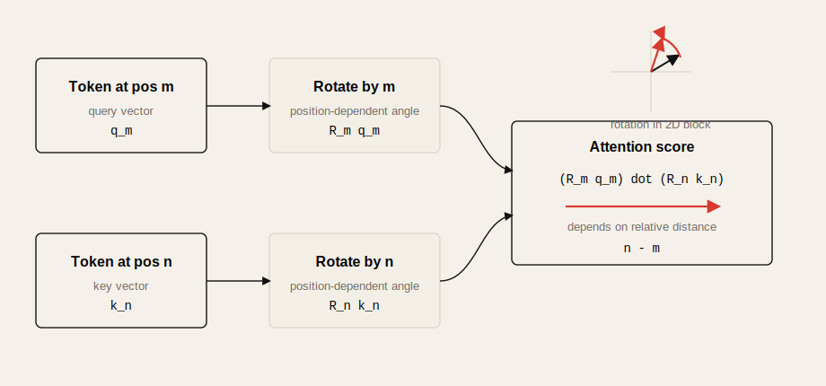
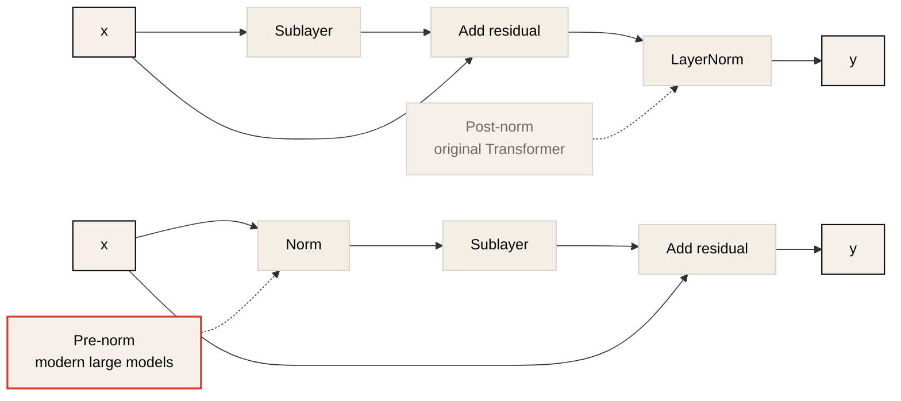
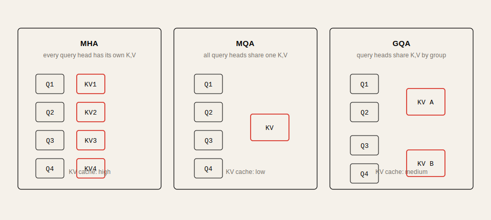
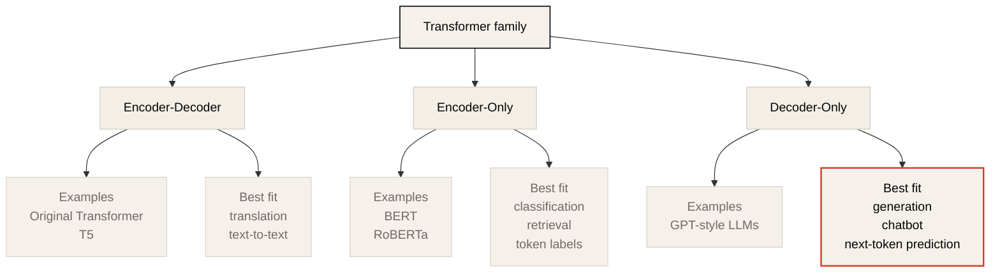
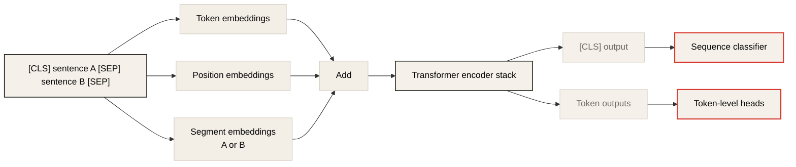

# Lecture 2: Transformer-Based Models & Tricks

Source: [CME295 Lecture 2](https://www.youtube.com/watch?v=yT84Y5zCnaA)

## Table of Contents

* [Goal](#goal)
* [Lecture Overview](#lecture-overview)
* [Self-Attention Recap](#self-attention-recap)
* [Multi-Head Attention Intuition](#multi-head-attention-intuition)
* [Why Position Information Is Needed](#why-position-information-is-needed)
* [Learned Positional Embeddings](#learned-positional-embeddings)
* [Sinusoidal Positional Encoding](#sinusoidal-positional-encoding)
* [Relative Position Bias and ALiBi](#relative-position-bias-and-alibi)
* [RoPE: Rotary Position Embedding](#rope-rotary-position-embedding)
* [Layer Normalization and RMSNorm](#layer-normalization-and-rmsnorm)
* [Attention Variants for Long Context and Inference](#attention-variants-for-long-context-and-inference)
* [Transformer Model Families](#transformer-model-families)
* [Encoder-Only Models and BERT](#encoder-only-models-and-bert)
* [BERT Pre-Training Objectives](#bert-pre-training-objectives)
* [Fine-Tuning BERT](#fine-tuning-bert)
* [DistilBERT and RoBERTa](#distilbert-and-roberta)
* [Practical Tips and Notes](#practical-tips-and-notes)
* [Chapter Summary](#chapter-summary)
* [Key Terms](#key-terms)
* [Questions](#questions)
* [Answers](#answers)

---

## Goal

이번 강의의 목표는 원래 Transformer 구조가 오늘날 LLM과 BERT 계열 모델로 어떻게 변형되었는지 이해하는 것이다.

핵심 메시지는 다음과 같다.

> 현대 Transformer 모델은 2017년 원래 구조를 그대로 복사한 것이 아니라, positional encoding, normalization, attention pattern, KV projection sharing, 학습 objective를 목적에 맞게 바꾼 진화형 구조다.

이 장에서는 다음을 다룬다.

* self-attention과 multi-head attention 복습
* learned positional embedding과 sinusoidal positional encoding
* relative position bias, ALiBi, RoPE
* post-norm에서 pre-norm으로의 변화
* LayerNorm에서 RMSNorm으로의 변화
* full attention, sliding window attention, global/local attention
* MHA, MQA, GQA와 KV cache 메모리 절감
* encoder-decoder, encoder-only, decoder-only Transformer 계열
* BERT의 입력 표현, MLM, NSP, fine-tuning
* DistilBERT와 RoBERTa가 해결하려 한 문제

---

## Lecture Overview

강의는 크게 두 부분으로 나뉜다.

첫 번째 부분은 Transformer 내부 구성요소의 변화다. 원래 Transformer는 token embedding에 positional encoding을 더하고, attention block 뒤에 add-and-norm을 두며, 모든 token이 모든 token에 attention하는 구조였다. 하지만 현대 모델은 긴 context, 안정적인 대규모 학습, 낮은 inference latency, KV cache 비용 절감을 위해 여러 부분을 바꾸었다.

두 번째 부분은 Transformer 계열 모델의 분류다. 원래 Transformer는 encoder와 decoder를 모두 가진 encoder-decoder 구조였다. 이후 classification과 representation learning에는 encoder-only 구조인 BERT가 널리 쓰였고, 오늘날 chatbot과 LLM의 중심은 decoder-only 구조로 이동했다.

---

## Self-Attention Recap

Self-attention의 기본 아이디어는 각 token이 sequence 안의 다른 token을 직접 참조할 수 있게 하는 것이다. 각 token representation에서 `Q`, `K`, `V`를 만들고, query와 key의 dot product로 어떤 token이 중요한지 계산한 뒤, 그 attention weight로 value를 가중합한다.

기본 수식은 다음과 같다.

```math
\text{Attention}(Q, K, V) =
\text{softmax}\left(\frac{QK^T}{\sqrt{d_k}}\right)V
```

직관은 다음과 같다.

| Symbol | Meaning | Intuition |
| ------ | ------- | --------- |
| `Q` | Query | 현재 token이 찾고 싶은 정보 |
| `K` | Key | 다른 token이 검색될 수 있는 특징 |
| `V` | Value | 실제로 전달되는 내용 |
| `QK^T` | Score | token 간 유사도 또는 관련성 |
| `softmax` | Weight | 관련성을 확률처럼 정규화 |

강의에서는 이 연산이 큰 matrix multiplication으로 표현되기 때문에 하드웨어에서 매우 효율적으로 최적화될 수 있다는 점도 강조한다. Transformer가 병렬화에 유리한 이유가 여기에 있다.

---

## Multi-Head Attention Intuition

Multi-head attention은 하나의 attention만 두는 대신 여러 attention head를 병렬로 둔다. 각 head는 자기만의 projection matrix를 사용해 `Q`, `K`, `V`를 만들고, 서로 다른 방식으로 token 관계를 학습할 기회를 갖는다.

```text
Input
  -> Head 1: Q1, K1, V1 -> Attention output 1
  -> Head 2: Q2, K2, V2 -> Attention output 2
  -> ...
  -> Concatenate
  -> Output projection
```

각 head가 완전히 해석 가능한 기능 하나를 맡는다고 단정할 수는 없지만, attention map을 보면 어떤 head는 문법적 관계, 어떤 head는 참조 관계, 어떤 head는 특정 주변 token에 강하게 반응하는 식의 차이를 보일 수 있다.

강의의 예시는 `its` 같은 token이 앞의 `law`, `application` 같은 token에 높은 attention weight를 둘 수 있음을 보여준다. 이는 model이 문장 안의 참조 관계를 attention으로 포착할 수 있음을 직관적으로 설명한다.

---

## Why Position Information Is Needed

Self-attention은 모든 token을 병렬로 본다. RNN처럼 첫 번째 token, 두 번째 token을 순서대로 처리하지 않는다. 이 장점 때문에 병렬화가 가능하지만, 동시에 token의 순서 정보가 기본적으로 사라진다.

예를 들어 다음 두 문장은 같은 token을 포함하지만 의미가 다르다.

```text
I love you
You love I
```

따라서 Transformer는 token embedding 외에 position information을 주입해야 한다. 원래 Transformer는 token embedding과 positional encoding을 더했다.

```math
x_i = e_i + p_i
```

여기서 `e_i`는 token embedding이고, `p_i`는 position embedding이다. 중요한 조건은 두 vector의 차원이 같아야 한다는 것이다.

---

## Learned Positional Embeddings

가장 직접적인 방식은 각 position마다 별도의 embedding vector를 학습하는 것이다.

```text
position 1 -> learnable vector p1
position 2 -> learnable vector p2
position 3 -> learnable vector p3
...
```

이 방식의 장점은 단순하다. position embedding도 다른 parameter와 같이 gradient descent로 학습하면 된다. model이 data에 맞는 position 표현을 직접 찾을 수 있다.

하지만 단점도 명확하다.

| Issue | Explanation |
| ----- | ----------- |
| Training set bias | 특정 position에 반복적으로 나타나는 pattern을 과하게 학습할 수 있다. |
| Maximum length limit | 학습 중 본 maximum sequence length까지만 embedding을 배운다. |
| Extrapolation problem | inference에서 더 긴 sequence가 들어오면 해당 position embedding이 없다. |

예를 들어 학습 시 sequence length가 최대 512였다면, position 513 이상의 embedding은 학습되지 않았다. 긴 context를 다뤄야 하는 LLM에서는 이 문제가 커진다.

---

## Sinusoidal Positional Encoding

원래 Transformer 논문은 learned positional embedding뿐 아니라 sinusoidal positional encoding도 실험했다. 이 방식은 position embedding을 학습하지 않고, sin/cos 수식으로 고정된 vector를 만든다.

```math
PE_{(pos, 2i)} = \sin\left(\frac{pos}{10000^{2i/d_{model}}}\right)
```

```math
PE_{(pos, 2i+1)} = \cos\left(\frac{pos}{10000^{2i/d_{model}}}\right)
```

강의의 핵심 설명은 dot product 관점이다. 두 position `m`, `n`의 positional encoding을 dot product하면, 그 결과 안에는 다음과 같은 상대 거리 항이 등장한다.

```math
\cos(\omega_i(m - n))
```

즉 position embedding의 유사도가 absolute position 자체보다 두 token 사이의 상대 거리와 연결된다. 가까운 token은 더 비슷하게, 먼 token은 덜 비슷하게 보이도록 하는 직관과 맞다.

또 다른 장점은 sequence length extrapolation이다. learned embedding은 미리 정한 position까지만 존재하지만, sinusoidal encoding은 수식으로 계산하므로 임의의 position에 대해 값을 만들 수 있다.

---

## Relative Position Bias and ALiBi

초기 방식은 position 정보를 input embedding에 더했다. 하지만 attention에서 실제로 중요한 것은 `QK^T`로 계산되는 token 간 similarity다. 그래서 이후 방법들은 position 정보를 attention score에 직접 넣는 방향으로 발전했다.

Relative position bias는 attention score 안에 위치 차이에 따른 bias를 더한다.

```math
\text{softmax}\left(\frac{QK^T}{\sqrt{d_k}} + b_{m-n}\right)
```

여기서 `b_{m-n}`은 position `m`과 `n`의 상대 거리에 따른 bias다. T5 계열은 상대 거리 값을 bucket으로 나누고, 각 bucket의 bias를 학습하는 방식을 사용한다.

ALiBi는 이 bias를 학습하지 않고, 상대 거리에 대한 deterministic linear bias로 둔다. 멀리 있는 token에 더 불리한 bias를 주는 단순한 방식이다. 학습 parameter가 줄고 긴 context extrapolation에 유리하지만, 표현력이 제한될 수 있다.

| Method | Position injection point | Learned? | Main benefit |
| ------ | ------------------------ | -------- | ------------ |
| Learned positional embedding | Input embedding | Yes | 단순하고 data-adaptive |
| Sinusoidal encoding | Input embedding | No | 길이 extrapolation 가능 |
| Relative position bias | Attention score | Usually yes | attention similarity에 직접 반영 |
| ALiBi | Attention score | No | 단순하고 긴 길이에 강함 |

---

## RoPE: Rotary Position Embedding

RoPE, Rotary Position Embedding은 현대 LLM에서 매우 널리 쓰이는 positional encoding 방식이다. 핵심 아이디어는 position 정보를 input embedding에 더하지 않고, attention에 들어가는 query와 key vector를 position에 따라 회전시키는 것이다.



2D에서 vector를 각도 `theta`만큼 회전시키려면 rotation matrix를 곱한다.

```math
R_\theta =
\begin{bmatrix}
\cos\theta & -\sin\theta \\
\sin\theta & \cos\theta
\end{bmatrix}
```

RoPE는 이 아이디어를 고차원 vector에 block-wise로 적용한다. query는 자기 position `m`에 해당하는 각도로 회전하고, key는 자기 position `n`에 해당하는 각도로 회전한다.

```text
q_m -> rotate(q_m, m)
k_n -> rotate(k_n, n)
```

이렇게 한 뒤 dot product를 계산하면 attention score가 두 token의 상대 거리 `n - m`의 함수가 된다. 이는 positional encoding에서 원했던 성질과 잘 맞는다.

```text
absolute position을 직접 외우는 대신,
attention score가 relative distance를 반영하게 만든다.
```

RoPE가 중요한 이유는 다음과 같다.

* position 정보가 attention score에 직접 반영된다.
* 상대 거리 기반 inductive bias를 제공한다.
* learned absolute position embedding보다 긴 context 확장에 유리하다.
* 많은 decoder-only LLM이 RoPE 계열을 사용한다.

주의할 점도 있다. RoPE가 모든 긴 context 문제를 자동으로 해결하는 것은 아니다. 긴 context 확장에서는 RoPE scaling, attention implementation, KV cache 메모리, 학습 시 context length가 함께 작용한다.

---

## Layer Normalization and RMSNorm

Transformer block에는 residual connection과 normalization이 들어간다. 원래 Transformer 그림에는 `Add & Norm`으로 표현된다.



원래 구조는 sublayer output과 input을 더한 뒤 normalize하는 post-norm 형태였다.

```text
x -> sublayer -> add residual -> layer norm
```

현대 LLM에서는 보통 pre-norm 구조가 더 많이 쓰인다.

```text
x -> norm -> sublayer -> add residual
```

pre-norm은 깊은 network에서 gradient flow와 학습 안정성 측면에서 유리한 경우가 많다. 특히 대규모 Transformer를 안정적으로 학습할 때 post-norm보다 다루기 쉽다.

LayerNorm은 vector의 평균과 표준편차를 사용해 activation을 normalize한다.

```math
\text{LayerNorm}(x) =
\gamma \frac{x - \mu}{\sigma} + \beta
```

RMSNorm은 평균을 빼지 않고 root mean square로만 normalize하며, 보통 `gamma`만 학습한다.

```math
\text{RMSNorm}(x) =
\gamma \frac{x}{\sqrt{\frac{1}{d}\sum_i x_i^2 + \epsilon}}
```

강의에서는 RMSNorm이 LayerNorm과 유사한 수렴 특성을 보이면서도 parameter와 연산을 줄일 수 있다는 점을 설명한다. 많은 현대 LLM은 LayerNorm 대신 RMSNorm을 사용한다.

| Normalization | Uses mean centering? | Learned terms | Common use |
| ------------- | -------------------- | ------------- | ---------- |
| LayerNorm | Yes | `gamma`, `beta` | Original Transformer, BERT 계열 |
| RMSNorm | No | usually `gamma` | 현대 decoder-only LLM |

BatchNorm과의 차이도 중요하다. BatchNorm은 batch dimension을 기준으로 normalize하므로 batch 구성에 영향을 받는다. Transformer language model에서는 sequence length, variable batch, autoregressive inference 때문에 LayerNorm/RMSNorm이 더 자연스럽다.

---

## Attention Variants for Long Context and Inference

Full self-attention은 모든 token pair를 비교한다. sequence length를 `n`이라고 하면 attention matrix는 `n x n`이고, 계산량과 memory가 대략 `O(n^2)`로 증가한다.

긴 context에서는 이 비용이 큰 병목이 된다. 이를 줄이기 위해 local attention 또는 sliding window attention을 사용한다.

```text
Full attention:
token i attends to every token

Sliding window attention:
token i attends only to nearby tokens
```

Sliding window attention은 convolution의 receptive field와 비슷하게 이해할 수 있다. 한 layer에서는 가까운 token만 보지만, 여러 layer를 쌓으면 정보가 점진적으로 더 넓은 범위로 전파될 수 있다. Mistral 계열처럼 sliding window attention을 활용하는 모델이 대표적 예다.

일부 모델은 local attention과 global attention layer를 섞는다. local attention은 비용을 줄이고, global attention은 멀리 떨어진 token 간 정보 전달을 보완한다.

### MHA, MQA, GQA

Inference에서 또 하나의 큰 비용은 KV cache다. Autoregressive decoding에서는 새 token을 생성할 때마다 이전 token들의 key/value를 다시 참조한다. 그래서 key와 value를 cache해 두는데, head마다 별도 `K`, `V` projection을 가지면 cache가 커진다.



이를 줄이기 위한 attention variant가 MQA와 GQA다.

| Method | Query heads | Key/Value heads | KV cache cost | Trade-off |
| ------ | ----------- | --------------- | ------------- | --------- |
| MHA | Many | Many | High | 표현력 높음 |
| MQA | Many | 1 shared KV | Low | 비용 절감 크지만 표현력 손실 가능 |
| GQA | Many | Grouped KV | Medium | MHA와 MQA 사이의 절충 |

Multi-query attention, MQA는 모든 query head가 하나의 shared key/value projection을 사용한다. Grouped-query attention, GQA는 여러 query head를 group으로 나누고 group마다 key/value를 공유한다. 최근 LLM에서는 latency와 memory 절감을 위해 GQA를 자주 볼 수 있다.

---

## Transformer Model Families

Transformer 계열은 크게 세 가지로 나눌 수 있다.



| Family | Architecture | Main objective | Typical use |
| ------ | ------------ | -------------- | ----------- |
| Encoder-decoder | Encoder + decoder | sequence-to-sequence | translation, T5 |
| Encoder-only | Encoder only | representation learning | classification, retrieval, token classification |
| Decoder-only | Decoder only | next-token prediction | LLM, chatbot, text generation |

### Encoder-Decoder

원래 Transformer는 machine translation을 위해 제안되었다. encoder는 source language 문장을 representation으로 바꾸고, decoder는 target language 문장을 autoregressive하게 생성한다.

T5는 encoder-decoder 계열의 대표적인 후속 모델이다. T5의 이름은 Text-to-Text Transfer Transformer에서 왔다. 모든 task를 text-to-text format으로 바꾸고, span corruption objective로 학습한다.

T5의 span corruption은 입력 문장에서 연속된 span을 sentinel token으로 가리고, decoder가 가려진 span을 복원하도록 학습하는 방식이다.

```text
Input:  my teddy bear <extra_id_0> is reading
Target: <extra_id_0> cute <extra_id_1>
```

### Encoder-Only

Encoder-only 모델은 decoder를 제거하고 encoder representation만 사용한다. text generation에는 맞지 않지만, 문장 또는 token의 의미 표현을 얻는 데 강하다.

대표 모델은 BERT다. BERT는 bidirectional self-attention을 사용해 각 token이 좌우 context를 모두 볼 수 있게 한다. 따라서 classification, sentiment analysis, named entity recognition, extractive question answering 같은 task에 적합하다.

### Decoder-Only

Decoder-only 모델은 encoder와 cross-attention을 제거하고 masked self-attention과 FFN으로 구성된 decoder block만 쌓는다. 오늘날 GPT류 LLM과 chatbot 중심 모델이 이 계열이다.

decoder-only 모델의 핵심 objective는 next-token prediction이다.

```math
P(x_1, ..., x_T) = \prod_{t=1}^{T} P(x_t | x_{<t})
```

강의에서는 compute budget을 decoder-only와 next-token prediction에 투자하는 방식이 scale-up과 generalization에 매우 잘 맞았다고 설명한다.

---

## Encoder-Only Models and BERT

BERT는 Bidirectional Encoder Representations from Transformers의 약자다. 이름 그대로 Transformer encoder를 사용해 bidirectional representation을 학습한다.



BERT의 중요한 입력 token은 다음과 같다.

| Token | Role |
| ----- | ---- |
| `[CLS]` | sequence-level classification을 위한 대표 token |
| `[SEP]` | 두 sentence 또는 segment를 구분 |
| `[MASK]` | masked language modeling에서 예측 대상 표시 |
| `[PAD]` | batch 안에서 sequence length를 맞추기 위한 padding |

BERT 입력 embedding은 세 가지를 더해 만든다.

```text
input representation =
token embedding + position embedding + segment embedding
```

segment embedding은 sentence A와 sentence B를 구분하기 위한 learned embedding이다. NSP task에서 두 문장이 연속인지 판단해야 하므로, 각 token이 어느 segment에 속하는지 알려준다.

```text
[CLS] sentence A [SEP] sentence B [SEP]
       segment A       segment B
```

BERT가 bidirectional하다는 말은 encoder self-attention에 causal mask가 없다는 뜻이다. 각 token은 왼쪽 token과 오른쪽 token을 모두 attend할 수 있다. 이는 decoder-only GPT의 masked self-attention과 다르다.

---

## BERT Pre-Training Objectives

BERT는 pre-training과 fine-tuning의 두 단계로 사용된다. pre-training에서는 대규모 unlabeled text에서 일반적인 language representation을 학습하고, fine-tuning에서는 특정 downstream task에 맞게 classifier 또는 task head를 붙인다.

### Masked Language Modeling

Masked Language Modeling, MLM은 입력 token 일부를 예측하도록 하는 objective다. 선택된 token에 대해 BERT 논문은 다음과 같은 전략을 사용한다.

| Case | Ratio | Action |
| ---- | ----- | ------ |
| Mask | 80% | token을 `[MASK]`로 바꿈 |
| Keep | 10% | token을 그대로 둠 |
| Random | 10% | random token으로 바꿈 |

이 task는 model이 masked token을 맞히기 위해 좌우 context를 모두 사용하게 만든다. 즉 bidirectional encoder의 장점이 objective에 직접 반영된다.

### Next Sentence Prediction

Next Sentence Prediction, NSP는 두 sentence가 실제로 연속된 문장인지 맞히는 binary classification task다.

```text
50%: sentence A 다음에 실제 sentence B가 온다.
50%: sentence A 다음에 random sentence B가 온다.
```

model은 `[CLS]` output representation 위에 classification head를 붙여 두 문장이 consecutive한지 판단한다. 원래 BERT 논문은 NSP가 sentence relationship을 학습하는 데 도움이 된다고 가정했다.

이 가정은 이후 RoBERTa 등에서 도전받았다. RoBERTa는 NSP를 제거해도 성능이 거의 떨어지지 않음을 보였고, 대신 data 규모, dynamic masking, 학습 설정을 개선했다.

---

## Fine-Tuning BERT

Fine-tuning 단계에서는 pre-trained BERT encoder 위에 task-specific head를 붙인다. task 종류에 따라 `[CLS]` token만 사용할 수도 있고, 모든 token의 output embedding을 사용할 수도 있다.

### Sequence Classification

Sentiment classification처럼 sequence 전체를 분류하는 task에서는 `[CLS]` output embedding을 사용한다.

```text
input tokens
  -> BERT encoder
  -> output embedding of [CLS]
  -> linear classifier
  -> label
```

`[CLS]` token은 일반 token과 동일하게 query, key, value projection을 거쳐 self-attention에 참여한다. 여러 encoder layer를 지나면서 다른 token의 context가 `[CLS]` representation에 섞이기 때문에 sequence-level representation으로 사용할 수 있다.

### Token-Level Tasks

Question answering이나 named entity recognition처럼 token별 판단이 필요한 task에서는 각 token의 output embedding을 사용한다.

예를 들어 extractive QA에서는 answer span의 시작 token과 끝 token을 예측하기 위해 두 개의 classifier head를 token별로 적용할 수 있다.

```text
token output embeddings
  -> start-position classifier
  -> end-position classifier
```

따라서 BERT가 항상 `[CLS]`만 쓰는 것은 아니다. `[CLS]`는 sequence-level task에 적합하고, token-level task에서는 각 token representation이 중요하다.

---

## DistilBERT and RoBERTa

BERT는 강력했지만 한계도 있었다.

* context length가 보통 512 token 수준으로 제한됐다.
* BERT-base도 약 110M parameter로 latency와 serving cost가 작지 않았다.
* MLM과 NSP objective가 모두 필요한지 의문이 있었다.

### DistilBERT

DistilBERT는 knowledge distillation으로 BERT를 더 작고 빠르게 만들려는 시도다. 핵심은 큰 teacher model의 hard label만 따라 하는 것이 아니라, teacher가 출력하는 probability distribution을 student model이 모방하게 하는 것이다.

Teacher distribution에는 class 간 상대적 유사도 정보가 들어 있다. 예를 들어 정답 label 하나만 보는 것보다, teacher가 어떤 오답을 얼마나 그럴듯하게 보았는지도 학습 신호가 된다.

distillation loss에는 KL divergence가 자주 쓰인다.

```math
D_{KL}(P_T || P_S)
```

여기서 `P_T`는 teacher distribution, `P_S`는 student distribution이다. student가 teacher의 output distribution에 가까워지도록 학습한다.

### RoBERTa

RoBERTa는 BERT 학습 절차를 재검토했다. 강의에서 강조한 변화는 다음과 같다.

* NSP objective를 제거했다.
* masking을 static하게 고정하지 않고 epoch마다 dynamic하게 바꿨다.
* 더 크고 다양한 data로 더 오래 학습했다.

RoBERTa의 핵심 교훈은 BERT의 구조 자체만큼이나 pre-training recipe가 중요하다는 것이다. 같은 encoder-only 계열이라도 data, masking strategy, objective 선택, training budget이 성능을 크게 바꾼다.

---

## Practical Tips and Notes

### Position Encoding을 모델 선택 기준으로 보기

긴 context가 필요한 모델을 고를 때는 parameter 수만 보지 말고 positional encoding 방식을 확인해야 한다. learned absolute positional embedding은 학습된 길이 바깥으로 일반화하기 어렵다. RoPE나 ALiBi 계열은 상대적으로 긴 길이 확장에 유리하지만, 실제 품질은 학습 context length와 serving implementation에도 좌우된다.

### KV Cache 비용을 먼저 계산하기

LLM inference에서는 parameter memory보다 KV cache가 먼저 병목이 되는 경우가 많다. 특히 batch size, sequence length, number of layers, number of KV heads가 커지면 cache가 빠르게 증가한다. GQA/MQA를 쓰는 모델은 같은 hidden size와 head 수라도 KV cache가 더 작을 수 있다.

```text
KV cache pressure roughly grows with:
batch_size x sequence_length x layers x kv_heads x head_dim
```

### BERT와 Decoder-Only LLM을 같은 도구로 보지 않기

BERT는 classification, retrieval feature, token classification에 강하다. Decoder-only LLM은 generation과 instruction following에 강하다. 둘 다 Transformer지만 attention mask, training objective, serving pattern이 다르다.

| Task | Better default |
| ---- | -------------- |
| 문장 분류 | BERT/RoBERTa 계열 |
| 개체명 인식 | BERT 계열 token classifier |
| 긴 답변 생성 | decoder-only LLM |
| embedding 기반 검색 | encoder 또는 embedding-specialized model |
| chatbot | decoder-only instruction model |

### Normalization은 학습 안정성 문제로 보기

LayerNorm, RMSNorm, pre-norm, post-norm은 단순한 구현 세부사항이 아니다. 깊은 Transformer에서 gradient flow, activation scale, 학습 안정성에 직접 연결된다. 기존 모델을 재현하거나 변형할 때 normalization 위치를 바꾸면 학습 dynamics가 달라질 수 있다.

### Attention Complexity를 Context Length와 함께 보기

Full attention의 `O(n^2)` 비용은 context length가 길어질 때 바로 문제가 된다. sliding window attention, sparse attention, local/global mix는 긴 context를 가능하게 하지만, 멀리 떨어진 token 사이의 정보 전달 방식이 바뀐다. 따라서 긴 문서 QA, code repository 분석, multi-document reasoning 같은 task에서는 attention pattern이 품질에 영향을 줄 수 있다.

### Quick Reference

| Symptom | First Check |
| ------- | ----------- |
| 긴 prompt에서 품질이 급격히 나빠진다 | 학습 context length, RoPE scaling, attention pattern |
| inference memory가 예상보다 크다 | KV cache size, KV heads, batch size, max sequence length |
| BERT classifier가 domain task에서 약하다 | tokenizer mismatch, fine-tuning data size, cased/uncased 선택 |
| long document classification이 어렵다 | BERT 512-token limit, chunking strategy, long-context encoder |
| LLM serving latency가 높다 | GQA/MQA 여부, KV cache layout, batching, prefill/decode 분리 |

---

## Chapter Summary

Transformer의 기본 구조는 단순하지만, 현대 모델은 목적에 맞게 여러 부분을 바꾸어 왔다. position 정보는 input embedding에 더하는 방식에서 attention score에 직접 개입하는 방식으로 발전했고, RoPE는 query/key rotation을 통해 상대 거리 정보를 attention에 녹여 넣는다.

Normalization은 post-norm LayerNorm에서 pre-norm과 RMSNorm 중심으로 이동했다. 이는 대규모 모델 학습 안정성과 효율성 때문이다. Attention은 full attention의 `O(n^2)` 비용을 줄이기 위해 sliding window, local/global mix, MQA, GQA 같은 변형을 갖게 되었다.

모델 계열도 목적에 따라 갈라졌다. Encoder-decoder는 sequence-to-sequence task에, encoder-only BERT는 representation과 classification에, decoder-only LLM은 next-token prediction과 generation에 최적화되었다.

BERT는 encoder-only Transformer의 대표 모델이다. `[CLS]`, `[SEP]`, segment embedding, MLM, NSP를 사용해 bidirectional representation을 학습했고, 이후 fine-tuning으로 다양한 downstream task에 적용되었다. DistilBERT는 비용을 줄이기 위해 distillation을 사용했고, RoBERTa는 NSP 제거, dynamic masking, 더 큰 data와 training recipe로 BERT의 학습 절차를 개선했다.

---

## Key Terms

| Term | Meaning |
| ---- | ------- |
| Self-attention | 같은 sequence 안의 token들이 서로를 attend하는 mechanism |
| Multi-head attention | 여러 attention head를 병렬로 사용해 다양한 relation을 학습하는 구조 |
| Positional embedding | token 순서 정보를 model에 주입하기 위한 vector |
| Sinusoidal encoding | sin/cos 수식으로 만든 고정 positional encoding |
| Relative position bias | attention score에 상대 거리 기반 bias를 더하는 방식 |
| ALiBi | attention score에 deterministic linear position bias를 넣는 방식 |
| RoPE | query와 key를 position별로 회전시켜 상대 거리 정보를 반영하는 방식 |
| LayerNorm | activation vector의 평균과 표준편차로 normalize하는 방식 |
| RMSNorm | root mean square만 사용해 normalize하는 방식 |
| Sliding window attention | 주변 token window 안에서만 attention하는 방식 |
| MQA | 여러 query head가 하나의 shared key/value head를 쓰는 attention |
| GQA | query head group별로 key/value head를 공유하는 attention |
| Encoder-decoder | encoder와 decoder를 모두 가진 sequence-to-sequence Transformer |
| Encoder-only | encoder만 사용하는 representation model 계열 |
| Decoder-only | masked self-attention decoder block만 사용하는 generation model 계열 |
| BERT | bidirectional encoder representation을 학습하는 encoder-only Transformer |
| MLM | masked token을 예측하는 BERT pre-training objective |
| NSP | 두 sentence가 연속인지 예측하는 BERT pre-training objective |
| Distillation | 큰 teacher model의 output distribution을 작은 student model이 모방하는 학습 |

---

## Questions

1. 왜 Transformer에는 positional encoding이 필요한가?
2. learned positional embedding의 긴 context 한계는 무엇인가?
3. sinusoidal positional encoding에서 dot product가 상대 거리와 연결되는 이유는 무엇인가?
4. position 정보를 input embedding에 더하는 방식과 attention score에 넣는 방식은 어떤 차이가 있는가?
5. RoPE는 query와 key에 어떤 변환을 적용하며, 그 결과 어떤 성질을 얻는가?
6. post-norm과 pre-norm의 차이는 무엇인가?
7. RMSNorm은 LayerNorm과 무엇이 다른가?
8. sliding window attention은 full attention의 어떤 문제를 줄이는가?
9. MHA, MQA, GQA는 KV cache 관점에서 어떻게 다른가?
10. encoder-decoder, encoder-only, decoder-only Transformer는 각각 어떤 task에 적합한가?
11. BERT의 `[CLS]` token은 왜 sequence classification에 쓰일 수 있는가?
12. MLM의 80/10/10 masking rule은 무엇인가?
13. NSP는 어떤 task이며, RoBERTa는 이 objective를 어떻게 다루었는가?
14. DistilBERT에서 teacher distribution을 학습하는 이유는 무엇인가?

---

## Answers

1. Self-attention은 token을 병렬로 처리하므로 순서 정보가 기본적으로 없다. 같은 token 집합이라도 순서가 달라지면 의미가 달라지므로 position 정보를 별도로 주입해야 한다.
2. 학습 중 본 maximum position까지만 embedding이 존재한다. 더 긴 sequence가 inference에 들어오면 해당 position embedding을 학습하지 않았기 때문에 extrapolation이 어렵다.
3. sin/cos 항의 dot product에는 `cos(omega_i(m-n))` 같은 항이 나타난다. 따라서 두 position의 유사도가 absolute position이 아니라 상대 거리 `m-n`의 함수로 표현된다.
4. input embedding에 더하는 방식은 position 정보가 attention layer에 간접적으로 전달된다. attention score에 넣는 방식은 token 간 similarity 계산 자체에 position bias를 직접 반영한다.
5. RoPE는 query와 key vector를 각 token position에 따른 각도로 회전시킨다. 회전된 query와 key의 dot product는 두 token의 상대 거리와 연결된다.
6. Post-norm은 sublayer output과 residual을 더한 뒤 normalize한다. Pre-norm은 sublayer에 들어가기 전에 normalize하고, 그 output을 residual에 더한다.
7. LayerNorm은 평균을 빼고 표준편차로 나눈 뒤 `gamma`, `beta`를 적용한다. RMSNorm은 평균 제거 없이 root mean square로 나누며 보통 `gamma`만 학습한다.
8. Full attention은 sequence length `n`에 대해 `O(n^2)` 비용을 갖는다. Sliding window attention은 각 token이 주변 window만 보게 해 긴 context의 계산량과 memory 부담을 줄인다.
9. MHA는 head마다 별도 key/value를 가지므로 KV cache가 크다. MQA는 모든 query head가 하나의 key/value를 공유해 cache를 크게 줄인다. GQA는 group 단위로 key/value를 공유해 절충한다.
10. Encoder-decoder는 translation 같은 sequence-to-sequence task에 적합하다. Encoder-only는 classification과 representation task에 적합하다. Decoder-only는 next-token prediction 기반 generation에 적합하다.
11. `[CLS]`도 다른 token처럼 self-attention에 참여한다. 여러 encoder layer를 지나며 전체 sequence의 context가 `[CLS]` output embedding에 섞이므로 sequence-level classifier 입력으로 사용할 수 있다.
12. MLM 대상 token 중 80%는 `[MASK]`로 바꾸고, 10%는 그대로 두며, 10%는 random token으로 바꾼다. model은 이 선택된 위치의 원래 token을 예측한다.
13. NSP는 두 sentence가 실제로 연속된 문장인지 `[CLS]` 기반 classifier로 맞히는 task다. RoBERTa는 NSP를 제거해도 성능이 거의 떨어지지 않음을 보이고, dynamic masking과 더 큰 data/training으로 성능을 개선했다.
14. Hard label 하나보다 teacher의 probability distribution이 더 많은 정보를 담고 있기 때문이다. student는 KL divergence 등을 통해 teacher distribution을 모방하면서 더 작은 model로도 성능을 유지하려 한다.
