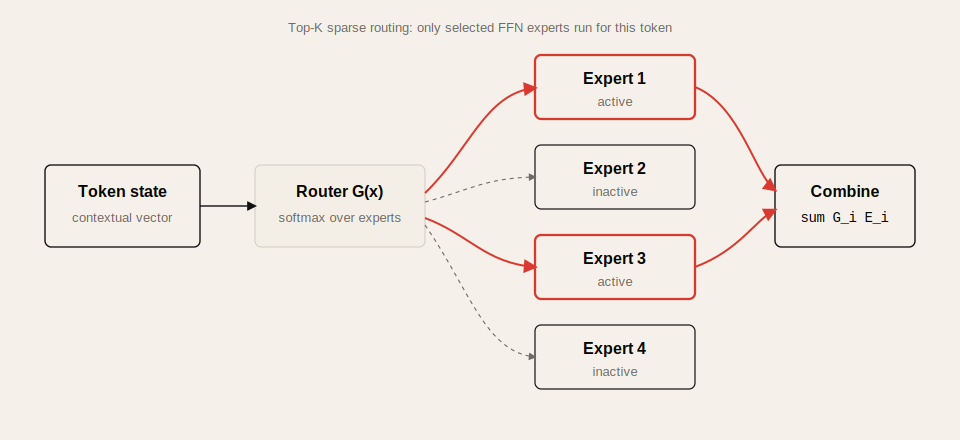
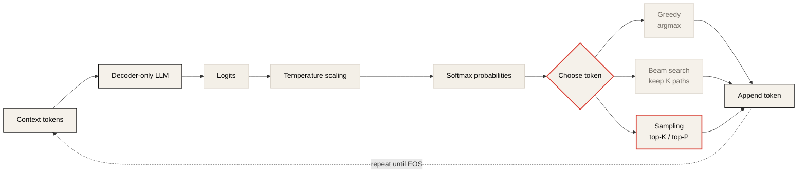
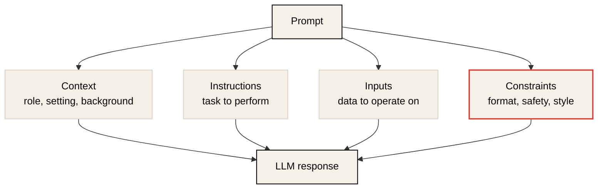
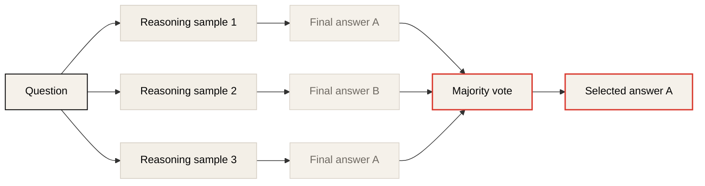
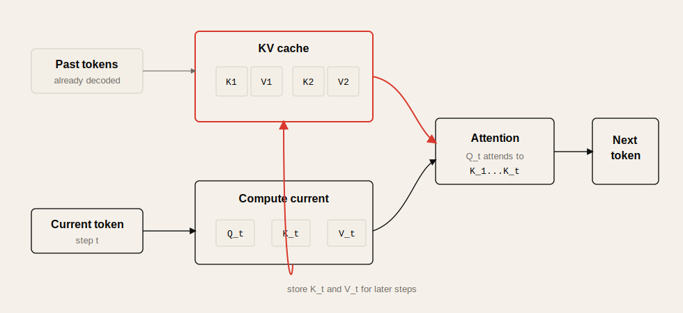

# Lecture 3: Large Language Models, Decoding, Prompting, and Inference

Source: [CME295 Lecture 3](https://www.youtube.com/watch?v=Q5baLehv5So)

## Table of Contents

* [Goal](#goal)
* [Lecture Overview](#lecture-overview)
* [From Transformer Families to LLMs](#from-transformer-families-to-llms)
* [What Makes a Language Model Large](#what-makes-a-language-model-large)
* [Decoder-Only Backbone](#decoder-only-backbone)
* [Mixture of Experts](#mixture-of-experts)
* [Sparse MoE and Routing](#sparse-moe-and-routing)
* [Routing Collapse and Load Balancing](#routing-collapse-and-load-balancing)
* [Next Token Generation](#next-token-generation)
* [Greedy Decoding and Beam Search](#greedy-decoding-and-beam-search)
* [Sampling, Top-K, Top-P, and Temperature](#sampling-top-k-top-p-and-temperature)
* [Guided Decoding](#guided-decoding)
* [Context Length and Context Rot](#context-length-and-context-rot)
* [Prompt Structure](#prompt-structure)
* [In-Context Learning](#in-context-learning)
* [Chain of Thought and Self-Consistency](#chain-of-thought-and-self-consistency)
* [Inference Efficiency](#inference-efficiency)
* [KV Cache](#kv-cache)
* [PagedAttention](#pagedattention)
* [Multi-Latent Attention](#multi-latent-attention)
* [Speculative Decoding](#speculative-decoding)
* [Multi-Token Prediction](#multi-token-prediction)
* [Practical Tips and Notes](#practical-tips-and-notes)
* [Lecture Summary](#lecture-summary)
* [Key Terms](#key-terms)
* [Questions](#questions)
* [Answers](#answers)

---

## Goal

이번 강의의 목표는 현대 LLM을 **decoder-only Transformer 기반의 next-token prediction system**으로 이해하고, 그 위에서 실제 응답이 어떻게 생성되고 최적화되는지 파악하는 것이다.

핵심 메시지는 다음과 같다.

> LLM은 단순히 큰 Transformer가 아니라, decoder-only architecture, token sampling strategy, prompt design, KV cache, MoE, speculative decoding 같은 학습/추론/서빙 기법이 결합된 시스템이다.

이 강의는 다음을 다룬다.

* LLM의 정의와 decoder-only model의 위치
* model size, training tokens, compute 관점의 "large"
* Mixture of Experts, sparse MoE, router, routing collapse
* greedy decoding, beam search, sampling
* top-K, top-P, temperature의 의미
* guided decoding과 structured output
* context length, context rot, needle-in-a-haystack 문제
* prompt 구성요소와 in-context learning
* zero-shot, few-shot, chain-of-thought, self-consistency
* KV cache, GQA, PagedAttention, multi-latent attention
* speculative decoding과 multi-token prediction

---

## Lecture Overview

Lecture 1과 2에서는 self-attention, Transformer, encoder-decoder, encoder-only, decoder-only model family를 다뤘다. Lecture 3는 이 기반 위에서 드디어 Large Language Model, LLM을 정의한다.

강의의 전반부는 LLM의 구조와 응답 생성 방식이다. LLM은 대부분 decoder-only Transformer이며, 다음 token probability distribution을 만든다. 이 distribution에서 실제 token을 고르는 방식에 따라 deterministic output, diverse output, structured output이 달라진다.

중반부는 prompting이다. Context length, prompt 구성, zero-shot/few-shot, chain-of-thought, self-consistency를 통해 model weight를 바꾸지 않고도 model behavior를 조정하는 방법을 다룬다.

후반부는 inference efficiency다. Autoregressive generation은 token을 하나씩 생성하므로 중복 계산과 memory pressure가 크다. 이를 줄이기 위해 KV cache, GQA, PagedAttention, multi-latent attention, speculative decoding, multi-token prediction 같은 기법을 사용한다.

---

## From Transformer Families to LLMs

이전 강의에서 Transformer 계열 model은 세 가지로 정리했다.

| Family | Structure | Typical task |
| ------ | --------- | ------------ |
| Encoder-decoder | encoder + decoder | translation, text-to-text, T5 |
| Encoder-only | encoder only | classification, retrieval, BERT |
| Decoder-only | decoder only | generation, GPT-style LLM |

LLM은 현재 통상적으로 **large decoder-only text-to-text language model**을 뜻한다. 과거에는 BERT 같은 encoder-only model도 큰 language model로 부르는 경우가 있었지만, 강의에서는 현대적 의미의 LLM을 text를 생성하는 decoder-only model로 제한한다.

BERT는 문장이나 문서를 좋은 embedding으로 encode하는 데 강하지만, 자체적으로 autoregressive text generation을 수행하지 않는다. 따라서 이 강의의 정의에서는 LLM으로 보지 않는다.

---

## What Makes a Language Model Large

Language model은 token sequence에 probability를 부여하는 model이다. Decoder-only LLM은 다음 token의 conditional probability를 반복적으로 계산한다.

```math
P(x_1, x_2, ..., x_T) = \prod_{t=1}^{T} P(x_t | x_{<t})
```

LLM이 "large"하다는 말은 보통 세 가지 차원을 포함한다.

| Dimension | Meaning | Typical scale |
| --------- | ------- | ------------- |
| Model size | parameter 수 | billions to hundreds of billions |
| Training data | pre-training token 수 | hundreds of billions to trillions |
| Compute | training/inference GPU 연산량 | many GPUs, large FLOPs |

강의에서는 LLM을 말할 때 적어도 billion-scale parameter를 떠올리면 된다고 설명한다. 최신 model은 수백 billion parameter, 수 trillion token 이상의 data, 대규모 GPU cluster를 필요로 한다.

---

## Decoder-Only Backbone

LLM의 backbone은 decoder-only Transformer다. 원래 Transformer decoder에는 masked self-attention, cross-attention, FFN이 있었지만, decoder-only model에서는 encoder가 없으므로 cross-attention이 사라진다.

```mermaid
flowchart LR
    A[Input tokens] --> B[Token embeddings]
    B --> C[Masked self-attention]
    C --> D[FFN or MoE FFN]
    D --> E[Add / Norm]
    E --> F[Logits over vocabulary]
    F --> G[Softmax]
    G --> H[Next-token distribution]
    H --> I[Decoding strategy]
    I --> J[Next token]
    J -. fed back .-> A

    classDef primary fill:#F5F1EA,stroke:#111111,stroke-width:1.4px,color:#050505
    classDef secondary fill:#F3EFE7,stroke:#D8D1C7,stroke-width:1.2px,color:#050505
    classDef note fill:#F5F1EA,stroke:#D8D1C7,stroke-width:1px,color:#6F6A63
    classDef accent fill:#F5F1EA,stroke:#D9392E,stroke-width:2px,color:#050505
    class A,J primary
    class B,C,D,E,F,G,H secondary
    class I accent
```



```text
input tokens
  -> masked self-attention
  -> feed-forward network
  -> add / norm
  -> next-token logits
```

주요 특징은 다음과 같다.

* causal mask를 사용해 미래 token을 보지 않는다.
* 이전 token context를 기반으로 다음 token probability를 계산한다.
* generation은 autoregressive하게 반복된다.
* GPT, Llama, Gemma, DeepSeek, Mistral, Qwen 등 대부분의 현대 LLM이 이 계열이다.

---

## Mixture of Experts

LLM은 parameter 수가 크기 때문에 매 forward pass에서 모든 parameter를 사용하는 것이 비효율적일 수 있다. 강의에서는 이를 전문가 metaphor로 설명한다. 수학 질문이 있으면 수학자에게 묻는 것이 자연스럽지, 역사학자와 화학자까지 모두 같은 비중으로 참여할 필요는 없다.



Mixture of Experts, MoE는 이 생각을 model architecture에 반영한다.

```text
input x
  -> router / gate G(x)
  -> selected expert(s)
  -> weighted output
```

일반적인 MoE 출력은 다음처럼 쓸 수 있다.

```math
\hat{y} = \sum_i G_i(x) E_i(x)
```

여기서 `E_i`는 expert network, `G_i(x)`는 gate 또는 router가 expert `i`에 부여한 weight다.

---

## Sparse MoE and Routing

MoE에는 dense MoE와 sparse MoE가 있다.

| Type | Expert usage | Compute implication |
| ---- | ------------ | ------------------- |
| Dense MoE | 모든 expert output을 사용하되 weight를 다르게 줌 | 모든 expert 계산 필요 |
| Sparse MoE | top-K expert만 선택 | active compute 감소 |

현대 LLM에서 중요한 것은 sparse MoE다. 전체 parameter capacity는 크게 늘리되, 각 token forward pass에서 활성화되는 expert 수는 제한한다. 이렇게 하면 total parameter는 커져도 active parameter와 FLOPs는 상대적으로 통제할 수 있다.

LLM에서 MoE는 보통 feed-forward network, FFN 위치에 들어간다. FFN은 `d_model -> d_ff -> d_model` 구조이며, `d_ff`가 `d_model`보다 훨씬 큰 경우가 많아 parameter와 연산량이 크다.

```text
decoder block
  -> masked self-attention
  -> MoE FFN
       router chooses top-K experts per token
  -> residual / norm
```

중요한 점은 routing이 token 단위로 일어난다는 것이다. 같은 sequence 안에서도 token마다 다른 expert를 사용할 수 있고, layer마다 router와 expert 선택이 다를 수 있다.

---

## Routing Collapse and Load Balancing

Sparse MoE에는 routing collapse 문제가 있다. Router가 계속 일부 expert만 선택하면, 다른 expert는 거의 학습되지 않고 compute capacity도 낭비된다.

```text
bad routing:
all tokens -> expert 1
expert 2, 3, 4 -> unused
```

이를 완화하기 위해 load balancing loss를 추가한다. 강의에서는 다음 두 quantity를 소개한다.

| Quantity | Meaning |
| -------- | ------- |
| `f_i` | expert `i`로 routing된 token fraction |
| `P_i` | expert `i`에 대한 average routing probability |

추가 loss는 expert 사용량과 routing probability가 더 uniform해지도록 유도한다. 핵심은 router가 특정 expert에만 collapse하지 않도록 loss function에서 인센티브를 주는 것이다.

다른 기법으로 noisy gating도 있다. Router score에 noise를 넣어 training 중 다양한 expert가 선택될 가능성을 높인다. Dropout과 비슷하게 exploration을 돕는 역할을 할 수 있다.

---

## Next Token Generation

LLM은 input token sequence를 받아 다음 token에 대한 probability distribution을 출력한다.



```text
context tokens
  -> decoder-only LLM
  -> logits over vocabulary
  -> softmax
  -> probability distribution
  -> choose next token
```

중요한 질문은 다음이다.

> Probability distribution이 주어졌을 때 실제 next token을 어떻게 고를 것인가?

이 선택은 model architecture가 아니라 inference-time decoding strategy다. Transformer 자체는 deterministic하게 logits를 계산한다. 응답이 매번 달라지는 이유는 보통 다음 token sampling 단계가 stochastic하기 때문이다.

---

## Greedy Decoding and Beam Search

### Greedy Decoding

가장 단순한 방식은 항상 probability가 가장 높은 token을 고르는 것이다.

```text
next token = argmax P(token | context)
```

이 방식은 deterministic하고 빠르다. 하지만 두 가지 문제가 있다.

* 같은 input에 항상 같은 output이 나온다.
* 각 step에서 locally optimal인 token을 고르지만, 전체 sequence probability가 globally optimal이라는 보장은 없다.

### Beam Search

Beam search는 한 path만 유지하지 않고, beam width `K`개의 유망한 partial sequence를 유지한다.

```text
BOS
  -> keep top K first tokens
  -> expand each path
  -> keep top K full paths
  -> repeat
```

Sequence probability는 token probability의 곱이고, log space에서는 log probability의 합으로 계산한다.

```math
\log P(x_{1:T}) = \sum_{t=1}^{T} \log P(x_t | x_{<t})
```

Beam search는 greedy보다 전체 sequence 관점에 가깝지만, 계산량이 크고 diversity가 낮다. 또한 probability를 계속 곱하면 긴 sequence일수록 score가 작아져 shorter output을 선호하는 문제가 생긴다. 그래서 length penalty 같은 보정이 필요하다.

강의에서는 beam search가 machine translation처럼 높은 likelihood의 정답형 output이 중요한 task에는 유용하지만, creative response generation에는 보통 sampling이 더 적합하다고 설명한다.

---

## Sampling, Top-K, Top-P, and Temperature

Sampling은 model이 출력한 probability distribution에서 실제 token을 무작위로 뽑는 방식이다. 확률이 높은 token이 더 자주 나오지만, 낮은 확률 token도 선택될 수 있다.

### Top-K Sampling

Top-K sampling은 probability가 가장 높은 `K`개 token만 남기고 그 안에서 sampling한다.

```text
vocabulary distribution
  -> keep top K tokens
  -> renormalize
  -> sample
```

이렇게 하면 매우 낮은 확률의 이상한 token이 선택될 위험을 줄일 수 있다.

### Top-P Sampling

Top-P, nucleus sampling은 누적 probability가 threshold `p`를 넘을 때까지 높은 확률 token을 남긴다.

```text
sort tokens by probability
keep smallest set whose cumulative probability >= p
sample from that set
```

Top-K는 token 개수를 고정하고, top-P는 probability mass를 고정한다.

### Temperature

Softmax에는 temperature `T`를 넣을 수 있다.

```math
P_i = \frac{\exp(z_i / T)}{\sum_j \exp(z_j / T)}
```

여기서 `z_i`는 token `i`의 logit이다.

| Temperature | Distribution | Behavior |
| ----------- | ------------ | -------- |
| Low | spiky | 높은 확률 token에 집중, deterministic에 가까움 |
| High | flatter | 낮은 확률 token도 더 자주 선택, creative해짐 |
| Very high | near-uniform | 품질 저하 가능 |

강의에서 중요한 포인트는 **Transformer 계산 자체는 deterministic**이라는 점이다. 비결정성은 주로 sampling에서 나온다. 단, 실제 hardware에서는 floating-point reduction 순서, GPU kernel nondeterminism 등으로 temperature 0에서도 완벽히 같은 결과가 항상 보장되지 않을 수 있다.

---

## Guided Decoding

Guided decoding은 output이 특정 format을 따라야 할 때 사용하는 decoding 방식이다. 예를 들어 JSON을 생성해야 한다면, 단순히 prompt에 "JSON으로 답해"라고 쓰고 실패하면 retry하는 방식은 비효율적이다.

Guided decoding은 generation 중에 문법적으로 invalid한 next token을 제거한다.

```text
desired output: JSON

step 1: only "{" is valid
step 2: only valid property name tokens are allowed
step 3: only ":" or valid value tokens are allowed
...
```

구현에는 finite state machine, grammar constraint, parser-based filtering 같은 기법이 사용될 수 있다. 핵심은 probability distribution에서 invalid token을 mask한 뒤 valid token 중에서 decoding strategy를 적용하는 것이다.

---

## Context Length and Context Rot

Context length, context size, window size는 LLM이 한 번에 볼 수 있는 input token 수를 뜻한다. 최신 model은 수만, 수십만, 심지어 million-scale token context를 지원하기도 한다.

하지만 context length가 길다고 모든 문제가 해결되는 것은 아니다. 강의에서는 **context rot** 현상을 소개한다. 긴 context 안에 정답이 들어 있어도 model이 그 정보를 안정적으로 찾아내지 못하는 현상이다.

Needle-in-a-haystack test는 긴 문서 안에 answer를 숨겨 두고 model이 찾아낼 수 있는지 평가한다. Context가 길어지고 distractor가 많아질수록 retrieval capability가 떨어질 수 있다.

운영 관점에서 중요한 결론은 다음이다.

> LLM에 모든 자료를 넣는 것보다, 필요한 context를 잘 골라 넣는 것이 더 중요할 수 있다.

RAG나 long-context QA에서는 retrieval quality, chunking, reranking, context ordering이 model context length만큼 중요하다.

---

## Prompt Structure

Prompt에는 엄격한 이론적 표준은 없지만, 강의에서는 보통 다음 네 요소로 나누어 볼 수 있다고 설명한다.



| Part | Role |
| ---- | ---- |
| Context | 상황, persona, 배경 정보 |
| Instructions | model이 수행해야 할 task |
| Inputs | task에 적용할 실제 data |
| Constraints | output format, safety, length, style 제한 |

예를 들어 ChatGPT류 system에서는 사용자가 직접 보지 못하는 hidden instructions나 safety constraints도 prompt context에 포함될 수 있다.

```text
Context: You are a helpful assistant.
Instruction: Summarize the following text.
Input: <document>
Constraint: Korean, bullet points, no unsupported claims.
```

이 mental model을 사용하면 prompt failure를 더 쉽게 디버깅할 수 있다. Model이 잘못된 output을 낼 때 context가 부족한지, instruction이 모호한지, input이 noisy한지, constraint가 충돌하는지 분리해 볼 수 있다.

---

## In-Context Learning

In-context learning은 model weight를 업데이트하지 않고 prompt 안의 예시나 설명만으로 model behavior를 조정하는 방법이다. 여기서 "learning"은 parameter learning이 아니라 context 안에서 task pattern을 파악한다는 뜻이다.

### Zero-Shot

Zero-shot은 예시 없이 instruction과 input만 주는 방식이다.

```text
Translate this sentence to French:
"A cute teddy bear is reading."
```

### Few-Shot

Few-shot은 input-output example을 몇 개 제공한 뒤 새 input을 넣는다.

```text
Input: teddy
Output: <bedtime story example>

Input: bob
Output: <bedtime story example>

Input: luna
Output:
```

Few-shot은 model을 task format에 잘 맞출 수 있지만, example을 수집해야 하고 context token을 더 많이 사용한다. 또한 example이 너무 좁으면 model이 그 example distribution에 과하게 맞춰져 generalization이 떨어질 수 있다.

최근 model은 reasoning 능력이 좋아지면서, 좋은 natural language instruction만으로 few-shot보다 낫거나 비슷한 성능을 보이는 경우도 있다. 강의에서는 plan-and-solve류 prompting도 이 흐름의 예로 언급한다.

---

## Chain of Thought and Self-Consistency

### Chain of Thought

Chain of Thought, CoT는 model이 최종 답만 내지 않고 reasoning path를 먼저 생성하게 하는 prompting 기법이다.



```text
Question
  -> reasoning steps
  -> final answer
```

이 방식은 특히 산술, 논리, multi-step reasoning task에서 성능을 높일 수 있다. 또한 debugging에 유리하다. 최종 답이 틀렸을 때 reasoning trace를 보면 어떤 context나 assumption이 잘못되었는지 찾기 쉽다.

단점은 token을 더 많이 생성하므로 latency와 cost가 증가한다는 점이다.

### Self-Consistency

Self-consistency는 같은 prompt에 대해 여러 reasoning path를 sampling하고, 최종 답을 majority voting으로 고르는 방식이다.

```text
sample response 1 -> answer A
sample response 2 -> answer B
sample response 3 -> answer A
majority vote -> answer A
```

이를 사용하려면 최종 답을 추출할 수 있어야 한다. 보통 "final answer를 마지막 줄에 쓰라"는 constraint를 넣거나, regex 또는 별도 LLM으로 answer를 parse한다.

Self-consistency는 병렬 sampling이 가능하므로 latency는 병렬 generation 중 가장 느린 branch에 가까울 수 있다. 하지만 총 compute cost는 증가한다.

---

## Inference Efficiency

강의 후반부는 inference optimization을 두 범주로 나눈다.

| Category | Meaning | Examples |
| -------- | ------- | -------- |
| Exact | 같은 결과를 더 효율적으로 계산 | KV cache, PagedAttention, equation reformulation |
| Approximate | 약간의 근사로 더 빠르게 생성 | architecture variation, compact representation, speculative methods |

Autoregressive generation은 token을 하나씩 생성하기 때문에 naive하게 구현하면 이전 token의 key/value를 매번 다시 계산하게 된다. 이 중복을 제거하는 것이 KV cache의 핵심이다.

---

## KV Cache

Decoder-only generation에서 현재 token의 query는 새로 필요하지만, 과거 token의 key/value는 이미 계산한 값이다. 따라서 이를 저장해 두면 다음 step에서 재사용할 수 있다.



```text
step t:
  compute Q_t
  reuse K_1 ... K_t from cache
  reuse V_1 ... V_t from cache
```

KV cache는 decoding 속도를 크게 개선하지만 memory를 많이 사용한다. Cache 크기는 대략 다음 항에 비례한다.

```text
batch_size x sequence_length x layers x kv_heads x head_dim
```

Lecture 2에서 다룬 GQA/MQA는 KV head 수를 줄여 KV cache memory를 낮추는 방법이다.

Training에서는 보통 teacher forcing으로 전체 sequence를 한 번에 처리하기 때문에 autoregressive decoding의 KV cache 개념이 그대로 적용되지 않는다. KV cache는 주로 inference-time generation optimization이다.

---

## PagedAttention

Naive KV cache allocation은 request마다 maximum context length만큼 memory를 미리 잡을 수 있다. 하지만 실제 generation은 EOS token에서 멈추므로, 대부분 request가 maximum length를 다 쓰지 않는다. 이는 memory waste와 fragmentation을 만든다.

PagedAttention은 KV cache를 고정 크기 block/page로 나누어 관리한다. Request 전체에 큰 contiguous memory를 예약하는 대신, 필요한 만큼 작은 block을 할당하고 mapping table로 token position과 cache block을 연결한다.

```text
naive allocation:
request -> full max context memory block

paged allocation:
request -> block 1 -> block 2 -> block 3 ...
```

이 방식은 internal fragmentation과 external fragmentation을 줄인다. vLLM의 핵심 아이디어 중 하나로 알려져 있다.

---

## Multi-Latent Attention

Multi-Latent Attention, MLA는 DeepSeek 계열에서 소개된 KV cache compact representation 기법으로 설명된다.

기본 multi-head attention에서는 head마다 key/value projection 결과를 저장해야 한다. 이는 layer와 sequence length가 커질수록 큰 memory pressure가 된다.

MLA의 아이디어는 key/value projection을 낮은 차원의 latent space로 factorization하는 것이다.

```text
token representation
  -> compressed latent representation
  -> decompressed key/value representation
```

강의에서 강조한 점은 compression representation을 key와 value, 그리고 여러 head 사이에서 공유할 수 있다는 것이다. 이렇게 하면 token당 저장해야 할 cache representation 수가 줄어든다.

흥미로운 점은 이것이 단순한 hardware optimization만은 아니라는 것이다. 논문에서는 shared compact representation이 regularization처럼 작용해 성능 개선도 관찰됐다고 설명한다.

---

## Speculative Decoding

Speculative decoding은 작은 draft model과 큰 target model을 함께 사용해 generation을 빠르게 하는 방법이다.

기본 흐름은 다음과 같다.

```text
1. 작은 draft model이 여러 token을 빠르게 제안한다.
2. 큰 target model이 이 draft token들을 한 번의 forward pass로 검증한다.
3. acceptance/rejection rule로 token을 채택하거나 거절한다.
4. 채택된 만큼 generation position을 앞으로 이동한다.
```

작은 model은 빠르게 여러 token을 생성하고, 큰 model은 병렬적으로 그 token들의 probability를 계산한다. 모든 draft token이 accept되면 큰 model을 token마다 호출하는 것보다 더 빠르게 여러 token을 진행할 수 있다.

강의에서는 이 방식이 rejection sampling과 연결되며, 적절한 acceptance rule을 사용하면 target model의 distribution과 맞는 출력을 얻을 수 있다고 설명한다.

추론이 memory-bound인 경우, 큰 model을 여러 번 호출하는 대신 한 번에 여러 position의 probability를 계산하는 것이 효율적일 수 있다.

---

## Multi-Token Prediction

Multi-token prediction은 speculative decoding과 비슷한 효율화 목표를 갖지만, draft model을 별도로 두지 않는다. 하나의 model 안에 여러 prediction head를 붙이고, training objective 자체를 next-token prediction이 아니라 multiple future token prediction으로 확장한다.

```text
decoder representation
  -> head 1 predicts token t+1
  -> head 2 predicts token t+2
  -> head 3 predicts token t+3
```

Inference 시에는 여러 head가 draft token 역할을 하고, main head 또는 target path가 이를 검증하는 방식으로 사용할 수 있다. 강의에서는 draft model과 target model이 같은 architecture 안에 embedded된다는 점을 강조한다.

Speculative decoding처럼 정확한 target distribution 보장이 항상 같은 형태로 주어지는 것은 아니며, paper마다 greedy acceptance 등 변형된 방법을 사용한다.

---

## Practical Tips and Notes

### LLM 응답 품질은 model만으로 결정되지 않는다

같은 model이라도 decoding strategy, temperature, top-K/top-P, prompt structure, context selection에 따라 결과가 크게 달라진다. "model이 틀렸다"라고 판단하기 전에 prompt, sampling, context, output constraint를 분리해서 확인해야 한다.

### Temperature는 창의성 knob이지만 품질 보장 knob은 아니다

높은 temperature는 다양한 token을 더 자주 뽑게 하지만, 항상 더 좋은 답을 만든다는 뜻은 아니다. 코드 생성, 수학, factual QA처럼 deterministic correctness가 중요한 task는 낮은 temperature가 보통 유리하다. 브레인스토밍이나 문체 다양성이 중요한 task는 높은 temperature를 실험할 수 있다.

### Long context는 retrieval 품질을 대체하지 않는다

Context length가 크더라도 distractor가 많으면 model이 필요한 정보를 놓칠 수 있다. 긴 문서를 통째로 넣는 것보다, retrieval과 reranking으로 필요한 chunk를 선별하고, prompt 안에서 evidence를 명확히 배치하는 것이 중요하다.

### KV cache는 inference memory의 핵심 병목이다

Serving capacity를 계산할 때 parameter memory만 보면 부족하다. 긴 sequence, 큰 batch, 많은 layer, 많은 KV head는 KV cache memory를 빠르게 키운다. GQA/MQA, PagedAttention, context length limit, batching policy를 함께 봐야 한다.

### MoE는 total parameter와 active parameter를 구분해서 봐야 한다

MoE model은 total parameter가 매우 커도 token당 active parameter는 상대적으로 작을 수 있다. 따라서 serving cost를 볼 때 total parameter만 보지 말고, active expert 수, routing policy, expert parallelism, load balancing을 확인해야 한다.

### Structured output은 prompt보다 decoder constraint가 더 강하다

JSON, SQL, grammar-constrained output이 필요하면 "JSON으로 답해"라는 prompt만으로는 부족할 수 있다. Guided decoding, schema validation, retry, parser feedback을 조합하는 것이 실무적으로 더 안정적이다.

### Quick Reference

| Symptom | First Check |
| ------- | ----------- |
| 응답이 매번 달라진다 | temperature, sampling, top-K/top-P |
| JSON이 자주 깨진다 | guided decoding, schema validation, retry strategy |
| 긴 문서에서 답을 못 찾는다 | retrieval quality, distractors, context ordering |
| serving memory가 부족하다 | KV cache size, batch size, context length, GQA/MQA |
| MoE expert 일부만 쓰인다 | routing collapse, load balancing loss, noisy gating |
| generation latency가 높다 | KV cache, PagedAttention, speculative decoding |

---

## Lecture Summary

Lecture 3는 LLM을 decoder-only Transformer 기반의 next-token prediction system으로 정의한다. 현대 LLM은 parameter 수, training token 수, compute 규모가 크며, GPT, Llama, Gemma, DeepSeek, Mistral, Qwen 같은 대부분의 model이 decoder-only architecture를 사용한다.

강의는 먼저 MoE를 통해 model capacity와 active compute의 차이를 설명한다. Sparse MoE는 router가 token별 top-K expert를 선택하게 하여 total parameter를 크게 늘리면서도 forward pass의 FLOPs를 통제한다. 하지만 routing collapse가 생길 수 있어 load balancing loss와 noisy gating 같은 기법이 필요하다.

그 다음 응답 생성 방식을 다룬다. Greedy decoding은 deterministic하지만 다양성과 global sequence quality가 부족할 수 있다. Beam search는 여러 path를 유지해 더 높은 likelihood sequence를 찾으려 하지만 계산량이 크고 diversity가 낮다. 실제 LLM 응답 생성에서는 sampling, top-K, top-P, temperature가 중요하다. Temperature는 softmax distribution의 sharpness를 조절하며, 낮으면 deterministic에 가깝고 높으면 더 creative하지만 품질이 불안정해질 수 있다.

Prompting 영역에서는 context length와 context rot, prompt 구성요소, zero-shot/few-shot in-context learning, chain-of-thought, self-consistency를 다룬다. 긴 context는 강력하지만 distractor가 많으면 retrieval 성능이 떨어질 수 있다. 좋은 prompt는 context, instruction, input, constraint를 분리해 설계해야 한다.

마지막으로 inference efficiency를 다룬다. KV cache는 이전 token의 key/value를 재사용해 중복 계산을 줄이지만 memory 병목을 만든다. PagedAttention은 cache allocation fragmentation을 줄이고, multi-latent attention은 KV representation을 compact하게 만든다. Speculative decoding은 작은 draft model과 큰 target model을 함께 사용해 여러 token을 빠르게 진행하며, multi-token prediction은 draft behavior를 같은 model 안의 multiple heads로 통합하려는 접근이다.

---

## Key Terms

| Term | Meaning |
| ---- | ------- |
| LLM | large decoder-only text generation language model |
| Language model | token sequence에 probability를 부여하는 model |
| Decoder-only | masked self-attention과 FFN 기반으로 next token을 생성하는 Transformer 계열 |
| MoE | 여러 expert network 중 일부를 선택해 사용하는 architecture |
| Router / Gate | input token을 어떤 expert로 보낼지 결정하는 network |
| Sparse MoE | top-K expert만 활성화하는 MoE |
| Routing collapse | router가 일부 expert만 계속 선택하는 현상 |
| FLOPs | floating point operations, 계산량 단위 |
| Greedy decoding | 가장 높은 probability token을 항상 선택하는 decoding |
| Beam search | 여러 candidate sequence path를 유지하는 decoding |
| Sampling | probability distribution에서 token을 확률적으로 뽑는 방식 |
| Top-K | 상위 K개 token만 남기고 sampling하는 방법 |
| Top-P | 누적 probability가 p가 될 때까지 token을 남기는 방법 |
| Temperature | softmax distribution의 sharpness를 조절하는 hyperparameter |
| Guided decoding | grammar/schema상 invalid한 token을 막는 decoding |
| Context length | model이 한 번에 볼 수 있는 token 수 |
| Context rot | 긴 context에서 필요한 정보를 찾는 능력이 떨어지는 현상 |
| In-context learning | weight update 없이 prompt 안의 pattern으로 task를 수행하는 방식 |
| Chain of Thought | reasoning steps를 생성한 뒤 답을 내는 prompting |
| Self-consistency | 여러 reasoning sample의 final answer를 voting하는 방법 |
| KV cache | 이전 token들의 key/value를 저장해 decoding에서 재사용하는 cache |
| PagedAttention | KV cache를 block/page 단위로 관리하는 방법 |
| Multi-Latent Attention | KV representation을 compact latent로 factorize하는 attention 변형 |
| Speculative decoding | 작은 draft model과 큰 target model로 generation을 가속하는 방법 |
| Multi-token prediction | 여러 future token을 동시에 예측하도록 학습/추론하는 방법 |

---

## Questions

1. 현대적 의미의 LLM은 왜 BERT와 구분되는가?
2. LLM이 large하다는 말은 어떤 세 가지 scale을 포함하는가?
3. Decoder-only LLM에서 cross-attention이 사라지는 이유는 무엇인가?
4. Sparse MoE는 total parameter와 active compute를 어떻게 분리하는가?
5. LLM에서 MoE expert가 주로 FFN 위치에 들어가는 이유는 무엇인가?
6. Routing collapse란 무엇이며 왜 문제가 되는가?
7. Greedy decoding이 locally optimal이지만 globally optimal이 아닐 수 있는 이유는 무엇인가?
8. Beam search가 짧은 sequence를 선호할 수 있는 이유는 무엇인가?
9. Top-K와 top-P sampling의 차이는 무엇인가?
10. Temperature가 낮을 때와 높을 때 probability distribution은 어떻게 변하는가?
11. Guided decoding은 structured output 문제를 어떻게 완화하는가?
12. Context length가 길어도 context rot이 문제가 되는 이유는 무엇인가?
13. Few-shot prompting이 항상 zero-shot보다 좋지 않을 수 있는 이유는 무엇인가?
14. Chain-of-thought가 debugging에 유리한 이유는 무엇인가?
15. KV cache는 어떤 중복 계산을 줄이는가?
16. PagedAttention이 naive KV cache allocation보다 유리한 이유는 무엇인가?
17. Speculative decoding에서 draft model과 target model의 역할은 무엇인가?
18. Multi-token prediction은 speculative decoding과 무엇이 다른가?

---

## Answers

1. BERT는 encoder-only representation model이며 text를 autoregressive하게 생성하지 않는다. 현대적 의미의 LLM은 대규모 decoder-only text-to-text generation model을 가리킨다.
2. Parameter 수, pre-training token 수, training/inference compute 규모다.
3. Decoder-only model에는 encoder가 없으므로 encoder output을 참조하는 cross-attention이 필요 없다.
4. 전체 expert parameter는 크게 늘리지만, token당 top-K expert만 활성화해 forward pass의 active parameter와 FLOPs를 제한한다.
5. FFN은 `d_model -> d_ff -> d_model` 구조에서 `d_ff`가 커 parameter와 연산량이 많다. 따라서 expert로 분리했을 때 compute 절감 효과가 크다.
6. Router가 일부 expert만 계속 선택해 다른 expert가 거의 사용되지 않는 현상이다. Capacity가 낭비되고 일부 expert만 학습되어 model quality와 load balance가 나빠진다.
7. 각 step에서 가장 높은 probability token을 고르는 것이 전체 sequence probability를 최대화한다는 보장은 없다. 초반에 약간 낮은 확률 token을 선택한 path가 이후 더 높은 확률을 이어갈 수 있다.
8. Sequence probability는 token probability의 곱이다. token 수가 늘어날수록 1보다 작은 값을 계속 곱하므로 긴 sequence score가 낮아진다. 그래서 length penalty가 필요하다.
9. Top-K는 상위 K개 token 수를 고정한다. Top-P는 cumulative probability mass가 p를 넘는 최소 token 집합을 사용한다.
10. 낮은 temperature는 distribution을 sharp하게 만들어 top token에 집중한다. 높은 temperature는 distribution을 flatter하게 만들어 더 다양한 token이 선택될 수 있게 한다.
11. Grammar나 schema상 불가능한 next token을 decoding 중에 mask한다. 따라서 JSON이나 특정 grammar 같은 structured output을 더 안정적으로 생성할 수 있다.
12. Context가 길어질수록 distractor가 많아지고 필요한 정보가 희석될 수 있다. Model이 긴 context 안의 answer를 항상 안정적으로 retrieve하지 못한다.
13. Few-shot example이 task를 잘 보여주면 도움이 되지만, example이 좁거나 편향되면 model을 그 분포에 과하게 묶어 새로운 input에 대한 generalization을 방해할 수 있다.
14. Model이 어떤 intermediate assumption과 reasoning step을 거쳤는지 token으로 드러나기 때문이다. 틀린 답의 원인을 context, 날짜, 계산 단계 등에서 추적하기 쉽다.
15. 이전 token들의 key/value projection을 다시 계산하지 않고 저장된 값을 재사용한다.
16. Request마다 maximum context length만큼 큰 memory block을 예약하지 않고, fixed-size block/page로 필요한 만큼 할당한다. 따라서 internal/external fragmentation이 줄고 serving capacity가 좋아진다.
17. Draft model은 여러 후보 token을 빠르게 제안한다. Target model은 그 token들을 검증하고 acceptance/rejection rule로 target distribution에 맞게 채택한다.
18. Speculative decoding은 별도 작은 draft model을 사용할 수 있다. Multi-token prediction은 같은 model 안에 여러 future-token prediction head를 두어 draft 역할을 model 내부에 통합한다.
