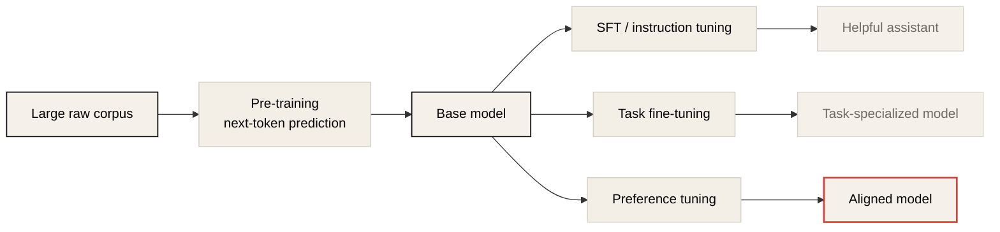
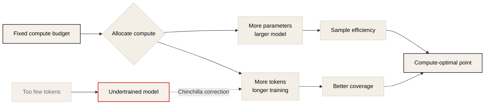
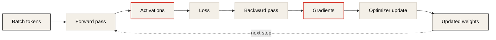
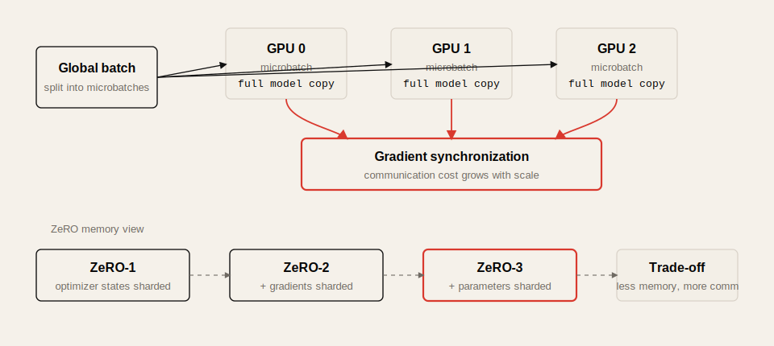
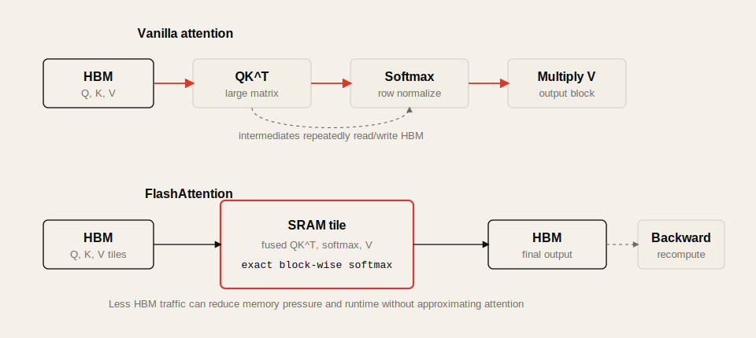
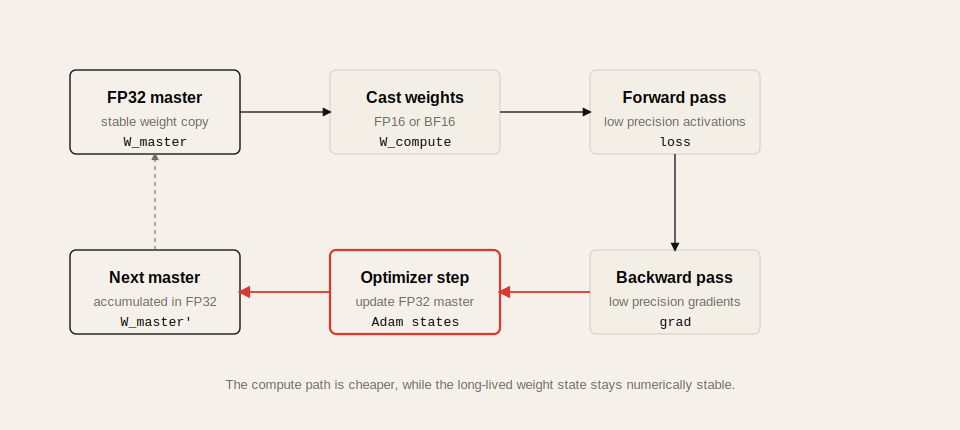
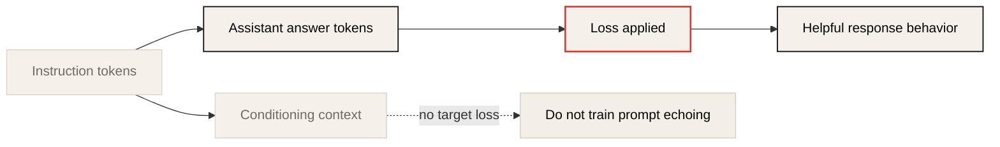
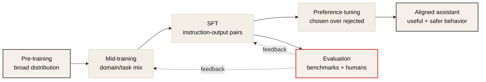
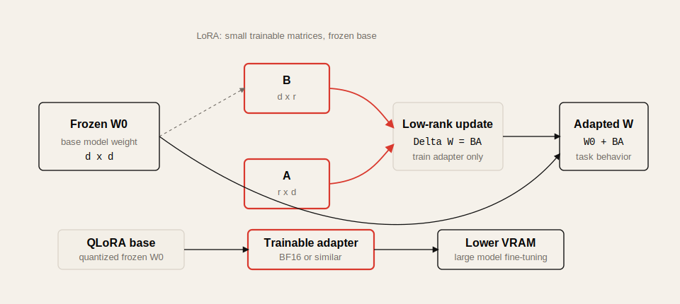

# Lecture 4: LLM Training, Fine-Tuning, and Efficient Adaptation

Source: [CME295 Lecture 4](https://www.youtube.com/watch?v=VlA_jt_3Qc4)

## Table of Contents

* [Goal](#goal)
* [Lecture Overview](#lecture-overview)
* [Training Paradigm: From Task-Specific Models to Transfer Learning](#training-paradigm-from-task-specific-models-to-transfer-learning)
* [Pre-Training](#pre-training)
* [Training Data and Scale](#training-data-and-scale)
* [FLOPs and FLOP/s](#flops-and-flops)
* [Scaling Laws and Chinchilla](#scaling-laws-and-chinchilla)
* [Pre-Training Challenges](#pre-training-challenges)
* [Training Loop and Memory Footprint](#training-loop-and-memory-footprint)
* [Data Parallelism and ZeRO](#data-parallelism-and-zero)
* [Model Parallelism](#model-parallelism)
* [FlashAttention](#flashattention)
* [Quantization and Mixed Precision Training](#quantization-and-mixed-precision-training)
* [Supervised Fine-Tuning](#supervised-fine-tuning)
* [Instruction Tuning Data](#instruction-tuning-data)
* [SFT Challenges and Evaluation](#sft-challenges-and-evaluation)
* [Alignment and Mid-Training](#alignment-and-mid-training)
* [LoRA](#lora)
* [QLoRA](#qlora)
* [Practical Tips and Notes](#practical-tips-and-notes)
* [Lecture Summary](#lecture-summary)
* [Key Terms](#key-terms)
* [Questions](#questions)
* [Answers](#answers)

---

## Goal

이번 강의의 목표는 LLM이 어떻게 학습되는지, 그리고 왜 pre-training 이후 fine-tuning과 alignment 단계가 필요한지 이해하는 것이다.

핵심 메시지는 다음과 같다.

> LLM training은 하나의 거대한 학습 절차가 아니라, pre-training으로 language/code distribution을 학습하고, SFT와 alignment로 useful assistant behavior를 만들며, distributed training과 memory optimization으로 물리적 한계를 넘는 multi-stage system이다.

이 강의는 다음을 다룬다.

* task-specific training에서 transfer learning으로의 전환
* pre-training objective와 data scale
* FLOPs와 FLOP/s의 차이
* scaling laws와 Chinchilla-style compute optimality
* GPU memory가 부족한 이유: parameters, activations, gradients, optimizer states
* data parallelism, ZeRO, model parallelism
* FlashAttention의 IO-aware exact attention
* quantization과 mixed precision training
* supervised fine-tuning, instruction tuning, safety data
* benchmark와 human preference evaluation의 한계
* alignment, mid-training
* LoRA와 QLoRA

---

## Lecture Overview

Lecture 4는 LLM training을 다룬다. 이전 강의에서는 LLM을 decoder-only Transformer로 정의하고, inference-time decoding과 prompting, KV cache 같은 기법을 배웠다. 이번 강의는 그 model이 처음부터 어떻게 만들어지는지에 초점을 둔다.

강의 전반부는 pre-training이다. LLM은 internet-scale text와 code를 사용해 next-token prediction을 학습한다. 이 단계는 매우 비싸며, model parameter 수, training token 수, compute budget이 성능에 어떤 관계를 갖는지 scaling laws로 설명한다.

중반부는 training infrastructure다. LLM 학습은 single GPU memory에 맞지 않기 때문에 여러 GPU에 data, optimizer state, gradients, parameters, model layers, experts, tensor operations를 나누어야 한다. 또한 FlashAttention과 mixed precision training처럼 GPU memory hierarchy와 numeric precision을 활용한 최적화가 필요하다.

후반부는 post-training이다. Pre-trained model은 language distribution은 잘 배웠지만 assistant로 행동하도록 학습된 것은 아니다. Supervised fine-tuning, instruction tuning, safety data, evaluation, LoRA/QLoRA를 통해 model을 실제 task와 product behavior에 맞춘다.

---

## Training Paradigm: From Task-Specific Models to Transfer Learning

전통적인 ML workflow에서는 task마다 model을 따로 학습했다.

```text
spam detection task -> train spam model
sentiment task      -> train sentiment model
NER task            -> train NER model
```

하지만 NLP task들은 완전히 독립적이지 않다. 모두 language understanding을 필요로 한다. 따라서 하나의 큰 model이 language와 code의 일반 구조를 먼저 학습하고, 이후 특정 task에 맞게 조정하는 방식이 자연스럽다.

이것이 transfer learning이다.



LLM training은 이 transfer learning paradigm 위에 있다. 먼저 큰 corpus로 base model을 만들고, 이후 fine-tuning과 alignment로 user-facing behavior를 만든다.

---

## Pre-Training

Pre-training은 LLM training에서 가장 비싼 단계다. 목표는 거대한 text/code corpus에서 next token을 예측하도록 model을 학습하는 것이다.

```math
\mathcal{L} = - \sum_t \log P(x_t | x_{<t})
```

Decoder-only LLM은 context token들을 보고 다음 token probability distribution을 출력한다. Pre-training에서는 이 objective를 internet-scale corpus 전체에 반복 적용한다.

Pre-training이 학습하는 것은 특정 instruction-following behavior가 아니다. 더 근본적으로 language, code, factual patterns, style, syntax, common reasoning traces, document structure 등을 next-token prediction을 통해 압축한다.

---

## Training Data and Scale

Pre-training data는 가능한 넓은 text/code distribution을 포함한다.

| Data source | Role |
| ----------- | ---- |
| Common Crawl | web-scale raw text |
| Wikipedia | factual encyclopedic text |
| Reddit / social media | dialogue, informal language |
| GitHub | code and software patterns |
| Stack Overflow / forums | technical Q&A |
| Multilingual text | non-English language capability |

Scale은 token 수로 측정한다. 강의에서 언급한 order of magnitude는 다음과 같다.

| Model / example | Training tokens |
| --------------- | --------------- |
| GPT-3 | about 300B tokens |
| Llama 3 | about 15T tokens |
| Modern frontier scale | hundreds of billions to tens of trillions |

Pre-training data는 cutoff date를 갖는다. Model은 그 날짜 이후의 사건을 pre-training만으로는 알 수 없다. 이 날짜를 knowledge cutoff date라고 한다.

---

## FLOPs and FLOP/s

강의에서는 혼동하기 쉬운 두 표기를 구분한다.

| Term | Meaning | Measures |
| ---- | ------- | -------- |
| FLOPs | floating point operations | 총 연산량 |
| FLOP/s | floating point operations per second | hardware compute speed |

LLM training의 총 연산량은 대략 model parameter 수와 training token 수의 함수로 볼 수 있다.

```text
training FLOPs roughly scales with:
number_of_parameters x number_of_training_tokens
```

정확한 formula는 architecture와 implementation에 따라 달라진다. 예를 들어 sparse MoE model은 total parameter가 커도 active parameter가 제한되므로 dense model과 compute profile이 다르다.

GPU spec에서 보이는 TFLOP/s, PFLOP/s는 hardware가 초당 처리할 수 있는 floating-point operation 속도다. 같은 GPU라도 FP64, FP32, FP16, BF16, tensor core 사용 여부에 따라 throughput이 다르다.

---

## Scaling Laws and Chinchilla

Scaling laws는 model size, data size, compute budget이 language model loss와 어떤 관계를 갖는지 실험적으로 설명한다.

2020년 scaling law 연구는 대체로 다음 경향을 보였다.

* model이 클수록 성능이 좋아진다.
* training data가 많을수록 성능이 좋아진다.
* compute가 많을수록 loss가 낮아진다.
* 큰 model은 같은 token 수에서도 더 sample efficient할 수 있다.

하지만 compute는 무한하지 않다. 따라서 같은 compute budget 안에서 model parameter 수와 training token 수를 어떻게 배분할지가 중요하다.

Chinchilla-style result는 compute-optimal training에서 training token 수가 model parameter 수보다 훨씬 커야 함을 보여주었다. 강의에서는 대략 다음 mental model을 제시한다.

```text
training tokens ~= 20 x model parameters
```

이 관점에서 GPT-3는 parameter 수에 비해 token 수가 적어 undertrained로 볼 수 있다. 이후 model들은 더 많은 token으로 더 오래 학습하는 방향으로 이동했다.



---

## Pre-Training Challenges

Pre-training의 어려움은 여러 층위에 있다.

| Challenge | Explanation |
| --------- | ----------- |
| Cost | millions to hundreds of millions of dollars scale 가능 |
| Time | large clusters에서 장기간 학습 필요 |
| Environmental impact | energy consumption과 carbon footprint |
| Knowledge cutoff | cutoff 이후 지식은 base model에 없음 |
| Knowledge editing | 새 지식 주입 시 다른 능력 regression 위험 |
| Memorization / plagiarism | training data를 그대로 생성할 위험 |
| Data quality | web-scale data에는 noise, bias, harmful text 포함 |

특히 knowledge editing은 어렵다. Model weight 안에 특정 사실을 넣거나 수정하면서 다른 domain 능력을 해치지 않는 것은 아직 쉬운 문제가 아니다.

---

## Training Loop and Memory Footprint

LLM training loop는 일반적인 neural network training과 같지만, scale 때문에 memory 문제가 훨씬 크다.



Training 중 GPU memory에는 다음이 필요하다.

| Memory item | Why needed |
| ----------- | ---------- |
| Parameters | model weights |
| Activations | backward pass에서 gradient 계산에 필요 |
| Gradients | loss를 줄이는 방향 계산 |
| Optimizer states | Adam의 first/second moment 등 |
| Batch data | input/output token tensors |

Activation memory는 model size, batch size, context length에 영향을 받는다. Attention은 sequence length에 대해 `O(n^2)` 성격을 갖기 때문에 긴 context는 memory 부담을 키운다.

예를 들어 H100 GPU의 memory가 80GB라고 해도, billion-scale model의 parameters, gradients, optimizer states, activations를 모두 담기에는 부족하다. 따라서 distributed training이 필수다.

---

## Data Parallelism and ZeRO

Data parallelism은 batch를 여러 GPU에 나누어 각 GPU가 독립적으로 forward/backward를 수행하게 한다.

```text
global batch
  -> GPU 1: microbatch 1 + full model copy
  -> GPU 2: microbatch 2 + full model copy
  -> GPU 3: microbatch 3 + full model copy
  -> aggregate gradients
```

장점은 batch-related memory와 compute를 분산할 수 있다는 것이다. 단점은 각 GPU가 full model copy를 가져야 하고, step마다 gradient synchronization communication cost가 발생한다는 점이다.

ZeRO, Zero Redundancy Optimizer는 data parallelism에서 중복 저장되는 optimizer states, gradients, parameters를 shard한다.

| ZeRO stage | What is sharded | Effect |
| ---------- | --------------- | ------ |
| ZeRO-1 | optimizer states | optimizer memory 감소 |
| ZeRO-2 | optimizer states + gradients | gradient memory도 감소 |
| ZeRO-3 | optimizer states + gradients + parameters | parameter redundancy 제거 |

ZeRO는 per-GPU memory를 크게 줄이지만, 필요한 시점에 parameter나 optimizer state를 모으기 위한 communication cost가 증가한다.



---

## Model Parallelism

Model parallelism은 model 자체의 계산과 parameter를 여러 GPU에 나누는 방법이다. Data parallelism이 batch를 나눈다면, model parallelism은 model operation을 나눈다.

| Method | Idea |
| ------ | ---- |
| Tensor parallelism | 큰 matrix multiplication을 여러 GPU에 나눔 |
| Pipeline parallelism | layer range를 GPU별로 나눔 |
| Expert parallelism | MoE expert를 GPU별로 배치 |

Pipeline parallelism에서는 예를 들어 GPU 1이 layer 1-3, GPU 2가 layer 4-6을 담당할 수 있다. Tensor parallelism은 attention/FFN의 큰 matrix multiplication을 shard한다. Expert parallelism은 MoE expert를 서로 다른 device에 두고 router가 token을 해당 expert로 보낸다.

실제 대규모 training은 data parallelism, ZeRO, tensor parallelism, pipeline parallelism, expert parallelism을 조합한다.

---

## FlashAttention

FlashAttention은 attention computation을 근사하지 않고 exact하게 계산하면서도 GPU memory hierarchy를 더 잘 활용해 빠르게 만드는 기법이다.

GPU에는 대체로 두 종류의 memory가 있다.

| Memory | Size | Speed | Role |
| ------ | ---- | ----- | ---- |
| HBM | large, tens of GB | slower | main GPU memory |
| SRAM | small, MB scale | much faster | on-chip memory near compute |

Vanilla attention은 `QK^T`, softmax, multiply by `V` 사이에 큰 intermediate matrix를 HBM에 반복적으로 read/write한다. 이 IO가 bottleneck이 된다.

FlashAttention의 핵심은 tiling이다. `Q`, `K`, `V`를 작은 block으로 나누어 SRAM에 올리고, 가능한 많은 연산을 SRAM 안에서 끝낸 뒤 HBM write를 최소화한다.

```text
vanilla:
HBM -> compute QK^T -> HBM
HBM -> softmax      -> HBM
HBM -> multiply V   -> HBM

flash attention:
HBM -> tile to SRAM -> fused attention block -> HBM
```

어려운 부분은 softmax가 row-wise normalization이라 전체 row 정보가 필요한 것처럼 보인다는 점이다. FlashAttention은 block-wise softmax를 누적하면서 exact result를 재구성하는 scaling trick을 사용한다.

또 다른 아이디어는 recomputation이다. Attention computation이 빨라졌기 때문에 forward pass의 모든 activation을 저장하지 않고, backward pass에서 일부 activation을 다시 계산한다. 일반적으로 recomputation은 memory를 아끼는 대신 runtime을 늘리지만, FlashAttention에서는 HBM IO 감소 덕분에 memory와 runtime 모두 좋아질 수 있다.



---

## Quantization and Mixed Precision Training

Quantization은 숫자의 precision을 낮추어 memory와 compute를 절약하는 방법이다. Floating-point number는 sign, exponent, mantissa bit로 표현되며, format마다 precision과 range가 다르다.

| Format | Typical use | Trade-off |
| ------ | ----------- | --------- |
| FP64 | scientific high precision | slow, memory heavy |
| FP32 | stable master weights | more memory |
| FP16 | fast training/inference operations | less range/precision |
| BF16 | wider exponent than FP16 | common in modern training |

Mixed precision training은 model weight의 master copy는 high precision으로 유지하고, forward/backward computation은 lower precision으로 수행하는 방식이다.

```text
master weights: FP32
forward/backward activations: FP16 or BF16
weight update: FP32 master weights
```

이렇게 하면 memory와 runtime을 줄이면서도 training stability를 유지할 수 있다. 직관적으로 activation과 gradient는 batch noise를 포함하므로 어느 정도 낮은 precision을 써도 괜찮지만, weights는 update가 누적되므로 더 높은 precision으로 유지하는 것이 유리하다.



---

## Supervised Fine-Tuning

Pre-trained model은 next-token prediction으로 language distribution을 배웠지만, user에게 helpful assistant로 답하도록 직접 학습된 것은 아니다.

예를 들어 사용자가 "내 teddy bear를 세탁기에 넣어도 되나요?"라고 물었을 때, base model은 다음 문장을 자연스럽게 이어갈 뿐이다. 사용자의 의도를 이해하고 안전하고 유용한 답을 주려면 추가 학습이 필요하다.

Supervised fine-tuning, SFT는 input-output pair로 model을 더 학습하는 단계다.

```text
input: Can I put my teddy bear in the washer?
output: You should check the care label. In many cases, hand washing is safer...
```

Pre-training과 SFT 모두 next-token prediction objective를 사용하지만, loss를 거는 위치가 다르다.

```text
pre-training:
BOS + raw text
loss over all next tokens

SFT:
instruction/input + target answer
loss mainly over target answer tokens
```

즉 SFT에서는 prompt/input을 parroting하게 만들고 싶은 것이 아니라, 그 input에 conditioned된 helpful answer를 생성하도록 학습한다.



---

## Instruction Tuning Data

Instruction tuning은 SFT의 한 종류로, model이 user instruction을 따르도록 학습한다.

Instruction tuning data는 보통 다음과 같은 task를 포함한다.

| Data category | Example |
| ------------- | ------- |
| Assistant dialogue | Q&A, helpful answers |
| Story writing | story generation from prompt |
| Poem creation | style-constrained creative writing |
| List generation | structured bullet/list output |
| Explanation | concept explanation |
| Math / reasoning | stepwise problem solving |
| Code | code generation, debugging |
| Safety | refusal, hedging, harmless behavior |

초기에는 사람이 instruction과 ideal answer를 많이 작성했다. 최근에는 이미 강한 LLM을 사용해 synthetic SFT data를 만들고, 사람이 검수하거나 다른 LLM이 quality review를 하는 방식도 사용된다.

Pre-training data와 비교하면 SFT data는 훨씬 작지만 품질이 중요하다. 강의에서는 GPT-3 계열의 instruction tuning data가 약 13K examples, Llama 3 계열은 약 10M examples 규모로 언급된다. Token 수로 환산하면 pre-training의 trillions of tokens보다 훨씬 작다.

---

## SFT Challenges and Evaluation

SFT의 어려움은 data quality와 evaluation이다.

| Challenge | Explanation |
| --------- | ----------- |
| High-quality data | human annotation, guideline, review 비용이 큼 |
| Distribution mismatch | SFT prompt distribution과 실제 user prompt가 다를 수 있음 |
| Generalization | 특정 example에 과하게 맞으면 새로운 request에 약함 |
| Safety balance | helpfulness와 harmlessness 사이 trade-off |
| Subjective quality | user preference가 사람마다 다름 |

Evaluation도 쉽지 않다. Benchmark score는 유용하지만 하나의 숫자로 model quality를 완전히 설명하지 못한다.

대표 benchmark 예시는 다음과 같다.

| Area | Benchmark examples |
| ---- | ------------------ |
| General language | MMLU |
| Math reasoning | GSM8K |
| Code generation | HumanEval 등 |
| Reasoning | 여러 domain-specific benchmark |

주의할 점은 **training on the test task**다. Model이 test set 자체를 본 것이 아니더라도, benchmark와 같은 task distribution의 auxiliary training data를 많이 봤다면 score가 크게 올라갈 수 있다. 따라서 model을 비교할 때 training mixture가 benchmark task에 얼마나 맞춰져 있는지 봐야 한다.

Human preference evaluation의 예로 Chatbot Arena가 있다. 두 model의 anonymous responses를 user가 비교하고, pairwise preference로 leaderboard를 만든다. 하지만 이것도 완벽하지 않다.

* 초기 ranking은 비교 pair noise에 민감할 수 있다.
* "Who are you?" 같은 질문으로 model identity가 드러나면 조작 가능성이 생긴다.
* user는 factual correctness를 모를 수 있다.
* emoji, verbosity, tone 같은 취향 차이가 ranking에 영향을 준다.
* safety refusal은 user preference에서 불리할 수 있다.

---

## Alignment and Mid-Training

강의에서는 alignment를 pre-training 이후의 fine-tuning과 preference tuning을 포함하는 넓은 과정으로 설명한다.



Preference tuning은 다음 강의에서 더 자세히 다루는 단계다. Human preference나 reward signal을 사용해 model behavior를 더 user intent와 safety policy에 맞춘다.

Mid-training은 최근 등장한 중간 단계로, pre-training objective는 유지하되 data distribution을 관심 task/domain에 더 맞추는 방식이다. 예를 들어 code, math, reasoning, domain-specific corpus를 강화할 수 있다.

---

## LoRA

LoRA, Low-Rank Adaptation은 full fine-tuning보다 훨씬 적은 parameter만 학습하는 효율적 adaptation 방법이다.

기본 아이디어는 pre-trained weight `W_0`를 freeze하고, update를 low-rank matrix product로 표현하는 것이다.

```math
W = W_0 + \Delta W
```

```math
\Delta W = BA
```

여기서 `B`와 `A`만 학습하고 `W_0`는 고정한다. Rank `r`은 작게 둔다.

```text
W_0: d x d matrix, frozen
B: d x r trainable
A: r x d trainable
r << d
```

이렇게 하면 task-specific adaptation parameter 수가 크게 줄어든다. 예를 들어 spam detection용 LoRA adapter, sentiment extraction용 LoRA adapter를 따로 저장하고 같은 base model 위에 갈아 끼울 수 있다.

원래 LoRA 논문은 attention projection matrix에 적용했지만, 최근 관찰로는 FFN block에 LoRA를 넣는 것이 성능에 더 중요할 수 있다. 실제 구현에서는 attention과 FFN 모두에 LoRA를 적용하는 경우가 많다.

강의에서 언급한 empirical note:

* LoRA는 full fine-tuning보다 높은 learning rate가 필요할 수 있다.
* 큰 batch size에서 항상 잘 작동하지 않을 수 있다.
* rank `r`은 design choice이며, common value를 쓰거나 grid search할 수 있다.

---

## QLoRA

QLoRA는 quantized LoRA다. Frozen base model weight `W_0`를 quantize해 memory footprint를 줄이고, LoRA matrices `A`, `B`는 더 높은 precision으로 학습한다.

```text
base weights W_0: quantized, frozen
LoRA weights A/B: trainable, BF16 or similar
```

강의에서는 NF4, NormalFloat 4-bit quantization을 소개한다. NF4는 weight가 roughly normal distribution을 따른다고 보고, fixed-width bucket 대신 quantile 기반으로 value space를 나누어 4-bit representation을 더 효율적으로 사용한다.

또한 double quantization은 quantization constants 자체도 다시 quantize해 추가 memory saving을 얻는 방법이다.

QLoRA의 목적은 큰 base model을 훨씬 작은 VRAM으로 fine-tuning할 수 있게 하는 것이다. 강의에서는 약 16x VRAM saving이 언급된다.



---

## Practical Tips and Notes

### Pre-Training과 Fine-Tuning을 역할로 구분하기

Pre-training은 language/code distribution을 학습한다. SFT는 user instruction에 대한 useful behavior를 학습한다. Preference tuning은 어떤 답을 더 선호할지 조정한다. 이 세 단계를 혼동하면 model failure를 잘못 진단하기 쉽다.

### FLOPs와 FLOP/s를 혼동하지 않기

FLOPs는 총 일의 양이고, FLOP/s는 hardware 속도다. Training cost estimate에는 둘 다 필요하다. 총 FLOPs가 같아도 memory bandwidth, communication, utilization 때문에 실제 wall-clock time은 달라진다.

### Benchmark Score만으로 Model을 고르지 않기

MMLU, GSM8K, coding benchmark는 유용하지만 product quality를 완전히 대표하지 않는다. 실제 use case에서는 domain eval, human review, safety eval, latency/cost, refusal behavior를 함께 봐야 한다.

### GPU Memory는 Parameters만의 문제가 아니다

Training memory에는 parameters, gradients, optimizer states, activations가 모두 들어간다. Adam은 optimizer state가 커서 parameter memory보다 훨씬 많은 memory가 필요할 수 있다. ZeRO, activation checkpointing, FlashAttention, mixed precision을 함께 봐야 한다.

### FlashAttention은 Approximation이 아니다

FlashAttention은 attention을 approximate하는 방법이 아니라 exact attention을 IO-aware 방식으로 계산하는 방법이다. 품질 trade-off라기보다 memory hierarchy를 활용한 implementation optimization이다.

### LoRA Adapter는 Task Artifact로 관리하기

LoRA를 쓰면 base model은 공유하고 task별 adapter만 따로 관리할 수 있다. 운영에서는 adapter version, base model version, rank, target modules, training data lineage를 함께 기록해야 재현성과 rollback이 가능하다.

### Quick Reference

| Symptom | First Check |
| ------- | ----------- |
| Training OOM | activation memory, optimizer states, sequence length, ZeRO stage |
| Scaling이 안 좋다 | GPU communication, data parallel sync, tensor parallel efficiency |
| Fine-tuned model이 helpful하지 않다 | SFT data quality, instruction distribution, loss masking |
| Benchmark는 좋은데 제품 품질이 낮다 | benchmark contamination/task training, domain eval mismatch |
| LoRA 성능이 낮다 | target modules, rank, learning rate, SFT data coverage |
| 비용이 너무 높다 | mixed precision, FlashAttention, ZeRO, LoRA/QLoRA |

---

## Lecture Summary

Lecture 4는 LLM training pipeline을 pre-training, infrastructure optimization, supervised fine-tuning, efficient adaptation으로 나누어 설명한다.

Pre-training은 web-scale text와 code로 next-token prediction을 학습하는 가장 비싼 단계다. Model size, training token 수, compute budget은 scaling laws로 연결되며, Chinchilla-style result는 compute-optimal training에서 parameter 수뿐 아니라 충분한 token 수가 중요함을 보여준다.

LLM training은 GPU memory 한계 때문에 distributed training이 필수다. Data parallelism은 batch를 나누고 gradient를 aggregate한다. ZeRO는 optimizer states, gradients, parameters를 shard해 redundancy를 줄인다. Model parallelism은 tensor, pipeline, expert parallelism으로 model computation 자체를 나눈다.

FlashAttention은 HBM과 SRAM의 차이를 활용해 attention을 exact하게 더 빠르고 memory-efficient하게 계산한다. Mixed precision training은 FP32 master weights와 FP16/BF16 computation을 조합해 memory와 throughput을 개선한다.

Pre-trained base model은 helpful assistant가 아니다. SFT와 instruction tuning은 input-output pair로 model이 user instruction에 답하도록 학습한다. SFT data는 pre-training보다 작지만 고품질이어야 하며, safety, refusal, hedging 같은 product behavior도 포함된다. Evaluation은 MMLU, GSM8K 같은 benchmark뿐 아니라 human preference와 domain-specific eval을 함께 봐야 한다.

LoRA는 frozen base weight에 low-rank trainable update를 추가해 fine-tuning 비용을 줄인다. QLoRA는 frozen base weights를 quantize하고 LoRA weights만 학습해 VRAM 요구량을 더 낮춘다.

---

## Key Terms

| Term | Meaning |
| ---- | ------- |
| Transfer learning | pre-trained model을 새 task에 맞게 조정하는 학습 방식 |
| Pre-training | 대규모 corpus에서 next-token prediction으로 base model을 학습하는 단계 |
| SFT | supervised fine-tuning, input-output pair로 model behavior를 조정하는 단계 |
| Instruction tuning | instruction-following assistant behavior를 학습하는 SFT |
| FLOPs | 총 floating point operation 수 |
| FLOP/s | 초당 floating point operation 처리량 |
| Scaling law | model size, data size, compute와 loss의 empirical relationship |
| Chinchilla | compute-optimal parameter/token allocation 관점의 scaling result |
| Knowledge cutoff | pre-training data가 포함하는 지식의 시간적 한계 |
| Activation | layer output, backward pass에 필요한 intermediate value |
| Gradient | loss를 줄이기 위한 parameter별 방향 |
| Optimizer state | Adam moment처럼 optimizer가 저장하는 추가 state |
| Data parallelism | batch를 여러 GPU에 나누어 학습하는 방식 |
| ZeRO | optimizer state, gradient, parameter redundancy를 줄이는 sharding 방법 |
| Tensor parallelism | matrix operation을 여러 GPU에 나누는 model parallelism |
| Pipeline parallelism | layer를 여러 GPU에 나누는 model parallelism |
| Expert parallelism | MoE expert를 GPU별로 나누는 방식 |
| FlashAttention | IO-aware exact attention implementation |
| Quantization | numeric precision을 낮춰 memory/compute를 줄이는 방법 |
| Mixed precision training | high/low precision을 조합해 학습하는 방법 |
| Alignment | SFT와 preference tuning 등으로 model behavior를 user intent/safety에 맞추는 과정 |
| Mid-training | pre-training 이후, SFT 이전에 target domain data로 objective를 이어가는 단계 |
| LoRA | low-rank trainable update로 efficient fine-tuning하는 방법 |
| QLoRA | quantized base model과 LoRA adapter를 결합한 fine-tuning 방법 |

---

## Questions

1. LLM training에서 transfer learning paradigm이 중요한 이유는 무엇인가?
2. Pre-training과 SFT의 objective는 어떻게 같고, loss 적용 위치는 어떻게 다른가?
3. FLOPs와 FLOP/s는 각각 무엇을 의미하는가?
4. Chinchilla-style scaling law가 GPT-3를 undertrained라고 보는 이유는 무엇인가?
5. Knowledge cutoff가 model behavior에 주는 한계는 무엇인가?
6. Training 중 GPU memory에 저장해야 하는 주요 항목은 무엇인가?
7. Data parallelism은 무엇을 나누며, 어떤 communication cost가 생기는가?
8. ZeRO-1, ZeRO-2, ZeRO-3는 각각 무엇을 shard하는가?
9. Tensor parallelism, pipeline parallelism, expert parallelism은 어떻게 다른가?
10. FlashAttention은 왜 exact attention이면서도 더 빠를 수 있는가?
11. Mixed precision training에서 master weights를 high precision으로 유지하는 이유는 무엇인가?
12. Instruction tuning data에는 어떤 종류의 example이 포함되는가?
13. Benchmark score만으로 model quality를 판단하기 어려운 이유는 무엇인가?
14. Alignment는 어떤 training stages를 포함하는가?
15. LoRA가 full fine-tuning보다 memory-efficient한 이유는 무엇인가?
16. QLoRA에서 NF4와 double quantization은 어떤 목적을 갖는가?

---

## Answers

1. NLP task들은 모두 language understanding을 공유한다. 매 task마다 처음부터 학습하기보다, 큰 corpus로 일반 language representation을 학습한 뒤 task별로 조정하는 것이 data와 compute를 더 효율적으로 쓴다.
2. 둘 다 next-token prediction을 사용한다. Pre-training은 raw text 전체에 loss를 걸지만, SFT는 instruction/input을 조건으로 두고 target answer token에 주로 loss를 건다.
3. FLOPs는 총 floating point operation 수로 계산량을 뜻한다. FLOP/s는 초당 처리할 수 있는 floating point operation 수로 hardware 속도를 뜻한다.
4. GPT-3는 약 175B parameters에 300B tokens로 학습됐다. Chinchilla 관점에서는 parameter 수 대비 training token 수가 적어 compute-optimal보다 data가 부족한 편이다.
5. Model은 cutoff 이후의 사건이나 지식을 pre-training만으로 알 수 없다. 최신 정보가 필요하면 retrieval, tool use, continued training, fine-tuning 등이 필요하다.
6. Parameters, activations, gradients, optimizer states, batch data가 필요하다.
7. Data parallelism은 batch를 여러 GPU에 나누고 각 GPU가 full model copy로 forward/backward를 수행한다. 이후 gradient를 평균/동기화해야 하므로 GPU 간 communication cost가 생긴다.
8. ZeRO-1은 optimizer states, ZeRO-2는 optimizer states와 gradients, ZeRO-3는 optimizer states, gradients, parameters까지 shard한다.
9. Tensor parallelism은 matrix operation을 나누고, pipeline parallelism은 layer 구간을 나누며, expert parallelism은 MoE experts를 여러 device에 나눈다.
10. HBM read/write를 줄이고 SRAM에서 tile 단위로 fused computation을 수행하기 때문이다. Softmax를 block-wise로 exact하게 누적하는 trick을 사용해 approximation 없이 IO bottleneck을 줄인다.
11. Weight update는 반복적으로 누적되므로 quantization error가 누적될 수 있다. Master weights를 high precision으로 유지하면 stability를 확보하면서 forward/backward는 낮은 precision으로 빠르게 수행할 수 있다.
12. Assistant dialogue, story writing, poem creation, list generation, explanation, math/reasoning, code, safety/refusal/hedging examples가 포함될 수 있다.
13. Benchmark와 유사한 task data로 training되었을 수 있고, benchmark가 user preference, factuality, safety, domain needs를 모두 반영하지 못하기 때문이다.
14. 강의에서는 pre-training 이후의 supervised fine-tuning과 preference tuning을 alignment로 묶어 설명한다. 최근에는 pre-training과 SFT 사이의 mid-training도 별도 단계로 언급된다.
15. Base weight를 freeze하고 작은 rank의 `A`, `B` matrices만 학습하기 때문이다. 학습 parameter 수와 optimizer state memory가 크게 줄어든다.
16. NF4는 normal-distributed weights에 맞춰 4-bit quantile representation을 사용해 base weights를 효율적으로 저장한다. Double quantization은 quantization constants까지 quantize해 추가 memory saving을 얻는다.
