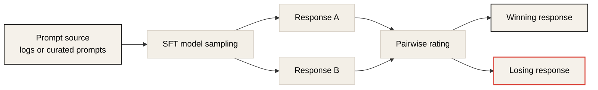
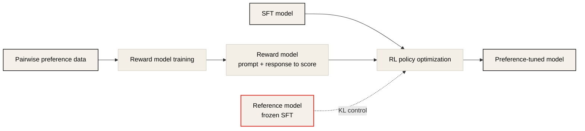
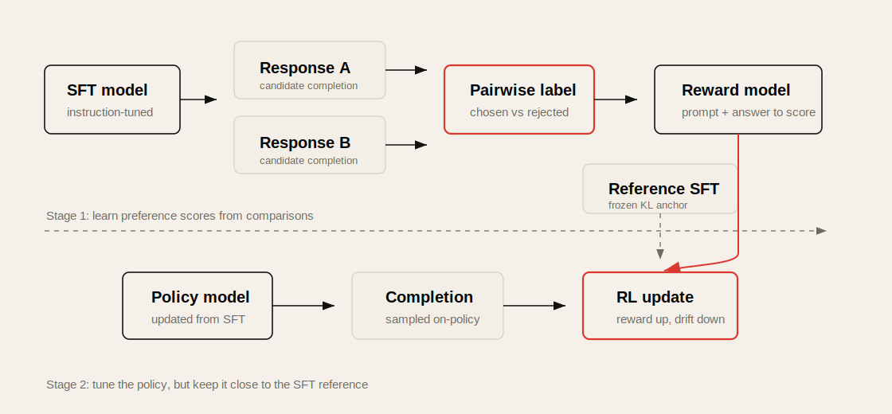
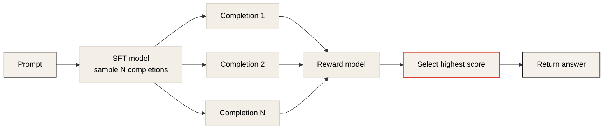
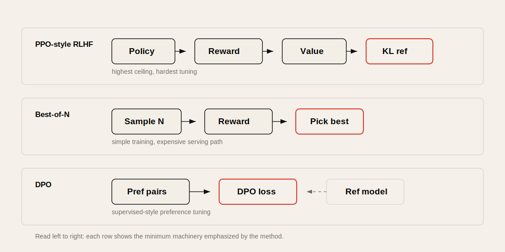

# Lecture 5: LLM Tuning and Human Preferences

Source: [CME295 Lecture 5](https://www.youtube.com/watch?v=PmW_TMQ3l0I)

## Table of Contents

* [Goal](#goal)
* [Lecture Overview](#lecture-overview)
* [Why Preference Tuning](#why-preference-tuning)
* [Preference Data](#preference-data)
* [RL Mental Model for LLMs](#rl-mental-model-for-llms)
* [RLHF Pipeline](#rlhf-pipeline)
* [Reward Model Training](#reward-model-training)
* [Bradley-Terry Formulation](#bradley-terry-formulation)
* [Policy Optimization with Rewards](#policy-optimization-with-rewards)
* [Reward Hacking and KL Regularization](#reward-hacking-and-kl-regularization)
* [Advantage and Value Function](#advantage-and-value-function)
* [PPO Clip](#ppo-clip)
* [PPO with KL Penalty](#ppo-with-kl-penalty)
* [Challenges of RLHF](#challenges-of-rlhf)
* [Best of N](#best-of-n)
* [DPO](#dpo)
* [RLHF, Best-of-N, and DPO Compared](#rlhf-best-of-n-and-dpo-compared)
* [Practical Tips and Notes](#practical-tips-and-notes)
* [Lecture Summary](#lecture-summary)
* [Key Terms](#key-terms)
* [Questions](#questions)
* [Answers](#answers)

---

## Goal

이번 강의의 목표는 pre-trained + SFT model을 human preference에 맞게 조정하는 preference tuning을 이해하는 것이다.

핵심 메시지는 다음과 같다.

> SFT는 model에게 "무엇을 생성해야 하는지"를 가르치지만, preference tuning은 "어떤 답이 더 좋은지"와 "어떤 답을 피해야 하는지"를 학습시킨다. RLHF는 preference data로 reward model을 만들고 PPO-style RL로 policy를 조정하는 방식이며, DPO는 reward model과 RL loop를 없애고 preference pair에서 직접 policy를 최적화하는 supervised alternative다.

이 강의는 다음을 다룬다.

* pre-training, SFT, preference tuning의 역할 차이
* preference pair와 pairwise ranking data 수집
* RL 관점에서 LLM을 policy로 보는 방법
* RLHF의 두 단계: reward model training과 RL policy update
* Bradley-Terry formulation과 reward model loss
* reward hacking, KL divergence, reference model
* advantage, value function, PPO clip, PPO KL penalty
* RLHF의 engineering challenges
* best-of-N inference-time reranking
* Direct Preference Optimization, DPO
* RLHF, best-of-N, DPO의 trade-off

---

## Lecture Overview

Lecture 5는 LLM training pipeline의 세 번째 단계인 preference tuning을 다룬다. Lecture 4에서 본 pre-training은 language/code distribution을 학습하고, SFT는 model을 assistant나 특정 task에 맞게 행동하도록 만든다. 하지만 SFT만으로는 tone, safety, helpfulness, harmlessness, politeness 같은 미묘한 선호를 충분히 맞추기 어렵다.

Preference tuning의 출발점은 prompt 하나에 대해 두 response를 비교하는 것이다. 예를 들어 teddy bear와 할 활동을 물었을 때, 차갑거나 부적절한 답변보다 친절하고 도움이 되는 답변을 선호한다고 표시한다. 이 pairwise preference data는 사람이 직접 rating할 수도 있고, LLM-as-a-judge나 rule-based metric으로 만들 수도 있다.

강의 중반부는 RLHF다. 먼저 preference pair로 reward model을 학습한다. Reward model은 prompt와 response를 입력받아 하나의 score를 출력한다. 학습은 Bradley-Terry formulation을 사용해 winning response의 reward가 losing response보다 높아지도록 한다. 그 다음 policy model, 즉 SFT model을 RL로 업데이트한다. 목표는 reward를 높이되, 기존 SFT model에서 너무 멀어지지 않도록 KL divergence로 묶는 것이다.

후반부는 PPO와 그 대안이다. PPO는 advantage를 maximize하면서 policy update가 너무 커지지 않도록 clipping이나 KL penalty를 사용한다. 하지만 PPO-based RLHF는 reward model, value function, policy, reference model 등 여러 model을 다뤄야 하고 hyperparameter와 instability 문제가 많다. Best-of-N은 RL training을 생략하고 inference time에 여러 답을 생성해 reward model로 고르는 방법이지만 latency와 cost가 커진다. DPO는 preference pair에서 직접 policy를 학습하는 supervised objective로, reward model과 RL loop를 제거한다.

---

## Why Preference Tuning

LLM training을 세 단계로 보면 역할이 명확하다.

| Stage | Role | Result |
| ----- | ---- | ------ |
| Pre-training | language/code distribution 학습 | next-token autocompleter |
| SFT | task-specific behavior 학습 | instruction-following assistant |
| Preference tuning | human preference에 맞게 output distribution 조정 | 더 helpful/safe/friendly한 assistant |

SFT model은 이미 질문에 답할 수 있지만, 반드시 사람이 선호하는 방식으로 답하지는 않는다. 예를 들어 prompt가 "teddy bear와 할 새 활동을 추천해줘"일 때, model이 "teddy bear와 시간을 보내지 말라"는 식으로 답하면 assistant behavior는 갖췄지만 선호되는 답은 아니다.

Preference tuning이 필요한 이유는 세 가지다.

| Reason | Explanation |
| ------ | ----------- |
| Preference data is easier | 좋은 답을 처음부터 쓰는 것보다 두 답 중 더 나은 것을 고르는 일이 쉽다 |
| SFT distribution is fragile | SFT data에 특정 prompt를 추가하면 prompt distribution bias가 생길 수 있다 |
| Negative signal matters | SFT는 주로 positive target만 주지만 preference tuning은 피해야 할 output도 알려준다 |

다만 preference tuning이 모든 문제의 해결책은 아니다. SFT model이 광범위하게 잘못 행동한다면 preference tuning 전에 SFT data quality와 prompt distribution을 먼저 점검해야 한다.

---

## Preference Data

Preference data는 prompt와 response 후보들, 그리고 어느 response가 더 좋은지에 대한 label로 구성된다.

### Annotation Styles

| Style | Form | Trade-off |
| ----- | ---- | --------- |
| Pointwise | response 하나에 절대 score 부여 | scale calibration이 어렵다 |
| Pairwise | response 두 개 중 더 나은 것 선택 | 가장 흔하고 annotation이 쉽다 |
| Listwise | 여러 response를 rank ordering | pointwise보다 쉽지만 pairwise보다 복잡하다 |

강의에서는 pairwise preference data를 중심으로 설명한다.

```text
prompt x
winning response y_w
losing response y_l
```

### How to Collect Pairwise Data

일반적인 수집 절차는 다음과 같다.

1. User logs나 desired prompt set에서 prompt를 고른다.
2. SFT model에 positive temperature로 여러 response를 생성시킨다.
3. 두 response를 human rater, LLM judge, rule-based metric 등으로 비교한다.
4. 더 좋은 response를 `chosen` 또는 `winning`, 덜 좋은 response를 `rejected` 또는 `losing`으로 저장한다.



Preference label은 binary일 수도 있고, "much better", "slightly better" 같은 graded scale일 수도 있다. 하지만 실제로는 subjectivity와 noise 때문에 binary pairwise setup이 많이 쓰인다.

---

## RL Mental Model for LLMs

RL에서는 agent가 state에서 action을 선택하고 reward를 받는다. 이 구조를 LLM에 대응시키면 다음과 같다.

| RL term | LLM equivalent |
| ------- | -------------- |
| Agent | LLM |
| State | 지금까지의 input tokens, prompt + partial generation |
| Action | next token 선택 |
| Policy | next-token probability distribution |
| Environment | vocabulary와 generation process |
| Reward | completion에 대한 preference/reward score |

LLM의 policy는 `pi_theta(a_t | s_t)`로 볼 수 있다. 즉 지금까지의 token context `s_t`가 있을 때 다음 token `a_t`를 선택할 확률이다.

Preference tuning의 목적은 model parameter `theta`를 조정해 policy가 human preference와 더 잘 맞도록 만드는 것이다.

---

## RLHF Pipeline

RLHF, Reinforcement Learning from Human Feedback은 일반적으로 두 단계로 구성된다.



첫 번째 단계는 좋은 output과 나쁜 output을 구분하는 reward model을 학습하는 것이다. 입력은 prompt와 response의 concatenation이고, 출력은 scalar score다.

두 번째 단계는 reward model을 사용해 SFT model을 RL로 업데이트하는 것이다. 이때 reward model은 frozen이고, 학습되는 것은 policy model이다.

`HF`는 preference label이 human rating에서 왔다는 뜻이다. Human label 대신 AI-generated feedback을 쓰면 RLAIF라고 부를 수 있다.



---

## Reward Model Training

Reward model은 prompt와 response를 입력받아 response quality score를 출력한다.

```text
reward_model(x, y) -> scalar score
```

중요한 점은 reward model의 inference는 pointwise라는 것이다. 하나의 prompt-response pair만 넣어도 score를 낼 수 있다. 하지만 training은 pairwise loss를 사용한다. Winning response의 score가 losing response보다 높아지도록 학습한다.

Reward model architecture는 여러 선택지가 있다.

| Architecture | Example |
| ------------ | ------- |
| Decoder-only LLM + reward head | 마지막 token 또는 sequence representation 위에 scalar head |
| Encoder-only model | BERT-style CLS embedding 위에 scalar head |

강의에서는 현대 LLM pipeline에서는 decoder-only LLM에 head를 붙이는 route가 흔하다고 설명한다. Reward model 평가 benchmark로는 RewardBench가 언급된다.

Reward dimension도 명확히 정의해야 한다. 같은 response라도 helpfulness, friendliness, safety, harmlessness, factuality 중 무엇을 평가하는지에 따라 label이 달라질 수 있다. Human rater guideline이 모호하면 preference data가 noisy해진다.

---

## Bradley-Terry Formulation

Pairwise reward model 학습은 Bradley-Terry formulation으로 설명된다.

두 response `y_i`, `y_j`가 있을 때 `y_i`가 `y_j`보다 선호될 확률은 다음처럼 쓴다.

```math
P(y_i \succ y_j) =
\frac{\exp(r_i)}{\exp(r_i) + \exp(r_j)}
= \sigma(r_i - r_j)
```

여기서 `r_i = r_\theta(x, y_i)`이고 `sigma`는 sigmoid다.

Winning response `y_w`가 losing response `y_l`보다 선호된다는 data가 있으면, reward model loss는 다음과 같다.

```math
\mathcal{L}_{RM}
= - \mathbb{E}_{(x,y_w,y_l)}
\left[
\log \sigma(r_\theta(x,y_w) - r_\theta(x,y_l))
\right]
```

이 loss는 winning response의 reward를 높이고 losing response의 reward를 낮추도록 학습한다. Loss 자체는 pairwise지만, 학습된 reward model은 prompt-response 하나에 대해 scalar reward를 출력한다.

---

## Policy Optimization with Rewards

Reward model이 준비되면 SFT model을 policy로 두고 RL을 수행한다.

절차는 다음과 같다.

1. Prompt를 policy model에 넣는다.
2. Policy model이 full completion을 생성한다.
3. Prompt와 completion을 reward model에 넣어 reward score를 얻는다.
4. Reward가 높아지도록 policy model을 업데이트한다.
5. 동시에 reference SFT model에서 너무 멀어지지 않도록 제약한다.

여기서 reward model은 frozen이다. Policy model만 업데이트된다.

목표는 단순히 reward를 최대화하는 것이 아니다. Model이 이미 pre-training과 SFT로 배운 language/code/task behavior를 유지하면서 preference만 조정해야 한다.

```text
maximize: preference reward
regularize: do not drift too far from the SFT reference model
```

---

## Reward Hacking and KL Regularization

Policy가 reward만 강하게 최적화하면 reward hacking이 발생할 수 있다. Reward hacking은 reward model이 실제 목표를 완벽히 대변하지 못할 때, model이 reward score는 높이지만 실제 원하는 behavior는 망가뜨리는 현상이다.

강의의 비유는 다음과 같다. 강의의 실제 목표가 informative lecture라고 하자. 그런데 reward를 "강의 끝 applause volume"으로 두면, 강사는 정보를 잘 전달하기보다 joke를 많이 해서 박수를 크게 받는 방향으로 최적화할 수 있다. Reward는 높지만 원래 목표는 달성하지 못한다.

LLM에서도 reward model은 imperfect proxy다. 따라서 policy가 reward model의 허점을 과하게 최적화하지 않도록 reference model과의 distance를 제한한다.

이때 사용하는 대표 measure가 KL divergence다.

```math
D_{KL}(P || Q) = \sum_i P_i \log \frac{P_i}{Q_i}
```

KL divergence는 두 probability distribution이 얼마나 다른지 측정한다. 항상 0 이상이며, 두 distribution이 같을 때 0이다. LLM preference tuning에서는 현재 policy distribution이 reference SFT model distribution에서 너무 멀어지지 않도록 KL penalty를 둔다.

---

## Advantage and Value Function

PPO에서는 reward 자체보다 advantage를 maximize한다.

```text
advantage = output이 기대보다 얼마나 좋은가
```

Reward는 completion-level score다. 반면 value function은 token-level estimation이다. Partial generation을 입력으로 받아, 이 상태에서 policy를 따라 계속 생성했을 때 expected final reward가 얼마일지 추정한다.

| Quantity | Level | Meaning |
| -------- | ----- | ------- |
| Reward | completion-level | full response가 얼마나 좋은지 |
| Value function | token-level / state-level | partial state에서 기대되는 future reward |
| Advantage | relative signal | reward가 baseline expectation보다 얼마나 좋은지 |

Advantage를 쓰는 이유는 gradient estimate의 variance를 줄이고 RL training을 더 안정적으로 만들기 위해서다. 실제 PPO에서는 generalized advantage estimation, GAE 같은 방법이 쓰인다. 이 value function은 policy와 함께 jointly trained되는 경우가 많다.

---

## PPO Clip

PPO, Proximal Policy Optimization은 policy update가 너무 커지지 않도록 설계된 RL algorithm이다. `proximal`이라는 이름은 policy가 이전 policy에서 너무 멀리 이동하지 않도록 한다는 의미다.

PPO clip에서는 현재 policy와 old policy의 probability ratio를 사용한다.

```math
r_t(\theta) =
\frac{\pi_\theta(a_t | s_t)}
{\pi_{\theta_{old}}(a_t | s_t)}
```

여기서 `old`는 SFT reference model이 아니라 RL loop의 이전 iteration policy다.

직관은 다음과 같다.

| Advantage | Desired update | Clip purpose |
| --------- | -------------- | ------------ |
| Positive | 해당 token/action probability를 올림 | 너무 많이 올리지 않음 |
| Negative | 해당 token/action probability를 내림 | 너무 많이 내리지 않음 |

즉 PPO clip은 좋은 completion을 강화하고 나쁜 completion을 약화하되, 한 iteration에서 policy가 과격하게 바뀌는 것을 막는다.

---

## PPO with KL Penalty

PPO의 또 다른 variant는 KL penalty를 objective에 넣는 방식이다.

```text
objective ~= advantage maximization - beta * KL(policy || reference)
```

원래 PPO paper에서는 KL을 old policy와 current policy 사이에 둘 수 있다. 하지만 modern LLM RLHF에서는 reference model, 보통 frozen SFT model과 current policy 사이의 KL을 penalty로 두는 경우가 많다.

실제 RLHF implementation은 PPO clip과 KL penalty를 섞어 쓰기도 한다.

| Constraint | Reference |
| ---------- | --------- |
| PPO clip | previous RL iteration에서 너무 멀어지지 않기 |
| KL penalty | initial SFT reference model에서 너무 멀어지지 않기 |

이 두 제약은 목적이 다르다. Clip은 training step 안정성을 위한 것이고, KL penalty는 base model의 지식과 behavior를 유지하기 위한 것이다.

---

## Challenges of RLHF

PPO-based RLHF는 강력하지만 engineering burden이 크다.

| Challenge | Explanation |
| --------- | ----------- |
| Two-stage dependency | reward model을 먼저 만들고, 문제가 있으면 RL stage도 다시 해야 함 |
| Many models | policy, value function, reward model, reference model을 다룸 |
| Hyperparameters | KL beta, PPO epsilon, GAE parameters 등 tuning 요소가 많음 |
| Instability | RL training은 supervised training보다 불안정할 수 있음 |
| Sparse signal | SFT는 token마다 target이 있지만 RLHF reward는 completion-level signal에 가까움 |
| Monitoring difficulty | average reward는 유용하지만 cross-entropy loss만큼 직관적이지 않음 |
| Exploration | generation diversity가 부족하면 좋은/나쁜 completion을 충분히 탐색하지 못함 |

강의에서는 PPO를 on-policy algorithm으로 설명한다. On-policy training은 현재 policy가 직접 생성한 output을 평가하고 그 결과로 현재 policy를 업데이트한다. SFT처럼 고정 dataset의 target을 모방하는 off-policy/supervised setup과 다르다.

---

## Best of N

Best-of-N은 reward model은 있지만 RL을 하고 싶지 않을 때 사용할 수 있는 inference-time method다.

절차는 간단하다.

1. Prompt 하나에 대해 SFT model이 `N`개의 completion을 생성한다.
2. Reward model이 각 prompt-completion pair를 scoring한다.
3. 가장 높은 reward score를 받은 completion만 user에게 반환한다.



Best-of-N의 장점은 RL training을 하지 않아도 reward model을 활용할 수 있다는 것이다. 단점은 inference cost와 latency가 커진다는 점이다. `N`개를 병렬 생성하더라도 user는 가장 늦게 끝난 generation을 기다려야 하므로 latency distribution의 tail이 악화된다.

Best-of-N은 model이 적어도 가끔 좋은 answer를 생성할 수 있어야 효과가 있다. 모든 candidate가 나쁘면 reward model이 그중 "덜 나쁜" 것만 고를 뿐이다.

---

## DPO

DPO, Direct Preference Optimization은 reward model과 RL loop 없이 preference pair에서 policy를 직접 최적화하는 방법이다.

DPO의 동기는 RLHF의 복잡성을 줄이는 것이다. PPO-based RLHF는 reward model, value function, policy, reference model 등 여러 model을 다루고 on-policy generation loop가 필요하다. DPO는 preference pair를 supervised data처럼 사용해 하나의 loss로 policy weight를 업데이트한다.

DPO paper의 핵심 insight는 "Your language model is secretly a reward model"이라는 제목에 담겨 있다. KL-regularized RL objective의 optimal policy를 풀어 쓰면, reward를 policy probability와 reference probability의 함수로 표현할 수 있다. 이 reward 표현을 Bradley-Terry preference likelihood에 대입하면 explicit reward model 없이 preference loss를 만들 수 있다.

DPO loss는 개념적으로 다음을 비교한다.

```text
current policy가 winning response에 주는 log probability
vs
current policy가 losing response에 주는 log probability

그리고 이 차이를 reference model의 같은 차이와 비교한다.
```

간단히 쓰면 다음 형태다.

```math
\mathcal{L}_{DPO}
= - \mathbb{E}
\left[
\log \sigma \left(
\beta
\left[
\log \frac{\pi_\theta(y_w|x)}{\pi_{ref}(y_w|x)}
-
\log \frac{\pi_\theta(y_l|x)}{\pi_{ref}(y_l|x)}
\right]
\right)
\right]
```

여기서 `pi_ref`는 frozen SFT reference model이고, `pi_theta`는 preference-tuned policy다. `beta`는 reference model에서 멀어지는 정도를 조절하는 hyperparameter이며, 강의에서는 order of magnitude로 `0.1` 정도가 언급된다.

DPO는 supervised-style preference tuning이라 구현과 tuning이 PPO보다 쉽다. 하지만 항상 PPO보다 좋은 것은 아니다. 강의에서는 PPO가 더 높은 최고 성능을 줄 수 있지만, DPO는 훨씬 적은 effort로 좋은 결과를 얻을 수 있는 선택지라고 설명한다.



---

## RLHF, Best-of-N, and DPO Compared

| Method | Main idea | Strength | Weakness |
| ------ | --------- | -------- | -------- |
| PPO-based RLHF | reward model로 policy를 RL update | 최고 성능 가능성 | 복잡하고 불안정하며 많은 model/hyperparameter 필요 |
| Best-of-N | 여러 completion을 만들고 reward model로 rerank | training 없이 적용 가능 | inference cost와 latency 증가 |
| DPO | preference pair로 policy를 직접 supervised optimize | 단순하고 실용적 | distribution shift와 성능 ceiling trade-off |

실무적 선택은 compute budget, latency budget, 팀의 RL expertise, 원하는 성능 ceiling에 따라 달라진다.

* 빠르게 좋은 preference tuning을 원하면 DPO가 강한 baseline이다.
* Reward model은 있지만 serving traffic이 작으면 best-of-N도 고려할 수 있다.
* RL expertise가 있고 최고 성능을 추구한다면 PPO-based RLHF가 여전히 유효하다.

---

## Practical Tips and Notes

### Preference Dimension을 분리해서 정의하기

Human preference는 하나의 scalar처럼 보이지만 실제로는 helpfulness, correctness, harmlessness, friendliness, concision, style 등이 섞여 있다. Annotation guideline에는 어떤 dimension을 우선할지 명확히 써야 한다.

### SFT 문제를 Preference Tuning으로 덮지 않기

Model이 기본 task를 자주 실패하거나 instruction을 이해하지 못한다면 preference tuning보다 SFT data를 먼저 고쳐야 한다. Preference tuning은 already useful model의 output distribution을 조정하는 단계로 보는 것이 안전하다.

### Reward Model은 Product Policy의 Proxy일 뿐이다

Reward model score가 올라간다고 제품 품질이 반드시 올라가는 것은 아니다. Reward hacking을 감시하려면 held-out human eval, adversarial prompts, safety eval, regression suite를 함께 유지해야 한다.

### KL과 Reward를 같이 로그하기

RLHF training에서는 average reward만 보면 위험하다. Reward가 오르면서 KL도 급격히 커지면 model이 reference behavior를 잃고 있을 수 있다. Reward, KL, response length, refusal rate, toxicity/safety metrics를 같이 봐야 한다.

### Best-of-N은 Training Cost를 Serving Cost로 옮긴다

Best-of-N은 RL training complexity를 줄이지만 `N`배 generation과 reward scoring이 필요하다. High-traffic product에서는 unit economics가 나빠질 수 있으므로 traffic volume과 latency SLO를 먼저 계산해야 한다.

### DPO Data Distribution을 확인하기

DPO는 preference pair를 직접 학습하므로 preference dataset의 prompt/response distribution이 중요하다. Current model이 실제로 낼 법한 rejected/chosen responses인지, 또는 다른 model에서 나온 off-distribution response인지 확인해야 한다.

### Quick Reference

| Symptom | First Check |
| ------- | ----------- |
| Reward는 오르는데 human eval이 나빠짐 | reward hacking, KL drift, reward model blind spots |
| Preference tuning 후 tone이 과하게 바뀜 | preference guideline, KL beta, data distribution |
| PPO training이 불안정함 | learning rate, KL beta, PPO epsilon, reward normalization |
| Best-of-N latency가 큼 | N, parallelism, max generation length, reward model cost |
| DPO가 기대보다 약함 | preference data quality, reference model mismatch, beta, SFT warmup |
| Safety behavior가 들쑥날쑥함 | safety-specific preference data, dimension-specific reward/eval |

---

## Lecture Summary

Lecture 5는 SFT 이후 model을 human preference에 맞추는 preference tuning을 설명한다. Pre-training은 language/code structure를 배우고, SFT는 model이 assistant처럼 행동하게 만든다. Preference tuning은 그 assistant가 어떤 tone, safety level, helpfulness를 가져야 하는지 조정한다.

Preference data는 보통 pairwise format으로 수집한다. 하나의 prompt에 대해 두 response를 만들고, 어느 쪽이 더 나은지 label을 붙인다. 좋은 답을 처음부터 작성하는 것보다 두 답을 비교하는 것이 쉽고, SFT로는 제공하기 어려운 negative signal을 줄 수 있다.

RLHF는 preference tuning의 대표 pipeline이다. 먼저 preference pairs로 reward model을 학습한다. Bradley-Terry formulation은 winning response의 reward가 losing response보다 높을 확률을 sigmoid로 표현하며, reward model은 pairwise loss로 학습되지만 inference에서는 prompt-response 하나에 scalar score를 준다.

그 다음 SFT model을 policy로 두고 RL을 수행한다. Policy는 reward model score를 높이도록 업데이트되지만, reference SFT model에서 너무 멀어지면 reward hacking, catastrophic forgetting, instability가 생길 수 있다. 그래서 KL divergence와 PPO clipping으로 update와 drift를 제한한다.

PPO-based RLHF는 강력하지만 복잡하다. Reward model, value function, policy, reference model이 필요하고, KL beta, PPO epsilon, GAE hyperparameters 등 tuning할 요소가 많다. 또한 reward signal은 completion-level로 sparse하고, on-policy generation 때문에 training loop가 까다롭다.

Best-of-N은 RL training 없이 reward model을 inference-time reranker로 사용하는 방법이다. 구현은 단순하지만 여러 completion을 생성하고 score해야 하므로 serving cost와 latency가 증가한다.

DPO는 preference pair에서 policy를 직접 최적화하는 supervised-style method다. KL-regularized RL objective의 optimal policy를 이용해 reward를 policy probability로 치환하고, Bradley-Terry loss와 결합한다. DPO는 PPO보다 간단하고 실용적이지만, PPO가 더 높은 최고 성능을 낼 수 있는 경우도 있다.

---

## Key Terms

| Term | Meaning |
| ---- | ------- |
| Preference tuning | SFT model의 output distribution을 human preference에 맞게 조정하는 단계 |
| Preference pair | 같은 prompt에 대한 winning response와 losing response 쌍 |
| Pairwise rating | 두 output 중 어느 쪽이 더 좋은지 고르는 annotation |
| RLHF | Reinforcement Learning from Human Feedback |
| RLAIF | Reinforcement Learning from AI Feedback |
| Reward model | prompt-response pair에 scalar quality score를 주는 model |
| Bradley-Terry formulation | pairwise preference probability를 reward score 차이의 sigmoid로 표현하는 방식 |
| Policy | LLM의 next-token probability distribution |
| Reference model | preference tuning 기준이 되는 frozen SFT model |
| Reward hacking | imperfect reward proxy를 과최적화해 실제 목표와 다른 behavior가 생기는 현상 |
| KL divergence | 두 probability distribution의 차이를 측정하는 값 |
| Advantage | output이 expected baseline보다 얼마나 좋은지 나타내는 RL quantity |
| Value function | partial state에서 future reward expectation을 예측하는 function |
| PPO | Proximal Policy Optimization |
| PPO clip | policy ratio를 clip해 update 폭을 제한하는 PPO variant |
| KL penalty | reference model에서 멀어지는 것을 objective에서 벌주는 항 |
| On-policy training | 현재 policy가 생성한 samples로 현재 policy를 업데이트하는 training |
| Best-of-N | 여러 completion을 생성하고 reward model score가 가장 높은 것을 반환하는 방법 |
| DPO | Direct Preference Optimization |
| Beta | KL/reference strength를 조절하는 DPO/RLHF hyperparameter |

---

## Questions

1. Preference tuning은 pre-training, SFT와 어떤 역할 차이가 있는가?
2. SFT만으로 human preference를 맞추기 어려운 이유는 무엇인가?
3. Pairwise preference data가 pointwise score보다 많이 쓰이는 이유는 무엇인가?
4. Preference tuning이 SFT와 달리 negative signal을 줄 수 있다는 말은 무슨 뜻인가?
5. RL 관점에서 LLM의 state, action, policy는 각각 무엇인가?
6. RLHF의 두 단계는 무엇인가?
7. Reward model은 어떤 입력을 받고 어떤 출력을 내는가?
8. Bradley-Terry formulation은 pairwise preference를 어떻게 표현하는가?
9. Reward model loss는 왜 winning reward와 losing reward의 차이를 사용하나?
10. RLHF policy optimization에서 reference model을 유지하는 이유는 무엇인가?
11. Reward hacking은 무엇이며 왜 위험한가?
12. KL divergence는 preference tuning에서 어떤 역할을 하는가?
13. Reward, value function, advantage는 어떻게 다른가?
14. PPO clip에서 ratio `r_t(theta)`는 무엇을 의미하는가?
15. PPO clip은 positive/negative advantage에서 각각 어떤 update를 제한하는가?
16. PPO-based RLHF가 engineering적으로 어려운 이유는 무엇인가?
17. Best-of-N은 어떤 상황에서 유용하고, 어떤 비용을 만든다?
18. DPO는 RLHF의 어떤 복잡성을 제거하는가?
19. DPO loss에서 reference model은 왜 필요한가?
20. PPO와 DPO 중 무엇을 선택할지는 어떤 요소에 달려 있는가?

---

## Answers

1. Pre-training은 language/code distribution을 학습하고, SFT는 task behavior를 학습한다. Preference tuning은 SFT model의 답변 스타일, safety, helpfulness 같은 선호 방향을 조정한다.
2. SFT는 target answer를 그대로 생성하도록 학습시키는 positive signal 중심이다. 특정 답을 피해야 한다는 negative signal이나 미묘한 선호 차이를 직접 표현하기 어렵다.
3. 사람이 절대 점수를 일관되게 부여하기는 어렵지만, 두 답 중 어느 쪽이 나은지 고르는 일은 상대적으로 쉽다.
4. Winning response는 더 자주 생성되도록 하고, losing response는 덜 생성되도록 학습할 수 있다는 뜻이다.
5. State는 지금까지의 prompt와 partial tokens, action은 next token 선택, policy는 다음 token에 대한 probability distribution이다.
6. 먼저 preference data로 reward model을 학습하고, 그 reward model을 사용해 SFT policy를 RL로 업데이트한다.
7. Prompt와 response를 입력받아 scalar quality/reward score를 출력한다.
8. `P(y_i > y_j) = sigmoid(r_i - r_j)`처럼 reward score 차이의 sigmoid로 표현한다.
9. Winning response가 losing response보다 높은 score를 갖도록 만들기 위해서다. 절대 score보다 상대 ordering을 학습한다.
10. Base model이 이미 배운 지식과 behavior를 유지하고, reward model의 imperfect proxy를 과최적화하지 않기 위해서다.
11. Reward model score는 높아지지만 실제 사람이 원하는 목표와 다른 behavior가 생기는 현상이다. Imperfect metric을 과하게 최적화할 때 발생한다.
12. Current policy가 frozen SFT reference model에서 너무 멀어지지 않도록 penalty를 준다.
13. Reward는 full completion의 score이고, value function은 partial state에서 기대되는 future reward다. Advantage는 실제/예상 reward가 baseline보다 얼마나 좋은지 나타낸다.
14. Current policy가 특정 token/action에 부여한 확률을 old policy의 확률로 나눈 값이다.
15. Positive advantage에서는 probability를 너무 많이 올리지 못하게 하고, negative advantage에서는 probability를 너무 많이 내리지 못하게 한다.
16. Reward model, value function, policy, reference model이 필요하고, KL beta, PPO epsilon, GAE parameters 등 hyperparameter가 많으며 training instability와 monitoring 문제가 있다.
17. RL training 없이 reward model로 더 나은 response를 고를 수 있다. 하지만 `N`개 completion 생성과 scoring 때문에 inference cost와 latency가 증가한다.
18. Reward model training과 on-policy RL loop, value function 학습을 제거하고 preference pair에서 policy를 직접 최적화한다.
19. Preference tuning이 기존 SFT model에서 너무 멀어지지 않도록 기준 distribution을 제공한다. DPO loss는 current policy와 reference policy의 log probability ratio를 비교한다.
20. Compute budget, serving latency, RL expertise, 목표 성능 ceiling, data distribution, 운영 안정성에 달려 있다. 빠른 실용 baseline은 DPO, 최고 성능을 노리는 복잡한 setup은 PPO가 유리할 수 있다.
