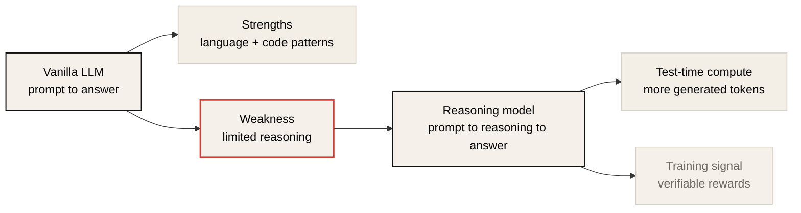
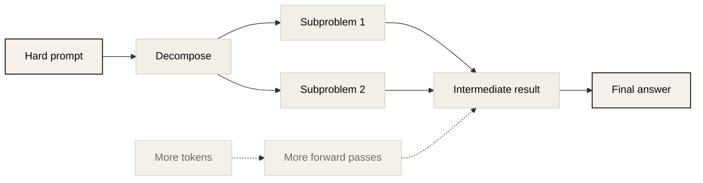
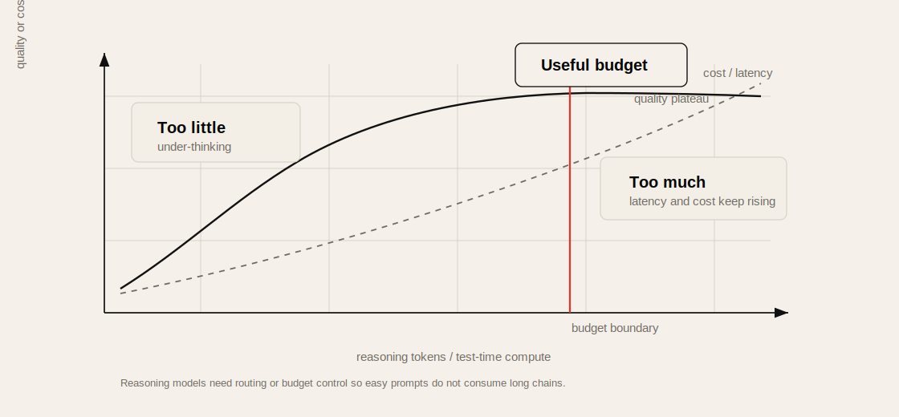
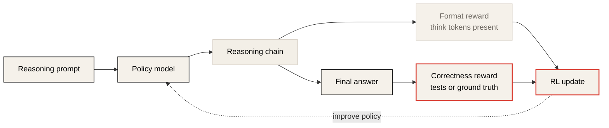
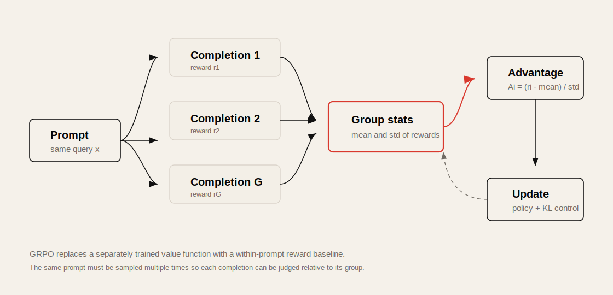
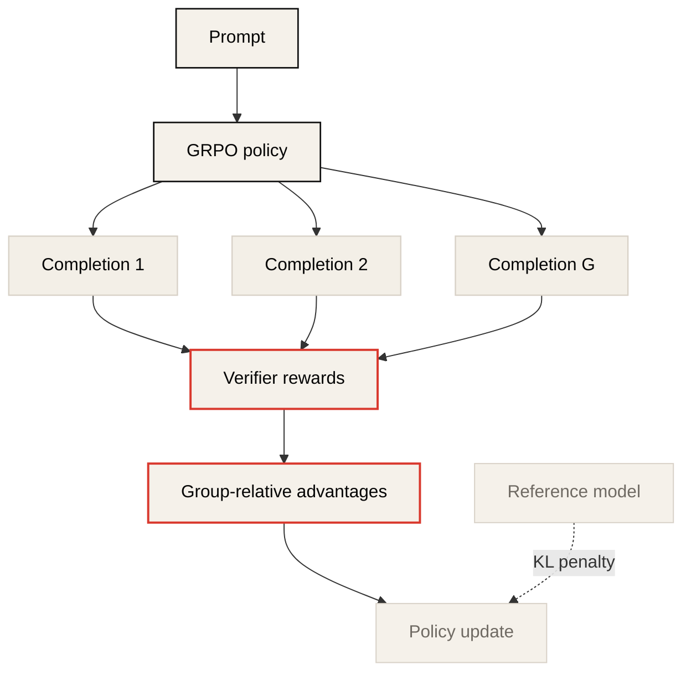

# Lecture 6: LLM Reasoning and GRPO

Source: [CME295 Lecture 6](https://www.youtube.com/watch?v=k5Fh-UgTuCo)

## Table of Contents

* [Goal](#goal)
* [Lecture Overview](#lecture-overview)
* [From Vanilla LLMs to Reasoning Models](#from-vanilla-llms-to-reasoning-models)
* [Reasoning as Multi-Step Problem Solving](#reasoning-as-multi-step-problem-solving)
* [Chain of Thought and Test-Time Compute](#chain-of-thought-and-test-time-compute)
* [Reasoning Model Timeline](#reasoning-model-timeline)
* [Reasoning Tokens, Thought Summaries, and Cost](#reasoning-tokens-thought-summaries-and-cost)
* [Reasoning Benchmarks](#reasoning-benchmarks)
* [Pass at K](#pass-at-k)
* [Temperature and Diversity](#temperature-and-diversity)
* [Why RL for Reasoning](#why-rl-for-reasoning)
* [Verifiable Rewards](#verifiable-rewards)
* [GRPO](#grpo)
* [GRPO Compared with PPO](#grpo-compared-with-ppo)
* [Output Length Growth](#output-length-growth)
* [DeepSeek-R1-Zero and DeepSeek-R1](#deepseek-r1-zero-and-deepseek-r1)
* [Reasoning Distillation](#reasoning-distillation)
* [Practical Tips and Notes](#practical-tips-and-notes)
* [Lecture Summary](#lecture-summary)
* [Key Terms](#key-terms)
* [Questions](#questions)
* [Answers](#answers)

---

## Goal

이번 강의의 목표는 reasoning model이 무엇이고, 왜 최근 LLM training에서 reinforcement learning이 reasoning capability를 키우는 핵심 도구가 되었는지 이해하는 것이다.

핵심 메시지는 다음과 같다.

> Reasoning model은 단순히 답을 바로 생성하는 LLM이 아니라, 문제를 여러 단계로 분해하고 reasoning chain을 생성한 뒤 최종 답을 내는 model이다. 이 능력은 사람이 쓴 긴 chain-of-thought data만으로 만들기 어렵기 때문에, math/code처럼 정답을 검증할 수 있는 task에서 verifiable reward와 GRPO-style RL을 사용해 학습한다.

이 강의는 다음을 다룬다.

* vanilla LLM의 한계: limited reasoning, static knowledge, no action, difficult evaluation
* reasoning의 working definition
* chain of thought와 reasoning chain
* reasoning token이 곧 test-time compute라는 관점
* coding/math reasoning benchmark와 pass@K
* sampling temperature와 answer diversity
* SFT보다 RL이 reasoning bootstrap에 유리한 이유
* formatting reward와 answer correctness reward
* GRPO의 group-relative advantage
* PPO와 GRPO의 차이
* output length가 계속 늘어나는 현상과 GRPO objective 수정
* DeepSeek-R1-Zero, DeepSeek-R1 training pipeline
* large reasoning model에서 small model로 distillation하는 방법

---

## Lecture Overview

강의 초반부는 이전 lecture의 preference tuning을 복습한다. RLHF에서 LLM은 policy이고, token generation은 action이며, human preference나 reward model은 reward로 해석된다. PPO는 advantage를 maximize하면서 old policy 또는 reference model에서 너무 멀어지지 않도록 clipping이나 KL penalty를 사용한다.

그 다음 reasoning model로 넘어간다. Vanilla LLM은 자연스러운 text/code generation에는 강하지만, 복잡한 math/coding problem에서는 중간 단계 없이 plausible answer를 생성하다가 실패할 수 있다. Reasoning model은 answer 전에 reasoning chain을 생성하도록 학습되어, 문제를 더 작은 subproblem으로 나누고 더 많은 generation step을 통해 추가 compute를 사용한다.

중반부는 evaluation이다. Coding benchmark는 generated solution이 test case를 통과하는지로 검증할 수 있고, math benchmark는 final answer를 parsing해 ground truth와 비교할 수 있다. 이때 pass@K는 `K`개 시도 중 하나라도 성공할 확률을 추정하는 metric이다. Sampling temperature는 candidate diversity와 correctness 사이의 trade-off를 만든다.

후반부는 training이다. Reasoning chain을 사람이 대량으로 쓰는 것은 어렵고, model의 reasoning 방식이 사람과 다를 수도 있다. 반면 math/code task는 정답 검증 reward가 명확하다. 그래서 reasoning model training은 SFT만으로 시작하기보다, formatting reward와 correctness reward를 결합한 RL이 자연스럽다. 여기서 대표 algorithm이 GRPO다.

마지막으로 DeepSeek-R1 계열을 사례로 본다. R1-Zero는 pre-trained base model에 SFT 없이 RL만 적용해 reasoning performance를 끌어올릴 수 있음을 보였다. 하지만 language mixing과 formatting 문제가 있어, R1은 cold-start SFT, reasoning RL, rejection sampling 기반 SFT, helpfulness/harmlessness를 포함한 final RL을 조합한다. 작은 model은 large reasoning teacher가 생성한 reasoning traces로 distillation할 수 있다.

---

## From Vanilla LLMs to Reasoning Models

Vanilla LLM은 prompt를 입력받고 answer를 바로 생성한다. Pre-training과 SFT를 거친 model은 text structure, code pattern, assistant-style response를 잘 배웠지만, 다음 약점을 가진다.

| Weakness | Explanation |
| -------- | ----------- |
| Limited reasoning | 복잡한 math/coding problem에서 multi-step search 없이 plausible continuation을 생성하다 실패할 수 있음 |
| Static knowledge | pre-training cutoff 이후 사건은 model weights만으로 알 수 없음 |
| No action | 주문, 예약, file operation 같은 external action을 직접 수행하지 못함 |
| Hard evaluation | free-form response는 BLEU/ROUGE 같은 전통 metric만으로 평가하기 어려움 |

이번 강의는 이 중 reasoning에 초점을 둔다. Static knowledge와 external action은 retrieval, tools, agents 쪽 문제로 이어지고, evaluation은 이후 lecture의 중요한 주제가 된다.



---

## Reasoning as Multi-Step Problem Solving

강의에서는 reasoning을 엄밀한 철학적 정의가 아니라 실용적인 working definition으로 둔다.

```text
reasoning = problem을 풀기 위해 multi-step process를 구성하는 능력
```

여기서 problem은 주로 math problem이나 coding problem을 뜻한다. 예를 들어 "Stanford Transformers and LLM class의 course code는 무엇인가?"는 knowledge question에 가깝다. 반면 "2020년에 태어난 대상이 2025년에 몇 살인가?" 같은 문제는 단순하더라도 입력을 intermediate step으로 처리해야 한다.

중요한 구분은 다음과 같다.

| Question type | Needed ability |
| ------------- | -------------- |
| Factual lookup | 저장된 지식 또는 retrieval |
| Simple generation | style, fluency, pattern completion |
| Reasoning problem | decomposition, intermediate state, final verification |

Reasoning problem은 보통 정답으로 바로 점프하기 어렵다. 문제를 작은 단계로 나누고, 각 단계에서 이미 학습한 pattern을 재사용해야 한다.

---

## Chain of Thought and Test-Time Compute

Chain of thought는 model이 바로 답하지 않고 중간 추론 단계를 생성하도록 유도하는 방법이다. 초기 형태는 in-context learning example 안에 reasoning step을 보여주어 model이 같은 형식으로 답하도록 만드는 방식이었다.

Reasoning model은 이 아이디어를 prompt trick이 아니라 model behavior 자체로 확장한다.

```text
vanilla LLM:
question -> answer

reasoning model:
question -> reasoning chain -> answer
```

이 방식이 도움이 되는 이유는 두 가지다.

첫째, 어려운 문제는 training set에 그대로 있었을 가능성이 낮다. Reasoning chain을 생성하면 model이 문제를 더 작은 subproblem으로 분해하고, 각 subproblem을 training 중 본 pattern과 연결할 수 있다.

둘째, 더 많은 token을 생성한다는 것은 더 많은 forward pass를 수행한다는 뜻이다. 즉 reasoning token은 model이 test time에 쓰는 compute budget이다. 단순한 질문에는 적은 reasoning token이면 충분하고, 어려운 질문에는 더 긴 reasoning chain이 필요할 수 있다.



---

## Reasoning Model Timeline

강의는 reasoning model의 최근 흐름을 대략 다음처럼 설명한다.

| Time | Event |
| ---- | ----- |
| 2024-09 | OpenAI o1-preview 공개 이후 reasoning model이 큰 관심을 받음 |
| 2024-12 | Google Gemini 2.0 Flash Thinking 계열 등장 |
| 2025-01 | DeepSeek-R1 paper가 공개되어 open methodology로 강한 reasoning performance를 보임 |
| 2025 | xAI, Anthropic, Mistral 등 여러 lab에서 reasoning capability를 강조한 model 공개 |

강의의 관점에서 중요한 점은 reasoning model이 2024년 말부터 본격적으로 product와 research의 중심 주제가 된 매우 최근의 흐름이라는 것이다.

---

## Reasoning Tokens, Thought Summaries, and Cost

사용자 UI에서 "thinking" 또는 "extended thinking"이 보이면 reasoning model을 쓰고 있을 가능성이 높다. 다만 많은 product는 raw reasoning chain 전체를 보여주지 않고 summary만 보여준다.

강의에서는 가능한 이유를 세 가지로 설명한다.

* Raw chain이 사람이 읽기 좋은 자연어가 아닐 수 있다.
* User는 긴 internal reasoning을 모두 읽고 싶지 않을 수 있다.
* Raw reasoning chain은 다른 model을 모방 학습시키는 training signal이 될 수 있다.

또 하나의 실무적 포인트는 비용이다. API에서 reasoning token은 최종 answer에 보이지 않더라도 output token의 일부로 과금될 수 있다. 따라서 reasoning model 운영에서는 "더 많이 생각하면 더 잘할 수 있다"와 "너무 많이 생각하면 비용과 latency가 커진다" 사이의 trade-off를 관리해야 한다.



---

## Reasoning Benchmarks

Reasoning benchmark는 정답을 검증할 수 있어야 한다. 강의에서는 coding과 math를 대표 예시로 든다.

### Coding Benchmarks

Coding task는 problem statement가 주어지고, model이 solution을 생성한다. 생성된 code가 test cases를 통과하면 정답으로 볼 수 있다.

| Benchmark | What it tests |
| --------- | ------------- |
| HumanEval | 사람이 작성한 programming problems |
| Codeforces-style tasks | competitive programming problem solving |
| SWE-bench | GitHub issue 기반 real-world bug fixing |

### Math Benchmarks

Math task는 problem이 주어지고, model이 reasoning과 final answer를 생성한다. Final answer를 parsing해서 ground truth와 비교한다. Prompt에서 answer를 특정 delimiter나 box 안에 넣게 하면 parsing이 쉬워진다.

| Benchmark | What it tests |
| --------- | ------------- |
| AIME | olympiad qualifying 수준의 challenging math |
| GSM8K | grade-school math word problems |

---

## Pass at K

`pass@K`는 `K`번의 시도 중 적어도 하나가 성공할 확률을 추정하는 metric이다.

```text
pass@K = P(at least one of K attempts succeeds)
```

Coding problem처럼 answer를 자동 검증할 수 있으면, 하나의 answer만 생성하지 않고 여러 candidate를 생성한 뒤 test를 통과한 것을 고를 수 있다. 이것은 preference tuning에서 본 `best-of-n`과 비슷하지만, reward model 대신 deterministic verifier를 사용한다.

실제로는 variance를 줄이기 위해 `K`개만 생성하지 않고 `n`개를 생성한다. 그중 `c`개가 correct이면, `n`개 중 `K`개를 뽑았을 때 적어도 하나가 correct일 확률을 다음처럼 추정한다.

```math
\text{pass@K} = 1 - \frac{\binom{n-c}{K}}{\binom{n}{K}}
```

해석은 간단하다. "적어도 하나가 성공"은 "모두 실패"의 여사건이다. `n-c`개의 실패 sample 중에서만 `K`개를 뽑을 확률을 전체 경우의 수로 나누고, 이를 1에서 빼면 된다.

`pass@1`은 single attempt가 성공할 확률이며, 위 식은 성공 sample 비율로 단순화된다.

---

## Temperature and Diversity

Multiple attempts를 생성할 때 sampling temperature가 중요하다.

| Temperature | Effect on pass@K |
| ----------- | ---------------- |
| Too low | candidate들이 비슷해져 `K`를 늘려도 다양성이 작음 |
| Moderate | quality를 크게 해치지 않으면서 diverse attempts를 제공 |
| Too high | 다양성은 늘지만 unlikely token이 많이 선택되어 correctness가 떨어짐 |

그래서 reasoning benchmark report는 보통 sampling temperature를 명시한다. 같은 model이라도 temperature와 number of samples가 달라지면 pass@K가 달라질 수 있다.

Consensus@K도 관련 metric이다. 여러 generation 중 가장 자주 등장한 answer를 선택하는 방식이며, self-consistency와 연결된다.

---

## Why RL for Reasoning

Reasoning model을 만들려면 model이 reasoning chain을 생성하고 최종 answer를 맞히도록 해야 한다. SFT만으로 접근하면 다음 문제가 있다.

| Issue | Why it matters |
| ----- | -------------- |
| Reasoning chain writing is hard | 긴 고품질 chain-of-thought를 사람이 대량 작성하기 어렵다 |
| Human reasoning may differ | 사람이 쓰는 풀이 방식이 model에게 최적의 reasoning trace가 아닐 수 있다 |
| Natural rewards exist | math/code는 final answer correctness를 자동 검증할 수 있다 |

따라서 reasoning을 처음 bootstrap할 때는 "정답을 맞히고, reasoning format을 따르는 output을 더 보상한다"는 RL setup이 자연스럽다.



---

## Verifiable Rewards

Reasoning RL에서는 reward model을 꼭 학습하지 않아도 된다. 정답을 검증하는 verifier가 있으면 reward를 직접 만들 수 있다.

| Reward type | Example |
| ----------- | ------- |
| Format reward | `<think>...</think>` 또는 지정된 reasoning block을 포함했는지 확인 |
| Math correctness reward | parsed final answer가 ground truth와 같은지 확인 |
| Coding correctness reward | generated solution이 compile되고 test cases를 통과하는지 확인 |
| Language consistency reward | target language token ratio 등으로 language mixing을 줄임 |

이런 reward는 subjective preference보다 단순하고 강한 signal을 준다. 특히 DeepSeek-R1-Zero 사례에서, SFT 없이도 verifiable reward 기반 RL만으로 reasoning benchmark 성능이 크게 올라갈 수 있음을 보여준다.

---

## GRPO

GRPO는 Group Relative Policy Optimization의 약자다. 강의에서는 reasoning training에서 널리 쓰이는 RL algorithm으로 소개한다.

핵심은 advantage를 value function으로 추정하지 않고, 같은 prompt에서 나온 여러 completions의 reward와 비교해 계산한다는 점이다.

```text
query q
  -> policy model samples G completions
  -> verifier computes G rewards
  -> each completion gets relative advantage
  -> policy is updated with clipping and KL regularization
```

대표적인 advantage 형태는 다음과 같다.

```math
A_i = \frac{r_i - \text{mean}(r_1, ..., r_G)}{\text{std}(r_1, ..., r_G)}
```

`r_i`가 같은 prompt의 다른 completions보다 높으면 positive advantage가 되고, 낮으면 negative advantage가 된다. 쉬운 문제에서 모두 높은 reward를 받는 경우와, 어려운 문제에서 드물게 correct answer를 찾는 경우를 구분하는 baseline 역할을 한다.

GRPO의 이점은 value model을 따로 학습하지 않는다는 것이다. PPO 기반 RLHF에서는 policy model과 value function을 함께 다뤄야 하지만, GRPO는 group sampling과 reward comparison으로 advantage를 만든다.



---

## GRPO Compared with PPO

PPO와 GRPO는 모두 policy update를 너무 크게 만들지 않기 위해 ratio clipping을 사용한다. 또한 reference model에서 너무 멀어지지 않도록 KL divergence를 고려한다.

차이는 advantage computation과 trainable model에 있다.

| Aspect | PPO | GRPO |
| ------ | --- | ---- |
| Samples per prompt | 보통 one completion 중심 | same prompt에서 group completions |
| Advantage | reward와 value function으로 추정 | group reward mean/std와 비교 |
| Value model | 필요 | 필요 없음 |
| KL handling | reward/advantage 쪽에 포함되는 구현이 많음 | objective에 explicit KL term을 둠 |
| Common use | RLHF preference tuning | reasoning RL with verifiable rewards |

Reasoning task에서는 reward model이 아니라 verifier를 사용할 수 있으므로, GRPO의 구조가 더 단순해진다. Frozen reference model은 KL 계산에 쓰이고, trainable한 것은 policy model이다.



---

## Output Length Growth

Reasoning RL을 진행하면 average response length가 증가하는 현상이 관찰된다. 초반에는 longer reasoning이 performance improvement와 함께 움직일 수 있다. 하지만 어느 시점 이후에는 benchmark performance가 plateau에 가까워져도 output length가 계속 증가할 수 있다.

강의에서는 GRPO objective의 length normalization이 이런 incentive를 만들 수 있다고 설명한다. GRPO objective가 completion별 token contribution을 output length로 나누면, 같은 token이라도 짧은 output 안에 있을 때 더 큰 weight를 받는다.

문제는 negative advantage에서도 이 효과가 작동한다는 점이다.

```text
short bad output  -> bad tokens are downweighted strongly
long bad output   -> bad tokens are downweighted weakly
```

즉 model 입장에서는 "짧게 틀리는 것"보다 "길게 틀리는 것"이 덜 벌받는 구조가 될 수 있다. 이것이 bad output의 길이를 키우는 방향의 incentive가 된다.

최근 수정 방향은 다음과 같다.

| Modification | Idea |
| ------------ | ---- |
| Token contribution equalization | token-level normalization factor를 output마다 다르게 두지 않고 공통화 |
| Dr. GRPO-style removal | problematic length factor를 제거 |
| Standard deviation adjustment | hard prompt에서 group reward variance가 작아지는 문제를 완화 |
| Asymmetric clipping epsilon | low-probability token이 성장할 수 있는 여지와 high-probability collapse 방지를 분리 |

실무적으로는 answer quality만 볼 것이 아니라 reasoning token length, latency, cost, incorrect-output length를 함께 봐야 한다.

---

## DeepSeek-R1-Zero and DeepSeek-R1

강의 후반부는 DeepSeek-R1 paper를 사례로 reasoning model training pipeline을 설명한다.

### DeepSeek-R1-Zero

R1-Zero는 proof of concept에 가깝다. Pre-trained DeepSeek-V3 base model에서 출발해, SFT 없이 reasoning data에 RL을 직접 적용한다.

Reward는 크게 두 종류다.

| Reward | Purpose |
| ------ | ------- |
| Accuracy reward | final answer가 맞는지 검증 |
| Format reward | thinking block과 answer block을 올바른 형식으로 냈는지 확인 |

결과적으로 AIME 같은 reasoning benchmark에서 성능이 올라간다. 하지만 supervision 없이 reward만 최적화하다 보니 reasoning chain에서 language mixing, syntax issue, readability problem이 생길 수 있다.

### DeepSeek-R1

R1은 R1-Zero의 약점을 줄이기 위해 multi-stage pipeline을 사용한다.

```mermaid
flowchart LR
    A[DeepSeek-V3 base] --> B[Cold-start SFT<br/>clean reasoning traces]
    B --> C[Reasoning RL<br/>accuracy + format + language]
    C --> D[Rejection sampling<br/>high-quality reasoning data]
    D --> E[Large SFT mix<br/>reasoning + non-reasoning]
    E --> F[Final RL<br/>reasoning + helpfulness + harmlessness]
    F --> G[DeepSeek-R1]

    classDef primary fill:#F5F1EA,stroke:#111111,stroke-width:1.4px,color:#050505
    classDef secondary fill:#F3EFE7,stroke:#D8D1C7,stroke-width:1.2px,color:#050505
    classDef note fill:#F5F1EA,stroke:#D8D1C7,stroke-width:1px,color:#6F6A63
    classDef accent fill:#F5F1EA,stroke:#D9392E,stroke-width:2px,color:#050505
    class A,G primary
    class B,C,D,E secondary
    class F accent
```



단계별 의미는 다음과 같다.

| Stage | Role |
| ----- | ---- |
| Cold-start SFT | 사람이 정리한 clean reasoning traces로 format과 readability를 anchor |
| Reasoning RL | verifiable reward, format reward, language consistency reward로 reasoning 강화 |
| Rejection sampling | model이 만든 reasoning responses 중 좋은 것만 filter해 SFT data 구성 |
| Large SFT mix | reasoning data와 non-reasoning assistant data를 섞어 범용성 유지 |
| Final RL | reasoning reward와 helpfulness/harmlessness reward를 함께 최적화 |

강의에서는 non-reasoning data로 약 200K pair를 재사용하고, reasoning data는 rejection sampling으로 더 큰 비중을 구성했다고 설명한다. Final RL에서는 reasoning task의 verifiable reward뿐 아니라 일반 assistant로서 helpfulness와 harmlessness도 포함한다. Harmlessness는 final answer뿐 아니라 thinking section 전체에도 적용되어야 한다.

---

## Reasoning Distillation

큰 reasoning model을 직접 운영하거나 학습할 수 없다면 distillation을 사용할 수 있다.

기존 distillation에서는 teacher model의 next-token probability distribution을 student가 맞추도록 학습했다. Reasoning distillation에서는 teacher reasoning model이 만든 full sequence를 SFT target으로 사용한다.

```text
teacher R1:
prompt -> reasoning tokens + final answer

student:
prompt -> same reasoning tokens + final answer
```

이 방식은 offline으로 teacher responses를 생성하고, 작은 model이 그 entire output sequence를 따라 하도록 SFT하는 형태다. 강의에서는 small model scale에서는 같은 RL을 처음부터 적용하는 것보다 large reasoning teacher의 traces를 distill하는 편이 더 효율적일 수 있다고 설명한다.

---

## Practical Tips and Notes

### Reasoning이 필요한 Prompt를 먼저 분류하기

모든 request에 긴 reasoning budget을 주면 cost와 latency가 빠르게 증가한다. Prompt classifier, route policy, user-selected thinking level 같은 방법으로 simple lookup, ordinary writing, hard reasoning을 분리하는 것이 좋다.

### Final Answer와 Reasoning Token을 따로 측정하기

Reasoning model 평가는 accuracy만으로 부족하다. `answer_tokens`, `reasoning_tokens`, wall-clock latency, cost per solved problem, incorrect-output length를 함께 기록해야 한다.

### Verifier Quality가 Reward Quality다

Math answer parser가 취약하거나 coding test case coverage가 낮으면 RL은 그 틈을 최적화한다. Reward hacking을 막으려면 hidden tests, robust parsing, edge-case tests, format-independent answer normalization이 필요하다.

### pass@K를 운영 Metric으로 그대로 쓰지 않기

pass@K는 research metric으로 유용하지만, 실제 product에서는 `K`개 candidate를 생성하고 검증하는 비용이 크다. 운영에서는 pass@1, cost-normalized pass rate, latency budget 안에서의 best-of-n 성능을 함께 봐야 한다.

### Length Control은 품질 문제가 아니라 비용 문제이기도 하다

긴 reasoning은 성능 향상에 기여할 수 있지만 plateau 이후에는 낭비가 된다. Training objective, stop rule, budget forcing, model routing, answer verifier를 조합해 "필요한 만큼만 생각하는" 정책을 만들어야 한다.

### SFT와 RL을 경쟁 관계로 보지 않기

R1-Zero는 RL-only 가능성을 보여주지만, production-quality reasoning model은 cold-start SFT, rejection sampling SFT, RL, helpfulness/harmlessness tuning을 함께 쓴다. SFT는 format과 readability를 anchor하고, RL은 correctness-seeking behavior를 강화한다.

### Quick Reference

| Symptom | First Check |
| ------- | ----------- |
| Reasoning chain이 너무 길다 | length normalization, stop token behavior, reasoning budget |
| 정답률은 높지만 비용이 과하다 | reasoning token count, pass@K sampling count, verifier cost |
| RL 후 format이 깨진다 | format reward, cold-start SFT data, parser robustness |
| Language mixing이 생긴다 | language consistency reward, SFT language distribution |
| Coding benchmark는 좋은데 실제 bug fixing이 약하다 | test coverage, SWE-bench-like eval, repository context handling |
| Small model RL이 불안정하다 | teacher reasoning distillation, rejection sampling SFT |

---

## Lecture Summary

Lecture 6은 reasoning model을 "answer 전에 reasoning chain을 생성하는 LLM"으로 정의하고, 이 behavior가 왜 multi-step problem solving과 test-time compute 관점에서 중요한지 설명한다.

Vanilla LLM은 text/code generation에는 강하지만 복잡한 reasoning problem에서는 바로 plausible answer를 생성하다 실패할 수 있다. Reasoning model은 chain of thought를 대규모 model behavior로 확장해, 문제를 작은 단계로 나누고 더 많은 token generation을 통해 추가 compute를 사용한다.

Reasoning model 평가는 coding과 math처럼 verifier가 있는 task에서 특히 명확하다. Coding에서는 generated solution이 tests를 통과하는지 보고, math에서는 final answer를 parsing해 ground truth와 비교한다. pass@K는 여러 attempt 중 하나라도 성공할 확률을 추정하며, sampling temperature는 diversity와 correctness 사이의 trade-off를 만든다.

Training에서는 SFT만으로 long reasoning traces를 대량 확보하기 어렵기 때문에 RL이 중요해진다. Formatting reward는 reasoning block을 생성하도록 유도하고, correctness reward는 final answer가 맞는지 검증한다. GRPO는 같은 prompt에서 여러 completions를 뽑아 group-relative advantage를 계산하므로 value model 없이 reasoning RL을 수행할 수 있다.

GRPO는 PPO와 마찬가지로 clipping과 KL regularization을 사용하지만, advantage 계산 방식이 다르다. PPO는 reward와 value function을 사용하고, GRPO는 group reward mean/std와 비교한다. Reasoning task에서는 reward model 대신 verifier를 사용할 수 있어 구조가 단순해진다.

DeepSeek-R1-Zero는 SFT 없이 RL만으로 reasoning performance를 올릴 수 있음을 보였지만, readability와 language consistency 문제가 있었다. DeepSeek-R1은 cold-start SFT, reasoning RL, rejection sampling SFT, final RL을 결합해 더 안정적인 full reasoning model pipeline을 구성한다. 작은 model에는 large reasoning model이 생성한 reasoning traces를 SFT target으로 사용하는 distillation이 효과적일 수 있다.

---

## Key Terms

| Term | Meaning |
| ---- | ------- |
| Vanilla LLM | prompt를 받아 answer를 바로 생성하는 일반 LLM |
| Reasoning model | answer 전에 reasoning chain을 생성하도록 학습된 LLM |
| Reasoning chain | 문제 해결을 위한 intermediate thought/token sequence |
| Chain of thought | model이 단계별 reasoning을 출력하도록 유도하는 prompting/training idea |
| Test-time compute | inference 중 더 많은 token/forward pass를 사용해 성능을 높이는 compute |
| Reasoning token | final answer가 아니라 reasoning 과정에 쓰이는 generated token |
| Thought summary | raw reasoning chain 전체가 아니라 사용자에게 보여주는 요약 |
| pass@K | `K`개 attempt 중 적어도 하나가 성공할 확률 |
| Consensus@K | 여러 generation 중 가장 자주 나온 answer를 선택하는 방식 |
| Verifiable reward | test case나 ground truth처럼 deterministic하게 확인 가능한 reward |
| Format reward | reasoning/answer block 형식을 지켰는지 보는 reward |
| Accuracy reward | final answer correctness를 보는 reward |
| GRPO | group completions의 relative reward로 advantage를 계산하는 RL algorithm |
| PPO | clipping과 value function을 사용하는 policy optimization algorithm |
| Advantage | 어떤 action/completion이 baseline보다 좋은지 나타내는 quantity |
| Reference model | KL regularization 기준이 되는 frozen model |
| Rejection sampling | 여러 output 중 품질 조건을 만족하는 sample만 SFT data로 채택하는 방법 |
| Cold-start SFT | RL 전에 clean examples로 format/readability를 잡아주는 초기 SFT |
| Language consistency reward | output이 target language를 유지하도록 주는 reward |
| Reasoning distillation | large reasoning teacher의 reasoning trace와 answer를 small student가 SFT로 학습하는 방법 |

---

## Questions

1. Vanilla LLM의 reasoning 한계는 무엇인가?
2. 강의에서는 reasoning을 어떻게 working definition으로 정의하는가?
3. Chain of thought가 어려운 문제 해결에 도움이 되는 직관은 무엇인가?
4. Reasoning token이 test-time compute라고 볼 수 있는 이유는 무엇인가?
5. Raw reasoning chain 대신 thought summary를 보여주는 이유는 무엇인가?
6. Coding benchmark에서 generated solution의 correctness를 어떻게 검증하는가?
7. Math benchmark에서 answer parsing이 필요한 이유는 무엇인가?
8. pass@K는 무엇을 추정하는 metric인가?
9. pass@K를 계산할 때 `1 - C(n-c,K)/C(n,K)` 형태가 나오는 이유는 무엇인가?
10. Sampling temperature가 pass@K에 주는 trade-off는 무엇인가?
11. Reasoning model bootstrap에서 SFT만 쓰기 어려운 이유는 무엇인가?
12. Verifiable reward가 reward model보다 단순해질 수 있는 이유는 무엇인가?
13. GRPO에서 advantage는 어떻게 계산되는가?
14. GRPO가 PPO와 비교해 value model을 필요로 하지 않는 이유는 무엇인가?
15. GRPO objective의 length normalization이 output length growth를 유도할 수 있는 이유는 무엇인가?
16. DeepSeek-R1-Zero와 DeepSeek-R1의 차이는 무엇인가?
17. Rejection sampling은 reasoning SFT data를 만들 때 어떤 역할을 하는가?
18. Reasoning distillation은 기존 distillation과 어떻게 다른가?

---

## Answers

1. Vanilla LLM은 prompt에 대해 plausible continuation을 바로 생성하도록 학습되어 있어, 복잡한 math/coding problem을 여러 단계로 분해하고 검증하는 능력이 약할 수 있다.
2. Reasoning은 문제를 풀기 위해 multi-step process를 구성하는 능력으로 정의한다. 강의에서는 특히 math와 coding problem을 중심 예시로 든다.
3. 어려운 문제를 그대로 맞히기보다 작은 subproblem으로 나누면, model이 pre-training 중 본 익숙한 pattern을 각 단계에서 재사용할 수 있다.
4. Token을 하나 생성할 때마다 forward pass가 수행된다. Reasoning chain이 길어질수록 inference 중 더 많은 compute를 쓰는 셈이다.
5. Raw chain은 사람이 읽기 어려울 수 있고 너무 길 수 있으며, 다른 model을 모방 학습시키는 training signal이 될 수 있다. 그래서 product UI는 보통 summary만 보여준다.
6. Generated code가 compile되고 provided/hidden test cases를 통과하는지 확인한다.
7. Model output은 free-form text이므로 final answer만 안정적으로 추출해야 ground truth와 비교할 수 있다. Prompt로 boxed answer나 delimiter를 요구하는 방식이 쓰인다.
8. `K`번의 generation attempt 중 적어도 하나가 correct일 확률을 추정한다.
9. "적어도 하나 성공"은 "모두 실패"의 여사건이다. `n-c`개의 실패 sample에서만 `K`개를 뽑는 경우의 수를 전체 `n`개에서 `K`개를 뽑는 경우의 수로 나누고 1에서 뺀다.
10. 낮은 temperature는 quality는 높지만 diversity가 부족하고, 높은 temperature는 diversity는 늘지만 correctness가 떨어질 수 있다. 중간값이 pass@K에 유리한 경우가 많다.
11. 긴 고품질 reasoning chain을 사람이 대량 작성하기 어렵고, 사람이 쓰는 풀이가 model에게 최적의 reasoning trace가 아닐 수 있다.
12. Math/code task에서는 final answer를 ground truth나 test cases로 직접 확인할 수 있다. Human preference를 예측하는 reward model을 따로 학습하지 않아도 된다.
13. 같은 prompt에서 여러 completions를 생성하고 각 reward를 group mean과 standard deviation으로 normalize해 relative advantage를 만든다.
14. PPO는 reward와 value function으로 advantage를 추정한다. GRPO는 같은 prompt의 group completions를 baseline으로 삼아 advantage를 계산하므로 value model이 필요 없다.
15. Output length로 token contribution을 나누면 짧은 bad output의 token이 더 강하게 downweight되고, 긴 bad output은 덜 벌받을 수 있다. 이 incentive가 "길게 틀리는" 방향을 만들 수 있다.
16. R1-Zero는 base model에 SFT 없이 RL만 적용한 proof of concept이다. R1은 cold-start SFT, reasoning RL, rejection sampling SFT, final RL을 결합해 readability, language consistency, helpfulness, harmlessness까지 다룬다.
17. Model이 생성한 여러 reasoning responses 중 verifier나 judge로 좋은 sample만 남겨 high-quality SFT data를 만든다.
18. 기존 distillation은 teacher의 next-token probability distribution을 student가 맞추게 한다. Reasoning distillation은 teacher가 생성한 reasoning tokens와 final answer 전체 sequence를 SFT target으로 사용한다.
