# Week 1: From Artificial Neuron to AI Training Fabric

## Table of Contents

* [Goal](#goal)
* [Why Network Engineers Should Learn the Training Loop](#why-network-engineers-should-learn-the-training-loop)
* [Chapter 1: Artificial Neuron](#chapter-1-artificial-neuron)
* [Chapter 2: Backpropagation Algorithm](#chapter-2-backpropagation-algorithm)
* [Chapter 3: Multi-Class Classification](#chapter-3-multi-class-classification)
* [Training Loop as Compute and Communication Phases](#training-loop-as-compute-and-communication-phases)
* [Gradient Synchronization and Backend Network Burst](#gradient-synchronization-and-backend-network-burst)
* [AI Training Traffic vs General Data Center Traffic](#ai-training-traffic-vs-general-data-center-traffic)
* [AI Training Fabric Design Implications](#ai-training-fabric-design-implications)
* [Chapter Summary](#chapter-summary)
* [Key Terms](#key-terms)
* [Questions](#questions)
* [Answers](#answers)
* [References](#references)

---

## Goal

이번 주 목표는 **기본적인 Deep Learning 학습 과정이 어떻게 network design 문제로 이어지는지** 이해하는 것이다.

핵심 아이디어는 다음과 같다.

> Deep Learning은 처음에는 GPU compute 문제처럼 보이지만, distributed training으로 확장되는 순간 backend network synchronization 문제가 된다.

목표는 model researcher가 되는 것이 아니다.
목표는 AI training workload가 왜 high bandwidth, low latency, congestion control, lossless behavior를 갖춘 전용 backend fabric을 요구하는지 이해하는 것이다.

책에서도 Deep Learning과 data center networking 사이를 연결하는 bridge 역할을 목표로 하며, 특히 Deep Learning workload가 backend network design에 어떤 영향을 주는지에 집중한다고 설명한다. 또한 이 책은 configuration guide가 아니며, frontend, management, storage network는 주요 범위 밖에 있다고 명시한다.

---

## Why Network Engineers Should Learn the Training Loop

현대 Deep Learning model은 단일 GPU 또는 CPU memory 용량을 초과할 수 있다. 이 경우 학습은 여러 GPU 또는 여러 server에 분산되어야 한다. 같은 node 안의 GPU 통신은 NVLink를 사용할 수 있고, node 간 통신은 InfiniBand 또는 Ethernet 기반 fabric 같은 backend network에 의존한다. 책에서는 GPU synchronization이 network에 높은 throughput, ultra-low latency, zero packet loss라는 엄격한 요구사항을 만든다고 강조한다.

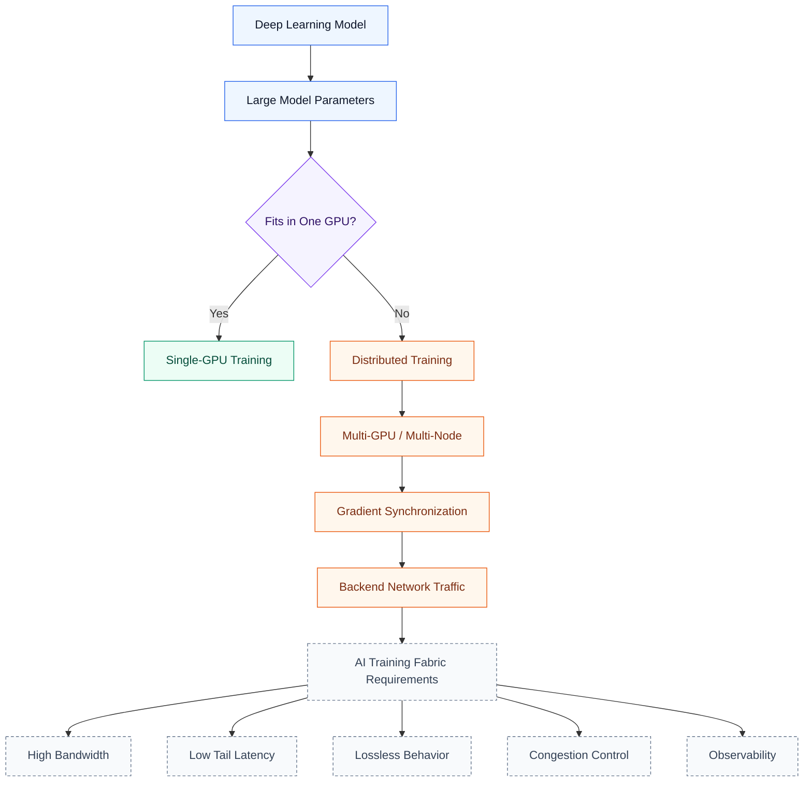

유용한 mental model은 다음과 같다.

> Forward/Backward는 GPU가 계산하는 구간이다.
> Gradient Synchronization은 GPU들이 서로를 기다리는 구간이다.

---

## Chapter 1: Artificial Neuron

### 1.1 What is an Artificial Neuron?

Artificial neuron은 neural network의 가장 작은 계산 단위다. 입력값을 받고, weight parameter를 곱한 뒤, bias term을 더하고, activation function을 적용해 output을 만든다. 책에서는 이 과정을 matrix multiplication 이후 non-linear activation function을 적용하는 흐름으로 설명한다.

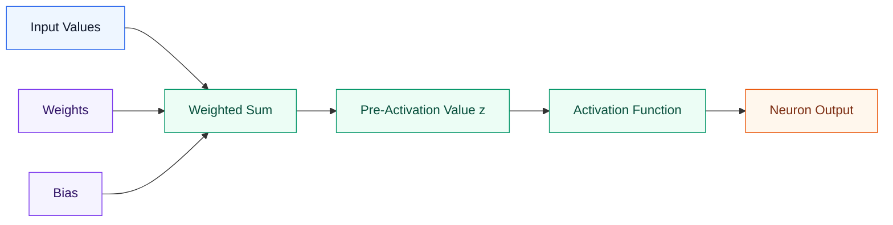

### 1.2 Weight and Bias

Weight와 bias는 단순한 수학 변수가 아니다.
학습되는 model parameter다.

Infrastructure 관점에서는 다음처럼 볼 수 있다.

| Deep Learning Concept | Infrastructure Meaning                            |
| --------------------- | ------------------------------------------------- |
| Weight                | GPU memory에 저장되는 model parameter              |
| Bias                  | 추가로 학습되는 parameter                            |
| Activation            | Forward pass 중 생성되는 intermediate tensor        |
| Gradient              | Weight update의 방향과 크기                         |
| Precision             | Memory와 bandwidth에 영향을 주는 FP32/FP16/BF16/FP8 선택 |

책에서는 모든 connection이 관련 weight parameter를 갖고, 예시에서는 보통 32-bit 값으로 표현된다고 설명한다. 또한 weighted sum 결과와 neuron output도 처리 과정에서 저장되어야 한다고 설명한다. model과 input data가 GPU memory를 초과하면 parallelization strategy가 필요해진다.

### 1.3 Why Weight and Bias Become GPU Memory Footprint

올바른 연결은 다음과 같다.

```text
Artificial neuron
→ weights and bias
→ model parameters
→ GPU memory footprint
→ distributed training when memory is insufficient
```

Neuron 하나는 작다.
하지만 수십억 개 parameter를 가진 model은 weights, activations, gradients, optimizer states, mini-batch tensors를 GPU memory에 유지해야 한다.

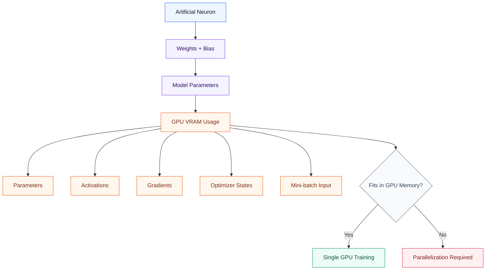

### 1.4 Network Impact of Chapter 1

Chapter 1은 단순해 보이지만, 이미 첫 번째 network design trigger를 보여준다.

> Model과 input data가 하나의 GPU에 들어가지 않으면 workload를 여러 GPU로 나눠야 한다.

책에서는 neural network model과 input data의 memory requirement가 GPU memory를 초과하면 parallelization이 필요하다고 설명한다. 한 server 안에서는 NVLink를 통해 synchronization이 일어날 수 있고, 여러 GPU server에 걸쳐서는 backend network를 통해 synchronization이 일어난다. 이 backend network는 lossless, high-speed packet forwarding을 제공해야 한다.

---

## Chapter 2: Backpropagation Algorithm

### 2.1 Training Loop Overview

Chapter 2는 작은 feed-forward neural network를 사용해 training loop를 설명한다. Forward pass는 model output을 만들고, error function은 output이 expected value와 얼마나 다른지 측정하며, backward pass는 weight를 어떻게 조정해야 하는지 계산한다.

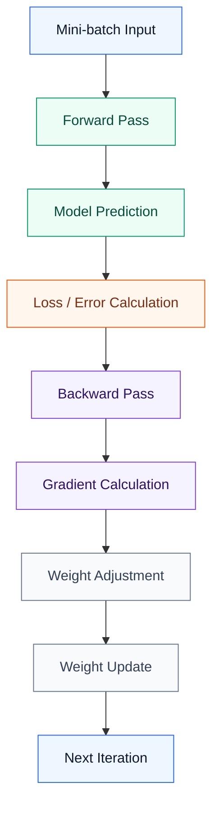

### 2.2 Forward Pass

Forward Pass는 다음을 의미한다.

> Model이 input data를 처리하고 prediction을 생성하는 과정이다.

책에서는 forward pass의 마지막 단계에서 error function을 적용해 model output과 expected value를 비교한다고 설명한다. Chapter 2에서는 Mean Squared Error를 사용하며, 이는 prediction이 expected value에서 얼마나 떨어져 있는지 측정한다.

```text
Input
→ Weighted Sum
→ Activation
→ Model Output
→ Loss Calculation
```

Infrastructure 관점에서는 다음과 같다.

| Phase            | Main Work                      | Main Bottleneck   |
| ---------------- | ------------------------------ | ----------------- |
| Forward Pass     | Tensor computation             | GPU compute / HBM |
| Loss Calculation | Prediction과 label 비교         | GPU compute       |

### 2.3 Backward Pass

Backward Pass는 다음을 의미한다.

> Model이 loss를 뒤로 전파하면서 각 weight의 gradient를 계산하는 과정이다.

책에서는 backpropagation이 activation output, weighted sum, input value를 직접 수정할 수 없다고 설명한다. 대신 weight adjustment를 계산하고, 이를 사용해 model weight를 업데이트한다.

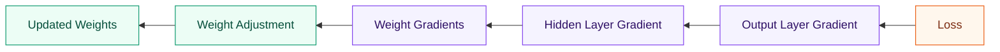

### 2.4 Gradient

Gradient는 model에게 다음을 알려준다.

> Loss를 줄이려면 weight를 어느 방향으로, 얼마나 바꿔야 하는가?

Chapter 2에서는 backward pass 중 algorithm이 각 weight의 gradient를 계산한다고 설명한다. Gradient descent를 통해 gradient의 반대 방향으로 이동하면, 여러 iteration에 걸쳐 loss를 줄일 수 있다.

```text
Gradient = direction + magnitude of weight adjustment
```

### 2.5 Learning Rate

Learning rate는 각 update step의 크기를 제어한다.

```text
Gradient = where to go
Learning Rate = how far to move
```

작은 learning rate는 training을 안정적으로 만들 수 있지만 느리다.
큰 learning rate는 training을 빠르게 할 수 있지만 overshoot가 발생해 불안정해질 수 있다.

Infrastructure team 입장에서는 중요하다. 불안정한 training은 비싼 GPU cluster 시간을 낭비할 수 있기 때문이다.

---

## Chapter 3: Multi-Class Classification

### 3.1 MNIST Dataset

Multi-class classification은 MNIST handwritten digit classification 예제로 이해할 수 있다. 이 dataset은 grayscale handwritten digit image로 구성되어 있으며, 가능한 digit이 10개이므로 output layer는 class마다 하나씩 총 10개의 neuron을 사용한다. Label은 training 전에 one-hot encoding된다.

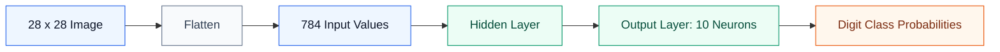

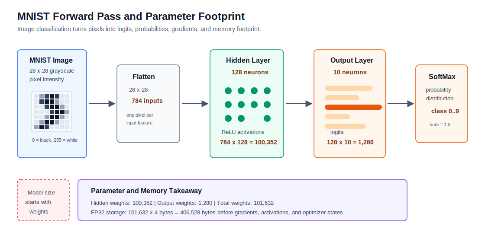

MNIST 예제는 단순히 image를 10개 class로 분류하는 흐름만 보여주는 것이 아니라, parameter 수가 어떻게 memory footprint로 이어지는지도 보여준다. 28 x 28 image는 784개 input feature가 되고, hidden layer가 128개 neuron이면 hidden layer weight만 `784 x 128 = 100,352`개가 된다. Output layer는 `128 x 10 = 1,280`개 weight를 추가한다.

FP32를 사용하면 weight 하나가 4 byte이므로, 이 작은 예제에서도 weight parameter만 `101,632 x 4 = 406,528 bytes`가 필요하다. 실제 training에서는 여기에 activation, gradient, optimizer state, mini-batch tensor가 더해진다.

### 3.2 SoftMax

Output layer는 logit이라고 부르는 raw score를 만든다.
SoftMax는 이 logit을 class probability로 변환한다.

```text
Logits
→ SoftMax
→ Probability distribution across classes
```

책에서는 각 output neuron이 weighted sum을 계산해 logit을 만들고, SoftMax가 각 logit에 exponential을 적용한 뒤 모든 exponential의 합으로 나누어 probability로 변환한다고 설명한다.

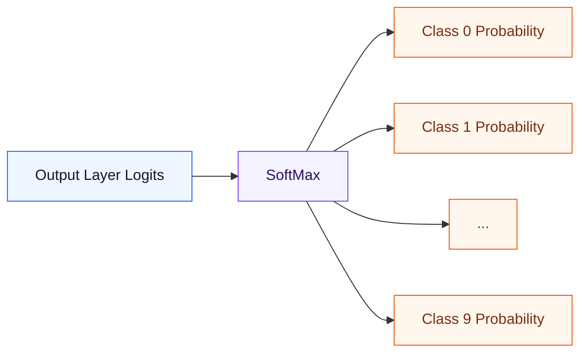

### 3.3 Cross-Entropy Loss

Cross-Entropy Loss는 다음 질문에 답한다.

> Model이 정답 class에 얼마나 높은 probability를 부여했는가?

정답 class의 probability가 높으면 loss는 낮다.
정답 class의 probability가 낮으면 loss는 높다.

```text
Correct class probability high → low loss
Correct class probability low  → high loss
```

### 3.4 Backward Pass in Multi-Class Classification

SoftMax + Cross-Entropy 조합에서 output layer gradient는 다음처럼 이해할 수 있다.

```text
gradient = predicted probability - ground truth
```

책에서는 output layer neuron의 gradient가 SoftMax가 만든 probability에서 one-hot encoded ground truth 값을 빼서 계산된다고 설명한다. SoftMax와 cross-entropy loss가 잘 결합되기 때문에 이런 단순한 gradient 표현이 가능하다.

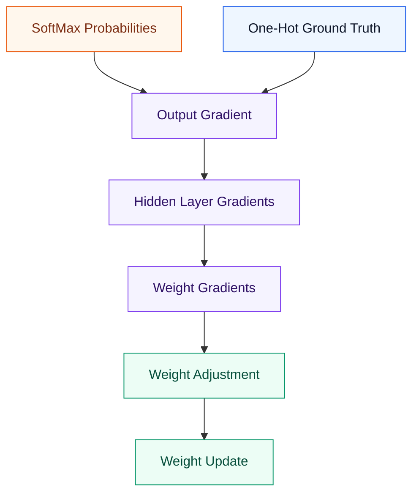

---

## Training Loop as Compute and Communication Phases

Chapter 1-3에서 얻을 수 있는 가장 중요한 infrastructure insight는 training loop에 성격이 매우 다른 두 phase가 있다는 점이다.

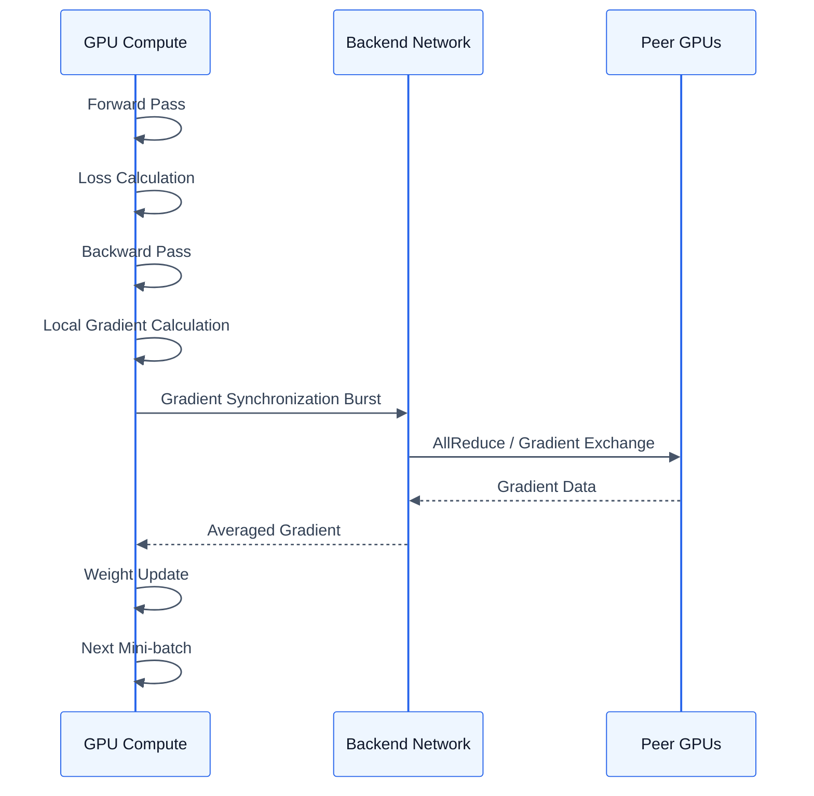

| Training Phase           | Main Work                      | Network Impact         |
| ------------------------ | ------------------------------ | ---------------------- |
| Mini-batch Load          | Training data load             | Storage/PCIe dependent |
| Forward Pass             | Prediction computation         | Low                    |
| Loss Calculation         | Prediction과 label 비교         | Low                    |
| Backward Pass            | Gradient computation           | Low to medium          |
| Gradient Synchronization | GPU 간 gradient 교환             | Very high              |
| Weight Update            | Parameter update               | Low                    |

책에서는 compute-intensive한 forward/backward pass 동안 대부분의 연산이 GPU 내부에서 local하게 수행되므로 network utilization이 낮다고 설명한다. 반면 gradient synchronization 중에는 GPU NIC가 line rate로 전송할 수 있고, 종종 link utilization이 100%에 가까워진다.

---

## Gradient Synchronization and Backend Network Burst

### 1. Why Synchronization is Needed

Data Parallel Training에서는 다음과 같이 동작한다.

```text
GPU-A processes mini-batch A
GPU-B processes mini-batch B
GPU-C processes mini-batch C
GPU-D processes mini-batch D
```

각 GPU는 local gradient를 계산한다.

각 GPU가 자기 gradient만 사용해 weight를 업데이트하면 model replica들이 서로 달라진다.

따라서 다음 과정이 필요하다.

```text
Local Gradients
→ Synchronize
→ Average
→ Same Weight Update
→ Same Model State
```

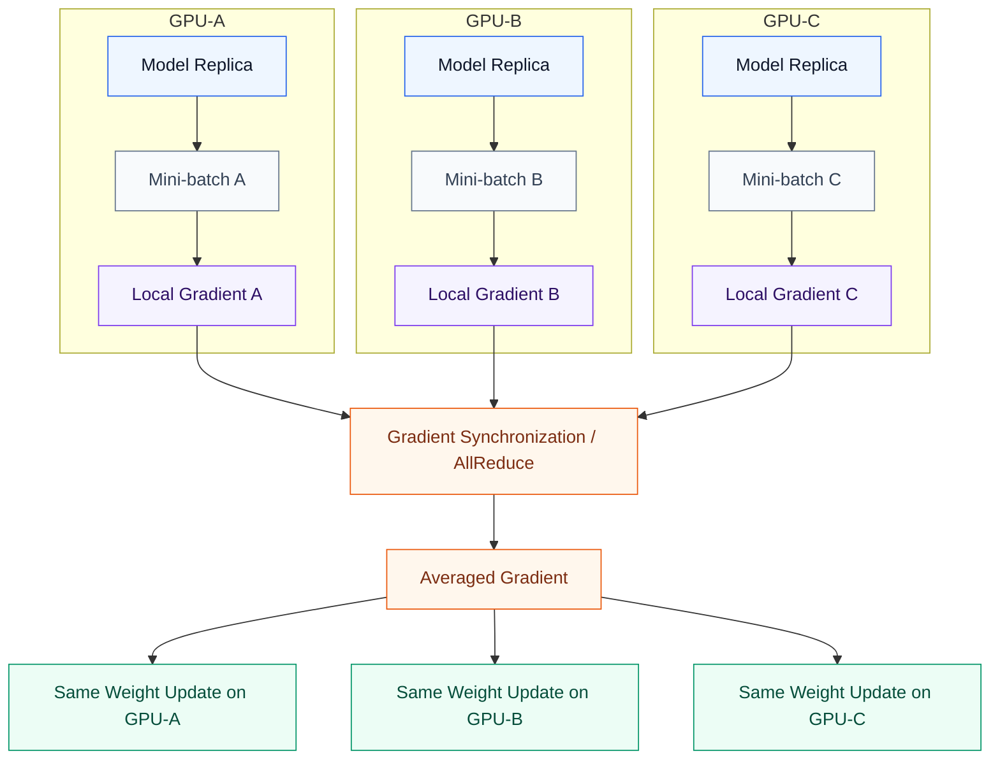

책에서는 data parallelization에서 dataset이 micro-batch로 나뉘고, 각 GPU가 같은 model과 parameter를 사용해 자신의 micro-batch를 처리한다고 설명한다. 실제 weight adjustment 값을 계산하기 전에 gradient는 synchronize되어야 한다. 각 GPU는 받은 gradient와 자기 gradient를 더한 뒤 GPU 수로 나누고, 평균 gradient를 weight adjustment에 사용한다.

### 2. Why This Creates Network Burst

Gradient synchronization은 local gradient computation 이후에 발생한다.
즉, 많은 GPU가 training step의 거의 같은 시점에 통신을 시작한다.

```text
Compute phase
→ quiet network

Synchronization phase
→ many GPUs send gradient data at once
→ backend network burst
```

```mermaid
flowchart LR
    classDef compute fill:#ecfdf5,stroke:#059669,color:#064e3b
    classDef quiet fill:#f8fafc,stroke:#64748b,color:#334155
    classDef sync fill:#fff7ed,stroke:#ea580c,color:#7c2d12
    classDef risk fill:#fff1f2,stroke:#e11d48,color:#7f1d1d
    classDef impact fill:#f5f3ff,stroke:#7c3aed,color:#2e1065

    A[Forward / Backward Compute]:::compute --> B[Low Network Utilization]:::quiet
    B --> C[Gradient Synchronization]:::sync
    C --> D[High NIC Utilization]:::sync
    D --> E[Potential Congestion]:::risk
    E --> F[Tail Latency]:::risk
    F --> G[GPU Idle Time]:::impact
    G --> H[Lower GPU Utilization]:::impact
```

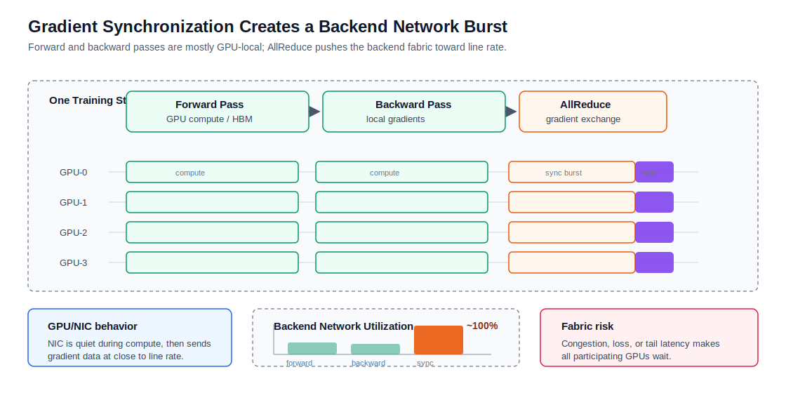

책의 Figure 3-7도 이 pattern을 보여준다. Gradient synchronization이 link utilization을 capacity에 가깝게 밀어 올리는 반면, backward/forward compute phase에서는 network utilization이 낮게 나타난다.

---

## AI Training Traffic vs General Data Center Traffic

| Item               | General Data Center Traffic       | AI Training Traffic                            |
| ------------------ | --------------------------------- | ---------------------------------------------- |
| Pattern            | 독립적인 request가 많음              | Training step에 동기화된 GPU communication       |
| Main Direction     | North-South + 일부 East-West       | Heavy East-West                                |
| Traffic Shape      | 비교적 분산됨                         | Compute phase + sync burst                     |
| Bottleneck Metric  | Average latency, RPS, throughput  | Collective completion time, tail latency       |
| Packet Loss Impact | Retransmission으로 회복 가능한 경우가 많음 | Training synchronization 지연 또는 실패 가능       |
| Main Objective     | Request를 안정적으로 serving          | GPU가 기다리지 않게 유지                         |
| Key Metrics        | p95 latency, error rate           | GPU utilization, AllReduce time, NIC utilization, ECN/PFC |

핵심 문장은 다음과 같다.

> General data center network는 request를 serving한다.
> AI Training Fabric은 GPU를 synchronize한다.

---

## AI Training Fabric Design Implications

### 1. Bandwidth

Gradient synchronization은 GPU NIC를 line rate에 가깝게 밀어 올릴 수 있다.
따라서 GPU-to-NIC mapping, NIC speed, rail capacity, oversubscription ratio가 중요하다.

Checklist:

* GPU당 충분한 NIC bandwidth가 있는가?
* GPU-to-NIC mapping이 명확한가?
* East-West bandwidth가 non-blocking인가, oversubscribed인가?
* Fabric이 synchronization burst를 흡수할 수 있는가?

### 2. Latency and Tail Latency

Average latency만으로는 충분하지 않다.
Distributed training은 참여한 GPU 중 가장 느린 GPU를 기다린다.

Checklist:

* Sync 중 p99/p999 latency는 어떤가?
* GPU group 사이에 slow path가 있는가?
* Job placement가 hop count 불균형을 만드는가?
* Collective completion time을 측정하고 있는가?

### 3. Lossless Behavior

책에서는 server 간 inter-GPU communication이 lossless해야 하며 line-rate performance를 유지할 수 있어야 한다고 반복해서 강조한다. 특히 training이 며칠 또는 몇 주 동안 지속될 때 더 중요하다. 또한 gradient exchange 중 packet 하나만 drop되어도 divergence나 job failure가 발생할 수 있고, restart가 필요할 수 있다고 설명한다.

Checklist:

* Fabric은 InfiniBand인가, RoCEv2인가?
* RoCEv2라면 PFC, ECN, DCQCN policy가 정의되어 있는가?
* Packet drop을 monitoring하고 있는가?
* Checkpoint를 정기적으로 저장하고 있는가?

### 4. Congestion Control

Synchronized burst는 incast, queue buildup, ECN marking, PFC pause, tail latency를 만들 수 있다.

Checklist:

* Gradient synchronization이 어디에서 incast를 만들 수 있는가?
* Switch buffer가 적절히 sizing되고 monitoring되는가?
* ECN threshold가 tuning되어 있는가?
* PFC pause가 fabric 전체로 propagation될 수 있는가?
* Topology가 hash polarization을 줄이는가?

### 5. Observability

AI Training Fabric은 standard interface counter만으로 운영하기 어렵다.
GPU telemetry와 network telemetry를 함께 correlation해야 한다.

Checklist:

* GPU utilization
* NCCL AllReduce duration
* NIC throughput
* RDMA errors
* ECN marking count
* PFC pause frames
* Switch queue depth
* Training step time

---

## Chapter Summary

Chapter 1-3은 AI Training Fabric을 이해하기 위한 기반을 만든다.

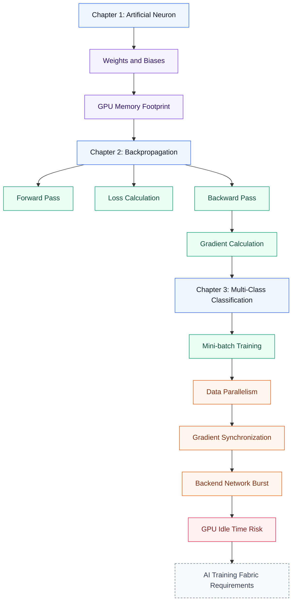

핵심 정리는 다음과 같다.

> Neural network는 weight를 update하면서 학습한다.
> Distributed training은 gradient synchronization을 통해 이 update를 일관되게 유지한다.
> Gradient synchronization이 Deep Learning을 backend network 문제로 만드는 지점이다.

---

## Key Terms

| Term                     | Meaning                                      |
| ------------------------ | -------------------------------------------- |
| Artificial Neuron        | Neural network의 기본 계산 단위                   |
| Weight                   | Input connection에 연결된 trainable parameter  |
| Bias                     | Weighted sum을 이동시키는 trainable offset       |
| Activation Function      | Weighted sum에 적용되는 non-linear function     |
| Forward Pass             | Prediction과 loss를 계산하는 과정                  |
| Backward Pass            | Gradient와 weight update 방향을 계산하는 과정       |
| Gradient                 | Loss를 줄이기 위한 방향과 크기                       |
| Learning Rate            | Gradient를 적용할 때 사용하는 step size             |
| Mini-batch               | Iteration마다 처리하는 training data의 작은 subset |
| Data Parallelism         | 여러 GPU에 같은 model을 두고 서로 다른 data를 처리하는 전략 |
| Gradient Synchronization | GPU 간 gradient를 교환하고 평균내는 과정              |
| AllReduce                | Gradient를 aggregate하는 collective operation  |
| RDMA                     | CPU data copy 없이 server 간 direct memory access를 수행하는 방식 |
| AI Training Fabric       | GPU-to-GPU training communication을 위한 backend network |

---

## Questions

1. Weight와 bias는 왜 GPU memory footprint에 포함되는가?
2. Forward Pass와 Backward Pass의 차이는 무엇인가?
3. Gradient는 왜 계산하는가?
4. Data Parallel Training은 왜 gradient synchronization이 필요한가?
5. Gradient synchronization은 왜 backend network burst를 만드는가?
6. AI training traffic은 일반 data center traffic과 왜 다른가?
7. Average bandwidth보다 tail latency와 collective completion time이 더 중요한 이유는 무엇인가?

---

## Answers

### 1. Weight와 bias는 왜 GPU memory footprint에 포함되는가?

Weight와 bias는 trainable model parameter다.
Neuron이 layer 사이에서 연결될수록 weight와 bias의 수는 빠르게 증가한다. 이 parameter들은 forward pass, backward pass, weight update 동안 GPU memory에 저장되어야 한다. 따라서 weight와 bias는 model의 GPU memory footprint의 기본이 된다.

### 2. Forward Pass와 Backward Pass의 차이는 무엇인가?

Forward Pass는 model prediction과 loss를 계산한다.

Backward Pass는 loss를 사용해 gradient를 계산하고, 각 weight를 어떻게 조정해야 하는지 결정한다.

```text
Forward Pass  = prediction + loss
Backward Pass = gradient + weight update direction
```

### 3. Gradient는 왜 계산하는가?

Gradient는 각 weight가 loss에 얼마나 기여했는지, 그리고 loss를 줄이기 위해 weight를 어느 방향으로 바꿔야 하는지 알려준다.

### 4. Data Parallel Training은 왜 gradient synchronization이 필요한가?

각 GPU는 서로 다른 mini-batch를 처리하고 자신의 local gradient를 계산한다.
각 GPU가 자기 gradient만 사용해 model을 update하면 model replica들이 서로 달라진다.
Gradient synchronization은 GPU 간 gradient를 평균내서 모든 replica가 같은 update를 적용하게 만든다.

### 5. Gradient synchronization은 왜 backend network burst를 만드는가?

Forward Pass와 Backward Pass 동안 대부분의 작업은 GPU 내부에서 local하게 수행된다.
Gradient Synchronization 단계에서는 많은 GPU가 training step의 거의 같은 시점에 gradient data를 교환한다. 이 때문에 backend network에 짧고 높은 bandwidth burst가 발생한다.

### 6. AI training traffic은 일반 data center traffic과 왜 다른가?

일반 data center traffic은 보통 독립적인 request가 많이 모인 형태다.
AI training traffic은 training step에 의해 동기화된다. GPU는 local하게 계산하다가 synchronization 단계에서 함께 통신한다. 그래서 AI training traffic은 bursty하고, East-West traffic 비중이 높으며, tail latency에 민감하다.

### 7. Average bandwidth보다 tail latency와 collective completion time이 더 중요한 이유는 무엇인가?

Distributed training은 참여한 모든 GPU가 synchronization을 끝낼 때까지 다음 단계로 진행할 수 없다.
Average bandwidth가 충분해 보여도, 하나의 slow path나 지연된 GPU가 나머지 GPU를 모두 기다리게 만들 수 있다. 따라서 collective completion time과 tail latency는 GPU idle time과 training cost에 직접 영향을 준다.
