# Week 2: Large Language Model, LLM

## Table of Contents

* [Goal](#goal)
* [Why LLM Matters to Network Engineers](#why-llm-matters-to-network-engineers)
* [LLM Processing Pipeline](#llm-processing-pipeline)
* [Tokenization](#tokenization)
* [Special Tokens and Context Size](#special-tokens-and-context-size)
* [Word Embedding Matrix](#word-embedding-matrix)
* [Embedding Vector Space](#embedding-vector-space)
* [Positional Embedding](#positional-embedding)
* [Positional Encoding Calculation](#positional-encoding-calculation)
* [Decoder-Only Transformer Architecture](#decoder-only-transformer-architecture)
* [Autoregressive Decoder Loop](#autoregressive-decoder-loop)
* [Query, Key, and Value](#query-key-and-value)
* [Self-Attention](#self-attention)
* [Multi-Head Attention and Parameter Blocks](#multi-head-attention-and-parameter-blocks)
* [Add & Normalization](#add--normalization)
* [Feed Forward Neural Network](#feed-forward-neural-network)
* [Next Token Prediction with SoftMax](#next-token-prediction-with-softmax)
* [Why LLMs Need Parallelism](#why-llms-need-parallelism)
* [Network Engineer View](#network-engineer-view)
* [Chapter Summary](#chapter-summary)
* [Key Terms](#key-terms)
* [Questions](#questions)
* [Answers](#answers)
* [References](#references)

---

## Goal

이번 주 목표는 **LLM이 텍스트를 어떻게 GPU가 처리할 수 있는 숫자 연산으로 바꾸는지** 이해하는 것이다.

핵심 흐름은 다음과 같다.

```text
Text
→ Token
→ Token ID
→ Word Embedding Vector
→ Positional Embedding
→ Q / K / V
→ Self-Attention
→ Context Vector
→ FFNN
→ SoftMax
→ Next Token
```

이 장의 목적은 특정 GPT 모델을 구현하는 것이 아니라, Transformer 기반 LLM의 기본 연산 구조를 이해하는 것이다. 책에서도 Chapter 7의 목표를 “LLM이 단어의 문맥을 어떻게 이해하는지”와 “왜 LLM 학습이 수백~수천 개 GPU의 병렬화를 요구하는지”로 설명한다. 

---

## Why LLM Matters to Network Engineers

네트워크 엔지니어 입장에서 LLM을 봐야 하는 이유는 간단하다.

> LLM은 모델 크기, 데이터 크기, 연산 복잡도 때문에 단일 GPU에 머물기 어렵고, 결국 GPU 간 통신 문제로 이어진다.

Transformer 기반 LLM은 RNN처럼 이전 상태를 순차적으로 넘겨받는 방식이 아니라, **Self-Attention**을 통해 sequence 안의 모든 token 관계를 동시에 계산한다. 이 구조 덕분에 병렬화와 대규모 학습이 가능하지만, 동시에 parameter 수와 activation memory가 크게 증가한다. 책의 앞부분에서도 Transformer 기반 LLM은 모든 token 간 관계를 self-attention으로 가중 계산하며, 이 구조가 수십억 parameter 규모로 확장될 수 있다고 설명한다. 

---

## LLM Processing Pipeline

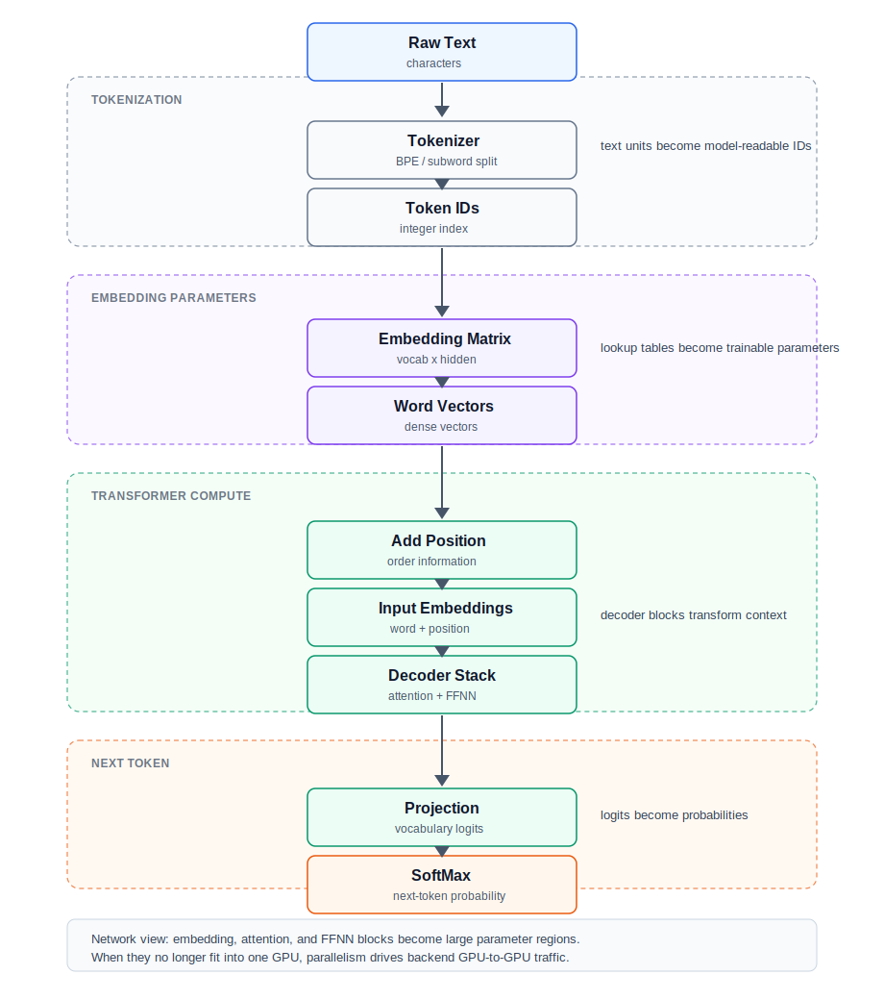

LLM은 문자열을 직접 이해하지 않는다. 먼저 text를 token으로 나누고, token ID를 embedding lookup table에서 vector로 변환한다. 이후 positional embedding을 더해 “어떤 단어가 어느 위치에 있었는지”를 반영하고, Transformer decoder block이 이 vector들을 처리한다. 

---

## Tokenization

Tokenization은 입력 문장을 model이 처리할 수 있는 단위로 쪼개는 과정이다.

예를 들어:

```text
"unhappiness" → "un" + "happi" + "ness"
```

책에서는 많은 LLM이 **Byte Pair Encoding, BPE**를 사용한다고 설명한다. BPE는 단어 전체만 vocabulary에 넣는 방식보다 rare word와 subword를 더 효율적으로 처리할 수 있다. 단순한 예제에서는 complete word를 사용하지만, 실제 LLM에서는 subword tokenization이 일반적이다. 

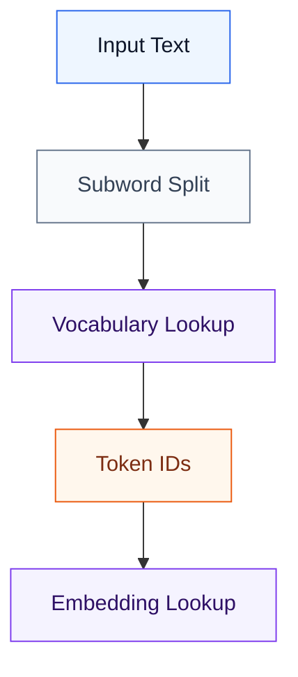

---

## Special Tokens and Context Size

책에서는 vocabulary의 token value가 2부터 시작하는 예를 든다.
이유는 token 0과 token 1이 일반 단어가 아니라 특수 목적에 사용되기 때문이다.

| Token | 의미          | 역할                                      |
| ----- | ----------- | --------------------------------------- |
| 0     | Padding     | 길이가 다른 sequence를 같은 길이로 맞출 때 사용       |
| 1     | Unknown     | Vocabulary에 없는 word 또는 token을 표현할 때 사용 |
| 2+    | Normal token | 실제 word/subword에 매핑되는 token ID          |

또 하나 중요한 값은 **context size**다.
Context size는 model이 다음 token을 예측할 때 참고할 수 있는 token sequence 길이를 의미한다. 책에서는 GPT-3 예시에서 context size가 2,048 token이라고 설명한다.

```text
Context size = model이 한 번에 참고할 수 있는 token window
```

Network Engineer 관점에서는 context size가 커질수록 activation memory와 attention 계산량이 증가한다는 점이 중요하다. 이는 결국 GPU memory pressure와 parallelism 요구로 이어진다.

---

## Word Embedding Matrix

Token ID는 그 자체로 의미를 갖지 않는다.
의미는 **Word Embedding Matrix**에서 가져온 vector에 들어간다.

```text
token_id = 42
→ embedding_matrix[42]
→ [0.12, -0.31, 1.07, ...]
```

책에서는 각 token이 Word Embedding Vector로 mapping되고, 이런 vector들의 집합이 Word Embedding Matrix를 이룬다고 설명한다. 또한 embedding dimension이 클수록 단어의 문맥적 정보를 더 많이 담을 수 있다고 설명한다. 예시로 GPT-3의 경우 12,288차원 vector와 약 50,000개 vocabulary를 사용하면 embedding matrix만 약 614.4M parameter가 된다고 제시한다. 

### Network Engineer 관점

Embedding matrix는 단순한 lookup table처럼 보이지만, 실제로는 거대한 parameter block이다.

```text
vocab_size × hidden_dimension = embedding parameters
```

즉, vocabulary가 커지고 hidden dimension이 커질수록 GPU memory footprint가 증가한다.

---

## Embedding Vector Space

Word embedding은 token을 단순한 ID가 아니라 vector space 안의 점으로 배치하는 과정이다.

책에서는 단순화를 위해 2차원 embedding 예제를 사용한다. 예를 들어 단어들을 adult/child, male/female 같은 의미 축에 따라 배치하면, training 이후 비슷한 의미의 단어는 가까운 위치에 놓이고 서로 대응되는 관계도 일정한 방향성을 갖게 된다.

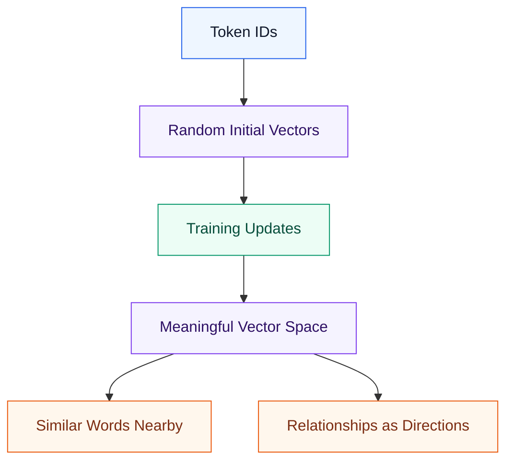

중요한 점은 embedding distance가 고정된 규칙이 아니라는 것이다.
책에서도 2D 예제는 설명을 위한 단순화이며, 실제 high-dimensional embedding에서는 Euclidean distance보다 **cosine similarity**가 단어 관계를 보는 데 더 자주 사용된다고 설명한다.

### Network Engineer 관점

Embedding vector space는 의미론적 개념처럼 보이지만, infrastructure 관점에서는 trainable parameter matrix다.

```text
Embedding quality
→ larger embedding dimension
→ more parameters
→ more GPU memory
→ more communication when sharded or synchronized
```

---

## Positional Embedding

Transformer는 RNN처럼 time step 순서대로 정보를 넘기지 않는다.
따라서 token의 순서를 별도로 알려줘야 한다.

예를 들어 다음 문장에는 `clear`가 두 번 나온다.

```text
The sky is clear, so she decided to clear the backyard.
```

첫 번째 `clear`는 형용사이고, 두 번째 `clear`는 동사다. 그런데 token ID만 보면 둘 다 같은 `clear`다. 그래서 word embedding만으로는 두 단어의 위치 차이를 표현하기 어렵다. 책에서는 이런 문제를 해결하기 위해 Word Embedding Vector에 Positional Encoding Vector를 더해 최종 word representation을 만든다고 설명한다. 

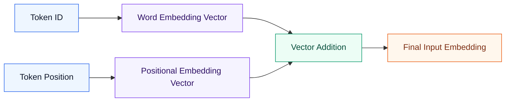

### 핵심 정리

```text
Final Embedding = Word Embedding + Positional Embedding
```

이렇게 하면 같은 단어라도 문장 내 위치에 따라 다른 representation을 갖게 된다.

---

## Positional Encoding Calculation

책에서는 positional encoding을 계산할 때 세 값을 사용한다고 설명한다.

| 변수       | 의미                         |
| -------- | -------------------------- |
| position | 단어가 sequence 안에서 차지하는 위치 |
| dimension | embedding vector의 차원 수      |
| index    | vector 안에서 계산할 축 또는 component |

단순화한 예제에서는 `clear`가 네 번째 위치에 있고, 2차원 vector를 사용한다. Positional Encoding Vector는 sine/cosine 기반 함수로 계산될 수 있고, 이 vector를 word embedding vector에 더해 final embedding을 만든다.

```text
Word Embedding Vector
+ Positional Encoding Vector
= Final Word Embedding Vector
```

책의 예시는 `clear`의 word embedding vector `[+2.5, +1.0]`에 positional encoding vector `[-0.8, +1.0]`을 더해 final word embedding vector `[+1.7, +2.0]`을 만드는 식으로 설명한다.

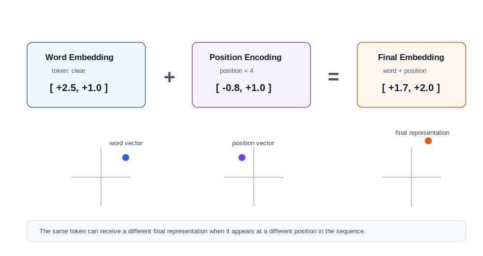

실제 구현에서는 positional encoding이 고정값일 수도 있고, training 중 학습되는 parameter일 수도 있다. 핵심은 Transformer가 token 순서를 직접 순차 처리하지 않기 때문에 위치 정보를 별도 vector로 주입해야 한다는 점이다.

---

## Decoder-Only Transformer Architecture

GPT 계열 LLM은 보통 **decoder-only Transformer** 구조로 설명된다.

책에서는 decoder-only Transformer를 다음 흐름으로 설명한다.

```text
Final Word Embedding
→ Q/K/V 생성
→ Self-Attention
→ Add & Normalization
→ Feed Forward Neural Network
→ Add & Normalization
→ SoftMax
→ Next Token Prediction
```

각 decoder module은 attention layer, add & normalization layer, feedforward neural network로 구성된다. 마지막 decoder의 output은 vocabulary 전체에 대한 확률 분포로 변환되고, 그중 가장 가능성 높은 token이 다음 token으로 선택된다. 

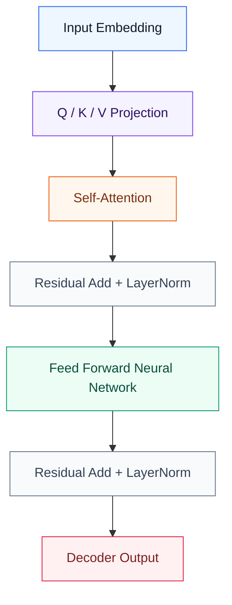

---

## Autoregressive Decoder Loop

Decoder-only Transformer는 **autoregressive** 방식으로 next token을 생성한다.
즉, 한 번에 전체 문장을 완성하는 것이 아니라, 지금까지의 token sequence를 보고 다음 token 하나를 예측한 뒤, 그 token을 다시 다음 step의 입력으로 사용한다.

```text
Current token sequence
→ decoder stack
→ vocabulary probability
→ selected next token
→ token-to-word lookup
→ append to sequence
→ next decoder step
```

책에서는 마지막 decoder 이후 SoftMax layer가 complete vocabulary를 대상으로 next word를 예측하고, 예측된 word/token이 다시 다음 decoder processing에 들어간다고 설명한다. 이 과정 때문에 inference에서는 token을 순차적으로 생성하고, training에서는 긴 sequence와 context size가 activation memory와 attention 계산량을 키운다.

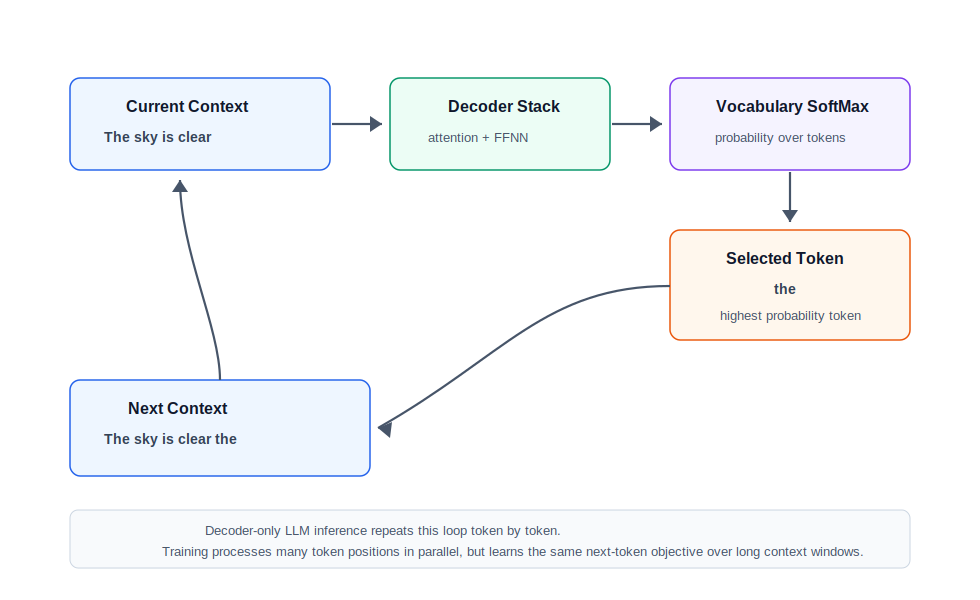

### Network Engineer 관점

Autoregressive generation 자체는 inference latency와 연결되고, training 관점에서는 긴 sequence를 처리하기 위한 memory pressure와 parallelism 요구로 연결된다.

```text
Longer sequence
→ larger attention workload
→ more activation memory
→ more pressure for tensor / pipeline parallelism
```

---

## Query, Key, and Value

Transformer는 입력 embedding vector를 그대로 attention에 넣지 않는다.
먼저 세 개의 vector로 projection한다.

| Vector   | 직관적 의미       | 역할                                       |
| -------- | ------------ | ---------------------------------------- |
| Query, Q | 내가 찾고 싶은 정보  | 현재 token이 다른 token에게 던지는 질문              |
| Key, K   | 내가 가진 정보의 색인 | 다른 token이 어떤 정보를 담고 있는지 비교 기준 제공         |
| Value, V | 실제 전달할 정보    | attention score에 따라 섞여 context vector 생성 |

책에서는 word embedding vector가 pretrained Query, Key, Value weight matrix와 곱해져 Q/K/V vector가 생성되고, 이들이 Transformer self-attention의 입력으로 사용된다고 설명한다. 

Q/K/V projection에서 중요한 점은 같은 self-attention layer 안에서는 모든 token이 같은 Q/K/V weight matrix를 공유한다는 것이다. 이렇게 해야 sequence 안의 모든 token이 같은 방식으로 변환된다. 반면 decoder layer가 달라지면 각 layer는 자기만의 Q/K/V weight matrix를 갖는다. 즉, 깊은 layer로 갈수록 같은 token도 다른 representation으로 변환될 수 있다.

```text
Same self-attention layer
→ same Q/K/V matrices for all tokens

Different decoder layer
→ different Q/K/V matrices
→ deeper semantic transformations
```

책의 단순 예제에서는 계산량을 줄이기 위해 5차원 word vector를 3차원 Query vector로 줄이는 projection을 보여준다. Infrastructure 관점에서는 이런 projection matrix도 모두 trainable parameter이며, model size와 GPU memory footprint에 포함된다.

---

## Self-Attention

Self-Attention은 한 token이 sequence 안의 다른 token들을 얼마나 참고해야 하는지 계산한다.

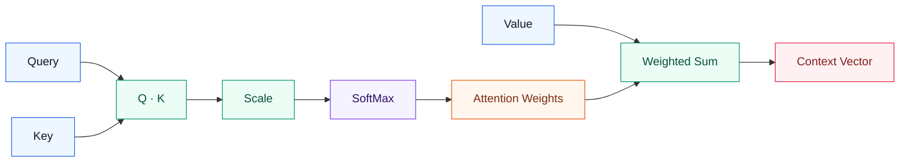

핵심 흐름은 다음과 같다.

```text
Q와 K를 dot product
→ scaling
→ SoftMax로 attention probability 계산
→ probability를 V에 곱함
→ context vector 생성
```

책에서도 query vector와 key vector의 matrix multiplication 결과를 key dimension의 square root로 나누고, softmax를 적용해 probability를 만든 뒤, 이 결과를 value vector와 곱해 context vector를 만든다고 설명한다. 

### Network Engineer 관점

Self-Attention 자체는 GPU 내부 matrix multiplication으로 보이지만, 모델이 커지면 Q/K/V projection weight와 attention output, activation을 한 GPU에 담기 어려워진다. 이 지점에서 tensor parallelism, pipeline parallelism, data parallelism이 등장한다.

---

## Multi-Head Attention and Parameter Blocks

책의 conclusion에서는 GPT-3 같은 대규모 Transformer block에서 attention layer가 **multi-head self-attention**으로 구현되며, Q/K/V projection과 attention output projection이 큰 parameter block을 만든다고 설명한다.

단순화하면 attention layer의 주요 trainable matrix는 다음과 같다.

| Parameter block     | 역할                                      |
| ------------------- | ---------------------------------------- |
| Query projection    | input embedding을 Query vector로 변환          |
| Key projection      | input embedding을 Key vector로 변환            |
| Value projection    | input embedding을 Value vector로 변환          |
| Output projection   | 여러 attention head의 결과를 다음 layer 형태로 변환 |

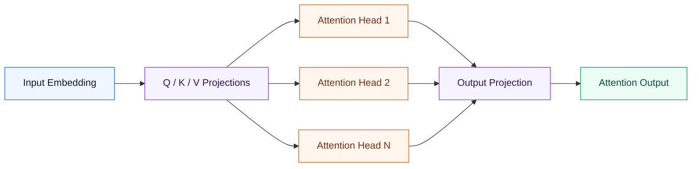

책에서는 GPT-3 규모 예시에서 attention layer의 Q/K/V projection과 output projection이 block당 대략 수억 개 parameter를 차지할 수 있다고 설명한다. Network Engineer 입장에서는 이 parameter block이 커질수록 tensor parallelism의 대상이 되고, GPU 간 tensor shard communication이 늘어난다는 점이 중요하다.

---

## Add & Normalization

Attention output은 바로 다음 layer로 넘어가지 않는다.
원래 input embedding과 attention output을 더하는 **residual connection**이 들어간다.

```text
normalized_output = LayerNorm(input_embedding + attention_output)
```

이 구조는 깊은 Transformer block을 안정적으로 학습시키는 데 중요하다. 책에서는 attention block 이후와 FFNN 이후에 residual connection과 layer normalization이 들어간다고 설명한다. 

LayerNorm은 vector component의 평균과 분산을 사용해 값을 안정적인 범위로 다시 맞춘다. 책의 예제도 mean을 구하고, 각 component에서 mean을 뺀 뒤, squared difference와 standard deviation을 사용해 normalized output을 만드는 흐름으로 설명한다.

Infrastructure 관점에서는 LayerNorm 자체의 parameter 수는 attention/FFNN에 비해 작지만, 깊은 decoder stack에서 반복적으로 실행되므로 training step time에는 영향을 줄 수 있다.

---

## Feed Forward Neural Network

Transformer decoder 안의 FFNN은 각 token별로 독립적으로 적용되는 작은 MLP라고 보면 된다.

일반적인 구조는 다음과 같다.

```text
hidden dimension
→ 4 × hidden dimension
→ hidden dimension
```

책에서는 decoder FFNN의 hidden layer가 보통 input layer보다 약 4배 큰 구조를 갖고, output dimension은 다시 context vector와 같은 dimension으로 맞춘다고 설명한다. 이렇게 해야 다음 decoder block으로 같은 형태의 vector를 넘길 수 있다. 

책의 단순 예제에서는 hidden layer가 input보다 3배 큰 형태로 설명되지만, 대규모 Transformer의 일반적인 구조는 hidden dimension을 약 4배로 확장한 뒤 다시 원래 dimension으로 줄이는 방식이다. 중간 hidden layer에서는 weighted sum과 ReLU 같은 activation function을 적용한다.

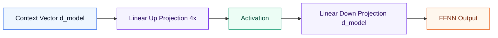

### 중요한 점

Attention은 token 간 관계를 섞는 역할이고, FFNN은 각 token의 representation을 더 풍부하게 변환하는 역할이다.

---

## Next Token Prediction with SoftMax

마지막 decoder block의 output은 바로 단어가 아니다.
먼저 vocabulary 크기의 vector로 변환된다.

```text
decoder_output
→ vocabulary logits
→ SoftMax
→ next token probability
```

SoftMax는 vocabulary 전체에 대해 다음 token이 될 확률 분포를 만든다. 책에서는 decoder output이 직접 next word를 의미하는 것이 아니라, vocabulary 전체에 대한 probability distribution으로 변환되어야 한다고 설명한다. 

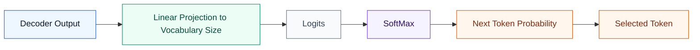

마지막으로 선택된 token은 token-to-word lookup을 통해 word로 바뀐다.
Autoregressive model에서는 이 token이 다음 iteration의 입력으로 다시 들어간다.

```text
Selected token
→ token-to-word lookup
→ next input token
→ embedding lookup
→ positional encoding
→ next decoder pass
```

---

## Why LLMs Need Parallelism

LLM이 병렬화를 요구하는 이유는 세 가지다.

| 원인                | 설명                                              | 결과                      |
| ----------------- | ----------------------------------------------- | ----------------------- |
| Model Size        | Parameter 수가 매우 큼                               | 단일 GPU VRAM 초과          |
| Activation Memory | Forward/Backward 중간값 저장 필요                      | 학습 시 memory pressure 증가 |
| Dataset Size      | 대규모 corpus 학습                                   | 긴 학습 시간                 |
| Computation       | Q/K/V, Attention, FFNN matrix multiplication 반복 | GPU cluster 필요          |
| Synchronization   | gradient, activation, tensor shard 교환           | backend network 필요      |

책에서는 GPT-3 같은 모델이 96개 decoder block을 갖고, attention layer와 FFNN layer가 대규모 parameter를 차지한다고 설명한다. 특히 FFNN layer는 block당 약 1.2B parameter 수준까지 커질 수 있으며, 전체 모델은 약 175B trainable parameter 규모가 된다고 설명한다. 그래서 학습은 여러 GPU에 분산되어야 하고, 선택한 parallelization strategy에 따라 실행되어야 한다. 

GPT-3 규모 예시를 parameter block 관점에서 보면 다음과 같다.

| Component              | 규모 감각                                      | Infrastructure 의미                 |
| ---------------------- | ------------------------------------------ | --------------------------------- |
| Attention layer        | Q/K/V + output projection이 block당 수억 parameter | tensor shard와 activation 교환 증가    |
| Add & Normalize layers | parameter 수는 상대적으로 작음                         | 반복 실행되며 training step latency에 영향 |
| FFNN layer             | block당 약 1.2B parameter 수준까지 커질 수 있음          | model memory와 tensor parallelism 압력 |
| Full model             | 약 175B trainable parameter                  | multi-GPU/multi-node training 필요 |

---

## Network Engineer View

LLM을 네트워크 관점에서 보면 핵심은 다음 연결이다.

```text
LLM parameter 증가
→ GPU memory 부족
→ model / tensor / pipeline / data parallelism 필요
→ GPU 간 activation, gradient, parameter shard 교환
→ backend network traffic 증가
→ low latency, high bandwidth, lossless fabric 요구
```

책 전체의 관점도 이와 같다. 현대 Deep Learning model은 단일 GPU/CPU memory를 초과할 수 있고, 이 경우 training은 여러 processor에 분산된다. intra-node GPU 통신은 NVLink 같은 고속 interconnect를 사용하고, inter-node 통신은 InfiniBand 또는 Ethernet 기반 backend network에 의존한다. 이때 parameter synchronization은 높은 throughput, ultra-low latency, zero packet loss를 요구한다. 

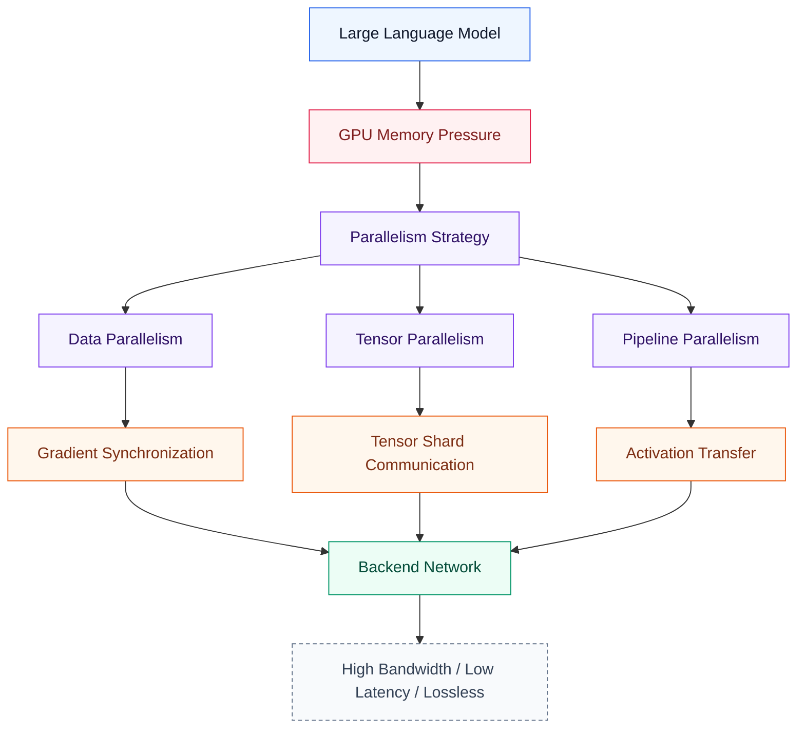

---

## Chapter Summary

Chapter 7의 핵심은 다음 한 문장으로 정리할 수 있다.

> LLM은 text를 token과 embedding vector로 변환한 뒤, positional embedding과 self-attention을 통해 문맥을 계산하고, decoder stack과 SoftMax를 통해 다음 token을 예측하는 Transformer 기반 모델이다.

네트워크 엔지니어 입장에서는 다음 문장이 더 중요하다.

> LLM의 embedding, attention, FFNN parameter가 커질수록 단일 GPU memory를 초과하고, 이로 인해 parallelism과 backend GPU-to-GPU network가 필수 요소가 된다.

---

## Key Terms

| Term                  | Meaning                                                             |
| --------------------- | ------------------------------------------------------------------- |
| Token                 | Text를 model이 처리할 수 있도록 나눈 단위                                        |
| Token ID              | Vocabulary lookup table에서 token에 부여된 정수 ID                          |
| Embedding             | Token ID를 dense vector로 바꾼 표현                                       |
| Word Embedding Matrix | 모든 token embedding vector가 저장된 parameter matrix                     |
| Positional Embedding  | Token의 위치 정보를 표현하는 vector                                           |
| Context Size          | 다음 token 예측에 사용할 수 있는 token window 길이                              |
| Padding Token         | 서로 다른 길이의 sequence를 같은 길이로 맞추기 위한 특수 token                      |
| Unknown Token         | Vocabulary에 없는 token을 표현하기 위한 특수 token                              |
| Q / K / V             | Attention 계산을 위한 Query, Key, Value vector                           |
| Self-Attention        | Sequence 내 token 간 관계를 계산하는 mechanism                               |
| Multi-Head Attention  | 여러 attention head가 서로 다른 관계를 병렬로 계산하는 구조                         |
| Output Projection     | Attention head 결과를 다음 layer가 처리할 수 있는 vector로 변환하는 matrix          |
| Context Vector        | Attention 결과로 생성된 문맥 반영 vector                                      |
| Autoregressive        | 이전 token sequence를 바탕으로 다음 token을 하나씩 생성하는 방식                     |
| LayerNorm             | Vector component를 평균/분산 기준으로 정규화해 학습을 안정화하는 연산                  |
| FFNN                  | Decoder block 안에서 각 token representation을 변환하는 feed-forward network |
| SoftMax               | 다음 token 후보들의 확률 분포를 계산하는 함수                                        |
| Decoder Block         | Attention, Add & Norm, FFNN으로 구성된 Transformer module                |
| Parallelism           | 모델/데이터/연산을 여러 GPU에 나눠 처리하는 전략                                       |

---

## Questions

1. Tokenization과 Word Embedding의 차이는 무엇인가?
2. 같은 단어가 문장 안에서 여러 번 나올 때 Positional Embedding이 왜 필요한가?
3. Query, Key, Value를 네 말로 설명하면?
4. Self-Attention은 왜 token 간 관계를 계산하는가?
5. Decoder-only Transformer의 주요 구성요소는 무엇인가?
6. FFNN은 Attention Layer와 어떤 역할 차이가 있는가?
7. SoftMax는 LLM의 어느 단계에서 사용되는가?
8. LLM parameter가 커지면 왜 GPU memory 문제가 발생하는가?
9. LLM 학습이 backend network와 연결되는 지점은 어디인가?
10. Network Engineer 입장에서 Chapter 7을 읽을 때 가장 중요한 포인트는 무엇인가?
11. Padding token과 unknown token은 왜 필요한가?
12. Context size가 커지면 infrastructure 관점에서 어떤 영향이 있는가?
13. 같은 self-attention layer와 다른 decoder layer에서 Q/K/V matrix는 어떻게 다른가?
14. Autoregressive decoder loop는 무엇인가?
15. Multi-head attention에서 output projection은 왜 필요한가?
16. Transformer block에서 attention layer와 FFNN layer가 infrastructure 관점에서 중요한 이유는 무엇인가?

---

## Answers

### 1. Tokenization과 Word Embedding의 차이는 무엇인가?

Tokenization은 text를 token ID로 바꾸는 과정이고, Word Embedding은 token ID를 vector로 바꾸는 과정이다.

```text
Text → Token ID → Embedding Vector
```

---

### 2. 같은 단어가 문장 안에서 여러 번 나올 때 Positional Embedding이 왜 필요한가?

같은 단어는 같은 token ID와 같은 word embedding을 갖는다. 따라서 위치 정보가 없으면 첫 번째 `clear`와 두 번째 `clear`를 구분하기 어렵다. Positional Embedding은 단어가 문장 안의 어느 위치에 있는지 알려준다.

---

### 3. Query, Key, Value를 네 말로 설명하면?

Query는 현재 token이 찾고 싶은 정보, Key는 다른 token이 가진 정보의 색인, Value는 실제로 전달될 내용이다.

---

### 4. Self-Attention은 왜 token 간 관계를 계산하는가?

단어의 의미는 주변 문맥에 따라 달라지기 때문이다. Self-Attention은 현재 token이 sequence 안의 다른 token들을 얼마나 참고해야 하는지 계산한다.

---

### 5. Decoder-only Transformer의 주요 구성요소는 무엇인가?

주요 구성은 다음과 같다.

```text
Q/K/V Projection
→ Self-Attention
→ Add & Normalization
→ Feed Forward Neural Network
→ Add & Normalization
```

이 decoder block이 여러 층으로 쌓이고, 마지막에 SoftMax를 통해 next token probability를 계산한다.

---

### 6. FFNN은 Attention Layer와 어떤 역할 차이가 있는가?

Attention Layer는 token 간 관계를 섞는다.
FFNN은 attention 결과로 나온 각 token representation을 개별적으로 변환한다.

---

### 7. SoftMax는 LLM의 어느 단계에서 사용되는가?

두 군데에서 중요하게 사용된다.

첫째, Self-Attention에서 attention score를 probability로 바꿀 때 사용된다.
둘째, 마지막 output을 vocabulary 전체에 대한 next token probability로 바꿀 때 사용된다.

---

### 8. LLM parameter가 커지면 왜 GPU memory 문제가 발생하는가?

LLM은 embedding matrix, Q/K/V projection matrix, attention output projection, FFNN weight 등 많은 parameter를 가진다. 학습 중에는 parameter뿐 아니라 activation, gradient, optimizer state도 저장해야 하므로 단일 GPU memory를 쉽게 초과한다.

---

### 9. LLM 학습이 backend network와 연결되는 지점은 어디인가?

모델이나 batch를 여러 GPU에 나누는 순간 backend network가 필요해진다.

```text
Data Parallelism → gradient synchronization
Tensor Parallelism → tensor shard communication
Pipeline Parallelism → activation transfer
```

---

### 10. Network Engineer 입장에서 Chapter 7을 읽을 때 가장 중요한 포인트는 무엇인가?

LLM의 수학을 완벽히 외우는 것보다, 다음 연결을 이해하는 것이 중요하다.

```text
Transformer 구조
→ parameter 증가
→ GPU memory 초과
→ distributed training
→ GPU-to-GPU communication
→ backend network requirement
```

---

### 11. Padding token과 unknown token은 왜 필요한가?

Padding token은 길이가 다른 sequence를 같은 길이로 맞추기 위해 사용한다.
Unknown token은 vocabulary에 없는 word 또는 subword를 model이 처리할 수 있는 공통 token으로 표현하기 위해 사용한다.

---

### 12. Context size가 커지면 infrastructure 관점에서 어떤 영향이 있는가?

Context size가 커지면 model이 한 번에 처리해야 하는 token 수가 증가한다. 그 결과 activation memory와 attention 계산량이 늘어나고, 학습 시 GPU memory pressure가 커진다. 큰 model에서는 이 문제가 tensor parallelism, pipeline parallelism, activation checkpointing 같은 전략과 backend network traffic으로 이어진다.

---

### 13. 같은 self-attention layer와 다른 decoder layer에서 Q/K/V matrix는 어떻게 다른가?

같은 self-attention layer 안에서는 모든 token이 같은 Q/K/V weight matrix를 공유한다. 그래야 sequence 안의 token들이 같은 규칙으로 projection된다.

반면 decoder layer가 달라지면 각 layer는 별도의 Q/K/V weight matrix를 가진다. 그래서 깊은 layer는 더 추상적인 token representation을 학습할 수 있다.

---

### 14. Autoregressive decoder loop는 무엇인가?

현재 token sequence를 보고 다음 token 하나를 예측한 뒤, 그 token을 다시 sequence에 붙여 다음 step의 입력으로 사용하는 방식이다.

```text
sequence → next token → append → next sequence
```

---

### 15. Multi-head attention에서 output projection은 왜 필요한가?

여러 attention head는 서로 다른 관점에서 token 관계를 계산한다. Output projection은 이 head들의 결과를 합쳐 다음 decoder layer가 처리할 수 있는 하나의 vector representation으로 변환한다.

---

### 16. Transformer block에서 attention layer와 FFNN layer가 infrastructure 관점에서 중요한 이유는 무엇인가?

두 layer가 parameter와 matrix multiplication의 대부분을 차지하기 때문이다. Attention layer는 Q/K/V projection과 output projection을 갖고, FFNN은 hidden dimension을 크게 확장했다가 다시 줄인다. 모델이 커지면 이 parameter block들이 단일 GPU memory를 초과하고, tensor parallelism과 backend GPU-to-GPU communication이 필요해진다.
