# Week 3: Parallelism Strategies in Deep Learning

## Table of Contents

* [Goal](#goal)
* [Why Parallelism Matters](#why-parallelism-matters)
* [Parallelism Strategy Overview](#parallelism-strategy-overview)
* [Data Parallelism](#data-parallelism)
* [Lossless Transport and Restart Cost](#lossless-transport-and-restart-cost)
* [Pipeline Parallelism](#pipeline-parallelism)
* [Tensor Parallelism](#tensor-parallelism)
* [Tensor Parallelism Details in Transformer Layers](#tensor-parallelism-details-in-transformer-layers)
* [Hybrid Parallelism](#hybrid-parallelism)
* [Practical Extensions: ZeRO, FSDP, and Expert Parallelism](#practical-extensions-zero-fsdp-and-expert-parallelism)
* [Network Impact](#network-impact)
* [Design Decision Matrix](#design-decision-matrix)
* [Practical Tips and Notes](#practical-tips-and-notes)
* [Operational Validation Checklist](#operational-validation-checklist)
* [Chapter Summary](#chapter-summary)
* [Key Terms](#key-terms)
* [Questions](#questions)
* [Answers](#answers)
* [References](#references)

---

## Goal

이번 주 목표는 **대규모 deep learning training이 왜 parallelism을 필요로 하는지**, 그리고 각 parallelization strategy가 GPU memory, GPU utilization, backend network design에 어떤 영향을 주는지 이해하는 것이다.

핵심 아이디어는 다음과 같다.

> Deep learning parallelism은 단순한 model training 기법이 아니다.
> Network traffic pattern을 만들어내는 구조이기도 하다.

책의 Chapter 8은 model, dataset, activation state, gradient, optimizer state가 단일 GPU 안에 효율적으로 들어가지 않을 때 사용하는 주요 parallelism strategy를 설명한다. 주요 전략은 **Data Parallelism**, **Model/Pipeline Parallelism**, **Tensor Parallelism**이다.

MLOps, LLMOps, AI data center network 관점에서 가장 중요한 질문은 다음과 같다.

> 무엇을 나누고, 무엇을 동기화해야 하는가?

---

## Why Parallelism Matters

Training 중 GPU는 model weight만 저장하는 것이 아니다. Weighted sum, activation value, error, local gradient, remote gradient, learning rate, weight adjustment value도 필요하다. Training dataset, test dataset, model code 역시 memory를 사용한다. Chapter 8은 이런 memory pressure에서 출발해, 단일 GPU가 모든 요소를 담기에 충분하지 않을 수 있다고 설명한다.

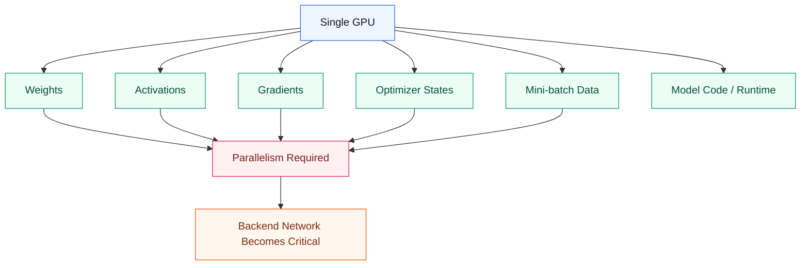

단순하게 정리하면 다음과 같다.

| Pressure                     | 발생 이유                                  | 일반적인 대응             |
| ---------------------------- | -------------------------------------- | -------------------- |
| Dataset이 너무 큼               | Sample 수가 많거나 mini-batch가 너무 큼         | Data Parallelism     |
| Model이 너무 깊음                | Layer 수가 너무 많음                         | Pipeline Parallelism |
| 단일 layer가 너무 큼              | Matrix operation이 한 GPU에 들어가지 않음        | Tensor Parallelism   |
| Optimizer state가 너무 큼        | Adam 계열 optimizer가 추가 state를 저장함        | ZeRO / FSDP          |
| MoE expert가 분산됨              | Token을 expert로 routing해야 함              | Expert Parallelism   |

---

## Parallelism Strategy Overview

| Parallelism          | 무엇을 나누는가?                 | 왜 사용하는가?                         | 주요 communication pattern          | 주요 bottleneck                                  |
| -------------------- | -------------------------- | -------------------------------- | ----------------------------------- | ------------------------------------------------ |
| Data Parallelism     | Dataset / mini-batch       | Dataset이 크고 model은 GPU별로 들어감     | Gradient AllReduce                  | Bandwidth, latency, straggler                    |
| Pipeline Parallelism | Model layer / stage        | Model이 너무 깊거나 큼                  | Activation과 gradient transfer       | Pipeline bubble, micro-batch tuning              |
| Tensor Parallelism   | Layer 내부 matrix operation | 단일 layer가 한 GPU에 들어가지 않음        | AllGather, AllReduce, ReduceScatter | Ultra-low latency, NVLink/IB dependency          |
| ZeRO / FSDP          | Optimizer, gradient, parameter | Memory redundancy를 줄임             | ReduceScatter, AllGather            | Memory saving과 communication overhead의 tradeoff |
| Expert Parallelism   | MoE expert와 token routing  | Sparse model을 확장함                 | All-to-All                          | Load imbalance, hot expert, all-to-all congestion |

책은 주로 Data, Pipeline, Tensor Parallelism을 다룬다. 실제 LLM training system에서는 여기에 ZeRO/FSDP와 Expert Parallelism이 함께 사용되는 경우가 많다.

---

## Data Parallelism

Data Parallelism은 가장 단순하고 가장 널리 쓰이는 distributed training strategy다.

각 GPU는 model의 full copy를 가지고, 서로 다른 mini-batch를 처리한다. Backward pass가 끝나면 각 GPU는 자신만의 gradient 값을 갖게 된다. 모든 model replica가 동일하게 유지되려면 이 gradient들을 동기화해야 한다. 책에서는 이를 각 GPU가 model replica를 들고 서로 다른 mini-batch를 처리한 뒤, iteration 끝에서 gradient를 synchronize하는 방식으로 설명한다.

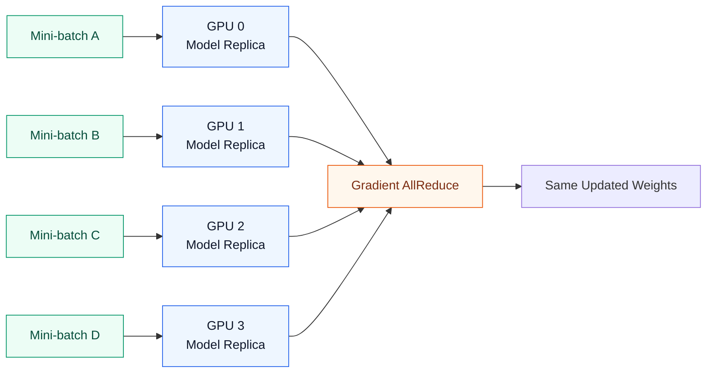

### Training Flow

1. 각 GPU가 서로 다른 mini-batch를 받는다.
2. 각 GPU가 local forward pass를 수행한다.
3. 각 GPU가 local backward pass를 수행한다.
4. 각 GPU가 local gradient를 계산한다.
5. Gradient를 AllReduce로 동기화한다.
6. 각 GPU가 동일한 averaged gradient로 자신의 model replica를 update한다.

### Network Impact

Data Parallelism은 bursty synchronization traffic을 만든다.

Computation 중에는 network가 비교적 조용할 수 있다. 하지만 gradient synchronization 시점에는 backend network가 갑자기 포화될 수 있다. GPU utilization은 synchronization이 얼마나 빨리 끝나는지에 영향을 받기 때문에 이 pattern이 중요하다.

| Phase         | GPU activity            | Network activity |
| ------------- | ----------------------- | ---------------- |
| Forward pass  | 높음                      | 낮음               |
| Backward pass | 높음                      | 낮음~중간           |
| Gradient sync | 대기 + communication      | 매우 높음           |
| Weight update | 중간                      | 낮음               |

책은 뒤에서 이 동작을 AllReduce 같은 collective communication과 연결한다. AllReduce 내부에는 ReduceScatter와 AllGather 단계가 포함될 수 있다.

---

## Lossless Transport and Restart Cost

Chapter 8에서 특히 강조하는 부분은 inter-GPU communication이 **낮은 latency**와 **lossless transport**를 요구한다는 점이다.

GPU가 같은 server 안에 있으면 PCIe나 NVLink를 사용할 수 있고, server를 넘어가면 InfiniBand, Ethernet/RoCE 같은 backend network를 사용한다. 어떤 transport를 사용하든 synchronization 중 packet loss가 발생하면 training step이 멈추거나 재시도되어 전체 training 시간이 늘어난다. Checkpoint 또는 snapshot이 없다면 최악의 경우 training을 처음부터 다시 시작해야 한다.

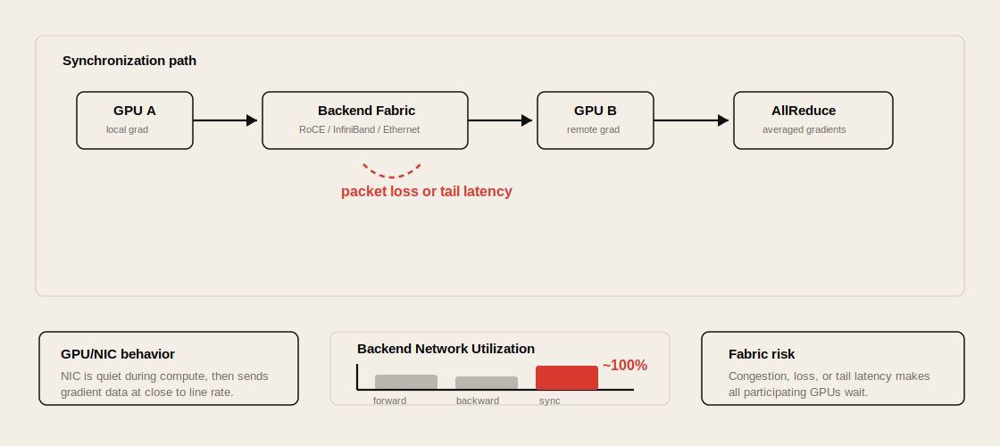

책은 이를 전력 비용 예제로 설명한다. 예를 들어 GPU 50,000개가 full load에서 각 350W를 사용한다고 하면 전체 전력은 다음과 같다.

```text
350 W × 50,000 GPU
= 17,500,000 W
= 17.5 MW
```

이 상태로 60일, 즉 1,440시간 training을 수행하면 전력 사용량은 다음과 같다.

```text
17.5 MW × 1,440 hours
= 25,200 MWh
= 25,200,000 kWh
```

전기요금을 kWh당 0.10 USD로 잡으면 전력 비용만 약 2.52M USD가 된다.

```text
25,200,000 kWh × 0.10 USD
= 2,520,000 USD
```

### Network Engineer 관점

Lossless 또는 near-lossless network가 중요한 이유는 단순히 packet drop counter를 깨끗하게 유지하기 위해서가 아니다.

```text
Packet loss
→ synchronization stall
→ GPU idle time 증가
→ step time 증가
→ training cost 증가
→ checkpoint가 없으면 restart risk
```

따라서 AI training fabric에서는 bandwidth뿐 아니라 PFC/ECN/DCQCN, RDMA 안정성, congestion control, checkpoint 주기까지 함께 봐야 한다.

---

## Pipeline Parallelism

Pipeline Parallelism은 model을 layer 또는 stage 단위로 나누는 방식이다.

모든 GPU가 전체 model을 들고 있는 대신, 각 GPU가 model의 서로 다른 부분을 담당한다. 책에서는 Pipeline Parallelism을 model을 여러 GPU에 나누고, 각 GPU가 forward/backward pass의 한 stage를 처리하는 방식으로 설명한다. Pipeline을 계속 채워 GPU utilization을 높이기 위해 micro-batch를 사용한다.

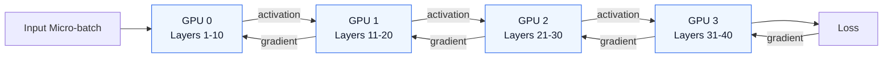

### Pipeline Bubble

가장 큰 문제는 **pipeline bubble**이다.

처음에는 첫 번째 GPU만 active 상태다. 중간 구간에서는 모든 GPU가 active가 될 수 있다. 끝에서는 앞쪽 stage가 먼저 일을 끝내고 idle 상태가 된다. Chapter 8은 여러 time step을 따라가며 pipeline이 채워지고 비워지는 동안 GPU utilization이 어떻게 바뀌는지 설명한다.

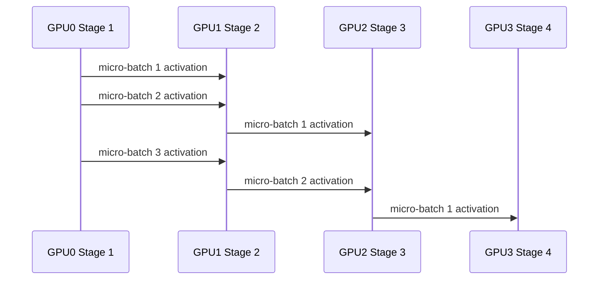

### Why Micro-batches Matter

Micro-batching은 pipeline stage들이 idle 상태에 머무는 시간을 줄이기 위해 사용된다.

Micro-batch가 없으면 다음처럼 동작한다.

```text
GPU0 works → GPU1 works → GPU2 works → GPU3 works
```

Micro-batch를 사용하면 다음처럼 겹쳐서 처리할 수 있다.

```text
GPU0 works on MB4
GPU1 works on MB3
GPU2 works on MB2
GPU3 works on MB1
```

목표는 GPU idle time을 줄이는 것이다.

### Time-Step Utilization Example

책의 pipeline 예시는 두 host에 각각 두 GPU가 있고, 총 네 GPU가 layer-wise model parallelism을 수행하는 구조를 사용한다. 첫 번째 hidden layer는 GPU 0a, 두 번째 hidden layer는 GPU 1a, 세 번째 hidden layer는 GPU 0b, output layer는 GPU 1b에 배치된다.

Forward pass 초반에는 pipeline이 아직 채워지지 않았기 때문에 GPU utilization이 낮다. 중간에는 forward pass와 backward pass가 겹치면서 utilization이 올라가고, 끝에서는 pipeline이 비워지면서 다시 낮아진다.

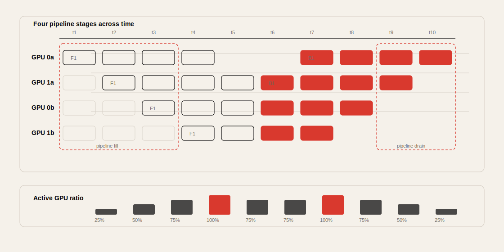

| Time step | Active GPU 비율 | 상태 요약                                      |
| --------- | -------------- | --------------------------------------------- |
| t1        | 25%            | 첫 GPU만 첫 micro-batch를 처리함                 |
| t2        | 50%            | 두 번째 GPU가 이전 activation을 받아 처리 시작     |
| t3        | 75%            | 세 번째 GPU까지 pipeline에 참여                  |
| t4        | 100%           | 네 GPU가 모두 active, 첫 backward pass도 시작     |
| t5        | 75%            | 앞쪽 stage가 일부 idle, forward/backward overlap |
| t6        | 75%            | Backward pass가 여러 stage로 확산                |
| t7        | 100%           | Backward pass에서도 모든 GPU가 active            |
| t8        | 75%            | Pipeline drain 시작                             |
| t9        | 50%            | 두 GPU만 남은 backward work 수행                 |
| t10       | 25%            | 마지막 GPU가 마지막 micro-batch update 수행       |

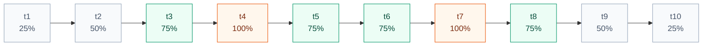

여기서 중요한 점은 pipeline parallelism이 memory 문제를 해결하더라도 자동으로 GPU utilization을 최대로 만들지는 않는다는 것이다. Micro-batch 수, stage 균형, layer별 계산량, activation transfer latency가 함께 맞아야 한다.

### Network Impact

Pipeline Parallelism은 Data Parallelism처럼 전체 GPU가 한꺼번에 동기화되는 global synchronization pattern을 만들지는 않는 경우가 많다. 대신 stage 사이에서 activation과 gradient transfer가 발생한다.

| Communication       | Direction       | Timing                            |
| ------------------- | --------------- | --------------------------------- |
| Activation transfer | Forward         | 앞 stage에서 뒤 stage로 이동             |
| Gradient transfer   | Backward        | 뒤 stage에서 앞 stage로 이동             |
| Weight update       | Local per stage | Gradient 계산 이후                    |

성능 문제는 bandwidth만의 문제가 아니다. Scheduling도 중요하다. 한 stage가 느리면 전체 pipeline이 멈춘다.

---

## Tensor Parallelism

Tensor Parallelism은 개별 tensor operation을 여러 GPU에 나누는 방식이다.

단일 layer가 너무 커서 한 GPU에 들어가지 않거나, 한 GPU에서 효율적으로 계산하기 어려울 때 필요하다. 책에서는 Tensor Parallelism을 매우 큰 model layer를 작은 slice로 나누어 각 GPU가 matrix operation의 일부를 계산하는 방식으로 설명한다.

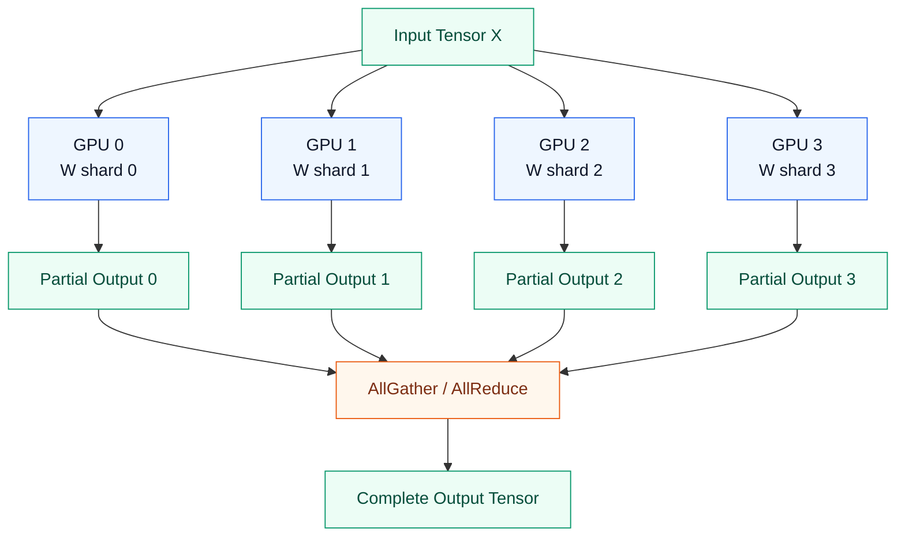

### Tensor Parallelism in Transformers

Transformer model에서는 Tensor Parallelism이 보통 다음 위치에 적용된다.

* Self-Attention layer
* Q, K, V projection matrix
* Attention output projection
* Feedforward layer
* Large matrix multiplication

책은 self-attention과 feedforward layer에서 Tensor Parallelism을 설명한다. Feedforward 예시에서는 hidden layer와 output layer를 GPU들에 나누고, partial result를 AllGather 같은 operation으로 synchronize한다.

---

## Tensor Parallelism Details in Transformer Layers

Chapter 8은 Transformer layer 내부에서 Tensor Parallelism이 어떻게 communication을 만드는지 더 구체적으로 설명한다.

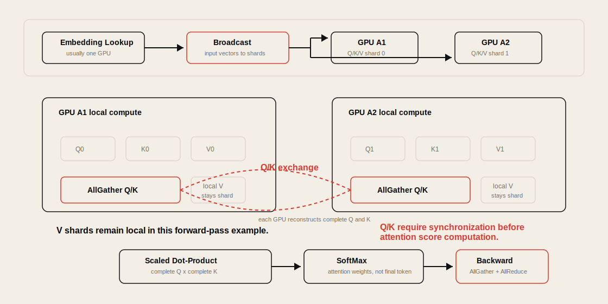

### Embedding Placement

대부분의 경우 word embedding matrix는 하나의 GPU에 둘 수 있다. 책은 embedding matrix가 큰 Transformer layer에 비해 상대적으로 작고, lookup operation이 matrix multiplication보다 계산 부담이 낮기 때문이라고 설명한다.

Embedding matrix를 여러 GPU에 나누면 vocabulary shard별 lookup을 위해 cross-GPU communication이 자주 발생할 수 있다. 그래서 단순한 구성에서는 embedding lookup을 한 GPU에서 수행하고, 생성된 embedding vector를 Transformer computation에 참여하는 GPU들로 broadcast한다.

다만 GPT-3급 대규모 model처럼 embedding 자체가 커지는 경우에는 distributed embedding을 사용할 수 있다. 예를 들어 row-wise parallelism에서는 vocabulary row를 GPU들에 나누고, 각 GPU가 자신이 가진 token embedding lookup을 담당한다.

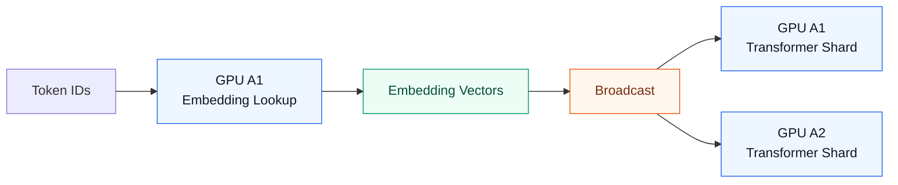

### Q, K, V Synchronization

Self-Attention에서 Q, K, V projection matrix가 GPU A1과 GPU A2에 shard되어 있다고 하자. 각 GPU는 자신이 가진 shard로 local Q/K/V fragment를 계산한다.

책의 예시에서 중요한 차이는 다음과 같다.

| Matrix | Forward pass communication | 이유                                      |
| ------ | -------------------------- | ---------------------------------------- |
| Q      | AllGather                  | Attention score 계산에 complete Q가 필요함 |
| K      | AllGather                  | Attention score 계산에 complete K가 필요함 |
| V      | Local shard 유지             | SoftMax 결과와 local V fragment를 곱함       |

Self-Attention의 SoftMax는 final token prediction이 아니라 attention weight를 계산하기 위한 SoftMax다. Final prediction은 보통 output projection 이후 vocabulary 전체에 대한 SoftMax에서 수행된다. 이 구분은 Chapter 7의 LLM pipeline과 연결해서 이해해야 한다.

```text
Self-Attention SoftMax
→ attention weight 계산
→ context vector 생성

Final SoftMax
→ vocabulary probability 계산
→ next token prediction
```

### Feedforward Layer Placement

책의 feedforward 예시는 Tensor Parallelism과 Pipeline Parallelism을 함께 사용한다. 한 hidden layer 안에서는 neuron 또는 weight matrix shard를 같은 server의 GPU들에 나누고, GPU 간 partial output은 NVLink 같은 high-speed domain에서 AllGather한다. 다음 hidden layer 또는 output layer로 넘어갈 때는 backend network를 사용한다.

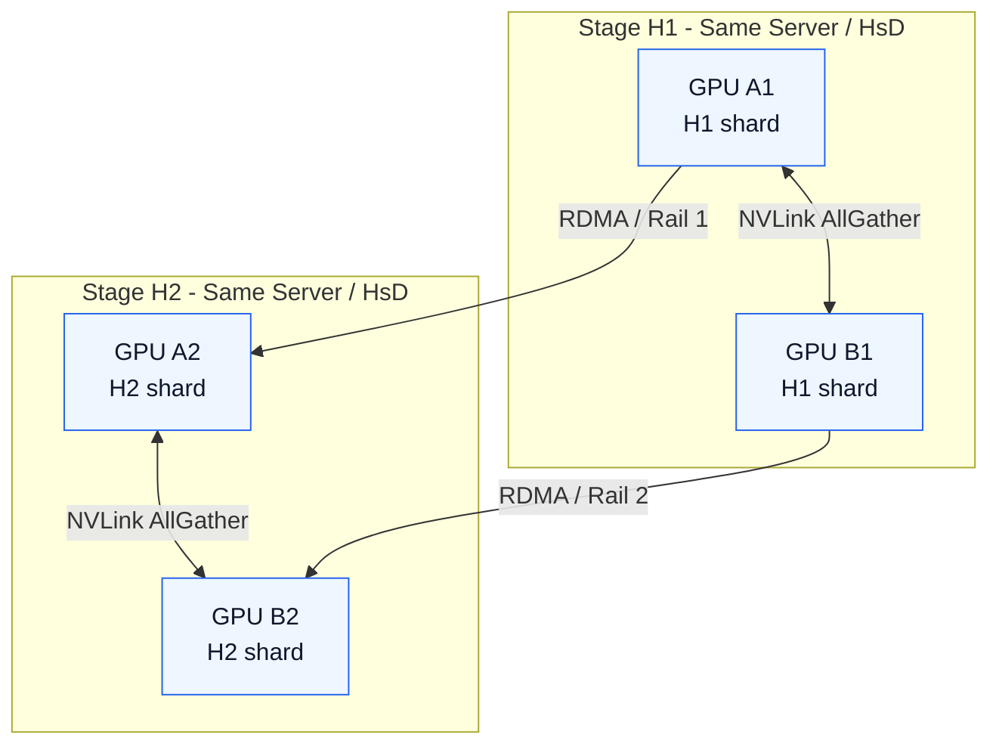

책은 같은 rail switch에 연결된 GPU 사이의 traffic은 backend network에서 짧은 path를 갖고, 다른 rail 사이 통신이 필요하면 spine switch를 거쳐야 한다고 설명한다. Network Engineer 관점에서는 tensor-parallel sync는 server 내부 HsD에, stage transfer는 가능한 한 같은 rail에 배치하는 것이 중요하다.

### Backpropagation Communication

Backward pass에서는 forward pass보다 communication dependency가 더 복잡해진다.

FFNN weight가 여러 GPU에 shard되어 있으면 각 GPU가 local gradient를 계산한 뒤, weight update 전에 gradient를 AllReduce로 맞춰야 한다. Self-Attention으로 error가 되돌아오면 Q/K/V matrix에 대한 gradient도 계산해야 한다. 이때 Q와 K는 forward pass와 마찬가지로 missing fragment를 AllGather해 complete matrix를 만든 뒤 local gradient를 계산하고, 이후 AllReduce로 gradient를 synchronize한다.

```text
FFNN backward
→ local gradient
→ AllReduce
→ weight update

Self-Attention backward
→ Q/K AllGather
→ local gradient
→ AllReduce
→ weight update
```

Network 관점에서 Tensor Parallelism은 forward path뿐 아니라 backward path에서도 layer 내부 collective communication을 반복한다. 그래서 Data Parallelism보다 latency에 더 민감하다.

### Why Tensor Parallelism Is Network-Sensitive

Tensor Parallelism은 Data Parallelism보다 latency에 더 민감하다.

Data Parallelism은 보통 iteration 단위 또는 gradient bucket 단위로 동기화한다. 반면 Tensor Parallelism은 forward pass와 backward pass 모두에서 layer 내부 communication이 필요할 수 있다.

```text
Layer computation
→ sync
→ next layer computation
→ sync
→ backward computation
→ sync
```

따라서 Tensor Parallelism은 다음 요소의 영향을 크게 받는다.

* Server 내부 NVLink / NVSwitch
* Server 간 InfiniBand 또는 고품질 RoCE
* Low-latency collective communication
* Topology-aware GPU placement

---

## Hybrid Parallelism

실제 LLM training은 한 가지 전략만 사용하지 않는 경우가 많다.

대규모 training job은 보통 다음 전략들을 조합한다.

```text
Data Parallelism
+ Tensor Parallelism
+ Pipeline Parallelism
+ ZeRO/FSDP
+ sometimes Expert Parallelism
```

책은 한 stage 안에서는 Tensor Parallelism을 사용하고, stage 사이에서는 Pipeline Parallelism을 사용하는 예를 든다. 또한 같은 server 안의 GPU는 NVLink로 통신하고, stage 사이의 GPU는 backend network로 통신할 수 있다고 설명한다.

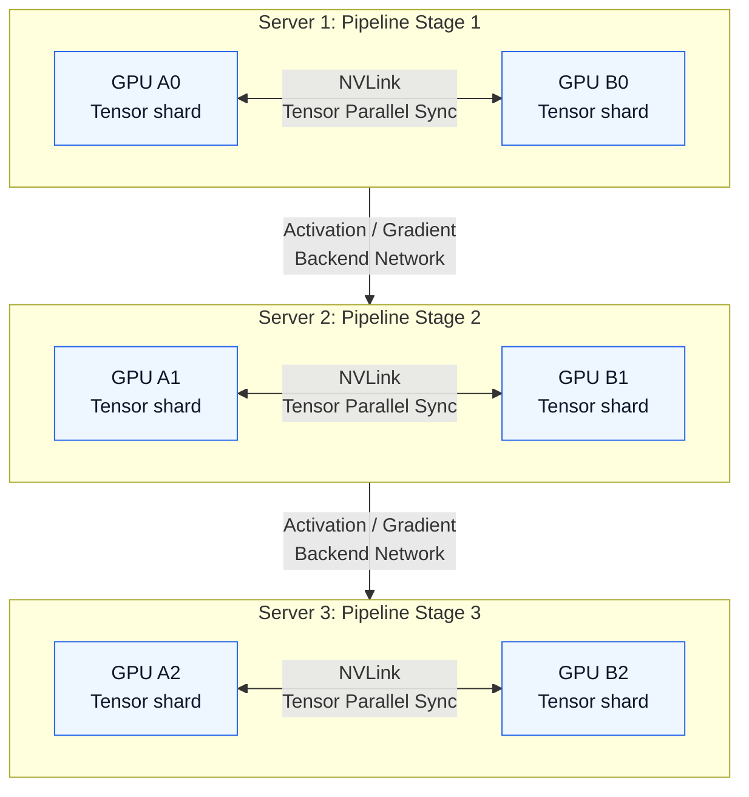

### Key Design Rule

가장 자주 발생하는 communication은 가장 빠른 communication domain 안에 배치한다.

| Communication frequency           | 더 나은 placement                         |
| --------------------------------- | ---------------------------------------- |
| 매우 빈번한 layer 내부 sync          | Same server, NVLink/NVSwitch             |
| Stage-to-stage transfer           | 가능하면 same rack 또는 same rail           |
| Data parallel gradient sync       | High-bandwidth backend fabric             |
| Expert all-to-all                 | Topology-aware expert placement           |

---

## Practical Extensions: ZeRO, FSDP, and Expert Parallelism

Chapter 8은 주로 Data, Pipeline, Tensor Parallelism을 다룬다. 하지만 현대 LLM training에서는 다음 세 가지 개념도 중요하다.

### ZeRO

ZeRO는 data-parallel training에서 model state를 data-parallel process들에 나누어 memory redundancy를 줄인다. DeepSpeed는 ZeRO를 optimizer state, gradient, parameter를 모든 process에 복제하지 않고 partitioning하는 방식으로 설명한다. ([DeepSpeed][1])

| ZeRO Stage | 무엇을 sharding하는가?                         | 주요 이점                  |
| ---------- | ----------------------------------------- | ---------------------- |
| ZeRO-1     | Optimizer state                           | Optimizer memory 감소    |
| ZeRO-2     | Optimizer state + gradient                | 추가 memory 감소          |
| ZeRO-3     | Optimizer state + gradient + parameter    | 가장 큰 memory 감소        |

### FSDP

FSDP는 PyTorch의 Fully Sharded Data Parallel 방식이다. PyTorch는 FSDP가 classic DDP와 비교해 model parameter, gradient, optimizer state를 sharding함으로써 GPU memory footprint를 줄이고, 단일 GPU에 들어가지 않는 model도 training할 수 있게 한다고 설명한다. ([PyTorch Documentation][2])

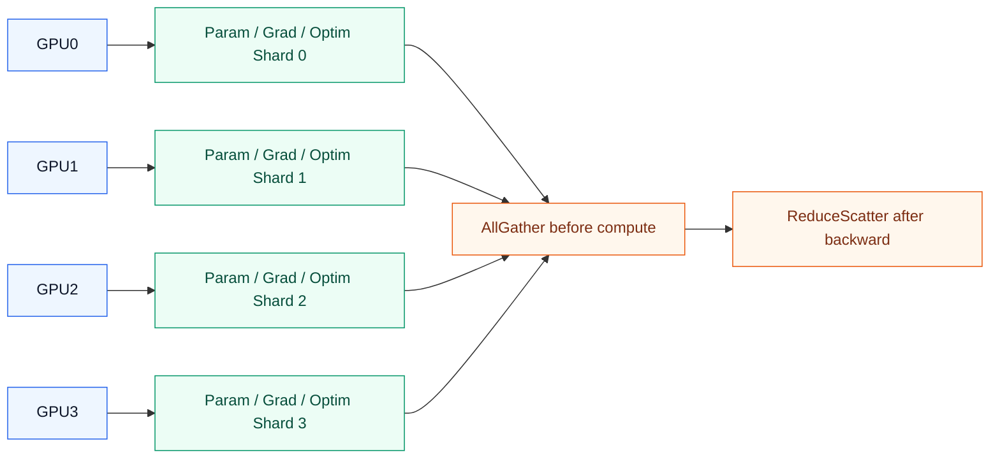

### Expert Parallelism

Expert Parallelism은 Mixture-of-Experts, MoE model에서 사용된다.

모든 token에 대해 전체 feedforward network를 활성화하는 대신, MoE model은 각 token을 하나 또는 소수의 expert로 routing한다. MoE 논문들은 이를 여러 expert subnetwork를 두고 input token마다 하나 또는 몇 개의 expert만 활성화하는 방식으로 설명한다. ([NeurIPS Papers][3])

어려운 부분은 communication이다. Expert가 여러 GPU에 분산되어 있으면, token을 가진 GPU와 선택된 expert가 있는 GPU 사이에 token을 교환해야 한다. 이때 All-to-All communication이 발생한다.

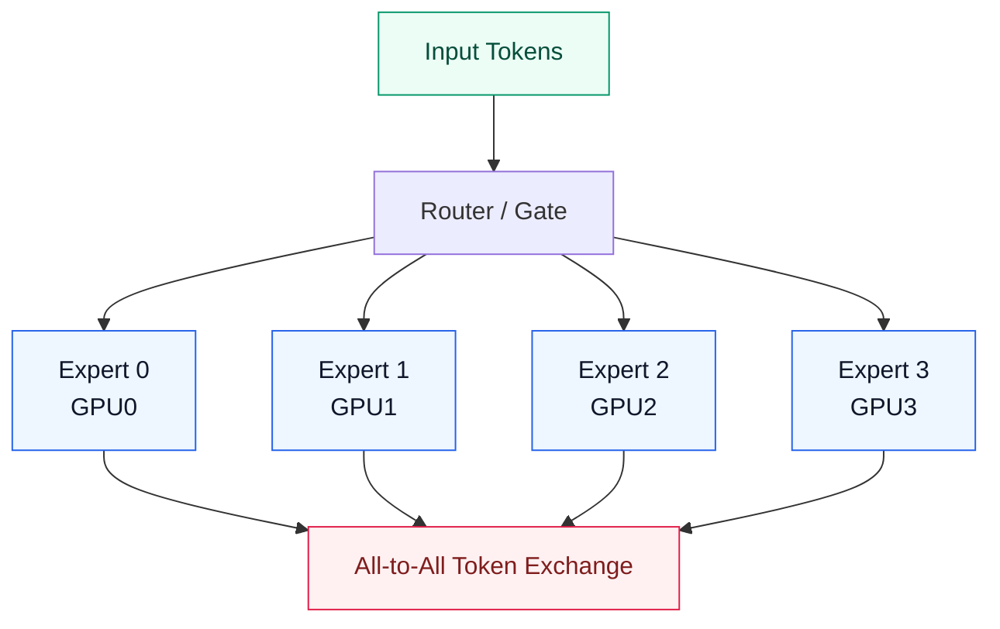

주요 문제는 다음과 같다.

| Problem               | 의미                                      |
| --------------------- | ---------------------------------------- |
| Hot expert            | 특정 expert로 너무 많은 token이 routing됨      |
| Load imbalance        | 일부 GPU가 과부하되고 다른 GPU는 대기함            |
| All-to-All congestion | 여러 GPU pair 사이로 token이 이동함             |
| Tail latency          | 가장 느린 expert path가 전체 step을 지연함        |

---

## Network Impact

Parallelism strategy는 traffic pattern을 결정한다.

Network Engineer 입장에서 가장 중요한 포인트다.

| Strategy             | Traffic pattern                           | Network stress                   |
| -------------------- | ----------------------------------------- | -------------------------------- |
| Data Parallelism     | 주기적인 gradient AllReduce                 | High bandwidth burst             |
| Pipeline Parallelism | Activation/gradient stage transfer        | Latency + scheduling             |
| Tensor Parallelism   | Layer 내부 collective communication         | Ultra-low latency                |
| ZeRO/FSDP            | Parameter/gradient sharding communication | Frequent AllGather/ReduceScatter |
| Expert Parallelism   | Token All-to-All                          | Many-to-many congestion          |

AI training fabric은 GPU-to-GPU east-west traffic과 collective communication을 처리해야 한다. 따라서 bandwidth, latency, congestion control이 핵심 설계 요소가 된다.

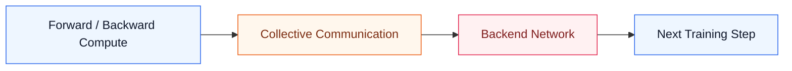

### Important Network Properties

| Property                           | 왜 중요한가                                             |
| ---------------------------------- | ---------------------------------------------------- |
| Bandwidth                          | Gradient, activation, parameter, token을 빠르게 이동시킴 |
| Low latency                        | 의존 관계가 있는 operation 사이에서 GPU 대기를 줄임          |
| Low jitter                         | Training step time을 예측 가능하게 유지함                  |
| Lossless or near-lossless behavior | Retransmission, stall, RDMA failure를 줄임             |
| Topology awareness                 | 자주 통신하는 GPU를 가깝게 배치함                           |
| Congestion control                 | Incast와 egress buffer overflow를 방지함                |
| Collective optimization            | AllReduce, AllGather, ReduceScatter, All-to-All을 최적화함 |

---

## Design Decision Matrix

| Situation                               | Recommended strategy | Network implication                                  |
| --------------------------------------- | -------------------- | ---------------------------------------------------- |
| Dataset이 크고 model은 한 GPU에 들어감       | Data Parallelism     | Gradient AllReduce bandwidth가 중요함                  |
| Model layer 수가 많음                     | Pipeline Parallelism | Stage 간 activation/gradient transfer 발생             |
| 단일 layer가 너무 큼                       | Tensor Parallelism   | NVLink/NVSwitch 또는 매우 낮은 latency backend 필요       |
| Optimizer state가 memory를 지배함          | ZeRO-1 / ZeRO-2      | Gradient/optimizer state communication 증가           |
| Parameter도 들어가지 않음                  | ZeRO-3 / FSDP        | 잦은 parameter AllGather 발생                          |
| Expert가 많은 MoE model                  | Expert Parallelism   | All-to-All과 load balancing이 중요해짐                  |
| Multi-node training                     | Hybrid parallelism   | Fabric topology와 NCCL tuning이 중요함                 |

---

## Practical Tips and Notes

아래 내용은 책의 Chapter 8에 직접 나오는 설명은 아니지만, 실제 training cluster를 운영하거나 troubleshooting할 때 자주 마주치는 포인트다.

### 1. Memory breakdown부터 계산하기

Parallelism strategy를 정하기 전에 parameter size만 보지 말고 다음 항목을 함께 계산한다.

```text
parameter
+ gradient
+ optimizer state
+ activation
+ temporary buffer
+ fragmentation/headroom
```

Training에서는 activation과 optimizer state가 memory를 크게 차지하므로, “model parameter가 GPU에 들어간다”는 말만으로는 충분하지 않다.

### 2. Tensor Parallel group은 같은 high-speed domain에 배치하기

Tensor Parallelism은 layer 내부에서 자주 통신하므로 latency에 민감하다. 가능하면 같은 server 안의 NVLink/NVSwitch domain에 먼저 배치한다.

반면 Data Parallelism의 gradient sync는 비교적 큰 bucket 단위로 묶을 수 있어 backend fabric bandwidth의 영향을 더 많이 받는다.

### 3. NCCL 문제는 topology부터 보기

NCCL 성능 문제는 model code 문제가 아니라 topology 문제인 경우가 많다.

`nvidia-smi topo -m`, PCIe/NIC locality, NUMA affinity, rail alignment를 먼저 확인한다. GPU가 올바른 NIC를 사용하지 않으면 bandwidth가 충분해 보여도 step time이 흔들릴 수 있다.

### 4. Collective benchmark는 workload별로 나누기

Data Parallelism은 AllReduce, FSDP/ZeRO는 AllGather와 ReduceScatter, MoE는 All-to-All이 중요하다.

`all_reduce_perf` 하나만으로 전체 training network 성능을 판단하면 안 된다. 실제 병목 collective가 무엇인지 모르면 network tuning 방향도 틀릴 수 있다.

> [!WARNING]
> Average step time만 보면 straggler를 놓치기 쉽다.
>
> P50/P95/P99 step time, GPU별 iteration time, NCCL timeout, retransmission/drop counter를 함께 봐야 한다. Training job은 가장 느린 rank에 맞춰 진행되기 때문에 tail latency가 곧 전체 성능이다.

### 5. Micro-batch size는 utilization과 memory의 tradeoff다

Micro-batch를 늘리면 pipeline bubble은 줄어들 수 있지만 activation memory가 증가한다. 반대로 너무 작으면 memory는 줄어도 pipeline stage가 충분히 채워지지 않아 GPU가 idle 상태로 남는다.

따라서 micro-batch size는 단순한 batch tuning 값이 아니라 GPU utilization, activation memory, pipeline bubble을 함께 바꾸는 parameter다.

### 6. Checkpoint 주기는 reliability parameter다

Checkpoint 주기는 storage 문제가 아니라 training reliability 문제이기도 하다.

너무 자주 저장하면 storage/network I/O가 training을 방해하고, 너무 드물게 저장하면 장애 시 재계산 비용이 커진다. 대규모 job에서는 checkpoint write time, object storage throughput, restart time을 함께 측정한다.

> [!WARNING]
> RoCE fabric에서는 “lossless 설정을 했다”와 “lossless로 동작한다”가 다르다.
>
> PFC, ECN, DCQCN, buffer profile, MTU, QoS marking, switch counter를 실제 traffic 아래에서 확인해야 한다. 특히 incast 상황에서 pause frame storm이나 head-of-line blocking이 생기지 않는지 봐야 한다.

---

## Operational Validation Checklist

대규모 training을 실행하기 전에 다음 항목을 확인한다.

### GPU and Runtime

* [ ] GPU topology 확인: `nvidia-smi topo -m`
* [ ] NVLink/NVSwitch 연결 상태 확인
* [ ] CUDA / NCCL / PyTorch 버전 정합성 확인
* [ ] GPU별 PCIe/NIC locality 확인
* [ ] GPU memory headroom 확인

### Distributed Training

* [ ] Data Parallel group 확인
* [ ] Tensor Parallel group 확인
* [ ] Pipeline Parallel stage mapping 확인
* [ ] FSDP/ZeRO sharding policy 확인
* [ ] MoE expert placement 확인
* [ ] Global batch size / micro-batch size / gradient accumulation step 확인

### Network

* [ ] NIC bandwidth 확인: 200G/400G/800G
* [ ] RDMA/RoCE/InfiniBand 동작 확인
* [ ] MTU, PFC, ECN, DCQCN 설정 확인
* [ ] NCCL interface binding 확인: `NCCL_SOCKET_IFNAME`, `NCCL_IB_HCA`
* [ ] Rail alignment 확인
* [ ] Cross-rail traffic 발생 여부 확인
* [ ] AllReduce / AllGather / ReduceScatter benchmark 수행
* [ ] Egress congestion 및 packet drop counter 확인

### Performance

* [ ] GPU utilization 확인
* [ ] Step time variance 확인
* [ ] Communication/compute overlap 확인
* [ ] Straggler GPU 확인
* [ ] Pipeline bubble 비율 확인
* [ ] All-to-All 시간 확인
* [ ] Checkpoint 저장 주기 확인

---

## Chapter Summary

Chapter 8은 model, data, gradient, optimizer state가 단일 GPU의 capacity를 초과할 때 deep learning training을 왜 distributed 방식으로 수행해야 하는지 설명한다.

Data Parallelism은 dataset을 나누고 model은 복제한다. 단순하지만 gradient synchronization이 필요하다.

Pipeline Parallelism은 model을 stage 단위로 나눈다. Memory scalability를 높일 수 있지만 pipeline bubble이 생긴다.

Tensor Parallelism은 큰 layer 내부의 matrix operation을 나눈다. 매우 큰 Transformer model에서는 필수적이지만 communication latency에 매우 민감하다.

Chapter 8의 예시처럼 Self-Attention에서는 Q/K shard를 AllGather해야 하고, FFNN에서는 partial output과 gradient를 synchronize해야 한다. 따라서 Tensor Parallelism은 forward pass와 backward pass 모두에서 반복적인 collective communication을 만든다.

Pipeline Parallelism은 time step에 따라 GPU utilization이 25%, 50%, 75%, 100%로 변한다. Micro-batch가 충분하지 않거나 stage balance가 맞지 않으면 pipeline bubble 때문에 GPU가 idle 상태로 남는다.

Network 관점에서는 lossless transport도 중요하다. 장기간 training 중 synchronization failure가 발생하면 GPU idle time과 restart risk가 커지고, 이는 전력 비용과 전체 training cost로 이어진다.

현대 LLM training에서는 이런 전략들이 보통 ZeRO, FSDP, 때로는 Expert Parallelism과 함께 사용된다.

Network Engineer 관점에서 핵심 교훈은 다음과 같다.

> Parallelism strategy가 communication pattern을 결정하고, communication pattern이 AI fabric requirement를 결정한다.

---

## Key Terms

| Term                 | Meaning                                                           |
| -------------------- | ----------------------------------------------------------------- |
| Data Parallelism     | 각 GPU에 같은 model을 두고 서로 다른 mini-batch를 처리하는 방식          |
| Model Parallelism    | Model을 여러 GPU에 나누는 방식                                      |
| Pipeline Parallelism | Model layer를 순차 stage로 나누는 방식                              |
| Tensor Parallelism   | Tensor/matrix operation을 여러 GPU에 나누는 방식                     |
| Micro-batch          | Pipeline stage를 채우기 위해 사용하는 더 작은 batch 단위                 |
| Pipeline Bubble      | Pipeline fill/drain 과정에서 생기는 idle time                       |
| AllReduce            | 모든 rank의 값을 집계하고 결과를 모든 rank에 공유하는 collective operation |
| AllGather            | 모든 rank의 shard를 모아 각 rank에 complete result를 제공하는 operation |
| ReduceScatter        | 값을 reduce한 뒤 결과 shard를 각 rank에 나누어 주는 operation          |
| ZeRO                 | Optimizer, gradient, parameter state를 partitioning하는 memory optimization |
| FSDP                 | PyTorch의 sharded data parallel training 방식                      |
| Expert Parallelism   | MoE expert를 여러 device에 분산하는 방식                             |
| All-to-All           | 모든 rank가 다른 모든 rank와 data를 교환하는 communication pattern       |
| Straggler            | 전체 training step을 지연시키는 느린 GPU 또는 rank                    |
| Backend Network      | GPU-to-GPU east-west training fabric                              |
| HsD                  | High-speed Domain. 같은 server 안의 NVLink/NVSwitch 통신 영역          |
| RDMA                 | CPU 개입을 줄이고 remote memory access를 수행하는 network mechanism    |
| RoCEv2               | Ethernet 위에서 RDMA를 제공하는 protocol                            |
| Rail                 | GPU/NIC/switch path를 정렬해 traffic locality를 높이는 network 설계 단위 |
| DMA                  | GPU 또는 device memory 간 data copy를 CPU 개입 없이 수행하는 방식        |

---

## Questions

1. Data Parallelism은 왜 gradient synchronization을 필요로 하는가?
2. Pipeline bubble은 왜 발생하는가?
3. Tensor Parallelism은 왜 Data Parallelism보다 latency에 더 민감한가?
4. AllReduce, AllGather, ReduceScatter의 차이는 무엇인가?
5. ZeRO와 FSDP는 왜 memory 사용량을 줄이지만 communication을 늘리는가?
6. MoE Expert Parallelism은 왜 All-to-All traffic을 만드는가?
7. Parallelism strategy는 AI data center network design에 어떤 영향을 주는가?
8. Server 내부 Tensor Parallelism에서 NVLink가 선호되는 이유는 무엇인가?
9. 단일 slow GPU가 왜 전체 training job을 지연시킬 수 있는가?
10. MLOps engineer가 training job을 8 GPU에서 64 GPU로 확장하기 전에 무엇을 검증해야 하는가?
11. Chapter 8의 전력 비용 예제가 network 설계와 연결되는 지점은 무엇인가?
12. Self-Attention Tensor Parallelism에서 Q/K와 V의 communication 방식은 어떻게 다른가?
13. Pipeline Parallelism에서 time step별 GPU utilization이 변하는 이유는 무엇인가?
14. Tensor Parallelism의 backward pass에서는 어떤 collective communication이 중요한가?

---

## Answers

### 1. Data Parallelism은 왜 gradient synchronization을 필요로 하는가?

각 GPU가 서로 다른 mini-batch를 처리하고 서로 다른 local gradient를 계산하기 때문이다. 각 GPU가 독립적으로 weight를 update하면 model replica가 서로 달라진다. Gradient synchronization은 모든 GPU가 같은 averaged gradient를 사용해 동일한 model weight를 유지하게 한다.

### 2. Pipeline bubble은 왜 발생하는가?

Pipeline bubble은 일부 pipeline stage가 idle 상태일 때 발생한다. Training step 초반에는 뒤쪽 stage가 activation을 기다린다. 끝에서는 앞쪽 stage가 먼저 끝나 idle 상태가 된다. Micro-batch는 이 idle time을 줄인다.

### 3. Tensor Parallelism은 왜 Data Parallelism보다 latency에 더 민감한가?

Tensor Parallelism은 model layer 내부에서 communication을 필요로 한다. 다른 GPU의 partial result를 gather하거나 reduce하기 전에는 다음 계산으로 진행할 수 없는 경우가 많다. Data Parallelism은 보통 gradient synchronization 지점에서 통신하지만, Tensor Parallelism은 더 자주 통신한다.

### 4. AllReduce, AllGather, ReduceScatter의 차이는 무엇인가?

AllReduce는 모든 rank의 값을 집계하고 full result를 모든 rank에 돌려준다. AllGather는 모든 rank의 shard를 모아 모든 rank가 complete result를 갖게 한다. ReduceScatter는 값을 reduce한 뒤 결과의 shard만 각 rank에 나누어 준다.

### 5. ZeRO와 FSDP는 왜 memory 사용량을 줄이지만 communication을 늘리는가?

Parameter, gradient, optimizer state를 모든 GPU에 복제하지 않고 shard로 나누기 때문이다. Memory는 절약되지만, 계산 전에 parameter를 gather하고 backward computation 이후 gradient를 scatter/reduce하기 위해 GPU 간 communication이 필요하다.

### 6. MoE Expert Parallelism은 왜 All-to-All traffic을 만드는가?

Token이 서로 다른 expert로 routing되고, 그 expert들이 서로 다른 GPU에 있을 수 있기 때문이다. Token은 현재 위치한 GPU에서 선택된 expert가 있는 GPU로 이동해야 하며, 이 과정이 many-to-many communication을 만든다.

### 7. Parallelism strategy는 AI data center network design에 어떤 영향을 주는가?

각 strategy는 서로 다른 traffic pattern을 만든다. Data Parallelism은 gradient sync 시 bandwidth를 압박한다. Tensor Parallelism은 latency를 압박한다. Pipeline Parallelism은 stage-to-stage scheduling에 민감하다. Expert Parallelism은 all-to-all congestion을 만든다. 따라서 network topology, rail design, congestion control, collective optimization을 training strategy에 맞춰야 한다.

### 8. Server 내부 Tensor Parallelism에서 NVLink가 선호되는 이유는 무엇인가?

Tensor Parallelism은 layer 내부에서 매우 자주 synchronization을 수행한다. NVLink/NVSwitch는 일반적인 server 간 network보다 latency가 낮고 bandwidth가 높기 때문에 layer-internal communication에 더 적합하다.

### 9. 단일 slow GPU가 왜 전체 training job을 지연시킬 수 있는가?

Distributed training step은 collective operation에서 동기화되는 경우가 많다. 한 GPU가 늦게 도착하면 다른 GPU들은 collective operation에서 기다린다. 이런 느린 rank를 straggler라고 한다.

### 10. MLOps engineer가 training job을 8 GPU에서 64 GPU로 확장하기 전에 무엇을 검증해야 하는가?

GPU topology, NCCL communication, RDMA configuration, network counter, collective benchmark 결과, batch/micro-batch 설정, tensor/pipeline/data parallel group mapping, checkpoint 동작, step-time variance를 확인해야 한다.

### 11. Chapter 8의 전력 비용 예제가 network 설계와 연결되는 지점은 무엇인가?

대규모 training은 수만 GPU를 장기간 사용하므로 packet loss나 synchronization failure가 단순한 순간 장애로 끝나지 않는다. GPU가 idle 상태로 기다리거나 checkpoint 없이 job을 재시작하면 이미 사용한 전력과 시간이 비용으로 손실된다. 그래서 lossless transport, congestion control, checkpointing은 training economics와 직접 연결된다.

### 12. Self-Attention Tensor Parallelism에서 Q/K와 V의 communication 방식은 어떻게 다른가?

Q와 K는 attention score를 계산할 때 complete matrix가 필요하므로 GPU 간 AllGather가 필요하다. 반면 V는 local shard 상태로 SoftMax 결과와 곱해 partial context를 만들 수 있다. 구현에 따라 이후 output projection 또는 다음 단계에서 추가 synchronization이 필요할 수 있다.

### 13. Pipeline Parallelism에서 time step별 GPU utilization이 변하는 이유는 무엇인가?

Pipeline이 처음에는 비어 있고 끝에서는 다시 비워지기 때문이다. 초반에는 앞쪽 stage만 active이고, 중간에는 여러 micro-batch가 서로 다른 stage에서 동시에 처리되어 utilization이 올라간다. 마지막에는 앞쪽 stage가 먼저 일을 끝내면서 idle GPU가 다시 늘어난다.

### 14. Tensor Parallelism의 backward pass에서는 어떤 collective communication이 중요한가?

FFNN에서는 각 GPU가 local gradient를 계산한 뒤 AllReduce로 gradient를 동기화한다. Self-Attention에서는 Q/K fragment를 AllGather해 gradient 계산에 필요한 complete matrix를 만든 뒤, 계산된 gradient를 AllReduce로 맞춘다. 이 반복적인 layer 내부 communication 때문에 latency가 중요하다.

---

## References

* Toni Pasanen, *Deep Learning for Network Engineers*, Chapter 8: Parallelism Strategies in Deep Learning.
* DeepSpeed, ZeRO documentation. ([DeepSpeed][1])
* PyTorch, Fully Sharded Data Parallel tutorial. ([PyTorch Documentation][2])
* Zhou et al., *Mixture-of-Experts with Expert Choice Routing*, NeurIPS 2022. ([NeurIPS Papers][3])
* Huang et al., *GPipe: Efficient Training of Giant Neural Networks using Pipeline Parallelism*. ([arXiv][4])
* Narayanan et al., *Efficient Large-Scale Language Model Training on GPU Clusters using Megatron-LM*. ([MLSys][5])
* Shoeybi et al., *Megatron-LM: Training Multi-Billion Parameter Language Models Using Model Parallelism*. ([arXiv][6])

[1]: https://deepspeed.readthedocs.io/en/latest/zero3.html "ZeRO - DeepSpeed documentation"
[2]: https://docs.pytorch.org/tutorials/intermediate/FSDP_tutorial.html "Getting Started with Fully Sharded Data Parallel"
[3]: https://papers.neurips.cc/paper_files/paper/2022/file/2f00ecd787b432c1d36f3de9800728eb-Paper-Conference.pdf "Mixture-of-Experts with Expert Choice Routing"
[4]: https://arxiv.org/abs/1811.06965 "GPipe: Efficient Training of Giant Neural Networks using Pipeline Parallelism"
[5]: https://proceedings.mlsys.org/paper_files/paper/2021/hash/bf62768ca46b6c3b5bea9515d1a1fc45-Abstract.html "Efficient Large-Scale Language Model Training on GPU Clusters using Megatron-LM"
[6]: https://arxiv.org/abs/1909.08053 "Megatron-LM: Training Multi-Billion Parameter Language Models Using Model Parallelism"
