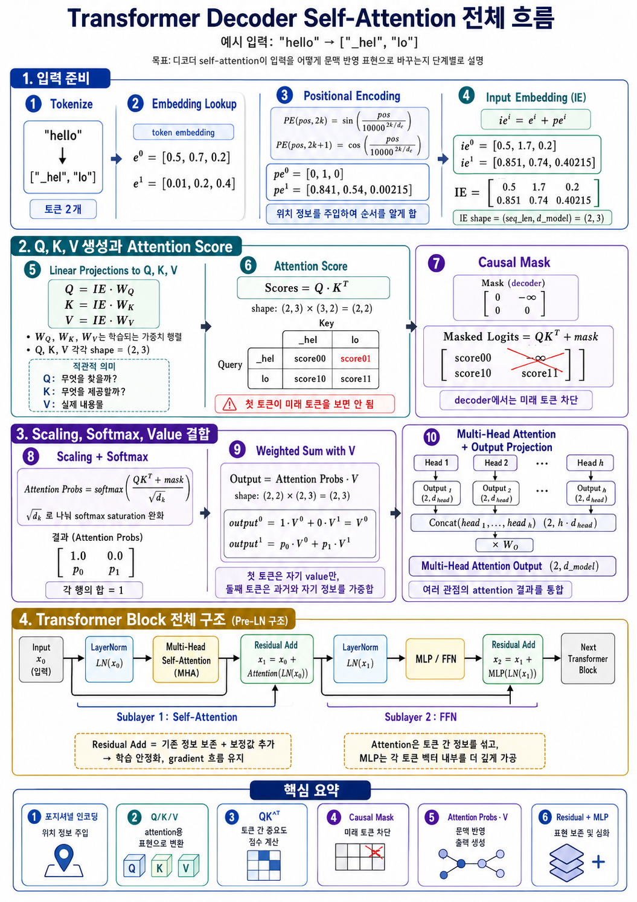

# Transformer

## LLM 추론 파이프라인

LLM은 문장을 한 번에 완성하지 않는다. 입력 문맥을 기반으로 다음 토큰 하나의 확률 분포를 계산하고, 그중 하나를 선택한 뒤, 선택된 토큰을 다시 문맥에 붙여 반복 생성한다.

```text
입력 문맥
 → 다음 토큰 확률 계산
 → 다음 토큰 선택
 → 문맥에 추가
 → 반복
```

Autoregressive generation은 전체 문장 확률을 각 시점의 다음 토큰 확률의 곱으로 표현한다.

```math
P(x_1, x_2, ..., x_T) = \prod_{t=1}^{T} P(x_t \mid x_{\lt t})
```

Decoder-only LLM의 전체 추론 흐름은 다음과 같다.

```text
User Input
 → Tokenizer
 → Token IDs
 → Embedding
 → Positional Encoding / RoPE
 → Transformer Blocks
 → LM Head
 → Logits
 → Softmax
 → Probability Distribution
 → Decoding Strategy
 → Next Token
 → Detokenizer
 → Streaming Output
```

## Decoder Self-Attention Flow



위 그림은 decoder-only self-attention이 입력 토큰을 문맥화된 표현으로 바꾸는 과정을 요약한다.

1. 입력 문자열을 토큰 ID로 변환하고 token embedding을 lookup한다.
2. 위치 정보를 더하거나 RoPE처럼 `Q`, `K`에 위치 정보를 주입한다.
3. 입력 embedding에서 `Q`, `K`, `V`를 linear projection으로 만든다.
4. `QK^T`로 attention score를 계산한다.
5. causal mask를 적용해 각 토큰이 미래 토큰을 보지 못하게 한다.
6. `sqrt(d_k)`로 scaling하고 softmax로 attention probability를 만든다.
7. attention probability와 `V`를 곱해 value의 weighted sum을 만든다.
8. multi-head attention 출력을 residual connection, LayerNorm, MLP/FFN과 함께 Transformer block 안에서 처리한다.

## Tokenization

LLM은 문자열을 직접 처리하지 않고, 먼저 텍스트를 토큰 단위로 나눈다. 이 appendix의 그림과 이어지는 self-attention 예시는 `"hello"`가 `["_hel", "lo"]` 두 토큰으로 나뉜다고 가정한다.

```text
"hello"
 → ["_hel", "lo"]
 → [101, 102]
```

위 token ID는 shape 설명을 위한 예시값이다. 실제 토큰 분할과 ID는 사용하는 tokenizer와 vocabulary에 따라 달라진다.

Vocabulary size를 `V`라고 하면 각 token ID는 보통 다음 범위 안에 있다.

```math
0 \leq token\_id < V
```

예를 들어 vocabulary size는 모델에 따라 `32,000`, `50,257`, `128,000`처럼 달라질 수 있다.

## Embedding Lookup

Token ID는 정수일 뿐이므로 모델이 계산할 수 있는 dense vector로 바꿔야 한다. 이를 위해 embedding matrix를 사용한다.

```math
E \in \mathbb{R}^{V \times d_{model}}
```

토큰 ID `x_i`에 대한 embedding vector는 embedding matrix의 해당 row를 lookup해서 얻는다.

```math
e_i = E[x_i]
```

입력 토큰 수가 `n`개이면 embedding 결과는 다음 shape을 가진다.

```math
X \in \mathbb{R}^{n \times d_{model}}
```

그림의 작은 예시처럼 `seq_len = 2`, `d_model = 3`이면 다음과 같다.

```math
X \in \mathbb{R}^{2 \times 3}
```

## Positional Encoding과 RoPE

Transformer의 self-attention은 기본적으로 토큰들을 병렬로 본다. RNN처럼 순서대로 읽지 않기 때문에, 별도의 위치 정보가 없으면 토큰 순서를 알기 어렵다.

```text
I love you
You love I
```

두 문장은 같은 토큰을 포함하지만 순서가 다르므로 의미가 달라진다. 따라서 Transformer는 각 토큰에 위치 정보를 추가한다.

원래 Transformer 논문에서는 sin/cos 기반 positional encoding을 사용했다.

```math
PE_{(pos, 2k)} = \sin \left(\frac{pos}{10000^{2k / d_{model}}}\right)
```

```math
PE_{(pos, 2k+1)} = \cos \left(\frac{pos}{10000^{2k / d_{model}}}\right)
```

최종 입력 embedding은 token embedding과 positional encoding을 더해서 만든다.

```math
x_i = e_i + pe_i
```

예를 들어 다음과 같다.

```math
e^0 = [0.5, 0.7, 0.2]
```

```math
pe^0 = [0, 1, 0]
```

```math
ie^0 = e^0 + pe^0 = [0.5, 1.7, 0.2]
```

요즘 GPT, LLaMA 계열 모델은 단순 sinusoidal positional encoding보다 RoPE, Rotary Positional Embedding을 많이 사용한다. RoPE는 위치 벡터를 embedding에 단순히 더하는 대신, `Q`와 `K` 벡터를 위치에 따라 회전시킨다. 목적은 동일하다.

```text
Transformer에게 토큰의 순서와 상대적 위치 정보를 알려준다.
```

## Input Embedding Matrix

각 토큰의 input embedding을 행으로 쌓으면 입력 행렬이 된다.

```math
IE =
\begin{bmatrix}
0.5 & 1.7 & 0.2 \\
0.851 & 0.74 & 0.40215
\end{bmatrix}
```

Shape은 다음과 같다.

```math
IE \in \mathbb{R}^{seq\_len \times d_{model}}
```

예시에서는 다음과 같다.

```math
IE \in \mathbb{R}^{2 \times 3}
```

## Q, K, V 생성

Self-attention에서는 입력 `X`에서 Query, Key, Value를 만든다.

```math
Q = XW_Q
```

```math
K = XW_K
```

```math
V = XW_V
```

각 projection matrix의 shape은 다음과 같다.

```math
W_Q \in \mathbb{R}^{d_{model} \times d_k}
```

```math
W_K \in \mathbb{R}^{d_{model} \times d_k}
```

```math
W_V \in \mathbb{R}^{d_{model} \times d_v}
```

직관적으로 보면 `Q`, `K`, `V`는 다음 역할을 한다.

```text
Q = Query = 내가 무엇을 찾고 싶은가?
K = Key   = 나는 어떤 정보로 검색될 수 있는가?
V = Value = 내가 실제로 제공할 내용은 무엇인가?
```

즉 `Q/K`는 matching score 계산용이고, `V`는 실제로 전달되는 payload에 가깝다.

예를 들어 다음 shape이라면:

```math
X \in \mathbb{R}^{2 \times 3}
```

```math
W_Q, W_K, W_V \in \mathbb{R}^{3 \times 3}
```

결과는 다음과 같다.

```math
Q, K, V \in \mathbb{R}^{2 \times 3}
```

Attention score는 `QK^T`로 계산하므로 `Q`와 `K`의 마지막 차원은 같아야 한다.

```math
QK^T \in \mathbb{R}^{seq\_len \times seq\_len}
```

반면 `d_v`는 반드시 `d_k`와 같을 필요는 없다. `V`는 score 계산 대상이 아니라 weighted sum 대상이기 때문이다.

## Attention Score

기본 attention score는 다음과 같이 계산한다.

```math
Scores = QK^T
```

각 원소는 다음 의미를 가진다.

```math
score_{ij} = Q_i \cdot K_j
```

즉 `i`번째 토큰의 Query가 `j`번째 토큰의 Key와 얼마나 잘 맞는지를 나타낸다.

토큰이 2개인 경우 attention score 행렬은 다음처럼 볼 수 있다.

```text
              Key: _hel      Key: lo
Query: _hel   score00        score01
Query: lo     score10        score11
```

핵심은 다음과 같다.

```text
행 = Query, 보는 주체
열 = Key, 보여지는 대상
```

예를 들어 `score01`은 다음 내적이다.

```math
score_{01} = Q_{hel} \cdot K_{lo}
```

```math
score_{01} = q_0 k_0 + q_1 k_1 + q_2 k_2
```

값이 클수록 Query와 Key가 잘 맞는다는 뜻이다.

## Causal Mask

Decoder 기반 LLM은 다음 토큰을 예측한다. 따라서 현재 위치에서 미래 토큰을 보면 안 된다.

예를 들어 `["_hel", "lo"]`에서 첫 번째 토큰 `_hel`은 두 번째 토큰 `lo`를 보면 안 된다. 하지만 `QK^T`를 계산하면 `_hel -> lo`에 해당하는 score가 생긴다. 이 값은 정보 누설이므로 causal mask로 미래 토큰을 차단한다.

토큰 2개인 경우 mask는 다음과 같다.

```math
Mask =
\begin{bmatrix}
0 & -\infty \\
0 & 0
\end{bmatrix}
```

Masked score는 다음과 같이 계산된다.

```math
MaskedScores = QK^T + Mask
```

```math
\begin{bmatrix}
score_{00} & score_{01} \\
score_{10} & score_{11}
\end{bmatrix}
+
\begin{bmatrix}
0 & -\infty \\
0 & 0
\end{bmatrix}
=
\begin{bmatrix}
score_{00} & -\infty \\
score_{10} & score_{11}
\end{bmatrix}
```

Mask 값으로 `0`이 아니라 `-\infty`를 쓰는 이유는 softmax 때문이다.

```math
softmax(z_i) = \frac{e^{z_i}}{\sum_j e^{z_j}}
```

막고 싶은 위치를 softmax 전에 `-\infty`로 만들면 다음과 같이 확률이 0이 된다.

```math
e^{-\infty} = 0
```

```math
softmax([a, -\infty]) = [1, 0]
```

시퀀스 길이 5의 causal mask는 다음 패턴을 가진다.

```math
Mask =
\begin{bmatrix}
0 & -\infty & -\infty & -\infty & -\infty \\
0 & 0 & -\infty & -\infty & -\infty \\
0 & 0 & 0 & -\infty & -\infty \\
0 & 0 & 0 & 0 & -\infty \\
0 & 0 & 0 & 0 & 0
\end{bmatrix}
```

```text
대각선과 좌하단 = 허용
우상단 = 미래 토큰이므로 차단
```

## Scaling과 Softmax

Attention score는 바로 softmax에 넣지 않고 `sqrt(d_k)`로 나눈다.

```math
ScaledScores = \frac{QK^T + Mask}{\sqrt{d_k}}
```

`Q`와 `K`의 차원이 커질수록 내적값의 크기도 커지는 경향이 있다.

```math
Q_i \cdot K_j = \sum_{m=1}^{d_k} q_m k_m
```

`d_k`가 크면 score의 분산이 커지고, softmax가 한쪽으로 과하게 쏠릴 수 있다.

```math
softmax([20, 1]) \approx [1, 0]
```

따라서 `sqrt(d_k)`로 나누어 score scale을 안정화한다.

Attention probability matrix `A`는 다음과 같다.

```math
A = softmax\left(\frac{QK^T + Mask}{\sqrt{d_k}}\right)
```

각 행은 합이 1이다.

```math
\sum_j A_{ij} = 1
```

즉 각 Query 토큰마다 어떤 Key 토큰을 얼마나 볼지에 대한 확률 분포가 된다.

## Weighted Sum with V

Attention probability `A`를 Value matrix `V`에 곱한다.

```math
O = AV
```

Shape은 다음과 같다.

```math
A \in \mathbb{R}^{seq\_len \times seq\_len}
```

```math
V \in \mathbb{R}^{seq\_len \times d_v}
```

```math
O \in \mathbb{R}^{seq\_len \times d_v}
```

예를 들어 다음 attention probability가 있을 때:

```math
A =
\begin{bmatrix}
1.0 & 0.0 \\
p_0 & p_1
\end{bmatrix}
```

출력은 다음과 같다.

```math
O^0 = 1.0 \cdot V^0 + 0.0 \cdot V^1 = V^0
```

```math
O^1 = p_0 \cdot V^0 + p_1 \cdot V^1
```

Attention의 본질은 다음 구조다.

```text
Attention Probability = 누구를 얼마나 참고할지
Value                 = 실제 가져올 정보
Output                = Value들의 가중합
```

수식으로 쓰면 다음과 같다.

```math
Attention(Q, K, V) =
softmax\left(
\frac{QK^T + Mask}{\sqrt{d_k}}
\right)V
```

## Multi-Head Attention

하나의 attention head는 한 가지 관점의 관계만 학습하기 쉽다. 여러 head를 두면 서로 다른 관계를 병렬로 학습할 수 있다.

```text
Head 1 = 문법 관계
Head 2 = 가까운 토큰 관계
Head 3 = 긴 거리 의존성
Head 4 = 구문 경계
```

이 역할은 사람이 지정하지 않고 학습 과정에서 자연스럽게 분화된다.

각 head는 독립적인 projection matrix를 가진다.

```math
Q_h = XW_Q^h
```

```math
K_h = XW_K^h
```

```math
V_h = XW_V^h
```

각 head의 출력은 다음과 같다.

```math
head_h = Attention(Q_h, K_h, V_h)
```

여러 head의 출력을 concat한다.

```math
H = Concat(head_1, head_2, ..., head_n)
```

일반적으로 다음 관계를 가진다.

```math
head\_dim = \frac{d_{model}}{num\_heads}
```

```math
num\_heads \times head\_dim = d_{model}
```

예를 들어 `d_model = 4096`, `num_heads = 32`, `head_dim = 128`이면 다음과 같다.

```math
32 \times 128 = 4096
```

Concat된 결과는 output projection으로 다시 섞는다.

```math
MHA(X) = Concat(head_1, ..., head_h)W_O
```

```math
W_O \in \mathbb{R}^{d_{model} \times d_{model}}
```

결과 shape은 다음과 같다.

```math
MHA(X) \in \mathbb{R}^{seq\_len \times d_{model}}
```

## Residual Connection과 LayerNorm

Attention output은 원래 입력을 완전히 대체하는 것이 아니라, 기존 표현에 문맥 정보를 보정값처럼 추가한다.

```math
x_1 = x_0 + MHA(x_0)
```

요즘 LLM의 Pre-LN 구조에서는 보통 다음과 같다.

```math
x_1 = x_0 + MHA(LN(x_0))
```

Residual connection의 주요 목적은 기존 표현 보존, gradient 흐름 개선, 깊은 모델 학습 안정화, 필요 없는 block을 사실상 건너뛰는 효과다.

```math
x + 0 \approx x
```

LayerNorm은 각 토큰 벡터 내부의 값 분포를 안정화한다.

```math
\mu = \frac{1}{d}\sum_{i=1}^{d} x_i
```

```math
\sigma^2 = \frac{1}{d}\sum_{i=1}^{d}(x_i - \mu)^2
```

```math
\hat{x}_i =
\frac{x_i - \mu}{\sqrt{\sigma^2 + \epsilon}}
```

```math
LN(x_i) = \gamma \hat{x}_i + \beta
```

BatchNorm은 batch 전체 통계에 의존하지만, LLM inference에서는 batch size가 1일 수도 있고 sequence length도 달라진다. LayerNorm은 각 토큰 벡터 내부에서만 정규화하므로 batch 크기와 무관하게 안정적이다.

```text
BatchNorm = batch 차원 기준 정규화
LayerNorm = hidden dimension 기준 정규화
```

원 논문의 Transformer는 Post-LN 구조에 가깝지만, 요즘 LLM은 보통 Pre-LN 구조를 많이 쓴다.

```text
Post-LN: x → Attention → Add → LayerNorm
Pre-LN : x → LayerNorm → Attention → Add
```

Pre-LN은 깊은 모델에서 학습 안정성이 더 좋은 편이다.

## MLP / FFN

Attention은 토큰 간 정보를 섞고, MLP/FFN은 각 토큰 벡터 내부를 비선형적으로 가공한다.

```text
Attention = 토큰 간 관계 처리
MLP / FFN = 토큰별 hidden representation 변환
```

일반적인 FFN은 다음과 같다.

```math
FFN(x) = W_2 \cdot \phi(W_1x + b_1) + b_2
```

구조는 다음과 같다.

```text
Linear
 → Activation
 → Linear
```

차원은 보통 다음처럼 확장 후 축소된다.

```math
d_{model} \rightarrow d_{ff} \rightarrow d_{model}
```

일반적으로 `d_ff`는 `d_model`보다 크며, 전통적인 Transformer에서는 약 `4 * d_model`을 많이 사용했다.

전통적인 Transformer에서는 ReLU를 사용했지만, 요즘 LLM에서는 GELU, SwiGLU 계열을 많이 사용한다.

```math
GELU(x) = x\Phi(x)
```

SwiGLU 계열은 gate 구조를 사용한다.

```math
SwiGLU(x) = Swish(xW_1) \odot (xW_2)
```

Attention 뒤와 마찬가지로 MLP 뒤에도 residual이 붙는다.

```math
x_1 = x_0 + MHA(LN(x_0))
```

```math
x_2 = x_1 + MLP(LN(x_1))
```

## Transformer Block

요즘 LLM 스타일의 Pre-LN Transformer block은 다음과 같다.

```text
Input x0
  ↓
LayerNorm
  ↓
Multi-Head Self-Attention
  ↓
Residual Add
  ↓
LayerNorm
  ↓
MLP / FFN
  ↓
Residual Add
  ↓
Output x2
```

수식은 다음과 같다.

```math
x_1 = x_0 + MHA(LN(x_0))
```

```math
x_2 = x_1 + MLP(LN(x_1))
```

이 block이 `N`개 반복된다.

```math
x^{(0)} \rightarrow x^{(1)} \rightarrow ... \rightarrow x^{(N)}
```

## LM Head와 Logits

Transformer blocks를 모두 통과하면 마지막 hidden state가 나온다.

```math
H \in \mathbb{R}^{seq\_len \times d_{model}}
```

다음 토큰 예측에는 보통 마지막 위치의 hidden state를 사용한다.

```math
h_t \in \mathbb{R}^{d_{model}}
```

LM Head는 hidden state를 vocabulary 크기의 logits로 변환한다.

```math
logits = h_t W_{LM}
```

```math
W_{LM} \in \mathbb{R}^{d_{model} \times V}
```

따라서:

```math
logits \in \mathbb{R}^{V}
```

Logits는 아직 확률이 아니다.

```text
logit[token_id] = 해당 토큰이 다음에 나올 raw score
```

예를 들어 toy tokenizer에서 `"_hel"`이 화면에는 `"hel"`로 보인다고 하면, 현재 문맥 `["_hel"]` 다음 토큰 후보의 logit은 다음처럼 볼 수 있다.

```text
lo       logit = 5.2
p        logit = 2.1
met      logit = 0.7
cat      logit = -2.0
```

Logits를 softmax에 넣으면 확률 분포가 된다.

```math
P(x_i) =
\frac{e^{z_i}}{\sum_{j=1}^{V} e^{z_j}}
```

전체 확률 합은 1이다.

```math
\sum_{i=1}^{V} P(x_i) = 1
```

## Decoding Strategies

다음 토큰을 선택하는 방식은 여러 가지가 있다.

Greedy decoding은 가장 확률이 높은 토큰을 항상 선택한다.

```math
x_t = \arg\max_i P(x_i \mid x_{\lt t})
```

장점은 결정적이고 빠르며 재현 가능하다는 점이다. 단점은 반복적이고 단조로운 출력이 나올 수 있다는 점이다.

Top-k sampling은 확률이 높은 상위 `k`개 토큰만 남기고 그 안에서 샘플링한다.

```math
S_k = TopK(P, k)
```

```math
P'(x_i) =
\begin{cases}
\frac{P(x_i)}{\sum_{j \in S_k}P(x_j)} & \text{if } i \in S_k \\
0 & \text{otherwise}
\end{cases}
```

Top-p, 또는 nucleus sampling은 누적 확률이 `p` 이상이 되는 최소 토큰 집합을 선택하고 그 안에서 샘플링한다.

```math
S_p = \{x_1, ..., x_m\}
```

```math
\sum_{i=1}^{m} P(x_i) \geq p
```

Temperature는 softmax 전에 logits의 날카로움을 조정한다.

```math
P(x_i) =
\frac{e^{z_i / T}}{\sum_j e^{z_j / T}}
```

```text
T < 1 = 더 보수적, 높은 확률 토큰에 집중
T = 1 = 원래 분포
T > 1 = 더 평평한 분포, 다양성 증가
```

Beam search는 여러 후보 시퀀스를 동시에 유지하면서 가장 좋은 시퀀스를 선택한다. 번역, 요약, constrained generation 같은 구조화된 작업에서 유리할 수 있지만, open-ended chat에서는 너무 평범하거나 반복적인 결과가 나올 수 있고 계산 비용도 증가한다.

실제 LLM 서비스에서는 보통 여러 전략을 조합한다.

```text
temperature = 0.7
top_p = 0.9
top_k = 40
```

Greedy는 sampling을 사실상 끈 deterministic 모드에 가깝다.

## Detokenization과 Streaming Output

선택된 token ID는 다시 텍스트로 변환된다.

```text
token_id = 102
 → "lo"
```

이후 새 토큰을 기존 문맥에 추가한다.

```text
["_hel"]
 + ["lo"]
 → ["_hel", "lo"]
 → "hello"
```

그리고 이 전체 문맥을 기반으로 다음 토큰을 다시 예측한다. 스트리밍 출력에서는 토큰이 생성되는 즉시 사용자에게 표시된다.

```text
"_hel" → "hel"
"lo"   → "hello"
```

## Prefill과 Decode

Prefill은 사용자 프롬프트 전체를 처음 한 번 처리하는 단계다.

```text
입력 프롬프트 전체 → Transformer 통과 → KV Cache 생성
```

특징은 다음과 같다.

```text
입력 토큰 전체를 병렬 처리
Attention 행렬이 seq_len × seq_len
GEMM 중심
Compute-heavy 성향
KV cache 초기 구축
```

수식 관점에서는 다음과 같다.

```math
Q \in \mathbb{R}^{n \times d_k}
```

```math
K \in \mathbb{R}^{n \times d_k}
```

```math
QK^T \in \mathbb{R}^{n \times n}
```

Decode는 이후 한 토큰씩 생성하는 단계다. 새 토큰 1개에 대해서만 Query를 계산하고, 과거 `K/V`는 cache에서 재사용한다.

```math
Q_{new} \in \mathbb{R}^{1 \times d_k}
```

```math
K_{cache} \in \mathbb{R}^{n \times d_k}
```

```math
Q_{new}K_{cache}^T
\in
\mathbb{R}^{1 \times n}
```

특징은 다음과 같다.

```text
한 토큰씩 순차 생성
KV cache 재사용
GEMV 중심
Memory-bandwidth-bound 성향
batch=1에서 SM busy가 낮게 나올 수 있음
```

## KV Cache

Decode 단계에서 매번 전체 프롬프트의 `K`, `V`를 다시 계산하면 비효율적이다. 그래서 과거 토큰들의 `K`, `V`를 cache에 저장한다.

```text
과거 K, V 저장
 → 새 토큰 생성 시 재사용
 → 중복 계산 제거
```

각 layer, 각 head별로 `K`와 `V`가 저장된다. 대략적인 shape은 다음과 같다.

```math
K_{cache}
\in
\mathbb{R}^{layers \times batch \times heads \times seq\_len \times head\_dim}
```

```math
V_{cache}
\in
\mathbb{R}^{layers \times batch \times heads \times seq\_len \times head\_dim}
```

Decode가 진행될수록 `seq_len` 방향으로 cache가 증가한다.

KV cache의 장점은 과거 토큰의 `K/V` 재계산을 피하고 decode latency를 줄이며 긴 문맥 처리를 가능하게 한다는 점이다. 단점은 메모리 사용량이 증가하고, 긴 context에서 HBM bandwidth 병목이 커지며, batch serving에서 cache 관리가 복잡해진다는 점이다.

## Serving 최적화 관점

FlashAttention은 attention 계산의 memory access를 최적화한 fused kernel 계열 기법이다. 일반 attention은 중간 attention matrix를 HBM에 크게 저장할 수 있다.

```math
S = QK^T
```

```math
A = softmax(S)
```

```math
O = AV
```

FlashAttention은 이를 block 단위로 계산하면서 SRAM/shared memory를 효율적으로 활용해 HBM read/write를 줄인다. Causal mask도 별도의 큰 mask 행렬을 메모리에 쓰기보다 kernel 내부에서 처리할 수 있다.

Quantization은 model weight, activation, KV cache 등을 낮은 precision으로 표현해 메모리 사용량과 bandwidth를 줄이는 기법이다.

```text
FP16
BF16
FP8
INT8
INT4
```

Weight quantization은 모델 크기와 weight memory bandwidth를 줄이고, KV cache quantization은 decode 단계의 KV cache read bandwidth를 줄인다.

Paged KV Cache는 OS의 virtual memory page처럼 KV cache를 page 단위로 관리한다. 요청마다 sequence length가 다른 serving 환경에서 fragmentation을 줄이고 dynamic batching에 유리하다.

Speculative decoding은 작은 draft model이 여러 토큰 후보를 빠르게 제안하고, 큰 target model이 이를 검증하는 방식이다.

```text
Draft model: 후보 토큰 여러 개 생성
Target model: 후보를 병렬 검증
Accept된 토큰은 그대로 사용
Reject되면 보정
```

목적은 한 토큰씩 순차 생성해야 하는 decode의 체감 속도를 높이는 것이다. 다만 draft model이 필요하고, acceptance rate에 따라 효과가 달라진다.

Continuous batching은 새 요청과 진행 중인 요청을 동적으로 묶어 GPU 사용률과 throughput을 높이는 serving 기법이다.

Prefix caching은 여러 요청이 같은 system prompt나 긴 prefix를 공유할 때, 해당 prefix의 KV cache를 재사용해 prefill 비용과 첫 토큰 latency를 줄이는 기법이다.

Tensor parallelism은 큰 matrix multiplication을 여러 GPU에 shard로 나누는 방식이고, pipeline parallelism은 layer를 여러 GPU에 나누어 배치하는 방식이다. 큰 모델을 단일 GPU에 올릴 수 없을 때 필요하지만, GPU 간 통신 비용과 pipeline bubble을 고려해야 한다.

## Decode가 느리게 느껴지는 이유

Decode 단계는 한 토큰씩 생성하기 때문에 본질적으로 순차적이다.

```math
x_t \sim P(x_t \mid x_{\lt t})
```

토큰 `t`를 생성해야 토큰 `t+1`을 생성할 수 있다. 또한 decode에서는 매 단계마다 KV cache와 model weight를 반복적으로 읽는다.

```text
batch=1에서는 연산량 대비 memory read 비중이 큼
GEMV 중심
HBM bandwidth 병목
GPU Util은 높아도 SM busy는 낮을 수 있음
```

즉 다음 둘은 같지 않다.

```text
GPU가 바쁘게 보인다
≠
compute unit이 꽉 차서 계산 중이다
```

실제로는 메모리 대기 시간이 클 수 있다.

## 핵심 수식 정리

Embedding:

```math
x_i = E[token_i] + pe_i
```

RoPE 사용 시:

```math
Q, K \leftarrow RoPE(Q, K)
```

Q, K, V:

```math
Q = XW_Q
```

```math
K = XW_K
```

```math
V = XW_V
```

Scaled dot-product attention:

```math
Attention(Q, K, V)
=
softmax
\left(
\frac{QK^T + Mask}{\sqrt{d_k}}
\right)V
```

Multi-head attention:

```math
head_i = Attention(Q_i, K_i, V_i)
```

```math
MHA(X) = Concat(head_1, ..., head_h)W_O
```

Transformer block, Pre-LN:

```math
x_1 = x_0 + MHA(LN(x_0))
```

```math
x_2 = x_1 + MLP(LN(x_1))
```

MLP:

```math
MLP(x) = W_2 \phi(W_1x + b_1) + b_2
```

LM Head:

```math
logits = h_t W_{LM}
```

Softmax:

```math
P(x_i) =
\frac{e^{z_i}}{\sum_{j=1}^{V}e^{z_j}}
```

Temperature:

```math
P(x_i) =
\frac{e^{z_i / T}}{\sum_j e^{z_j / T}}
```

Autoregressive generation:

```math
P(x_1, ..., x_T)
=
\prod_{t=1}^{T}
P(x_t \mid x_{\lt t})
```

## 전체 흐름 요약

```text
1. 사용자 입력 텍스트
2. Tokenizer가 token ID로 변환
3. Embedding lookup으로 dense vector 변환
4. 위치 정보 주입
5. Transformer block N개 반복
   - LayerNorm
   - Multi-Head Self-Attention
   - Residual Add
   - LayerNorm
   - MLP / FFN
   - Residual Add
6. 마지막 hidden state를 LM Head에 통과
7. Vocabulary 전체에 대한 logits 생성
8. Softmax로 확률 분포 변환
9. Greedy / Top-k / Top-p / Temperature / Beam Search 등으로 다음 토큰 선택
10. 선택된 token ID를 텍스트로 변환
11. 문맥에 추가
12. EOS가 나올 때까지 반복
```

모델 구조 관점에서는 다음처럼 정리할 수 있다.

```text
Embedding은 토큰을 벡터로 바꾼다.
Positional encoding은 순서 정보를 넣는다.
Self-Attention은 토큰 간 관계를 계산한다.
MLP는 토큰별 표현을 비선형적으로 가공한다.
Residual은 정보 보존과 학습 안정성을 제공한다.
LayerNorm은 표현 분포를 안정화한다.
LM Head는 hidden state를 vocabulary logits로 바꾼다.
```

추론 엔진 관점에서는 다음처럼 정리할 수 있다.

```text
Prefill은 prompt 전체를 병렬 처리한다.
Decode는 한 토큰씩 순차 생성한다.
KV Cache는 과거 K/V 재계산을 피한다.
Decode는 memory bandwidth 병목이 강하다.
FlashAttention은 attention memory IO를 줄인다.
Quantization은 메모리와 bandwidth를 줄인다.
Paged KV Cache는 serving 메모리 관리를 개선한다.
Speculative Decoding은 decode 속도를 높일 수 있다.
Continuous Batching은 GPU throughput을 개선한다.
```

가장 압축하면 LLM 추론은 다음 과정을 EOS 토큰이나 stopping condition이 나올 때까지 반복한다.

```text
문맥을 벡터로 표현하고,
Transformer가 문맥 정보를 섞고,
다음 토큰 확률을 계산하고,
하나의 토큰을 선택한 뒤,
그 토큰을 다시 문맥에 붙인다.
```

```math
x_t \sim softmax(LMHead(Transformer(x_{\lt t})))
```

## References

- [Transformer Explainer: LLM Transformer Model Visually Explained](https://poloclub.github.io/transformer-explainer/) - interactive GPT-2 small visualization for tokenization, embeddings, masked self-attention, output probabilities, and sampling controls.
