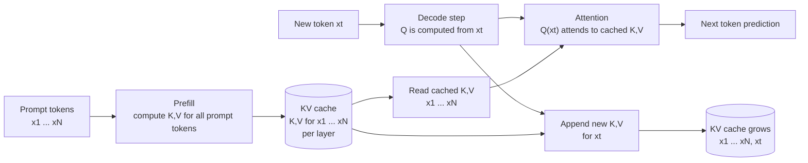

# Week 3 — Transformer Inference and the KV Cache

## 3.1 Learning Goals

By the end of this week, you should be able to:

1. Memorize the KV cache memory formula and estimate memory for an arbitrary model, sequence length, and batch size in under 5 seconds.
2. Explain the evolution from MHA to MQA to GQA to MLA from a **memory-bound inference** perspective, not just as "memory savings."
3. Compute the point where **KV cache memory becomes larger than model weight memory** in 70B serving.
4. Explain how RoPE works and what breaks when context is extended with NTK-aware scaling or YaRN.
5. Estimate how many VSS/VRS camera streams an **AGX Orin 64GB** can process concurrently using KV cache accounting.

## 3.2 Prerequisite Check

You should already know:

- What Q/K/V projections are in a Transformer, at least conceptually.
- Why prompt length had little effect on TPOT in the Week 1 data: KV grows, but weight loading dominated this setup.
- Why the Week 2 NCU measurement showed **L2 hit rate dropping from 77% at batch=1 to 37% at batch=32**: the KV working set spilled out of L2 and into device memory.

If the Transformer attention flow is not fresh, review the [Transformer appendix](../appendix/transformer/README.md) first.

This week combines those observations. **KV cache size scales with both batch size and sequence length, which makes it a hard constraint in multi-tenant serving.**

However, as Week 2 showed, the attention kernel was not the latency bottleneck for the Qwen2.5-3B + RTX 5080 experiment. Read this week's KV optimization primarily as **capacity and concurrency optimization**, not as a direct latency optimization for that specific workload.

---

## 3.3 Core Concept: Quantitative KV Cache Accounting

### 3.3.1 Formula

```
KV Cache memory (per sequence) = 2 × L × n_kv_heads × d_head × seq_len × bytes
                                 │   │       │            │         │       │
                                 K+V layers  groups   head dim   tokens   precision
```

**Five key variables**:

- `L`: number of layers (Qwen2.5-3B = 36, Llama-3-70B = 80)
- `n_kv_heads`: number of KV heads (same as query heads for MHA, smaller for GQA)
- `d_head`: head dimension, usually 128
- `seq_len`: accumulated prefill + decode length
- `bytes`: precision (BF16=2, FP8/INT8=1, INT4=0.5)

### 3.3.2 KV cache lifecycle

The KV cache is not a static buffer created once. It is per-request state that grows as decoding progresses.

```
prefill:
  process N prompt tokens in parallel
  -> store K,V for every layer
  -> KV length = N

decode step 1:
  compute the query for one new token
  read all K,V for the existing N tokens
  append the new token's K,V
  -> KV length = N + 1

decode step t:
  read all K,V for the existing N+t-1 tokens
  append the new token's K,V
  -> KV length = N + t
```

So the KV cache has two costs at the same time:

1. **Capacity cost**: it occupies GPU memory proportional to `batch × current_seq_len`.
2. **Read traffic cost**: each decode step reads the accumulated KV cache in the attention kernel.

In the Week 2 Qwen2.5-3B + RTX 5080 experiment, attention was not the latency bottleneck. But from a serving perspective, the capacity cost alone strongly constrains batch size and concurrent requests.



The cache stores past `K,V`, not past `Q`. In a new decode step, only the current token's `Q` is needed. That query attends to the cached past `K,V`.

<p style="text-align: center; background-color: #FFFFFF;">
    
</p>

In the diagram, each token's hidden state is projected into `Q`, `K`, and `V`. During autoregressive decode, only the new token's `Q` must be computed at each step. Past tokens' `K,V` do not change because of causal masking, so they can be stored per layer as the KV cache.  
Source: dvgodoy, [Decoder self-attention with causal masking, detailed diagram](https://commons.wikimedia.org/wiki/File:Decoder_self-attention_with_causal_masking,_detailed_diagram.png), Wikimedia Commons, [CC BY 4.0](https://creativecommons.org/licenses/by/4.0/). Used without modification.

### 3.3.3 Per-Token KV Size by Model

The numbers below use binary units: KiB, MiB, GiB.

| Model | L | n_kv_heads | d_head | KV/token (BF16) |
|---|---|---|---|---|
| Qwen2.5-3B | 36 | 2 (GQA) | 128 | **36 KiB** |
| Qwen2.5-7B | 28 | 4 (GQA) | 128 | **56 KiB** |
| Llama-3-8B | 32 | 8 (GQA) | 128 | **128 KiB** |
| Llama-3-70B | 80 | 8 (GQA) | 128 | **320 KiB** |
| Llama-2-70B | 80 | 64 (MHA) | 128 | **2,560 KiB (2.5 MiB)** |
| DeepSeek-V2-236B | 60 | latent c=512 | — | ~70 KiB (MLA) |

The move from MHA to GQA reduces KV cache size by 8x for Llama-70B-class models. Llama-2-70B uses MHA, while Llama-3-70B uses GQA with far fewer KV heads.

### 3.3.4 Re-Reading the Week 1 Data

The Week 1 batch sweep ran up to `batch=128` with prompt length 256 and decode length 512, so the final sequence length was roughly 768 tokens.

```
Qwen2.5-3B, BF16, RTX 5080 16GB
- Weights: about 6 GiB
- Runtime overhead: CUDA context, PyTorch reserved memory, temporary tensors
- KV/token: 36 KiB

batch=128, seq_len=768:
KV = 36 KiB × 128 batch × 768 tokens = 3.375 GiB
-> large, but not enough by itself to explain OOM on a 16GB GPU

batch=256, seq_len=768:
KV = 36 KiB × 256 × 768 tokens = 6.75 GiB
-> potentially possible by KV alone, but risky once temporary buffers and reserved memory are included

batch=128, seq_len=2048:
KV = 36 KiB × 128 × 2048 = 9.0 GiB
-> very tight on a 16GB GPU even before other allocations
```

Important pitfall: the Week 1 experiment used `logits_to_keep=1`, so it did not allocate full prompt logits. If prefill returns logits for every prompt position:

```
batch 128 × prompt 256 × vocab 151,936 × 2 bytes = 9.27 GiB
```

In that case, OOM can happen because of the logits tensor before the KV cache becomes the true limiting allocation. Therefore, the Week 1 knee around batch 64-128 should be interpreted as a **practical saturation region**, not a pure KV capacity boundary.

The core rule still holds: **the OOM boundary is governed by batch × sequence length, not batch size alone**. To measure the boundary cleanly, you need to control logits and temporary allocations.

### 3.3.5 70B Model: Weight vs. KV Cross-Over

```
Llama-3-70B BF16 (GQA):
- Weights: about 140 GB, fixed
- KV/token: 320 KiB

batch=1, seq_len=4K: KV = 1.25 GiB (about 1% of weights)
batch=32, seq_len=4K: KV = 40 GiB (about 30% of weights)
batch=128, seq_len=8K: KV = 320 GiB, more than 2x the weight size
batch=256, seq_len=32K: KV = 2.5 TiB, completely impractical
```

The cross-over occurs around `batch × seq_len ~= 4.3e5-4.6e5` token positions. Decimal GB vs. binary GiB changes the exact number slightly, but the mental model is enough: at batch 128, sequence lengths around 3.3K-3.6K make KV memory larger than BF16 weight memory.

This matters because **KV cache memory constrains batch size when serving 70B models**. Weights are fixed and often sharded across 8 H100s, but KV grows with concurrent users. This is why PagedAttention in Week 6 is decisive for production serving.

If this were Llama-2-70B with MHA, all KV numbers above would be 8x larger. At `batch=16, seq_len=4K`, KV would already be larger than weights. GQA increases the practical serving batch by roughly 8x.

---

## 3.4 Evolution of Attention Variants

### 3.4.1 Four Attention Variants

| Variant | KV cache ratio | Quality | Representative models |
|---|---|---|---|
| MHA (Multi-Head) | 1x baseline | highest | GPT-3, Llama-2, BERT |
| MQA (Multi-Query) | 1/H | slight drop | PaLM, Falcon-7B |
| GQA (Grouped-Query) | 1/G, often G=4-8 | close to MHA | Llama-3, Mistral, Qwen |
| MLA (Multi-head Latent) | ~1/8 effective | MHA-level or better | DeepSeek-V2/V3 |

### 3.4.2 MQA: The First Aggressive Attempt

MQA makes **all query heads share a single K,V pair**. This reduces KV cache size by `H`, but it can reduce representation diversity and cause quality loss. For that reason, it is less common in recent production-grade models.

### 3.4.3 GQA: The Practical Sweet Spot

```
H=64 query heads, G=8 KV groups
-> 64 query heads are split into 8 groups
-> each group of 8 query heads shares K,V
-> KV cache is reduced by 8x
-> quality remains close to MHA
```

**Llama-3, Mistral, Qwen, and Gemma all use GQA.** It is now the default architecture choice for modern decoder-only LLMs.

GQA works because similar query heads often attend to similar K,V information. Even when several query heads share the same K,V, the queries differ, so their attention patterns can still differ.

### 3.4.4 MLA: The DeepSeek-V2 Trick

MLA stores K,V in a **low-dimensional latent space** and reconstructs them when needed:

```
store:   c = X · W_DKV  (shape: seq_len × c_kv, usually c_kv around 512)
compute: K = c · W_UK, V = c · W_UV  (expanded only when needed)
```

The cache stores only `seq_len × c_kv`. Quality can remain at or above MHA because `W_UK` and `W_UV` are learned projections, so the model learns how to reconstruct useful K,V representations.

For DeepSeek-V2 (236B MoE):

- If it used MHA: `KV/token = 2 × 60 × 128 × 128 × 2 = 3.9 MB`
- With MLA: `KV/token ~= 70 KiB`
- Roughly **56x compression** with no meaningful quality loss reported

This is one reason DeepSeek-V2 can serve much longer contexts and larger batches on the same hardware.

### 3.4.5 Decision Frame

| Situation | Choice |
|---|---|
| Training a new model from scratch | GQA with around 8 groups, the validated standard |
| Fine-tuning an existing MHA model | Keep MHA; changing attention structure is expensive |
| Using DeepSeek-style models | Use MLA |
| Edge or extreme memory constraint | MLA or KV cache quantization |

---

## 3.5 Long Context: Attention Matrix and RoPE

### 3.5.1 Two Different Memory Problems

Long context creates two different memory problems. Keep them separate.

| Problem | Where it matters | Complexity | Typical solutions |
|---|---|---|---|
| Attention score matrix | prefill / full attention | `O(seq_len^2)` | FlashAttention, sparse attention, ring attention |
| KV cache | serving / decode state | `O(batch × seq_len)` | GQA/MQA/MLA, PagedAttention, KV quantization |

For example, materializing a standard BF16 attention matrix at 128K context requires:

```
128,000 × 128,000 × 2 bytes ~= 32 GiB
```

That is only the prefill attention score matrix for a single request. FlashAttention solves this by computing softmax tile by tile without materializing the `n × n` matrix in HBM.

The KV cache is a different `O(n)` memory problem: it stores K,V state for each token at each layer. FlashAttention does not remove the KV cache. Long-context serving needs both **attention kernel optimization** and **KV cache accounting and management**.

### 3.5.2 RoPE Basics

Older positional encodings, such as sinusoidal or learned embeddings, are added to the input embeddings. RoPE is different:

**It rotates Q and K** by a position-dependent angle.

```
token at position m: q_m = q · R(m·theta)
token at position n: k_n = k · R(n·theta)

dot product q_m · k_n depends on (m-n)
-> relative position information appears naturally
```

Why this matters:

- **Relative position is built in**, which gives some context length generalization.
- **K in the KV cache already has position applied**, simplifying decode attention.
- **No extra parameters** are needed, which is why RoPE is used by most LLMs.

### 3.5.3 Context Extension Pitfalls

What happens if a model trained on 4K context is run at 32K context? The model sees rotation angles outside the training distribution. That creates unfamiliar `q·k` patterns and can cause a large quality drop.

Two common fixes:

**NTK-aware scaling**: reduce the rotation frequencies so positions spread across a longer sequence.

**YaRN**: NTK-style scaling plus additional calibration, often working well with limited fine-tuning.

### 3.5.4 Practical Guide

| Original context | Target context | Recommended method |
|---|---|---|
| 4K | 8K-16K | NTK-aware scaling, often no fine-tuning |
| 4K | 32K-128K | YaRN plus short fine-tuning |
| 32K | 128K+ | dataset retraining or long-context LoRA |
| 128K | 1M+ | Ring Attention plus specialized training |

The main trap: increasing context length increases KV cache linearly. Going from 4K to 128K makes KV 32x larger. If you extend context without solving the memory problem, you end up with batch=1 single-user serving.

Long-context work must be paired with KV optimization.

---

## 3.6 Reading

### Required

- Original book, Chapter 3

### Recommended Papers

1. **Shazeer 2019, "Fast Transformer Decoding: One Write-Head is All You Need"** — the original MQA paper; short and direct.
2. **Ainslie et al. 2023, "GQA: Training Generalized Multi-Query Transformer Models from Multi-Head Checkpoints"** — the core GQA paper, including how to convert MHA checkpoints to GQA.
3. **DeepSeek-V2 paper (DeepSeek-AI 2024)** — read the MLA section; the architecture diagram is the key.
4. **Su et al. 2021, "RoFormer: Enhanced Transformer with Rotary Position Embedding"** — the original RoPE paper.
5. **Peng et al. 2023, "YaRN: Efficient Context Window Extension of Large Language Models"** — a practical guide to context extension.

The GQA paper is the highest-value reading for this week. It is short and directly relevant to serving practice.

---

## 3.7 Results and Artifacts

The implementation is complete and lives in the week 3 Python scripts. The README focuses on the results and the interpretation rather than embedding the lab code.

| Artifact | Purpose |
|---|---|
| `week03/kv_cache_size.py` | Computes KV cache size from model configuration and validates against actual cache tensors where practical |
| `week03/gqa_vs_mha.py` | Compares MHA and GQA KV cache growth using config-based accounting |
| `week03/oom_boundary.py` | Measures the OOM boundary across the batch x sequence-length plane |
| `week03/results/kv_cache_sizes.csv` | KV/token results for Qwen2.5 models |
| `week03/results/gqa_vs_mha.csv` | GQA vs. MHA comparison table |
| `week03/results/oom_boundary.csv` | Batch x sequence-length OOM boundary data |
| `week03/results/oom_boundary.svg` | OOM boundary plot |

### Result 1: KV Per Token

The measured/config-derived KV sizes match the hand calculation. For Qwen2.5, GQA keeps the per-token KV footprint small enough that capacity is not the immediate bottleneck at short contexts.

| Model | Layers | Q heads | KV heads | GQA ratio | Head dim | BF16 KV/token | INT8 KV/token | INT4 KV/token |
|---|---:|---:|---:|---:|---:|---:|---:|---:|
| Qwen/Qwen2.5-3B-Instruct | 36 | 16 | 2 | 8.0 | 128 | 36 KiB | 18 KiB | 9 KiB |
| Qwen/Qwen2.5-7B-Instruct | 28 | 28 | 4 | 7.0 | 128 | 56 KiB | 28 KiB | 14 KiB |

The important observation is that KV cache scales with `batch x sequence length`. A small per-token value can still become large under high concurrency or long-context serving.

### Result 2: GQA vs. MHA

This comparison uses config-based accounting. It does not require loading large model weights.

| Model | KV/token | 8K context | 128K context |
|---|---:|---:|---:|
| Llama-2-7B (MHA) | 512 KiB | 4,096 MiB | 65,536 MiB |
| Llama-3-8B (GQA-4) | 128 KiB | 1,024 MiB | 16,384 MiB |
| Llama-2-70B (MHA) | 2,560 KiB | 20,480 MiB | 327,680 MiB |
| Llama-3-70B (GQA-8) | 320 KiB | 2,560 MiB | 40,960 MiB |

For a single 128K-context user, Llama-2-70B would need about 320 GiB of KV cache. With GQA, the same 70B-class KV cache shrinks to about 40 GiB. The 70B BF16 weights still require about 140 GB, so full serving still needs tensor parallelism or weight quantization. The point is that GQA changes the KV feasibility envelope.

### Result 3: OOM Boundary

The OOM boundary follows the expected `batch x sequence length` shape. Cases with the same token-position product have the same theoretical KV size.

| Batch | Seq Len | Token Positions | Mode | Status | Peak MiB | KV MiB | Theoretical KV MiB |
|---:|---:|---:|---|---|---:|---:|---:|
| 128 | 768 | 98,304 | allocate | OK | 3,456 | 3,456 | 3,456 |
| 256 | 768 | 196,608 | allocate | OK | 6,912 | 6,912 | 6,912 |
| 128 | 1,536 | 196,608 | allocate | OK | 6,912 | 6,912 | 6,912 |
| 128 | 2,048 | 262,144 | allocate | OK | 9,216 | 9,216 | 9,216 |
| 64 | 4,096 | 262,144 | allocate | OK | 9,216 | 9,216 | 9,216 |
| 384 | 1,024 | 393,216 | allocate | OOM | 0 | 0 | 13,824 |
| 256 | 2,048 | 524,288 | allocate | OOM | 0 | 0 | 18,432 |


The clean allocation experiment isolates KV memory capacity. Full model prefill can OOM earlier because attention buffers, logits, temporary allocations, and framework reservations are also present. To isolate the KV boundary, non-KV allocations must be controlled with settings such as `logits_to_keep=1`.

### Result 4: Jetson Orin Empirical Report

This report connects the KV-cache accounting in this chapter to the AGX Orin 64GB edge target. It combines two related but different measurements:

1. A **2B VLM VRS smoke** using `Qwen/Qwen3-VL-2B-Instruct`, YOLOE-S, and an RTSP falldown stream. This validates the application slow path.
2. A **7B text-model feasibility and concurrency smoke** using `Qwen/Qwen2.5-7B-Instruct` BF16. This isolates the transformer inference and KV/concurrency behavior more directly.

Do not compare the two rows as a pure model-size benchmark. The 2B run includes video frames, VLM processing, detector/candidate plumbing, and alert-verification prompts. The 7B run is a text-only proxy for transformer serving capacity.


#### Environment

| Field | Value |
|---|---|
| Host | Jetson AGX Orin 64GB |
| Jetson Linux | L4T R36.4.3 |
| CUDA | 12.6 |
| Python | 3.10.12 |
| torch | 2.7.0 CUDA |
| transformers | 5.8.0 |
| PyTorch visible memory | about 61.4 GiB |

#### 2B VLM VRS Smoke

The VRS smoke used YOLOE-S as a detector and Qwen3-VL-2B as a local BF16 verifier. The optimized verifier profile used 2 keyframes, 448 px max frame width, and 128 max generated tokens.

| Measurement | Value |
|---|---:|
| Detector | YOLOE-S segmentation, FP16 |
| Verifier | `Qwen/Qwen3-VL-2B-Instruct`, BF16 |
| RTSP frames processed in initial run | 30 |
| Detector latency, median | 132.4 ms/frame |
| Best stable loaded-model verifier latency | 6.30s at 448 px, 2 keyframes, 128 tokens |
| End-to-end optimized verifier call | 8.07s |
| Final memory used | 12.12 GiB |
| 4-bit bitsandbytes attempt | failed on Jetson aarch64 CUDA symbol lookup |

Interpretation: the 2B VLM path fits comfortably in memory, but it is too slow for per-frame use. It should be treated as a slow-path verifier behind detector persistence, cooldown, and candidate gating. This is consistent with the chapter's theme: memory capacity alone does not determine practical concurrency.

#### 7B BF16 Text Feasibility

The 7B experiment loaded `Qwen/Qwen2.5-7B-Instruct` in BF16 on CUDA and measured short prefill/decode runs.

| Measurement | Value |
|---|---:|
| Model load time | 12.41s |
| CUDA allocated after load | 14.19 GiB |
| Driver-used memory after load | 19.72 GiB |
| Single smoke prompt | 27 tokens |
| Single smoke decode | 32 tokens in 2.88s |
| Single-request decode throughput | 11.1 tok/s |
| Driver-used memory after single smoke | 20.2 GiB |

The first useful result is simple: 7B BF16 is feasible on this Orin. Weight memory, not KV memory, dominates at batch 1 and short context.

#### 7B Concurrency Probe

For a VSS/VRS-style proxy, the next sweep used about 1K prompt tokens and 16 generated tokens per request. That is closer to a camera-captioning or VLM-verifier request shape than a tiny chat prompt.

| Batch | Prompt tokens/request | Decode tokens/request | Status | Prefill time | Decode time | Aggregate decode throughput | KV after decode | Driver-used memory |
|---:|---:|---:|---|---:|---:|---:|---:|---:|
| 1 | 1020 | 16 | OK | 1.21s | 1.51s | 10.6 tok/s | 56.7 MiB | 19.8 GiB |
| 2 | 1020 | 16 | OK | 1.70s | 1.54s | 20.8 tok/s | 113.3 MiB | 19.8 GiB |
| 4 | 1020 | 16 | OK | 3.32s | 1.60s | 39.9 tok/s | 226.6 MiB | 19.8 GiB |
| 8 | 1020 | 16 | OK | 6.64s | 1.73s | 74.1 tok/s | 453.3 MiB | 19.8 GiB |
| 16 | 1020 | 16 | OK | 13.38s | 1.99s | 128.4 tok/s | 906.5 MiB | 20.9 GiB |

The measured KV size matches the formula: `56 KiB/token x 16 x about 1036 tokens ~= 906 MiB`. This validates the KV accounting. It also shows why the memory-only estimate is misleading: batch 16 uses less than 1 GiB of KV, but prefill already takes 13.38s.

#### KV-Only Capacity Boundary

A synthetic KV allocation sweep for Qwen2.5-7B BF16 reached:

```
batch=1024, seq_len=1024
KV = 57,344 MiB
status = OK
```

That is a capacity ceiling, not a serving recommendation. It excludes model weights, attention temporaries, logits, scheduler overhead, vision encoders, and latency SLOs. The practical concurrency limit appears much earlier because prefill and decode time determine whether camera events can be served on schedule.

#### Jetson Runtime Note

Do not set `PYTORCH_CUDA_ALLOC_CONF=expandable_segments:True` for this 7B load path. On this Orin run it caused `CUDA driver error: out of memory` from PyTorch's expandable segment allocator even when `torch.cuda.mem_get_info()` still reported enough free memory. The default allocator loaded Qwen2.5-7B BF16 on CUDA successfully.

#### Conclusion

The Orin 64GB result supports the chapter's claim:

- **KV capacity is large enough** for modest 7B GQA concurrency at 1K context.
- **Latency is the binding constraint** for real VSS/VRS use. Even when memory is comfortable, prefill and decode time make high camera counts impractical.
- **2B VLM and 7B text tests answer different questions**. The 2B VLM smoke validates the VRS verifier path; the 7B text smoke validates transformer serving capacity. A production plan should keep those tracks separate and use the 7B results as a capacity proxy, not as an alert-quality result.

---

## 3.8 Self-Assessment Questions

Answer Q3.1-Q3.5 from the original Chapter 3 in your own words, then answer these:

1. **VSS/VRS scenario**: Load a 7B GQA model in BF16 on an AGX Orin 64GB. Assume each camera caption request uses prompt length ~800 tokens including image tokens, plus ~200 decode tokens, for total sequence length ~1000. What is the upper bound on concurrently processed cameras? Subtract 14GB for weights and 4GB for framework overhead.

2. **MLA trade-off**: DeepSeek-V2 compresses KV by roughly 56x. Why doesn't every model use MLA? What are the downsides or constraints?

3. **Interaction with quantization**: INT8 KV cache halves KV memory. Why is it often discussed less than weight quantization such as W4? Hint: look at the Week 2 NCU attention-vs-FFN time ratio.

4. **OOM recovery strategy**: In production serving, when KV memory is short, compare three options: request rejection, preempting an existing request, and swapping KV to CPU. Which is worst for SLOs? Which is best?

5. **Asymmetric context cost**: Compare prompt 32K + decode 1K vs. prompt 1K + decode 32K. Both have total length 33K. Which is more expensive, and why?

### Expected Answer Sketch

1. `56 KiB/token × 1000 tokens ~= 55 MiB/camera`. If `64GB - 14GB - 4GB - OS reserve` leaves roughly 42GB for KV, the memory-only upper bound is about 760 cameras. The practical bound is much lower because of bandwidth and batching limits.

2. MLA changes the model architecture, so it cannot be easily bolted onto existing MHA/GQA checkpoints. It also complicates implementation: RoPE handling, latent projections, and kernel optimization all need to fit together. It is attractive for new models trained from scratch, but GQA is the more conservative ecosystem choice.

3. KV INT8 is mainly a **capacity and concurrency** optimization. It halves the KV cache, so the server can hold longer contexts or more concurrent requests before OOM. It also reduces the bytes read by the attention kernel during decode.

   However, in the Week 2 measurement, attention was not the main latency cost. The hot path was the FFN linear layers, which repeatedly read model weights during every decode step. W4 weight quantization attacks that hot path directly by reducing weight traffic, so it is often discussed first when the goal is lower decode latency. KV quantization becomes more important when the workload is long-context, high-concurrency, or KV-capacity-limited.

4. CPU swap can create severe tail-latency spikes and is often the most dangerous SLO option. Preempting an existing request disrupts an active user. Rejecting a new request is explicit admission control. Real systems mix rejection, preemption, and swap by priority and SLO, but unbounded swap is a bad default.

5. The two cases have different cost shapes. `prompt 32K + decode 1K` has one large prefill burst plus 1K decode steps. `prompt 1K + decode 32K` keeps reading and appending KV for a long decode-heavy period. Long decode is usually harder for scheduler occupancy and user-visible latency, while long prefill mainly increases TTFT and compute burst.

---

## 3.9 VSS/VRS Reflection

This week quantifies the key constraint in the multi-camera scenario.

### Scenario: Multi-Camera Captioning on AGX Orin 64GB

Assumptions:

- Model: Qwen2.5-VL-7B, BF16 accounting, GQA
- Hardware: AGX Orin 64GB, roughly 200 GB/s bandwidth
- Per-camera inference: image encoding -> caption generation
- Use case: 1 fps captioning, one new frame per second

### KV Accounting

Assume Qwen2.5-VL-7B has the same transformer shape as Qwen2.5-7B for this estimate: 28 layers, 4 KV heads, head dim 128.

```
Per-token KV: 56 KiB (BF16, 7B GQA-4 assumption)
Prompt including image tokens: ~800 tokens
Decode: ~200 tokens
Total sequence: ~1000 tokens
KV per camera: 56 KiB × 1000 = 54.7 MiB
```

### Memory Budget on AGX Orin 64GB

```
Total: 64 GB
- OS/baseline: 4 GB
- Model weights (7B BF16): 14 GB
- Framework overhead: 4 GB
- Available KV: about 42 GB

about 42 GB / about 55 MB per camera ~= 760 cameras theoretical
```

**760 cameras?** That is obviously too high in practice. Why?

1. **Bandwidth constraint**: AGX Orin has about 200 GB/s bandwidth. Reading 14GB of BF16 weights each decode step gives a theoretical 70 ms per token. A 200-token decode takes about 14 seconds. To hit 1 fps, all camera captions must complete within one second, so BF16 7B is bandwidth-limited before it is capacity-limited.

2. **Batching efficiency**: You cannot process 760 cameras as one batch. AGX Orin GEMM efficiency likely has a sweet spot around batch 64-128. Even with batch 128, 760 cameras require about 6 batches, which makes the latency completely incompatible with 1 fps.

3. **Practical limit**: Production would use INT4 weights rather than BF16 to reduce weight bandwidth. Even then, vision encoder cost, prefill cost, batching overhead, and SLO margin make **8-16 concurrent cameras** a more realistic starting point for AGX Orin 64GB.

### Tier Decision Frame

| Camera count | Tier | Model |
|---|---|---|
| 1-16 | AGX Orin | 7B GQA INT4 |
| 16-64 | RTX 4090 / L4 | 7B BF16 or 13B INT4 |
| 64-256 | single H100 | 13B-30B BF16 |
| 256+ | H100 cluster | 70B+ |

### Deliverable

Write a one-page note covering:

1. The **theoretical upper bound** on concurrent cameras from KV memory on AGX Orin 64GB.
2. The **practical upper bound** from bandwidth and batching efficiency.
3. What the gap between the two numbers means.
4. Which tier to escalate to as camera count increases.

This feeds directly into the capstone design in Week 10.

---

## 3.10 Deliverables

By the end of the week, keep these in your notes:

1. **Model KV accounting table** — Result 1 plus additional models such as Llama, Mistral, DeepSeek.
2. **OOM boundary plot** — batch x sequence length chart from Result 3.
3. **GQA vs. MHA comparison** — Result 2 plus commentary.
4. **VSS/VRS multi-camera accounting** — the one-page analysis from Section 3.9.

---

## 3.11 Week 6 Connection: How Do We Operate the KV Cache?

This week is about calculating KV cache size. Week 6 moves to production KV cache management.

| Technique | Problem it solves |
|---|---|
| PagedAttention | allocate KV in blocks/pages instead of contiguous max-length buffers per request |
| Prefix caching | reuse KV for common system prompts, documents, or few-shot prefixes |
| KV cache quantization | reduce KV memory and attention read traffic with INT8/FP8/INT4 |
| StreamingLLM | keep sink tokens plus a recent window for bounded-memory streaming |

This week's `batch × seq_len` accounting is the input to Week 6's block allocator, eviction, and prefix reuse policies.

---

## 3.12 Week 4 Preview

Quantization. Weight INT4 reduces memory bandwidth by 4x, which directly targets the FFN GEMV bottleneck observed in NCU. We will cover practical selection among GPTQ, AWQ, and SmoothQuant, the interaction with KV cache quantization, and the trade-off between quantization and security requirements such as TPM and fingerprint binding in model training and serving.
