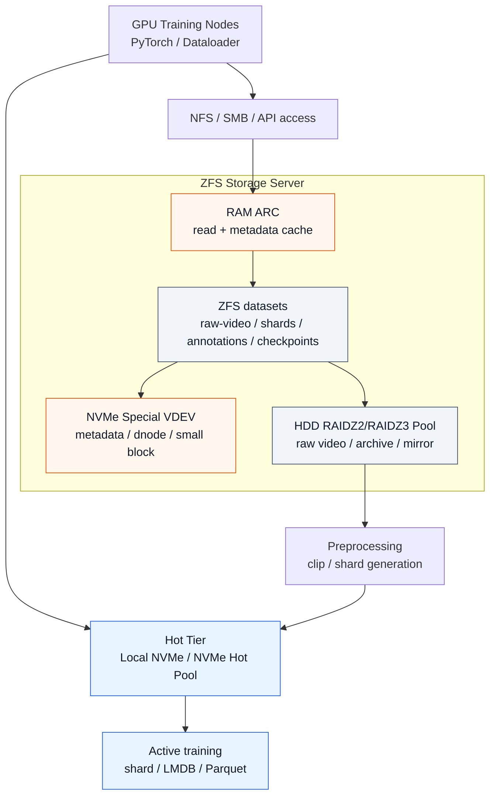
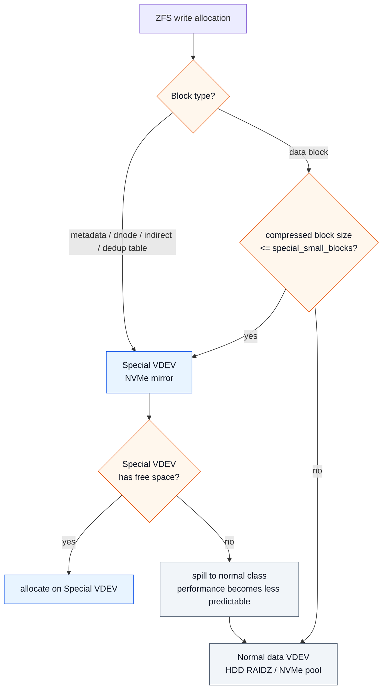
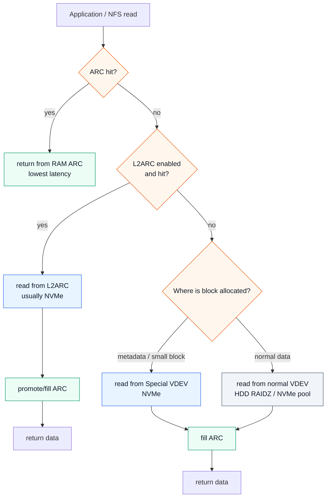
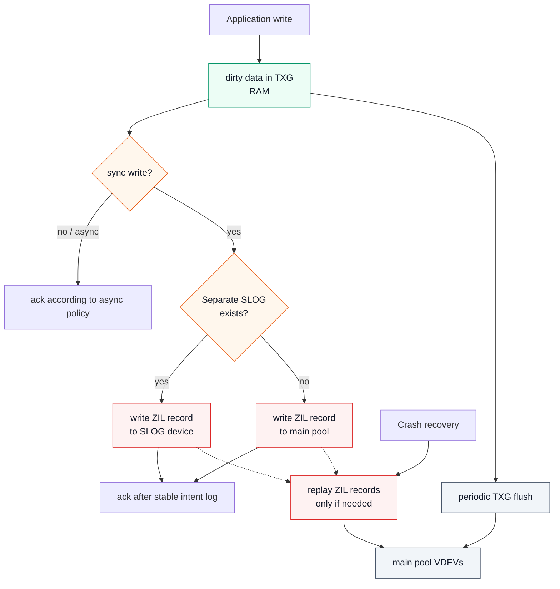
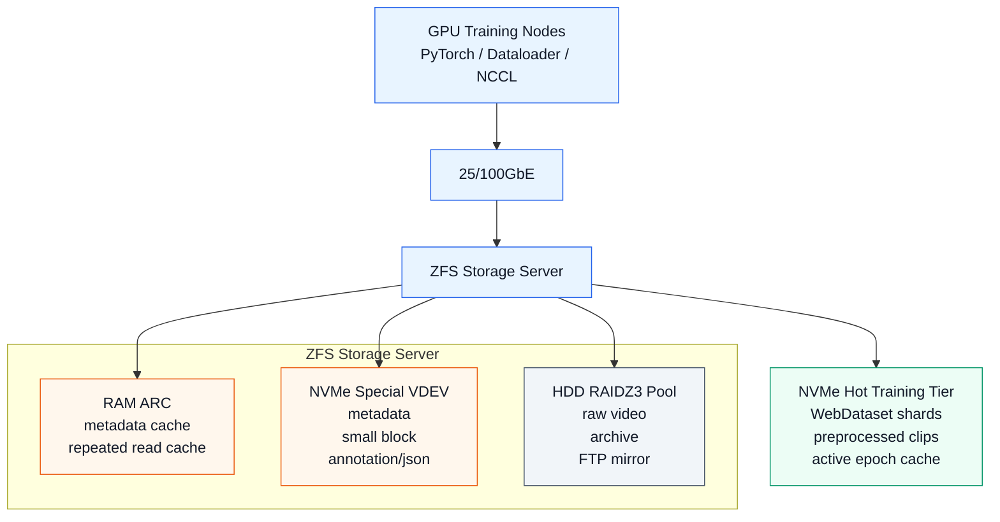
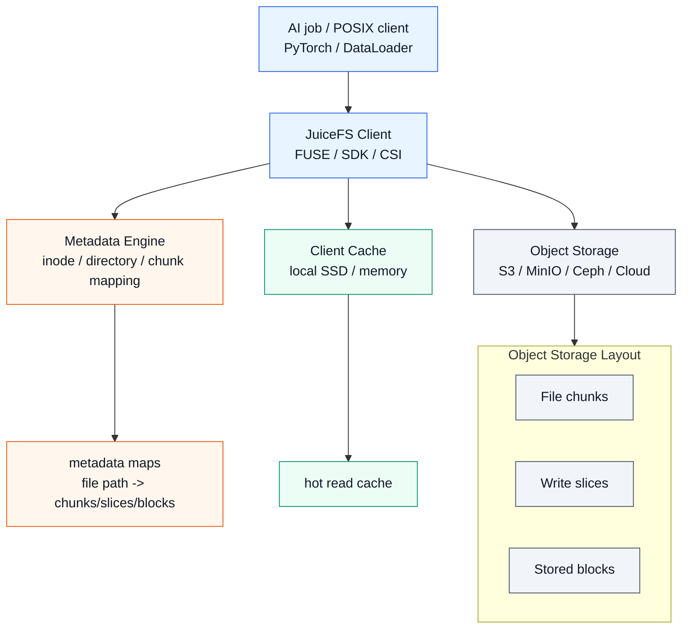

# AI 학습 워크로드를 위한 ZFS 튜닝 가이드

HDD + NVMe 기반 중소형 AI 스토리지 설계 기준

> 이 문서는 AI 연구실, 대학 FTP/미러 운영팀, 중소형 AI 기업, MLOps/Infra 엔지니어가 엔터프라이즈 스토리지를 바로 도입하기 어려운 상황에서 HDD + NVMe + OpenZFS로 AI 학습 워크로드를 어디까지 감당할 수 있는지 판단하고, 데이터셋 포맷, ZFS pool 설계, ARC/L2ARC/SLOG, NFS 운영 기준을 잡는 데 목적이 있다.

작성 기준: 2026년 5월

---

## 목차

- [빠른 의사결정 표](#빠른-의사결정-표)

1. [핵심 결론](#1-핵심-결론)
2. [AI 학습 워크로드의 I/O 특성](#2-ai-학습-워크로드의-io-특성)
3. [스토리지 계층 비교](#3-스토리지-계층-비교)
4. [ASUSTOR/Synology NAS, QNAP, DIY ZFS, Enterprise Storage 비교](#4-asustorsynology-nas-qnap-diy-zfs-enterprise-storage-비교)
5. [왜 AI 워크로드에서 HDD만으로는 부족한가?](#5-왜-ai-워크로드에서-hdd만으로는-부족한가)
6. [ZFS가 AI 워크로드에서 유리한 이유](#6-zfs가-ai-워크로드에서-유리한-이유)
7. [AI 학습용 권장 스토리지 아키텍처](#7-ai-학습용-권장-스토리지-아키텍처)
8. [규모별 권장 구성](#8-규모별-권장-구성)
   - [소규모](#81-소규모)
   - [중규모](#82-중규모)
   - [대규모](#83-대규모)
9. [AI 데이터셋 포맷 전략](#9-ai-데이터셋-포맷-전략)
10. [ZFS Pool 설계](#10-zfs-pool-설계)
    - [HDD Capacity Pool](#101-hdd-capacity-pool)
    - [NVMe Special VDEV](#102-nvme-special-vdev)
    - [NVMe Hot Pool](#103-nvme-hot-pool)
11. [Dataset 설계](#11-dataset-설계)
12. [ARC 튜닝](#12-arc-튜닝)
13. [L2ARC 판단](#13-l2arc-판단)
14. [SLOG와 sync 설정](#14-slog와-sync-설정)
15. [NFS / 네트워크 설계](#15-nfs--네트워크-설계)
16. [학습 파이프라인 권장 패턴](#16-학습-파이프라인-권장-패턴)
17. [모니터링](#17-모니터링)
18. [장애와 운영 주의사항](#18-장애와-운영-주의사항)
19. [규모별 최종 추천](#19-규모별-최종-추천)
20. [최종 아키텍처 예시](#20-최종-아키텍처-예시)
21. [부록: JuiceFS 참고](#21-부록-juicefs-참고)
22. [결론](#22-결론)

---

## 빠른 의사결정 표

| 상황 | 우선 선택 | 핵심 이유 |
| --- | --- | --- |
| GPU 1~2대, 데이터 수 TB~수십 TB | NAS/QNAP/TrueNAS + local NVMe | 운영 단순성, 학습은 local NVMe에서 처리 |
| GPU 2~8대, 데이터 100TB~수백 TB | HDD ZFS + NVMe Special VDEV | capacity와 metadata 가속의 균형 |
| 작은 파일 수백만 개, dataloader stall 발생 | shard화 + local/NVMe hot tier | metadata I/O와 random read 감소 |
| 여러 팀/다중 GPU 노드 active training | NVMe hot pool 또는 병렬 FS 검토 | 단일 ZFS/NFS head 병목 가능성 |
| PB급 active dataset 또는 센터급 운영 | Lustre/GPFS/WEKA/Pure/ESS 계열 | scale-out metadata/data path 필요 |
| S3/MinIO/Ceph 기반 데이터 레이크 보유 | JuiceFS 검토 | object storage를 POSIX/shared filesystem으로 노출 |

> [!TIP]
> 이 표는 초기 판단용이다. 최종 선택은 실제 dataloader, GPU 노드 수, NFS latency, metadata scan, checkpoint write burst를 측정해서 결정해야 한다.

---

## 1. 핵심 결론

AI 학습 스토리지 관점에서 스토리지 계층은 대략 다음 순서로 볼 수 있다.

```text
일반 NAS
< HDD 기반 ZFS + NVMe Special VDEV
< NVMe-heavy ZFS
< GPFS / Lustre / WEKA / IBM ESS / Pure FlashBlade 계열
```

이 분류가 중요한 이유는, AI 학습 워크로드에서는 단순히 “200TB 저장 가능”보다 다음 요소가 더 중요하기 때문이다.

- GPU가 기다리지 않을 정도의 지속 읽기 성능
- 수많은 파일 open/stat을 처리하는 metadata 성능
- small random read 성능
- 여러 학습 노드의 동시 접근 처리 능력
- dataset scan / rsync / preprocessing / checkpoint 처리 능력
- 장애 발생 시 데이터 무결성과 복구 가능성

일반 NAS는 운영 편의성은 좋지만, AI 학습용 active storage로는 한계가 빠르게 드러난다.
반면 OpenZFS는 HDD의 약점인 metadata/random I/O를 RAM ARC와 NVMe Special VDEV로 보완할 수 있어서, 연구실이나 중소형 기업에게 현실적인 중간 지점이 된다.

다만 중요한 전제가 있다.

```text
HDD ZFS는 AI 학습용 고속 스토리지라기보다는,
NVMe와 데이터셋 포맷 최적화를 결합했을 때 쓸 만한
저비용 capacity + metadata-accelerated storage에 가깝다.
```

즉, **HDD는 원본/대용량 보관**, **NVMe는 hot data와 metadata**, **GPU 학습은 가능하면 local NVMe 또는 NVMe-heavy tier**에서 돌리는 구조가 가장 현실적이다.

> [!TIP]
> 이 문서의 핵심 판단 기준은 “HDD는 capacity tier, NVMe는 metadata/hot tier, 학습 데이터는 shard + NVMe”로 요약할 수 있다.

---

## 2. AI 학습 워크로드의 I/O 특성

AI 학습 스토리지는 일반 파일 서버와 다르다.

일반 NAS 워크로드는 대체로 다음과 같다.

```text
- 문서 열기
- 파일 공유
- 백업
- 영상 저장
- 간헐적 다운로드
```

반면 AI 학습 워크로드는 다음과 같다.

```text
- dataloader worker가 동시에 파일 open
- 수천~수백만 개 파일 stat
- epoch마다 반복적인 dataset scan
- 작은 이미지/라벨/JSON 반복 읽기
- 영상 clip random seek
- preprocessing job의 대량 read/write
- checkpoint의 burst write
- 여러 GPU 서버의 동시 NFS 접근
```

여기서 병목은 보통 순수 디스크 용량이 아니라 다음 순서로 발생한다.

```text
1. metadata IOPS
2. small random read
3. HDD seek latency
4. NFS server CPU
5. network bandwidth
6. directory traversal
7. Python dataloader 병렬성
8. preprocessing decode CPU
```

그래서 AI 스토리지에서는 “몇 TB냐”보다 다음 질문이 더 중요하다.

```text
- 초당 몇 개의 파일을 열 수 있는가?
- 초당 몇 GB를 지속적으로 읽을 수 있는가?
- 여러 GPU 노드가 동시에 읽어도 latency가 무너지지 않는가?
- metadata scan이 빠른가?
- checkpoint write가 학습 read를 방해하지 않는가?
```

> [!TIP]
> 스토리지 벤치마크는 `fio` sequential throughput만 보면 부족하다. 실제 dataloader로 `open/stat/read` 패턴을 재현하고, 동시에 `iostat -x`, `pidstat`, `nfsstat`, GPU utilization, dataloader wait time을 같이 봐야 한다. “디스크는 한가한데 GPU가 쉰다”면 스토리지 대역폭이 아니라 metadata latency, Python worker, decode CPU, NFS server CPU가 병목일 수 있다.

---

## 3. 스토리지 계층 비교

| 계층                              | 예시                                                    | 적합한 용도                                             | 한계                   |
| ------------------------------- | ----------------------------------------------------- | -------------------------------------------------- | -------------------- |
| 일반 NAS                          | ASUSTOR/Synology/QNAP 일부 모델                            | 사내 파일 공유, 백업, 소규모 연구 데이터                           | AI 학습 active I/O에 약함 |
| ZFS NAS Appliance               | QNAP QuTS hero, TrueNAS Appliance                     | ZFS 기반 NAS, snapshot, 무결성, 중소규모 연구 스토리지            | 제품 설계와 GUI 정책에 묶임    |
| DIY HDD ZFS + NVMe Special VDEV | Supermicro/일반 서버 + HDD + NVMe + OpenZFS               | 연구실/중소기업의 대용량 AI dataset, FTP mirror, NFS          | 운영자가 직접 설계/장애 대응 필요  |
| NVMe-heavy ZFS                  | All-NVMe 또는 NVMe mirror/RAIDZ                         | active training dataset, small file-heavy workload | 비용 증가, scale-out 한계  |
| 병렬/엔터프라이즈 스토리지                  | GPFS/IBM Storage Scale, Lustre, WEKA, Pure FlashBlade | 대규모 GPU 클러스터, HPC, 기관급 AI센터                        | 비용과 운영 난이도 높음        |

ASUSTOR 계열은 Btrfs snapshot 중심의 관리 편의성이 강하고, QNAP QuTS hero는 ZFS 기반 OS로 데이터 무결성, SSD 활용, HDD+SSD hybrid 구성을 강조한다. QNAP은 QuTS hero를 ZFS 기반 OS로 설명하며 HDD+SSD hybrid storage와 데이터 무결성을 주요 장점으로 내세우고 있다. ([QNAP NAS][1])

Pure FlashBlade, WEKA, IBM Storage Scale 계열은 단순 NAS가 아니라 AI/HPC용 고성능 파일/오브젝트 또는 병렬 파일시스템 계열이다. Pure는 FlashBlade를 scale-out file/object storage로 설명하고, WEKA는 AI/ML/HPC 파이프라인을 위한 고성능 데이터 플랫폼을 강조하며, IBM Storage Scale은 대규모 데이터셋과 AI 학습/추론을 위한 병렬 파일시스템 성격을 가진다. ([purestorage.com][2])

> [!NOTE]
> 제품군 이름보다 중요한 것은 실제 workload 검증이다. 같은 “10GbE NAS”라도 CPU, RAM, filesystem, NFS 구현, SSD cache 정책, snapshot 상태에 따라 AI 학습 성능은 크게 달라진다. 도입 전에는 대표 dataset, 실제 dataloader worker 수, 실제 GPU 노드 수로 PoC를 진행하는 것이 가장 안전하다.

---

## 4. ASUSTOR/Synology NAS, QNAP, DIY ZFS, Enterprise Storage 비교

핵심 판단 기준은 다음과 같다.

```text
운영 편의성 중심이면 NAS.
데이터 무결성과 튜닝 중심이면 ZFS.
GPU utilization을 지속적으로 유지해야 하면 NVMe-heavy 또는 병렬 파일시스템.
```

| 항목                 | ASUSTOR/Synology NAS | QNAP QuTS hero   | DIY OpenZFS          | Pure / WEKA / IBM / Lustre |
| ------------------ | --------------------- | ---------------- | -------------------- | -------------------------- |
| 운영 난이도             | 낮음                    | 중간               | 중간~높음                | 높음                         |
| 파일시스템              | Btrfs/ext4 계열         | ZFS              | OpenZFS              | 전용/병렬/분산 FS                |
| AI active training | 약함                    | 제한적 가능           | 구성에 따라 가능            | 강함                         |
| metadata 성능        | 제한적                   | SSD/ZFS 기능 활용 가능 | Special VDEV로 직접 최적화 | scale-out metadata 구조      |
| small file 성능      | 제한적                   | 모델별 차이           | NVMe tier로 개선 가능     | 강함                         |
| 확장성                | 베이/확장유닛 제한            | 제품군 제한           | scale-up 중심          | scale-out                  |
| 비용                 | 낮음~중간                 | 중간               | 중간                   | 높음                         |
| 적합 조직              | 소규모 팀/일반 사내           | 중소기업/연구실         | 기술 인력 있는 연구실/기업      | 대형 연구소/HPC/AI센터            |
| 핵심 장점              | 편의성                   | ZFS appliance    | 튜닝 자유도/비용 효율         | 성능/확장성/지원                  |
| 핵심 약점              | AI I/O 한계             | 벤더 제약            | 운영 책임                | 비용                         |


> [!TIP]
> NAS appliance를 선택하더라도 “편의성”과 “성능”을 분리해서 판단하는 것이 좋다. GUI snapshot, 사용자 관리, SMB/NFS 공유는 NAS가 편하지만, active training path는 local NVMe나 별도 NVMe hot tier로 분리하면 작은 장비에서도 체감 성능이 훨씬 안정적이다.

---

## 5. 왜 AI 워크로드에서 HDD만으로는 부족한가?

HDD는 여전히 TB당 비용이 가장 낮고, 대용량 영상 원본 저장에는 적합하다.
하지만 AI 학습에서는 HDD의 약점이 바로 드러난다.

HDD가 잘하는 것:

```text
- 대용량 저장
- 큰 파일 순차 읽기
- archive / cold data 보관
- FTP mirror / raw video 저장
```

HDD가 취약한 것:

```text
- 수많은 파일 open/stat
- small random read
- random seek
- directory traversal
- 여러 worker의 동시 접근
```

영상 학습에서도 데이터 포맷에 따라 차이가 크다.

### HDD로도 가능한 경우

```text
- 큰 mp4/tar/parquet/webdataset shard를 순차적으로 읽는 경우
- preprocessing job이 sequential read 중심인 경우
- active 학습 전에 local NVMe로 stage-in 하는 경우
```

### HDD가 병목이 되는 경우

```text
- 수백만 개 jpg/png 프레임
- 작은 JSON annotation 다수
- NFS 위에서 ffmpeg random seek
- 여러 GPU 노드가 동시에 원본 영상 직접 decode
- epoch마다 전체 directory tree scan
```

따라서 HDD ZFS를 AI 학습에 쓰려면, HDD를 “직접 학습용 고속 tier”로 보기보다 **capacity tier**로 보고 설계해야 한다.

> [!TIP]
> “큰 파일이면 HDD에서 괜찮다”도 접근 패턴이 순차적일 때의 이야기다. mp4라도 많은 worker가 서로 다른 offset을 random seek하면 HDD seek가 누적된다. 반대로 tar/WebDataset shard처럼 큰 파일이어도 worker별 shard 범위를 잘 나누면 HDD와 readahead가 훨씬 예측 가능하게 동작한다.

---

## 6. ZFS가 AI 워크로드에서 유리한 이유

ZFS의 장점은 단순히 “RAID가 좋다”가 아니다.
AI 워크로드에서는 다음 기능들이 특히 중요하다.

```text
- ARC: RAM 기반 read/metadata cache
- Special VDEV: metadata와 일부 small block을 NVMe로 분리
- Dataset별 recordsize 조정
- Dataset별 compression/atime/sync 정책 분리
- Snapshot/clone
- End-to-end checksum
- Scrub을 통한 silent corruption 탐지
- HDD capacity tier + NVMe performance tier 조합
```

OpenZFS의 Special Allocation Class는 기본적으로 metadata, indirect block, dedup table 등을 special class에 배치하고, dataset별 `special_small_blocks` 설정을 통해 작은 데이터 블록도 special class에 배치할 수 있다. ([OpenZFS][3])

AI 학습 스토리지에서는 이 구조가 매우 중요하다.

```text
대용량 영상 원본       → HDD RAIDZ2/RAIDZ3
metadata / inode       → NVMe Special VDEV
label / json / small   → NVMe Special VDEV
현재 학습 shard        → NVMe-only dataset 또는 local NVMe
```

즉, HDD의 용량 경제성과 NVMe의 metadata/random I/O 성능을 결합하는 구조다.

> [!WARNING]
> Snapshot과 checksum은 백업을 대체하지 않는다. ZFS는 silent corruption 탐지와 rollback에는 강하지만, 운영자 실수, pool 전체 장애, ransomware, 잘못된 `zfs destroy`까지 단독으로 해결해 주지는 않는다. 중요한 연구 데이터는 별도 pool, 별도 서버, 또는 object storage로 복제해야 한다.

---

## 7. AI 학습용 권장 스토리지 아키텍처

가장 현실적인 구조는 3-tier다.

```text
[Cold / Capacity Tier]
HDD RAIDZ2/RAIDZ3 ZFS
- 원본 영상
- 오래된 dataset
- FTP mirror
- 재생성 가능한 데이터
- 장기 보관 데이터

[Warm / Metadata + Small File Tier]
NVMe Special VDEV
- metadata
- inode/dnode
- directory lookup
- label/json
- small block
- thumbnail

[Hot / Active Training Tier]
Local NVMe 또는 NVMe-only ZFS dataset
- 현재 학습 shard
- preprocessed clip
- WebDataset tar
- LMDB / Parquet / Arrow
- 임시 cache
```

구조를 도식화하면 다음과 같다.



운영 흐름은 이렇게 잡는 게 좋다.

```text
1. Raw video는 HDD ZFS에 저장
2. Annotation/metadata는 Special VDEV 효과를 받도록 dataset 분리
3. 학습 전 preprocessing으로 shard 생성
4. 현재 epoch/training set은 local NVMe 또는 NVMe-heavy tier로 stage-in
5. 학습 결과/checkpoint는 별도 dataset에 저장
6. 오래된 checkpoint와 raw data는 HDD tier로 이동
```

> [!TIP]
> dataset은 성능 tier뿐 아니라 보존 정책 단위로도 나누는 것이 좋다. `raw-video`, `preprocessed`, `dataset-shards`, `checkpoints`, `scratch`를 분리하면 recordsize, snapshot retention, compression, sync 정책을 각각 다르게 줄 수 있고, 장애 대응도 쉬워진다.

---

## 8. 규모별 권장 구성

### 8.1 소규모

대상:

```text
- 개인 연구자 또는 소규모 연구실/스타트업
- GPU 서버 1~2대
- 총 GPU 1~8장
- 데이터셋 수 TB~수십 TB
- 10GbE 수준
- 전담 스토리지 엔지니어 없음
```

권장:

```text
- ASUSTOR/Synology/QNAP 같은 일반 NAS 가능
- QNAP/TrueNAS 또는 간단한 ZFS 서버 가능
- active training은 GPU 서버 local NVMe 사용
- NAS/ZFS는 raw data와 백업 저장소로 사용
- 학습 hot path의 작은 파일은 shard화 권장
```

구성 예시:

```text
GPU Server
  - Local NVMe 4~16TB
  - 학습용 hot dataset 저장

NAS/ZFS
  - HDD RAID6/RAIDZ2
  - raw video / backup / dataset archive
  - 10GbE
```

이 규모에서는 굳이 복잡한 Special VDEV까지 가지 않아도 된다.
하지만 파일 수가 많거나 rsync scan이 잦으면 NVMe Special VDEV가 체감될 수 있다.

> [!TIP]
> 소규모에서는 가장 효과 좋은 최적화가 “학습 전 local NVMe로 복사”인 경우가 많다. NAS에는 원본과 archive를 두고, 학습 job 시작 시 manifest/checksum을 기준으로 필요한 shard만 local NVMe에 stage-in하면 비용 대비 안정성이 좋다.

---

### 8.2 중규모

대상:

```text
- 중소형 AI 기업, 큰 연구실, FTP/package mirror 운영팀
- GPU 서버 2~8대
- 총 GPU 8~64장
- 데이터셋 100TB~수백 TB
- archive/mirror 중심이면 1PB 근처까지 가능
- 10/25GbE, 다중 노드 학습은 100GbE 검토
- MLOps/Infra 담당자 있음
- 여러 연구팀 또는 학습 job이 동시에 사용
```

권장:

```text
- DIY OpenZFS 서버 권장
- HDD RAIDZ2/RAIDZ3 + NVMe Special VDEV
- RAM 128~512GB
- 25GbE 이상 권장
- active dataset은 NVMe stage-in
- 규모가 커지면 별도 NVMe-only hot pool 검토
- read-only mirror dataset과 active training dataset 분리
- dataset format은 WebDataset/Parquet/Arrow/LMDB 권장
- Prometheus/Grafana 모니터링 권장
- 장애 대응 runbook 필요
```

구성 예시:

```text
Storage Server
  - HDD 16~72개
  - RAIDZ3 vdev 2~6개
  - Enterprise NVMe Special VDEV 3-way mirror
  - RAM 256GB+
  - 25/100GbE NIC
  - OpenZFS

GPU Nodes
  - Local NVMe cache
  - NFS mount
  - training job 시작 전 stage-in

NVMe Hot Pool
  - 필요 시 NVMe mirror 또는 RAIDZ
  - active training shard
  - preprocessing output
```

이 규모가 **HDD + NVMe ZFS의 sweet spot**이다.
IBM ESS나 WEKA를 살 정도는 아니지만, 일반 NAS로는 부족한 상황이다.
다만 GPU 서버가 8대 이상이거나 FTP mirror처럼 여러 사용자가 동시에 붙는 경우에는 단일 ZFS head의 CPU, metadata 처리량, NFS 처리량, NIC 사용률을 계속 측정해야 한다.

> [!IMPORTANT]
> 중규모의 상한은 용량보다 동시성으로 결정된다. 1PB에 가까운 archive/mirror는 ZFS로 운영할 수 있어도, 여러 GPU 노드가 동시에 active training을 수행하면 단일 ZFS/NFS head가 먼저 병목이 될 수 있다.

> [!TIP]
> 중규모부터는 “빠른가?”보다 “얼마나 느려지면 장애로 볼 것인가?”를 먼저 정하는 편이 좋다. 예를 들어 dataloader wait time, NFS p95 latency, Special VDEV 사용률, checkpoint write 시간, scrub 중 성능 저하폭을 기준으로 내부 SLO를 잡아두면 증설 시점을 훨씬 빨리 판단할 수 있다.

---

### 8.3 대규모

대상:

```text
- 학과/센터급 공용 스토리지
- 대형 AI 센터 또는 HPC급 환경
- GPU 서버 수십 대 이상
- 총 GPU 수십~수백 장
- PB급 active dataset 또는 PB급 archive + 높은 동시성
- 다수 사용자가 동시에 학습
- checkpoint burst write 큼
- 단일 NFS/ZFS head로 감당하기 어려움
```

권장:

```text
- ZFS는 archive/capacity tier로 사용
- active training path는 병렬 파일시스템 또는 scale-out storage 검토
- IBM Storage Scale / GPFS
- Lustre
- WEKA
- Pure FlashBlade
- VAST / DDN 계열
- Object storage + high-performance cache layer
```

전환 기준:

```text
- 대규모 초입에서는 다중 vdev ZFS + Special VDEV + NVMe hot pool로 일정 수준까지 대응할 수 있다.
- 하지만 active training을 여러 GPU 노드가 동시에 수행하면 단일 ZFS/NFS head가 병목이 된다.
- 이 시점부터는 단일 ZFS/NFS head를 전제로 설계하기보다 병렬 파일시스템 또는 scale-out storage로 넘어가야 한다.
```

IBM Storage Scale은 concurrent data access와 대규모 병렬 파일시스템 성격을 제공하고, AI 학습/시뮬레이션/대규모 데이터셋 처리를 위한 고성능 접근을 강조한다. Lustre는 HPC 환경에서 널리 쓰이는 오픈소스 병렬 파일시스템으로, 대규모 Linux 클러스터용 고성능 shared filesystem으로 설명된다. ([IBM][4])

이 단계에서는 OpenZFS 단일 서버를 기본 전제로 잡지 않는 편이 안전하다.
ZFS는 여전히 archive/capacity tier로 쓸 수 있지만, active training path는 병렬 파일시스템이 더 적합하다.

> [!TIP]
> 대규모에서는 checkpoint path와 dataset read path를 분리하는 것이 중요하다. 수십~수백 GPU가 동시에 checkpoint를 쓰면 read-heavy 학습 workload와 write burst가 충돌한다. 가능하면 checkpoint 전용 namespace, 별도 pool, object storage, 또는 병렬 FS의 별도 policy를 둔다.

---

## 9. AI 데이터셋 포맷 전략

ZFS 튜닝보다 더 중요한 것이 데이터셋 포맷이다.

피해야 할 구조:

```text
/dataset/
  video001/
    frame000001.jpg
    frame000002.jpg
    ...
    label000001.json
  video002/
    frame000001.jpg
    ...
```

이 구조는 metadata I/O 병목을 크게 만든다.

> [!TIP]
> Metadata I/O 병목은 보통 “디스크 대역폭이 부족하다”보다 “작은 작업이 너무 많이 발생해 latency와 queue가 누적된다”에 가깝다. 이때 서버에서는 `iowait`이 증가하고, GPU 서버에서는 dataloader worker가 file open/stat/read를 기다리면서 GPU utilization이 흔들린다.
>
> SSD를 붙였다고 항상 해결되는 것도 아니다. 작은 파일 생성/삭제, metadata update, checkpoint write가 섞이면 SSD 입장에서는 mixed read/write workload가 되고, 내부 GC, write amplification, SLC cache 소진, spare area 부족이 tail latency를 키울 수 있다. DRAM-less consumer SSD나 QLC SSD는 이런 상황에서 성능 편차가 커질 수 있으므로, metadata tier에는 PLP가 있는 enterprise NVMe, 충분한 over-provisioning, 안정적인 sustained write 성능이 더 중요하다. TLC + DRAM + PLP 조합은 이런 mixed workload에서 예측 가능성이 상대적으로 좋다.
>
> 소프트웨어 레벨의 우회 방법도 있다. 병렬 worker가 작은 파일을 동시에 쓰는 구조라면 각 worker가 filesystem에 직접 작은 쓰기를 반복하지 않도록, producer-consumer queue나 ring buffer를 두어 write를 batch화하거나 shard writer가 순차적으로 묶어 쓰게 만들 수 있다. 예를 들어 frame/label을 바로 수백만 파일로 쓰지 않고, 메모리 또는 local NVMe ring buffer에 모은 뒤 tar/WebDataset/Parquet/LMDB 단위로 flush하면 metadata update 횟수와 fsync 압력을 줄일 수 있다.
>
> 다만 ring buffer는 근본적인 스토리지 성능 개선책이 아니라 backpressure와 write coalescing을 위한 완충 장치다. 장애 시 유실 가능한 데이터인지, flush 주기, checkpoint 일관성, 재시작 시 복구 절차를 같이 설계해야 한다.

권장 구조:

```text
/dataset-shards/
  train-000000.tar
  train-000001.tar
  train-000002.tar
  ...
```

또는:

```text
/dataset/
  train.parquet
  train.arrow
  train.lmdb
```

영상 학습이면:

```text
/raw-video/
  original_video_001.mp4
  original_video_002.mp4

/preprocessed/
  clip-shard-000001.tar
  clip-shard-000002.tar
  frame-shard-000001.tar
```

권장 포맷:

| 데이터 유형     | 권장 포맷                                       |
| ---------- | ------------------------------------------- |
| 이미지 다수     | WebDataset tar shard                        |
| 영상 clip    | tar shard / chunked mp4 / preprocessed clip |
| annotation | Parquet / Arrow / SQLite / LMDB             |
| metadata   | Parquet / DB                                |
| checkpoint | 큰 파일 단위, 별도 dataset                         |
| raw video  | HDD capacity pool                           |

핵심 원칙은 다음과 같다.

> [!TIP]
> 작은 파일 수백만 개를 그대로 학습하지 말고, 학습 전 shard로 묶어야 한다.

이렇게 해야 HDD ZFS에서도 metadata 병목과 random I/O 부담을 줄일 수 있다.

---

## 10. ZFS Pool 설계

### 10.1 HDD Capacity Pool

AI 영상 데이터셋 기준으로는 RAIDZ2보다 RAIDZ3가 더 안전하다.
특히 16TB 이상 HDD를 다수 사용할 경우 resilver 시간이 길어질 수 있기 때문이다.

예시:

> [!WARNING]
> 아래 명령은 구조 예시다. 실제 장비에서는 디스크 이름, sector size, redundancy, spare, 백업 상태를 확인한 뒤 실행해야 한다.

아래 예시는 4K sector HDD를 전제로 한 예시다.
실제 장비에서는 `lsblk -t` 등으로 물리 sector와 optimal I/O size를 확인한 뒤 `ashift`를 결정해야 한다.

```bash
zpool create -o ashift=12 \
  -O compression=lz4 \
  -O atime=off \
  -O xattr=sa \
  -O dedup=off \
  ai-pool \
  raidz3 hdd1 hdd2 hdd3 hdd4 hdd5 hdd6 hdd7 hdd8 \
  raidz3 hdd9 hdd10 hdd11 hdd12 hdd13 hdd14 hdd15 hdd16
```

권장:

```text
- 물리 sector 확인 후 ashift=12, 8Kn/일부 SSD는 ashift=13 검토
- RAIDZ3 for large HDD pool
- vdev는 8~12 disks 단위 권장
- 2개 이상 vdev로 병렬성 확보
- pool capacity 80% 이상 사용 금지
- dedup은 명확한 근거가 없으면 off 유지
```

> [!TIP]
> RAIDZ vdev 폭은 “용량 효율”과 “장애 복구 시간”의 타협이다. 너무 넓은 vdev는 효율은 좋지만 resilver와 scrub 시간이 길어지고, 장애 중 두 번째 문제가 생겼을 때 대응 시간이 줄어든다. 큰 pool은 처음부터 vdev 1개를 크게 만드는 것보다 적당한 폭의 vdev를 여러 개 두는 편이 병렬성과 운영 안정성 면에서 유리하다.

---

### 10.2 NVMe Special VDEV

Special VDEV는 캐시가 아니다.
실제 metadata/small block allocation class다.
Special VDEV에는 pool metadata와, 설정에 따라 작은 데이터 블록이 실제로 배치된다.
따라서 Special VDEV 장애는 단순 성능 저하가 아니라 pool 전체 가용성 문제로 이어질 수 있다.

> [!IMPORTANT]
> Special VDEV는 “빠른 캐시”가 아니라 pool의 실제 저장 구성 요소다. 추가 전에는 백업, NVMe redundancy, PLP, 용량 산정, 장애 대응 절차를 먼저 확인해야 한다.
> 또한 나중에 Special VDEV를 추가해도 기존 block이 자동으로 NVMe로 이동하지는 않으므로, 신규 allocation 중심으로 효과가 나타난다.

추가 전 확인:

```text
- 전체 백업 또는 복구 가능한 원본 확보
- Enterprise NVMe와 PLP 사용
- HDD pool과 동등하거나 더 높은 redundancy 구성
- metadata 예상량 + small block 예상량 + 여유율 산정
- Special VDEV 사용률과 남은 용량을 모니터링할 방법 확보
- 기존 데이터에 대한 효과 범위와 재작성 필요 여부 확인
```

권장:

```bash
zpool add ai-pool special mirror nvme1 nvme2 nvme3
```

최소:

```bash
zpool add ai-pool special mirror nvme1 nvme2
```

권장 원칙:

```text
- Enterprise NVMe 사용
- PLP 지원 권장
- 3-way mirror 권장
- consumer NVMe 단독 사용 금지
- Special VDEV 용량 모니터링 필수
- Special VDEV 용량이 부족하면 성능 예측이 어려워짐
```

Special VDEV에는 기본적으로 metadata가 들어가고, `special_small_blocks`를 설정하면 작은 데이터 블록도 들어간다. OpenZFS 문서에 따르면 `special_small_blocks`는 compression/encryption 후 지정 크기 이하의 block을 special allocation class에 배치한다. ([OpenZFS][5])
Special class가 가득 차면 해당 class로 가야 할 allocation이 normal class로 spill될 수 있으므로, `special_small_blocks` 값은 성능 목표뿐 아니라 NVMe 용량과 장애 여유까지 보고 정해야 한다.

Special VDEV의 allocation 경로는 다음처럼 이해하면 된다.



---

### 10.3 NVMe Hot Pool

active training dataset은 가능하면 별도 NVMe pool로 분리하는 것이 좋다.

예시:

```bash
zpool create -o ashift=12 \
  -O compression=lz4 \
  -O atime=off \
  -O dedup=off \
  nvme-hot \
  mirror nvmeA nvmeB \
  mirror nvmeC nvmeD
```

용도:

```text
- 현재 학습 shard
- preprocessing 결과
- temporary cache
- small file-heavy dataset
```

이 구조가 Special VDEV보다 명확할 때도 많다.

```text
Special VDEV:
HDD pool의 metadata/small block 가속

NVMe Hot Pool:
학습 데이터를 아예 NVMe에 올림
```

active training이 많으면 NVMe Hot Pool이 더 직관적이다.

> [!TIP]
> NVMe hot pool은 cache처럼 보이지만, 운영상으로는 “짧은 수명의 별도 storage tier”로 다루는 편이 좋다. eviction 정책, 최대 사용량, job 종료 후 cleanup, 재생성 가능 여부를 정해두지 않으면 hot pool이 가득 차서 오히려 학습 job이 실패한다.

---

## 11. Dataset 설계

권장 dataset 구조:

```bash
zfs create ai-pool/raw-video
zfs create ai-pool/dataset-shards
zfs create ai-pool/annotations
zfs create ai-pool/checkpoints
zfs create ai-pool/mirror
zfs create nvme-hot/train-cache
zfs create nvme-hot/preprocessed
```

> [!TIP]
> dataset 이름에는 데이터 성격과 수명 주기를 드러내는 편이 좋다. 예를 들어 `raw-*`, `shard-*`, `scratch-*`, `checkpoint-*`처럼 이름만 봐도 snapshot, backup, cleanup 정책을 예상할 수 있으면 운영자가 바뀌어도 실수가 줄어든다.

속성 예시:

```bash
# 원본 영상: 큰 파일 중심
zfs set recordsize=1M ai-pool/raw-video
zfs set special_small_blocks=0 ai-pool/raw-video
zfs set dedup=off ai-pool/raw-video

# 학습 shard: 큰 sequential read 중심
zfs set recordsize=1M ai-pool/dataset-shards
zfs set special_small_blocks=16K ai-pool/dataset-shards
zfs set dedup=off ai-pool/dataset-shards

# annotation: 작은 파일/메타데이터 중심
zfs set recordsize=128K ai-pool/annotations
zfs set special_small_blocks=64K ai-pool/annotations
zfs set dedup=off ai-pool/annotations

# checkpoint: 큰 파일, 중요 데이터
zfs set recordsize=1M ai-pool/checkpoints
zfs set sync=standard ai-pool/checkpoints
zfs set dedup=off ai-pool/checkpoints

# FTP/package mirror: 재생성 가능 데이터
zfs set recordsize=1M ai-pool/mirror
zfs set special_small_blocks=64K ai-pool/mirror
zfs set dedup=off ai-pool/mirror

# NVMe active training cache
zfs set recordsize=1M nvme-hot/train-cache
zfs set atime=off nvme-hot/train-cache
zfs set dedup=off nvme-hot/train-cache
```

recordsize는 파일 접근 패턴에 따라 조정해야 한다. Oracle ZFS 문서는 `recordsize`가 파일시스템의 suggested block size이며, fixed-size record 접근을 하는 데이터베이스나 큰 파일의 특정 접근 패턴에서 조정 효과가 있을 수 있다고 설명한다. ([Oracle Docs][6])

> [!NOTE]
> `recordsize`를 바꿔도 기존 파일의 block layout이 자동으로 다시 쓰이지 않는다. 설정 변경은 이후 새로 쓰이는 데이터에 주로 적용된다. 이미 적재된 dataset의 layout을 바꾸려면 재복사, send/receive, rewrite 같은 재작성 절차를 별도로 계획해야 한다.

AI dataset에서는 dedup을 기본적으로 끄는 편이 안전하다.
중복 제거 효과가 명확히 검증되지 않은 상태에서 dedup을 켜면 DDT와 metadata 부담이 커져 ARC, Special VDEV, 메모리 사용량을 압박할 수 있다.
중복 제거가 필요하면 별도 테스트 pool에서 dedup ratio와 메모리 사용량을 먼저 측정해야 한다.

> [!WARNING]
> AI dataset에서 dedup은 기본값처럼 켜는 기능이 아니다. dedup ratio가 충분히 높다는 측정 결과와 메모리 여유가 모두 있을 때만 별도로 검토한다.

AI에서는 일반적으로 다음 기준이 현실적이다.

| Dataset           |        recordsize | special_small_blocks |
| ----------------- | ----------------: | -------------------: |
| raw-video         |                1M |                    0 |
| WebDataset tar    |                1M |                0~16K |
| Parquet/Arrow     | 1M 또는 128K~1M 테스트 |                0~16K |
| annotation JSON   |              128K |              16K~64K |
| small image files |         128K~256K |              32K~64K |
| checkpoint        |                1M |                    0 |
| FTP mirror        |                1M |              16K~64K |

---

## 12. ARC 튜닝

ARC는 ZFS 성능의 핵심이다.

AI 워크로드에서는 ARC가 다음에 도움을 준다.

```text
- 반복 epoch의 metadata cache
- directory traversal cache
- small file read cache
- dataloader 반복 접근
- rsync scan
```

ARC와 L2ARC의 read path는 다음과 같이 볼 수 있다.



권장 RAM:

| 규모                      |       RAM |
| ----------------------- | --------: |
| 소규모                     |  64~128GB |
| 중규모                     | 128~512GB |
| 대규모 metadata-heavy serving | 512GB 이상 |
| metadata-heavy workload |   많을수록 유리 |

archive/capacity 전용 ZFS라면 RAM 요구량은 낮아질 수 있다.
반대로 active NFS serving, 수많은 파일 lookup, rsync scan, Special VDEV 활용이 많으면 같은 용량이라도 RAM을 더 넉넉히 잡는 것이 좋다.

예시:

```bash
# RAM 256GB 서버에서 ARC 160GB 제한
cat >/etc/modprobe.d/zfs.conf <<'EOF'
options zfs zfs_arc_max=171798691840
EOF
```

모니터링:

```bash
arc_summary
arcstat 1
```

중요 지표:

```text
- ARC hit ratio
- Metadata hit ratio
- Dnode cache hit
- ARC size / target size
- MFU/MRU 비율
```

AI 학습에서는 전체 hit ratio보다 **metadata hit ratio**와 **dataloader stall 여부**가 더 중요하다.

> [!NOTE]
> ARC를 크게 잡을수록 항상 좋은 것은 아니다. NFS server, page cache, monitoring agent, backup job, 압축/체크섬 처리도 메모리를 쓴다. `zfs_arc_max`를 너무 공격적으로 잡으면 ZFS는 좋아 보여도 OS 전체 latency가 흔들릴 수 있으므로, 실제 부하에서 memory pressure와 swap 사용 여부를 같이 본다.

---

## 13. L2ARC 판단

L2ARC는 무조건 넣는 장치가 아니다.

L2ARC가 도움이 되는 경우:

```text
- RAM보다 working set이 크다
- 동일 데이터셋을 반복 학습한다
- random read가 반복된다
- NVMe를 cache로 쓸 여유가 있다
```

도움이 제한적인 경우:

```text
- 한 번 읽고 버리는 sequential workload
- 이미 local NVMe stage-in을 한다
- Special VDEV가 metadata 병목을 해결하고 있다
- RAM이 충분하다
```

권장 판단:

```text
1차: RAM 증설
2차: Special VDEV
3차: 데이터셋 shard화
4차: local NVMe stage-in
5차: 그래도 반복 read가 많으면 L2ARC 검토
```

> [!TIP]
> L2ARC는 “느린 RAM”이 아니라 “재사용되는 read working set을 위한 보조 cache”에 가깝다. 첫 epoch처럼 cold read가 많은 구간에서는 효과가 제한적일 수 있고, workload가 매번 바뀌면 hit ratio도 낮다. 도입 전후로 ARC/L2ARC hit ratio와 dataloader wait time이 실제로 줄었는지 확인해야 한다.

---

## 14. SLOG와 sync 설정

SLOG는 모든 쓰기를 빠르게 하는 장치가 아니다.
SLOG는 synchronous write에 영향을 준다.

SLOG와 ZIL의 관계는 다음처럼 보는 것이 안전하다.



> [!IMPORTANT]
> SLOG는 일반적인 write-back cache가 아니다. 정상 read path에서 SLOG를 읽는 것이 아니라, sync write의 intent log를 빠르게 안전하게 기록하고 장애 복구 시 필요한 경우 replay하는 역할에 가깝다.

AI 워크로드에서 SLOG가 의미 있는 경우:

```text
- NFS sync export
- checkpoint를 sync semantics로 보장해야 하는 경우
- DB/metadata service
- VM image
```

의미가 제한적인 경우:

```text
- 일반 async bulk write
- raw dataset copy
- rsync mirror
- preprocessing output
```

`sync=disabled`는 매우 조심해야 한다.

> [!WARNING]
> `sync=disabled`는 장애 시 최근 쓰기 데이터 손실 가능성을 키운다. 재생성 가능한 데이터나 임시 cache처럼 손실을 감당할 수 있는 dataset에만 제한적으로 사용해야 한다.

사용 가능:

```text
- 재생성 가능한 FTP mirror
- 다시 받을 수 있는 raw dataset
- 임시 preprocessing cache
```

사용 금지:

```text
- checkpoint 원본
- 유일한 연구 데이터
- DB
- 사용자 업로드 원본
- 백업의 유일한 사본
```

예시:

```bash
# 재생성 가능한 mirror dataset에만 제한적으로 사용
zfs set sync=disabled ai-pool/mirror

# checkpoint는 보수적으로 유지
zfs set sync=standard ai-pool/checkpoints
```

> [!TIP]
> 좋은 SLOG는 큰 용량보다 낮은 latency, PLP, 내구성이 중요하다. SLOG는 일반 write cache가 아니므로 async bulk write를 빠르게 만들지는 않는다. NFS sync export, VM, DB처럼 synchronous write가 실제로 많은 workload에서만 효과를 검증하는 것이 좋다.

---

## 15. NFS / 네트워크 설계

GPU active training storage 관점에서는 1GbE가 대체로 부족하다.
다만 소형 tabular dataset, 저속 실험, 관리/백업 트래픽에는 예외가 있을 수 있다.

| 네트워크       |   이론 대역폭 | 현실적 판단        |
| ---------- | -------: | ------------- |
| 1GbE       |  125MB/s | active training에는 대체로 부적합 |
| 10GbE      | 1.25GB/s | 최소 기준         |
| 25GbE      |  3.1GB/s | 중소형 GPU 서버 권장 |
| 100GbE     | 12.5GB/s | 다중 GPU 노드 권장  |
| 200/400GbE | 고성능 클러스터 | 병렬 FS 검토      |

ZFS 단일 head에서는 NIC만 빠르다고 해결되지 않는다.

```text
- HDD vdev 처리량이 부족하면 NIC 대역폭이 남는다
- NFS server CPU가 병목이면 디스크 사용률이 낮게 남는다
- dataloader가 느리면 GPU utilization이 낮아진다
- random small file workload에서 NVMe tier가 없으면 HDD latency가 급증한다
```

권장:

```text
- 최소 10GbE
- GPU 서버 2~4대 이상이면 25GbE
- 8대 이상이면 100GbE 검토
- NFS mount 옵션과 nconnect 테스트
- 학습 전 local NVMe stage-in 적극 활용
```

`nconnect`는 NFS client, kernel, NFS version, NAS/server 구현에 따라 효과와 지원 범위가 다르다.
같은 endpoint에 여러 mount를 걸 때 첫 mount의 연결 설정이 영향을 줄 수 있으므로, 운영 적용 전 동일한 client/server 조합에서 throughput, latency, CPU 사용률을 함께 측정해야 한다.

> [!TIP]
> 네트워크 대역폭만 보지 말고 GPU utilization, dataloader wait time, NFS latency, zpool iostat를 같은 시간축에서 봐야 병목 위치를 제대로 판단할 수 있다.

> [!NOTE]
> Jumbo frame은 end-to-end로 MTU가 맞을 때만 의미가 있다. switch, NIC, bond, VLAN, storage server, GPU node 중 한 곳이라도 MTU가 맞지 않으면 packet drop이나 fragmentation으로 오히려 latency가 나빠질 수 있다. MTU를 바꿀 때는 `ping -M do -s ...`, `iperf3`, NFS read/write 테스트를 같이 돌려야 한다.

---

## 16. 학습 파이프라인 권장 패턴

비권장:

```text
GPU training job
  → NFS 위의 수백만 jpg/json 직접 읽기
  → HDD random I/O
  → GPU starvation
```

권장:

```text
Raw data on HDD ZFS
  → preprocessing
  → WebDataset/Parquet/Arrow/LMDB shard
  → NVMe hot pool 또는 local NVMe stage-in
  → training
  → checkpoint/results write-back
```

구체적 흐름:

```text
1. ai-pool/raw-video에 원본 저장
2. preprocessing job이 clip/shard 생성
3. nvme-hot/train-cache 또는 GPU node local NVMe로 복사
4. training은 NVMe에서 수행
5. checkpoint는 ai-pool/checkpoints에 저장
6. 최종 결과와 metadata는 ai-pool에 archive
```

이렇게 하면 HDD ZFS가 active training path에서 직접 random I/O를 처리하는 비중을 줄일 수 있다.

> [!TIP]
> shard를 만들 때는 atomic publish 패턴을 쓰는 것이 좋다. 예를 들어 `train-000123.tar.tmp`로 쓰고 checksum/manifest 검증이 끝난 뒤 `train-000123.tar`로 rename하면, 학습 job이 반쯤 쓰인 shard를 읽는 사고를 줄일 수 있다. manifest에는 shard 이름, sample 수, checksum, 생성 코드 버전, source dataset version을 같이 남긴다.

---

## 17. 모니터링

필수 모니터링:

```bash
zpool status -x
zpool iostat -v 1
arcstat 1
arc_summary
zfs list -o name,used,avail,refer,compressratio
zpool list -o name,size,allocated,free,frag,capacity
```

확인해야 할 것:

```text
- GPU utilization
- dataloader wait time
- NFS latency
- zpool iostat vdev별 병목
- Special VDEV 사용률
- ARC metadata hit ratio
- HDD iowait
- network throughput
- checkpoint write burst
- fragmentation
```

성능 저하가 발생했을 때는 다음 순서로 확인하는 것이 실용적이다.

```text
1. GPU utilization이 실제로 낮아졌는지 확인
2. dataloader wait time / batch loading time 확인
3. NFS latency, nfsd CPU, mount option 확인
4. ARC metadata hit ratio와 dnode cache hit 확인
5. zpool iostat -v로 HDD vdev, Special VDEV, NVMe hot pool 병목 확인
6. network throughput, packet error, MTU mismatch 확인
7. checkpoint write burst와 preprocessing job이 학습 read를 방해하는지 확인
8. dataset layout이 small file-heavy인지, shard/manifest 구조인지 확인
```

> [!TIP]
> 이 순서를 지키면 “스토리지가 느리다”는 증상을 GPU, dataloader, NFS, ARC, vdev, network, dataset format 중 어느 층의 문제인지 빠르게 좁힐 수 있다.

Prometheus/Grafana 구성 시 권장 exporter:

```text
- node_exporter
- zfs_exporter
- nvidia_dcgm_exporter
- nfsd metrics
- blackbox_exporter
```

핵심 대시보드는 “스토리지”만 보면 안 된다.
**GPU utilization + dataloader time + storage latency**를 같이 봐야 한다.

> [!TIP]
> 운영 대시보드에는 synthetic canary job을 하나 두는 것이 유용하다. 실제 학습과 비슷한 shard read, metadata scan, checkpoint write를 주기적으로 실행하면 사용자 문의가 오기 전에 “평소보다 느려졌다”를 먼저 감지할 수 있다.

> [!TIP]
> 장애 분석을 위해 job id, dataset version, mount target, GPU node, storage pool, checkpoint 경로를 로그에 남겨두면 좋다. 스토리지 지표만으로는 어떤 학습 job이 어떤 dataset을 읽었는지 연결하기 어렵다.

---

## 18. 장애와 운영 주의사항

Special VDEV는 캐시가 아니다.
따라서 반드시 redundancy를 가져야 한다.

```text
금지:
- consumer NVMe 단일 special vdev
- PLP 없는 SSD SLOG
- 백업 없는 sync=disabled
- 근거 없는 dedup 활성화
- 90% 이상 찬 ZFS pool
- snapshot 무제한 방치
```

권장:

```text
- Special VDEV 3-way mirror
- Special VDEV 추가 전 백업과 용량 산정
- 월 1회 scrub
- SMART 모니터링
- UPS
- spare disk 준비
- zpool status 알림
- snapshot retention 정책
- 장애 대응 runbook
```

대용량 HDD pool에서는 scrub을 매일 돌리기보다 월 1회 또는 4~6주 1회가 현실적이다.
서비스 부하가 낮은 시간대에 수행하는 것이 좋다.

> [!WARNING]
> 백업과 장애 대응은 “존재한다”가 아니라 “복구해 봤다”가 기준이다. 대표 dataset, checkpoint, metadata DB를 대상으로 정기적으로 restore drill을 해보고, 복구 시간과 절차를 문서화해야 한다.

> [!TIP]
> Snapshot retention은 dataset별로 다르게 잡는 것이 좋다. raw data는 길게, scratch/cache는 짧게, checkpoint는 실험 재현 기간에 맞춰 보존한다. snapshot이 무제한 쌓이면 삭제된 파일도 공간을 계속 잡고 있어 pool capacity와 fragmentation 문제를 키운다.

---

## 19. 규모별 최종 추천

| 규모  | 추천 스토리지                                                | 핵심 전략                                          |
| --- | ------------------------------------------------------ | ---------------------------------------------- |
| 소규모 | NAS/QNAP/TrueNAS 또는 간단 ZFS + local NVMe              | 학습은 local NVMe, NAS/ZFS는 raw data와 백업          |
| 중규모 | HDD ZFS + NVMe Special VDEV + 필요 시 NVMe hot pool       | capacity + metadata 가속, shard/stage-in, 모니터링 |
| 대규모 | ZFS archive + Lustre/GPFS/WEKA/Pure/ESS 같은 scale-out 계열 | active training path 분리, 병렬 FS / scale-out     |

> [!TIP]
> 최종 선택은 “현재 필요한 성능”보다 “다음 장애 대응을 누가 할 것인가”까지 포함해 결정해야 한다. DIY ZFS는 비용 효율이 좋지만 운영 책임이 내부에 있고, enterprise storage는 비용이 높지만 지원과 장애 escalation 체계가 있다.

---

## 20. 최종 아키텍처 예시



> [!TIP]
> 위 그림은 논리 아키텍처다. 실제 배치에서는 management network, backup path, monitoring path, out-of-band 관리망, UPS/PDU, rack 단위 장애 도메인까지 별도로 설계해야 한다.

---

## 21. 부록: JuiceFS 참고

JuiceFS는 object storage 위에 POSIX-compatible file system을 제공하는 분산 파일시스템 계열이다.
공식 문서 기준으로 JuiceFS는 client, metadata engine, data storage로 구성되며, 파일 데이터는 object storage에 저장하고 metadata는 별도 metadata engine에 저장하는 구조를 가진다. Community Edition에서는 Redis, MySQL/MariaDB, PostgreSQL, TiKV, SQLite 같은 metadata engine을 사용할 수 있고, Cloud/Enterprise 계열은 별도 metadata service를 제공한다. ([JuiceFS][11])

ZFS와 비교하면 역할이 다르다.

```text
ZFS:
- 단일 서버 또는 scale-up storage에 강함
- local disk, NVMe, HDD pool, checksum, snapshot, ARC 중심
- raw dataset / archive / 연구실 규모 NAS에 적합

JuiceFS:
- object storage + metadata engine 기반
- POSIX mount, Kubernetes CSI, Hadoop/S3 gateway 같은 접근 방식 제공
- object storage의 용량 확장성과 client cache를 활용하는 구조
```

AI 워크로드 관점에서 JuiceFS가 어울릴 수 있는 경우:

```text
- S3/MinIO/Ceph 같은 object storage를 이미 운영하는 경우
- Kubernetes 기반 학습 job에서 shared filesystem이 필요한 경우
- dataset을 여러 노드/지역/클러스터에서 공유해야 하는 경우
- cold/warm dataset을 object storage에 두고 client cache로 보완하려는 경우
- HDFS/S3/POSIX 접근을 함께 제공해야 하는 경우
```

주의할 점:

```text
- metadata engine latency와 안정성이 전체 성능에 직접 영향을 준다
- object storage의 PUT/GET latency, request cost, rate limit을 고려해야 한다
- POSIX처럼 보이지만 local NVMe filesystem과 같은 latency를 기대하면 안 된다
- small file-heavy active training은 metadata engine과 client cache 설계가 중요하다
- checkpoint burst write는 object storage와 metadata engine 양쪽에 부하를 줄 수 있다
```

JuiceFS의 파일 저장 구조는 chunk, slice, block 개념을 사용한다.
공식 문서에 따르면 파일은 chunk로 나뉘고, write는 slice를 만들며, object storage에는 block 단위로 저장된다. 즉 사용자는 POSIX file처럼 접근하지만, 내부적으로는 metadata engine이 file name, inode, chunk/slice mapping을 관리하고 object storage가 실제 데이터 block을 보관한다. ([JuiceFS Architecture][12])



> [!TIP]
> JuiceFS는 ZFS Special VDEV의 대체라기보다, object storage를 POSIX filesystem처럼 쓰기 위한 계층으로 보는 편이 정확하다. ZFS는 “로컬 디스크 기반 pool 설계”, JuiceFS는 “object storage + metadata service + client cache 설계”가 핵심이다.

> [!IMPORTANT]
> AI active training path에 JuiceFS를 넣을 때는 반드시 실제 dataloader로 metadata latency, cache hit ratio, object storage request latency, checkpoint write burst를 측정해야 한다. object storage 용량이 충분하다는 사실만으로 GPU feeding 성능이 보장되지는 않는다.

현실적인 조합은 다음과 같다.

```text
ZFS:
- raw data ingest
- local archive
- FTP/package mirror
- NVMe hot pool
- 연구실/중소형 기업의 primary storage

JuiceFS:
- object storage 기반 shared dataset
- Kubernetes/Ray/Hadoop 계열 워크로드
- 여러 클러스터에서 접근하는 warm dataset
- cloud/on-prem object storage를 POSIX로 노출하는 계층
```

따라서 이 문서의 기본 전략을 유지하되, 이미 S3/MinIO/Ceph 기반 데이터 레이크가 있거나 Kubernetes 중심 학습 환경이라면 JuiceFS를 별도 shared filesystem 후보로 검토할 수 있다.

---

## 22. 결론

AI 학습 워크로드 기준으로 보면, 일반 NAS는 “저장소”로는 쓸 수 있지만 “학습용 고속 스토리지”로 보기는 어렵다.
HDD 기반 OpenZFS는 NVMe Special VDEV, 충분한 ARC, dataset 분리, shard 기반 데이터 포맷, local NVMe stage-in을 결합할 때 연구실/중소기업에서 매우 현실적인 대안이 된다.

가장 중요한 설계 원칙은 다음이다.

```text
HDD는 capacity tier.
NVMe는 metadata/hot tier.
RAM은 ARC.
학습은 가능하면 shard + NVMe에서.
대규모 scale-out은 GPFS/Lustre/WEKA/IBM/Pure 계열로.
```

따라서 실전 선택지는 이렇게 정리할 수 있다.

```text
소규모:
NAS/QNAP/TrueNAS 또는 간단 ZFS + local NVMe

중규모:
HDD RAIDZ3 + NVMe Special VDEV + large ARC + NVMe stage-in

대규모:
ZFS archive/capacity tier + IBM Storage Scale / Lustre / WEKA / Pure FlashBlade / ESS 계열
```

한 문장으로 요약하면:

**IBM ESS나 WEKA를 살 수 없는 연구실/중소기업에게 가장 현실적인 AI 스토리지 전략은 “HDD ZFS를 원본 저장소로 쓰고, NVMe를 metadata/hot tier로 붙이며, 학습 데이터는 shard화해서 NVMe에서 읽게 만드는 것”이다.**

---

## 참고 자료

* OpenZFS Special Allocation Class: metadata와 small block을 special class에 배치하는 구조. ([OpenZFS][3])
* QNAP QuTS hero: ZFS 기반 NAS OS, HDD+SSD hybrid storage, 데이터 무결성 강조. ([QNAP NAS][1])
* ASUSTOR Snapshot Center: Btrfs snapshot 기반 NAS 기능. ([ASUSTOR NAS][7])
* Pure FlashBlade: scale-out file/object storage 및 AI/HPC/analytics 대상 unstructured data storage. ([purestorage.com][2])
* WEKA AI/ML Data Platform: AI/ML/HPC 파이프라인용 고성능 데이터 플랫폼. ([WEKA][8])
* IBM Storage Scale: 대규모 데이터셋, AI 학습/추론, 병렬 파일시스템 성격의 고성능 스토리지. ([IBM][9])
* Lustre: 대규모 HPC Linux 클러스터용 오픈소스 병렬 파일시스템. ([Lustre][10])
* JuiceFS: object storage와 metadata engine을 분리한 POSIX-compatible distributed filesystem. ([JuiceFS][11], [JuiceFS Architecture][12])

[1]: https://www.qnap.com/en/operating-system/quts-hero "the preferred choice for highly reliable ZFS storage solutions"
[2]: https://www.purestorage.com/au/products/unstructured-data-storage.html "Unstructured Data Storage - FlashBlade"
[3]: https://openzfs.github.io/openzfs-docs/man/master/7/zpoolconcepts.7.html "zpoolconcepts.7"
[4]: https://www.ibm.com/products/storage-scale "IBM Storage Scale"
[5]: https://openzfs.github.io/openzfs-docs/man/master/7/zfsprops.7.html "zfsprops.7"
[6]: https://docs.oracle.com/en/operating-systems/solaris/oracle-solaris/11.4/manage-zfs/recordsize-property.html "The recordsize Property"
[7]: https://www.asustor.com/admv2?lan=kor&sub=144&subject=9&type=2 "ASUSTOR NAS - Snapshot Center"
[8]: https://www.weka.io/solutions/ai-machine-learning/ "Data Platform for AI, Machine Learning, & Deep Learning"
[9]: https://www.ibm.com/products/storage-scale-system "IBM Storage Scale System"
[10]: https://www.lustre.org/ "Lustre"
[11]: https://juicefs.com/docs/community/introduction/ "Introduction to JuiceFS"
[12]: https://juicefs.com/docs/community/architecture "JuiceFS Architecture"
